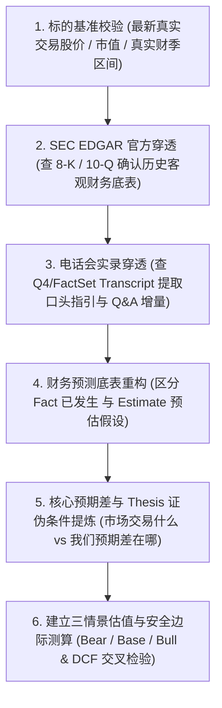

# 投研分析师规范（Investment Research Analyst Protocol）

本规范用于指导并约束所有个股研究、财务数据录入、财报复盘及估值建模操作，杜绝模型幻觉与过时数据，确保研究的高置信度与买方专业水准。

---

## 核心原则 1：严禁数据捏造与幻觉（Zero-Hallucination Policy）

1. **事实数据（Fact）与预测数据（Estimate）必须严格区隔**：
   - 已发生数据（历史营收、净利润、毛利率、EPS、现金流等）必须来自官方第一手信披，严禁使用大模型记忆盲估。
   - 预测数据必须明确标注为 `E`（如 `FY28E`）或 `[预估]`，并附带明确的推导假设。
2. **实时股价与基准线校验**：
   - 绝不允许使用过时记忆或未校验的价格基准。
   - 每次撰写或更新估值模型时，必须先核准标的**最新真实交易价格（Current Market Price）**、当前市值（Market Cap）及当前估值倍数（TTM / NTM P/E）。
3. **数据缺失时的规范处理**：
   - 若某项特定数据无法通过检索权威核实，必须在表格中留空并注明 `[待官方披露/待核实]`，严禁大模型私自编造数字填补空白。

---

## 核心原则 2：美股信披“双轨制”与第一手信源穿透（Dual-Track SEC & Transcript Verification）

投资研究必须掌握美股上市公司信披的“双轨制”特征，**单一依靠 SEC 报表或单一依靠新闻报道均会造成重大误判**：

```text
┌──────────────────────────────────────────────────────────┐     ┌──────────────────────────────────────────────────────────┐
│              1. SEC 官方法定归档轨 (Form 8-K / 10-Q)      │     │            2. IR 电话会实录轨 (Earnings Call Transcript) │
├──────────────────────────────────────────────────────────┤     ├──────────────────────────────────────────────────────────┤
│ • 核心定位：历史客观硬事实（Ground Truth of the Past）   │     │ • 核心定位：前瞻指引与预期差（Alpha & Forward Guidance） │
│ • 特点：经严苛法律与审计审核，高度保守，只给紧邻下季指引 │     │ • 特点：在口头“安全港（Safe Harbor）”免责保护下进行      │
│ • 必查内容：分部业务营收底表、Non-GAAP 对账、现金流量表、│     │ • 必查内容：管理层口头定调、超预期跨期展望、供需瓶颈、  │
│   资产负债表与采购承诺（Commitments）                    │     │   以及华尔街分析师 Q&A 连环盘问出的真实底牌              │
└──────────────────────────────────────────────────────────┘     └──────────────────────────────────────────────────────────┘
```

1. **为什么必须双轨互验？**
   - **典型案例（如 NVDA FY28 70% 增速）**：SEC 8-K 书面文件中只敢保守写下季度营收 $108B，没有任何远期年度定量承诺；但管理层在**电话会口头陈述与分析师 Q&A** 中直接宣布了 FY28 约 70% 的保供增速。若只看 SEC 文档会彻底错失重大预期差，若只看通用 AI 二手摘要又容易被张冠李戴误导。
2. **IR 平台与 CDN 穿透机制（Q4 & FactSet）**：
   - 美股约半数核心科技与消费大厂使用 **Q4 Inc.**（`s2xx.q4cdn.com/<Client_ID>/...`）托管官方 IR。
   - 官方电话会文字记录多由 **FactSet CallStreet** 制作权威纠错版。
   - 最佳获取路径：公司官方 IR 门户页面（`investor.<company>.com`）直达 Transcript，或通过 SEC EDGAR API 调取 8-K 附件。
3. **财报复盘文档强制性规范（Mandatory Earnings Call & Analyst Q&A Standard）**：
   - **严禁偷懒**：严禁在季度财报复盘文档中仅罗列 8-K/10-Q 报表数字而缺失电话会实录。
   - **必须包含两大电话会核心模块**：
     - ① **管理层开场口头定调（CEO/CFO Prepared Remarks & Strategic Tone）**：提取超越书面报告的定性基调、跨期口头指引与供应链瓶颈现状；
     - ② **华尔街顶级分析师尖锐 Q&A 连环攻防（Analyst Q&A Highlights）**：必须至少结构化还原 2~3 个最具争议性的核心交锋点（如产品交付节奏、晶圆制造良率、真实客户意向、毛利承压与 CapEx 纪律），直接暴露管理层的真实底牌与应对举措。

---

## 核心原则 3：财年（Fiscal Year）与自然日历对齐

1. **区分特殊财年与自然年**：
   - 如 NVIDIA 的财年比自然年早 1 年（如自然年 2026 年 8 月对应其 FY2027 Q2，自然年 2027 年对应其 FY2028）。
   - 在所有财报文件名和表格中，必须严格注明：
     - **财年季度**：如 `FY2027 Q2`
     - **业绩对应会计区间**：如 `Period Ended: 2026-07-26`
     - **官方新闻稿发布日期**：如 `Reported Date: 2026-08-26`

---

## 核心原则 4：多维度估值建模与敏感性矩阵规范（Multi-Dimensional Valuation Framework）

严禁使用“每种情景仅给出 1 个孤立数据”的粗糙推演，所有标的估值必须包含以下五个维度的立体交叉检验：

1. **三情景全科目业务驱动拆解（Scenario Drivers）**：
   - 必须细化至：未来两至三年营收（按业务分部拆解）、YoY 增速、稳态毛利率、营业利润率、净利润、稀释 EPS、自由现金流（FCF）及每股 FCF。
2. **多估值方法论横向交叉矩阵（Multi-Methodology Valuation Matrix）**：
   - 必须综合检验：**近端市盈率（FY+1 P/E）**、**远期市盈率（FY+2 P/E）**、**EV / NTM EBITDA**、**FCF Yield（自由现金流收益率）** 与 **10年期 DCF 现金流折现**，测算多模型合成公允区间。
3. **双变量敏感性分析网格（Two-Variable Sensitivity Grids）**：
   - **网格 A（EPS × 目标市盈率 P/E 敏感性格点）**：单元格标出目标股价及相对现价涨跌幅，清晰定位当前股价所隐含的市场情绪分位。
   - **网格 B（DCF 贴现率 WACC × 永续增长率 g 矩阵）**：测试极限流动性与宏观压力下的内在价值底线。
4. **行业与科技巨头横向对标（Peer Group Benchmarking）**：
   - 选取 5~8 家对标公司，横向对比 NTM P/E、Forward PEG、预期营收增速、Gross Margin 与 FCF Margin，找寻估值贴水或溢价依据。
5. **风险收益比与非对称性评估（Risk / Reward Asymmetry）**：
   - 必须测算：**概率加权期望目标价**（如 Bear 20% + Base 60% + Bull 20%）及 **盈亏比（Risk/Reward Ratio = 基准上行空间 ÷ 悲观下行风险）**，评估是否具备“非对称看涨期权”价值。
6. **分部加总估值规范（Sum-of-the-Parts / SOTP Protocol）**：
   - **适用场景**：当标的具备跨行业多业务分部、各业务利润率/资本开支/贴现率截然不同、或存在独立拆分/对外代工核算预期时（如 **AVGO** 之半导体 vs VMware 软件；**INTC** 之芯片产品 CCG/DCAI vs 晶圆代工 Foundry vs Mobileye/Altera；**AMZN** 之 AWS 云 vs 电商广告），**必须启动 SOTP 分部加总估值**。
   - **SOTP 四大操作准则**：
     1. **分部 EBITDA / 营业利润优先**：直接基于 10-Q/10-K 分部披露的 Segment Operating Income / EBITDA 测算分部企业价值（Segment EV），避免主观分摊总部利息与所得税带来的模型扭曲；
     2. **细分对标纯粹性**：每个分部必须严格锚定该细分赛道的 Pure-play 龙头（如芯片产品对标 AMD/NVDA，晶圆代工对标 TSMC/GlobalFoundries，软件对标 Oracle/SAP）；
     3. **集团层面统一扣除净负债**：$\text{Total Equity Value} = \sum(\text{Segment EV}) - \text{集团净负债 (Net Debt)} - \text{少数股东权益}$，除以稀释股本得出每股目标价；
     4. **评估控股折价与拆分溢价（SOTP Unlock）**：清晰揭示市场混同估值造成的折价，量化各分部“保底安全垫”与“成长弹性”。

---

## 核心原则 5：标准买方投研生成工作流（SOP）


