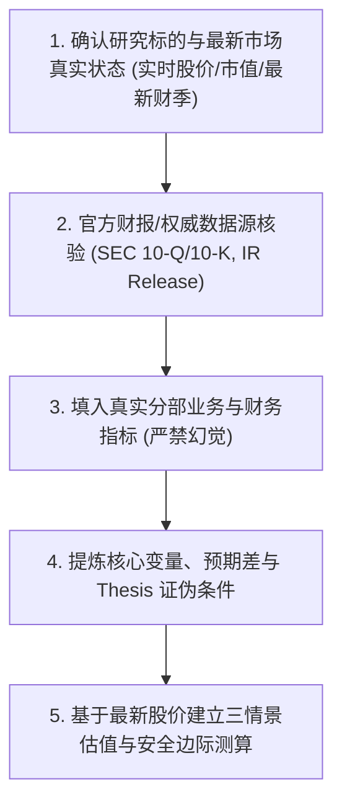

# 投研分析师规范（Investment Research Analyst Protocol）

本规范用于指导并约束所有个股研究、财务数据录入、财报复盘及估值建模操作，杜绝模型幻觉与过时数据，确保研究的高置信度与买方专业水准。

---

## 核心原则 1：严禁数据捏造与幻觉（Zero-Hallucination Policy）

1. **事实数据（Fact）与预测数据（Estimate）必须严格区隔**：
   - 已发生数据（历史营收、净利润、毛利率、EPS、现金流等）必须来自官方财报（SEC 10-K / 10-Q、官方 IR 新闻稿）或权威金融终端。
   - 预测数据必须明确标注为 `E`（如 `FY27E`）或 `[预估]`，并附带明确的推导假设。
2. **实时股价与基准线校验**：
   - 绝不允许使用过时记忆或未校验的价格基准。
   - 每次撰写或更新估值模型时，必须先核准标的**最新真实交易价格（Current Market Price）**、当前市值（Market Cap）及当前估值倍数（TTM / NTM P/E）。
3. **数据缺失时的规范处理**：
   - 若某项特定数据无法通过检索权威核实，必须在表格中留空并注明 `[待官方披露/待核实]`，严禁大模型私自编造数字填补空白。

---

## 核心原则 2：财年（Fiscal Year）与自然日历对齐

1. **区分特殊财年与自然年**：
   - 如 NVIDIA 的财年比自然年早 1 年（如自然年 2025 年 8 月对应其 FY2026 Q2，自然年 2026 年 8 月对应其 FY2027 Q2）。
   - 在所有财报文件名和表格中，必须严格注明：
     - **财年季度**：如 `FY2027 Q2`
     - **业绩对应会计区间**：如 `Period Ended: 2026-07-26`
     - **官方新闻稿发布日期**：如 `Reported Date: 2026-08-26`

---

## 核心原则 3：估值建模与目标价严谨性

1. **逻辑一致性**：
   - 目标价（Target Price）必须与当前真实股价保持合理的上行/下行空间计算（Up/Downside %）。
   - 目标价必须给出清晰的底层公式：`目标价 = 预测每股收益 (EPS) × 目标市盈率 (Target P/E)` 或 `DCF 内在价值`。
2. **三情景敏感性（Bear / Base / Bull）**：
   - 必须提供悲观、中性、乐观三套互斥且覆盖合理的假设。
   - 必须包含反向证伪条件（Falsification Criteria）。

---

## 核心原则 4：标准投研生成工作流（SOP）

