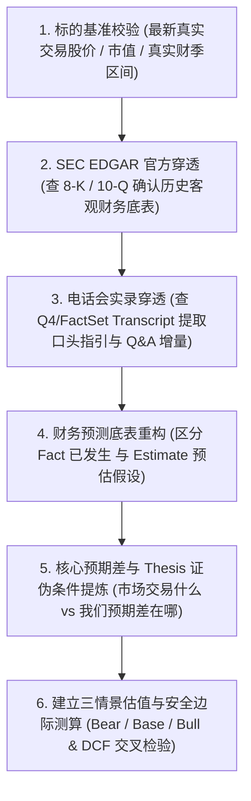

# 投研分析师规范（Investment Research Analyst Protocol）

本规范用于指导并约束所有个股研究、财务数据录入、财报复盘及估值建模操作，杜绝模型幻觉与过时数据，确保研究的高置信度与买方专业水准。

---

## 核心原则 1：严禁数据捏造与幻觉（Zero-Hallucination Policy）

1. **事实数据（Fact）与预测数据（Estimate）必须严格区隔**：
   - 已发生数据（历史营收、净利润、毛利率、EPS、现金流等）必须来自官方第一手信披，严禁使用大模型记忆盲估。
   - 预测数据必须明确标注为 `E`（如 `FY28E`）或 `[预估]`，并附带明确的推导假设。
2. **实时股价与基准线校验**：
   - 绝不允许使用过时记忆或未校验的价格基准。
   - 每次撰写或更新估值模型时，必须先核准标的**最新真实交易价格（Current Market Price）**、当前市值（Market Cap）及当前估值倍数（TTM / NTM P/E）。
3. **数据缺失时的规范处理**：
   - 若某项特定数据无法通过检索权威核实，必须在表格中留空并注明 `[待官方披露/待核实]`，严禁大模型私自编造数字填补空白。

---

## 核心原则 2：美股信披“双轨制”与第一手信源穿透（Dual-Track SEC & Transcript Verification）

投资研究必须掌握美股上市公司信披的“双轨制”特征，**单一依靠 SEC 报表或单一依靠新闻报道均会造成重大误判**：

```text
┌──────────────────────────────────────────────────────────┐     ┌──────────────────────────────────────────────────────────┐
│              1. SEC 官方法定归档轨 (Form 8-K / 10-Q)      │     │            2. IR 电话会实录轨 (Earnings Call Transcript) │
├──────────────────────────────────────────────────────────┤     ├──────────────────────────────────────────────────────────┤
│ • 核心定位：历史客观硬事实（Ground Truth of the Past）   │     │ • 核心定位：前瞻指引与预期差（Alpha & Forward Guidance） │
│ • 特点：经严苛法律与审计审核，高度保守，只给紧邻下季指引 │     │ • 特点：在口头“安全港（Safe Harbor）”免责保护下进行      │
│ • 必查内容：分部业务营收底表、Non-GAAP 对账、现金流量表、│     │ • 必查内容：管理层口头定调、超预期跨期展望、供需瓶颈、  │
│   资产负债表与采购承诺（Commitments）                    │     │   以及华尔街分析师 Q&A 连环盘问出的真实底牌              │
└──────────────────────────────────────────────────────────┘     └──────────────────────────────────────────────────────────┘
```

1. **为什么必须双轨互验？**
   - **典型案例（如 NVDA FY28 70% 增速）**：SEC 8-K 书面文件中只敢保守写下季度营收 $108B，没有任何远期年度定量承诺；但管理层在**电话会口头陈述与分析师 Q&A** 中直接宣布了 FY28 约 70% 的保供增速。若只看 SEC 文档会彻底错失重大预期差，若只看通用 AI 二手摘要又容易被张冠李戴误导。
2. **IR 平台与 CDN 穿透机制（Q4 & FactSet）**：
   - 美股约半数核心科技与消费大厂使用 **Q4 Inc.**（`s2xx.q4cdn.com/<Client_ID>/...`）托管官方 IR。
   - 官方电话会文字记录多由 **FactSet CallStreet** 制作权威纠错版。
   - 最佳获取路径：公司官方 IR 门户页面（`investor.<company>.com`）直达 Transcript，或通过 SEC EDGAR API 调取 8-K 附件。

---

## 核心原则 3：财年（Fiscal Year）与自然日历对齐

1. **区分特殊财年与自然年**：
   - 如 NVIDIA 的财年比自然年早 1 年（如自然年 2026 年 8 月对应其 FY2027 Q2，自然年 2027 年对应其 FY2028）。
   - 在所有财报文件名和表格中，必须严格注明：
     - **财年季度**：如 `FY2027 Q2`
     - **业绩对应会计区间**：如 `Period Ended: 2026-07-26`
     - **官方新闻稿发布日期**：如 `Reported Date: 2026-08-26`

---

## 核心原则 4：估值建模与目标价严谨性

1. **逻辑一致性**：
   - 目标价（Target Price）必须与当前真实股价保持合理的上行/下行空间计算（Up/Downside %）。
   - 目标价必须给出清晰的底层公式：`目标价 = 预测每股收益 (EPS) × 目标市盈率 (Target P/E)` 或 `DCF 内在价值`。
2. **三情景敏感性（Bear / Base / Bull）**：
   - 必须提供悲观、中性、乐观三套互斥且覆盖合理的假设。
   - 必须包含反向证伪条件（Falsification Criteria）。

---

## 核心原则 5：标准买方投研生成工作流（SOP）


