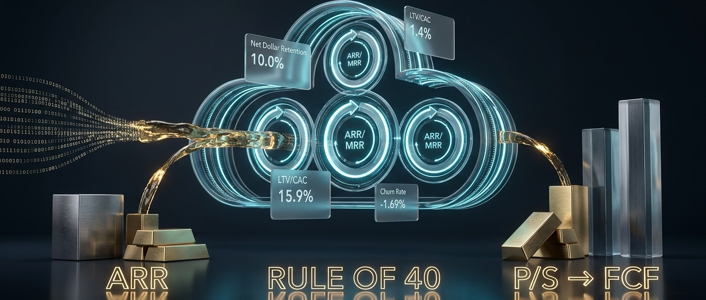
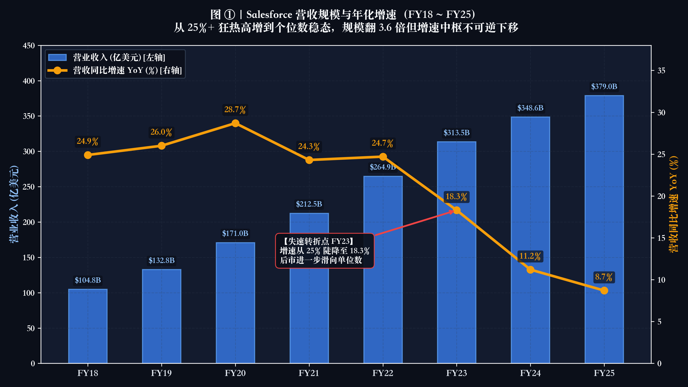
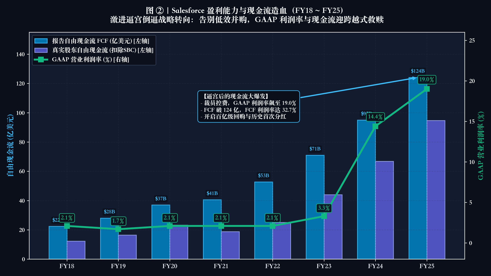
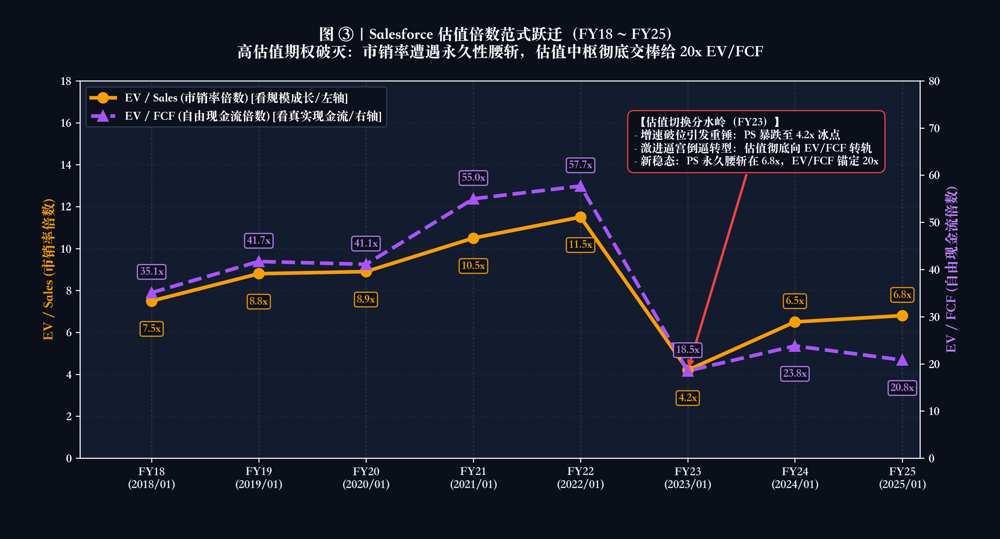
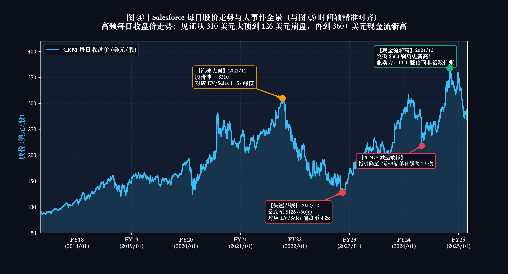

# 第 10 讲｜SaaS 与订阅经济学：当增长减速，估值语言如何从 PS 切换到 FCF？



> 华尔街对软件公司的耐心从来不是无限的：当营收年增速超过 40% 时，市场甘愿用市销率（P/S）为你编织星辰大海；但当增速滑落至 15% 时，每一分不能转化为真金白银自由现金流的收入，都将沦为估值杀跌的催化剂。

在投资机构的投研词典里，过去十年最富神话色彩也最具破坏力的商业物种，非 **SaaS（Software-as-a-Service，软件即服务）** 莫属。

在 2020~2021 年全球流动性泛滥的极盛时期，整个美股二级市场为 SaaS 描绘了一个近乎完美的叙事：高毛利（75%~85%）、高黏性（负流失率）、高确定性订阅收入（ARR）。当时，传统买方视若珍宝的市盈率（P/E）和现金流折现（DCF）被视作陈旧过时，市场狂热地使用 **EV/NTM Sales（未来 12 个月市销率）** 为其定价——30 倍、50 倍屡见不鲜，数据云新贵 Snowflake 甚至一度被推升至不可思议的 **110 倍 EV/Sales**！

然而，商业世界最严苛的物理定律是：**重力始终存在，只是有时被热气球的升力暂时掩盖。**

随着 2022 年美联储急剧加息与全球企业 IT 支出进入预算审查周期，SaaS 行业的营收增速从 50%+ 骤然降速至 15%~25%。随之而来的，是一场惨烈的估值大坍塌：大量明星 SaaS 公司的 EV/Sales 倍数从 40 倍硬生生腰斩再腰斩至 6~8 倍，股价最大回撤普遍高达 70%~85%！

**为什么当营收增速只是温和放缓时，公司的身价却会发生毁灭性的塌陷？**  
**看懂 SaaS 真实的造血能力，买方必须掌握哪 7 大底层指标？**  
**顶级买方在什么阶段该用什么工具给 SaaS 估值？背后的底层商业逻辑是什么？**  
**当企业进入成熟期，估值的核心语言究竟是如何从市销率（EV/Sales）彻底交棒给自由现金流（EV/FCF）的？**

从本讲开始，我们正式翻开专栏的全新篇章——**【第四篇：因地制宜·不同商业物种的专用估值武器（Business Model Valuation Toolkit）】**。我们将告别通用的宏观框架，深入最具代表性的细分产业肌理。

作为第四篇的开篇之作，本讲将用买方的手术刀，为您层层剖解 SaaS 订阅经济学的底层齿轮与估值范式迁徙！

---

## 一、 语言基石：看懂 SaaS 造血能力的 7 大核心指标

工欲善其事，必先利其器。许多投资者在研究 SaaS 财报时容易迷失，正是因为没有厘清这套独特的“订阅制商业语言”。

在阅读任何一家 SaaS 公司的 SEC 10-K 年报或 S-1 招股说明书时，要穿透表面的会计数字看清其内在质地，必须首先掌握买方投研必备的 7 张核心拆解卡：

### 1. ARR 与 MRR（年度/月度经常性收入）
* **定义**：按合同锁定的、每年可确定重复收取的纯软件订阅服务费，排除了定制开发、实施交付等一次性专业服务收入。
* **买方逻辑**：一次性收入毛利低且不可持续，买方只对高毛利的 Pure ARR 给出估值溢价。

### 2. NRR / NDR（净金额留存率）
* **定义**：衡量期初既有客户群在当期贡献的金额净变动（扣除流失与降配，加上老客户增购）。
* **买方基准**：
  * **NRR > 130%（顶级神作）**：哪怕销售人员全部放假，老客户增购也能驱动公司收入年增 30%（负客户流失率）；
  * **110% ~ 120%（稳健健康）**：主流企业级 SaaS 水准；
  * **< 100%（价值漏斗）**：老客户在不断流失降配，公司必须像无底洞一样源源不断烧钱获客才能维持规模不倒退。

### 3. CAC 与 CAC Payback Period（获客成本及回收期）
* **定义**：获取一个新客户所花费的全部销售与营销费用（S&M），以及该客户通过订阅毛利把这笔获客投入赚回来的时间（月数）。
* **买方基准**：回收期 **< 12 个月**为极佳，**12~18 个月**为行业均衡线；若 **> 24 个月**则为资本毒药，说明业务本质上是在补贴客户烧钱。

### 4. LTV / CAC（客户终身价值倍数）
* **定义**：单个客户全生命周期贡献的毛利总和与获客成本的比值。
* **买方铁律**：成熟 SaaS 的 **LTV / CAC 必须 ≥ 3.0x**。若低于 3 倍，商业模式将极度脆弱，无法覆盖高昂的研发与管理开支。

### 5. Magic Number（销售效率魔术数字）
* **公式**：`(本季度新增净 ARR × 4) ÷ 上季度销售与市场费用 (S&M)`。
* **买方判定**：**> 1.0** 证明营销投放回报丰厚，应加速扩张；**< 0.5** 说明投放严重衰退，产品丧失竞争力或市场已饱和。

### 6. Rule of 40（40 法则：SaaS 终极平衡木）
* **公式**：`营收年化增长率 (%) + 自由现金流利润率 FCF Margin (%)`。
* **买方精髓**：允许增长 60% 但亏损 20%（得分 40%），也允许增长 10% 但净现金流率达 30%（得分 40%）。**只要两者之和稳居 40% 以上，即为买方公认的顶尖软件资产。**

### 7. FCF Yield（自由现金流收益率）
* **公式**：`全年真实自由现金流 ÷ 当前企业价值 (EV)`。
* **买方之锚**：成熟期买方不再看市销率，而是将 FCF Yield 与美国 10 年期国债无风险利率（4%~4.5%）进行严苛对比。

---

## 二、 估值语言切换：什么阶段该用什么？为什么？

在掌握了底层的 7 大指标后，我们就能看清二级市场对 SaaS 的真实定价逻辑。

很多刚接触企业级软件（SaaS）的投资者，最常犯的错误就是“试图用一把尺子量到底”：
* 要么用传统的市盈率（P/E）去生搬硬套所有处于亏损期的成长期 SaaS，觉得满地都是泡沫、毫无投资价值；
* 要么在公司营收增速已经跌落到 10% 左右时，依然执迷于 15~20 倍的高市销率（P/S），最终遭遇估值腰斩再腰斩的灭顶之灾。

在买方第一性原理中：**SaaS 不是一种静态的资产。在其生命周期的不同阶段，商业矛盾与造血机制完全不同，因此估值语言必须经历三次根本性的动态切换：**

### 1. 阶段一：高速成长期（Hyper-Growth）—— 为什么该用 EV/Sales？

* **业务特征与适用条件**：年营收增速 **YoY > 30%~40%**，处于抢占行业生态位的窗口期，销售团队疯狂获客，账面 GAAP 净利润大幅亏损。
* **该用什么估值**：**EV / ARR（或 EV/Sales 市销率）**，核心辅助指标为 **NRR > 120%** 与 **Magic Number > 0.8**。
* **为什么用它？（买方底层逻辑）**：  
  SaaS 拥有特殊的会计特性：获取新客户的销售与营销费用（CAC），必须在签约当期全额扣除；但客户缴纳的订阅费，却是按年、按月在未来数年持续流入。这就导致**早期扩张越快、获客越成功的公司，账面亏损反而越严重（假性失血）**。在单客经济学成立前提下（LTV > 3x CAC、NRR > 120%），**当期营收规模是终态现金流池的最佳代理人**，因此市场在早期乐于给予高市销率预支成长溢价。
* **致命误区与禁忌**：盲目用市盈率（P/E）会错杀爆发前夜的伟大公司；但若客户留存极差（NRR < 100%），盲目给高 PS 则是在为假成长买单。

---

### 2. 阶段二：降速过渡期（Growth Deceleration）—— 为什么引入 Rule of 40？

* **业务特征与适用条件**：年营收增速回落至 **15% ~ 30%**，行业渗透率提升，获客边际变贵，二级市场开始严厉要求展现自我造血能力。
* **该用什么估值**：**Rule of 40（40 法则）平衡法**，核心辅助指标为 **CAC 回收期** 与 **SBC 占营收比**。
* **为什么用它？（买方底层逻辑）**：  
  增长减速后，市场不再容忍无节制“烧钱圈地”，买方开始严厉拷问投入产出比：**你牺牲了增长速度，到底有没有换回造血能力？** 40 法则（营收增速 % + 自由现金流率 %）就是最佳天平：它既允许高增长、轻亏损，也允许中增长、高利润。只要两者之和稳居 40% 以上，证明增长与利润保持平衡，估值溢价得以保全；一旦跌破 40%，市场立刻杀估值挤水分。
* **致命误区与禁忌**：增速已跌破 20%，还在幻想 20 倍高市销率；或者只看 Non-GAAP 现金流，忽视股权激励（SBC）对每股价值的严重稀释。

---

### 3. 阶段三：稳态成熟期（Mature Cash Cow）—— 为什么必须切换为 EV/FCF？

* **业务特征与适用条件**：年营收增速降至 **个位数至 15%**，行业进入存量博弈与巨头防守，研发与营销费用占营收比见顶回落。
* **该用什么估值**：**EV / FCF（自由现金流倍数）与 FCF Yield（自由现金流收益率）**，核心辅助指标为 **真实 GAAP 净利率** 与 **回购分红收益率**。
* **为什么用它？（买方底层逻辑）**：  
  此时公司退化为“公用事业股一样的成熟现金牛”，不再具备高成长想象空间。市场彻底撕毁了之前给予的高成长借条，唯一的度量衡就是**每年能给股东分出多少真金白银**。机构直接拿其 FCF Yield 与美国 10 年期国债无风险利率（4%~4.5%）比拼利差。如果现金回报跑不赢无风险国债，估值就会继续被资本无情抛弃。
* **致命误区与禁忌**：依然按市销率幻想估值扩张；或者在面对 AI 颠覆时，误把存量现金牛的“永续终值”当成不可撼动的铁饭碗。

---

### 4. 估值重力场：为什么切换估值语言时，会发生惨烈的“市值折叠”？

看清了上述演进，你就拿到了破译 SaaS 股灾之谜的终极钥匙：  
**为什么很多 SaaS 公司在营收增速从 45% 逐步滑落至 10% 时，股价却会发生 70% 以上的毁灭性塌陷？**

因为从“阶段一（看市销率）”向“阶段三（看现金流）”切换，绝不是换个计算公式那么简单，而是**资产属性的根本性降维打击**：

```text
买方定价逻辑的范式逆转：
【高速成长期】市场用 35 倍 EV/Sales 估值，本质上是把公司当成“终态拥有 30% 利润率 + 持续高增”的超级期权；
       ⬇ （增速一旦降温，终态期权破灭，市场立即撕毁借条）
【成熟稳态期】市场直接切换至 20 倍 EV/FCF 的冰冷账本，只看现货造血！
```

我们可以通过一个跨度 5 年的买方连续追踪模型，亲眼见证这一场数学上的“残酷重力折叠”：

| 发展时序与阶段 | 第 1 年：高速成长期 (Bubble Peak) | 第 3 年：降速过渡期 (Growth Slowdown) | 第 5 年：成熟稳态期 (Mature Cash Cow) |
| :--- | :--- | :--- | :--- |
| **当年营收规模** | 10.0 亿美元 | **16.0 亿美元** | **20.0 亿美元** |
| **年化营收增速 (YoY)** | **+45.0%**（跑马圈地极速扩张） | **+20.0%**（渗透率提升，明显降速） | **+10.0%**（告别高增步入稳态成熟） |
| **市场主流估值语言** | 纯市销率（EV / Forward Sales） | Rule of 40 平衡修正倍数 | **EV / FCF 自由现金流倍数** |
| **当时市场给予倍数** | **35.0x EV/Sales**（狂热市销率） | **12.0x EV/Sales**（倍数急剧腰斩） | **20.0x EV/FCF（折合仅 5.0x EV/Sales）** |
| **自由现金流假设** | 负现金流（FCF 率 -10%） | 盈亏平衡（FCF 率 5%） | 稳态高造血（FCF 率 **25.0%** ➔ 产生 5.0 亿 FCF） |
| **隐含企业价值 (EV)** | **350.0 亿美元** | **192.0 亿美元** | **100.0 亿美元** |
| **企业价值变动** | 基准顶峰 | **下跌 -45.1%**（营收大增 60% 但身价腰斩） | **惨烈暴跌 -71.4%（较顶峰蒸发超 70%！）** |

> **买方警示**：哪怕这家公司在 5 年内把业务扎扎实实做大了一倍（营收从 10 亿翻倍到 20 亿美元），只要估值语言从 35 倍市销率切换到 20 倍现金流，企业总身价依然会缩水超 70%！这就是为什么成长股投资者如果死守高 PS，哪怕公司业绩翻倍，二级市场也会把你无情套牢五年！

---

## 三、 估值实战暗坑：识别“假现金流”与收费模式陷阱

在理解了核心指标与阶段演进后，我们必须穿透两项最容易误导普通投资者的财报障眼法：

### 1. 暗坑一：SBC（股权激励）的“假自由现金流”吸血鬼陷阱

绝大多数卖方分析师报告中引用的“自由现金流（FCF）”，标准算法是 `经营现金流（OCF）- 资本开支（CapEx）`。

然而在会计准则下，**股权激励（Stock-Based Compensation, SBC）作为非现金费用，会被全额加回到经营现金流中！**

> **吸血鬼把戏**：一家 SaaS 公司宣称自己产生了 10 亿美元经营现金流，只花了 1 亿资本开支，宣告自由现金流达 9 亿美元；但翻开附注，它在当年给员工发放了 **8.5 亿美元的股票期权（SBC）**！

站在买方股东视角，SBC 根本不是“不花钱的福利”，而是**隐性的现金流透支**：
* 如果公司未来为了抑制股份稀释去市场上回购股票，需要消耗真金白银的净现金；
* 如果公司不回购，总股本每年被稀释 3%~5%，老股东手里的每股收益和每股现金流就会被大幅摊薄。

买方尽调准则：**必须计算“真实股东自由现金流” = 报告 FCF - SBC。** 如果一家公司的真实 FCF 为负，哪怕报告 FCF 再高，也坚决不能按成熟现金牛给出 20 倍以上的估值倍数。

---

### 2. 暗坑二：席位制 vs 用量制——估值倍数的隐形分水岭

SaaS 公司的计费模式不同，其在二级市场的估值乘数有着天壤之别：

| 收费模式 | 典型代表 | 商业特征与顺周期弹性 | 逆周期风险与买方折价 |
| :--- | :--- | :--- | :--- |
| **按席位收费 (Seat-based)** | Salesforce, Workday, ServiceNow | 收入高度刚性，粘性极强；只要客户不裁员，合同到期必定续订 | 客户缺乏爆发增购弹性，面临 AI 时代人头精简的结构性压力 |
| **按用量计费 (Usage-based)** | Snowflake, Twilio, Datadog | 零摩擦上云，客户业务爆发时收入呈指数级飙升 | 经济下行期客户会极速优化代码或缩减算力，收入失速如瀑布般断崖 |

> **买方定式**：纯用量计费公司在景气度高点往往能拿到极高估值溢价，但必须**按周期股的谨慎态度打折**；而席位制公司虽然稳健，但一旦遭遇行业逆风或 AI 替代人头，其增长钝化同样不可逆转。

---

## 四、 顶级实战案例复盘：Salesforce（CRM）穿越 8 年的三次估值跃迁

理论只有在真实残酷的二级市场中才能淬炼成投资纪律。

作为全球 SaaS 模式的开山鼻祖与绝对领头羊，**Salesforce（NYSE: CRM）** 在 2018 至 2025 财年（FY18 ~ FY25）的 8 年演变史，几乎是全球软件产业从狂热市销率到成熟现金流定价的“微缩教科书”。

### 📊 核心财报与估值指标 8 年演变全景（FY18 ~ FY25，数据来源：SEC 10-K）

| 财年 (FY) | 营业收入 (亿美元) | 营收增速 (YoY) | GAAP 营业利润率 | 自由现金流 FCF (亿美元) | 真实自由现金流 (扣除SBC) | EV/Sales (期末) | EV/FCF (期末) | 期末市值 (亿美元) |
| :---: | :---: | :---: | :---: | :---: | :---: | :---: | :---: | :---: |
| **FY18** | 104.8 | +24.9% | 2.1% | 22.4 | 12.3 | **7.5x** | 35.1x | 820 |
| **FY19** | 132.8 | +26.0% | 1.7% | 28.0 | 16.5 | **8.8x** | 41.7x | 1,168 |
| **FY20** | 171.0 | +28.7% | 2.1% | 37.0 | 23.3 | **8.9x** | 41.1x | 1,520 |
| **FY21** | 212.5 | +24.3% | 2.1% | 40.6 | 18.8 | **10.5x** | 55.0x | 2,233 |
| **FY22** | 264.9 | +24.7% | 2.1% | 52.8 | 25.1 | **11.5x (峰值)** | 57.7x | 3,050 |
| **FY23** | 313.5 | **+18.3% (失速)** | 3.3% | 71.0 | 44.0 | **4.2x (冰点)** | 18.5x | 1,315 |
| **FY24** | 348.6 | **+11.2% (个位)** | **14.4% (激进)** | 95.0 | 66.8 | **6.5x** | **23.8x** | 2,260 |
| **FY25** | 379.0 | **+8.7% (稳态)** | **19.0% (现金牛)** | **124.1** | **94.7** | **6.8x** | **20.8x** | 2,580 |

---

### 📈 Salesforce 估值范式跃迁全景走势（4 大硬核图解）

为了让大家更直观地看清这种“基本面、现金流、估值倍数与二级市场股价的深刻背离”，我们将 Salesforce 过去 8 年的轨迹拆解为 4 张独立的买方透视图（其中图 ③ 与图 ④ 的时间轴与刻度线已实现 **1:1 绝对精准对齐**，方便上下对照）：

#### 1. 规模与增速：从 25%+ 狂热高增滑向个位数稳态



* **规模扩张 vs 增速失速**：8 年间公司营收从 105 亿飙升至 379 亿美元（增长 3.6 倍），但年化增速从 25%~29% 的高歌猛进，剧烈滑落至 FY23 的 18.3%，最终走向 FY25 的 8.7% 个位数稳态；
* **估值拐点已至**：营收增速跌破 15% 并步入个位数，宣告公司彻底告别“高速成长期”，传统高市销率估值的地基开始坍塌。

---

#### 2. 盈利与造血：激进逼宫倒逼出惊人的自由现金流爆发



* **前期的极度低效**：在 FY18~FY22 的狂热扩张期，由于巨额研发与营销开支吞噬利润，GAAP 营业利润率常年维持在极其贫瘠的 **1.7%~2.1%**；
* **惊天大逆转**：2022 年底激进投资人入驻后，公司全面停止低效并购并大幅裁员控费。到 FY25，GAAP 营业利润率跨越式跃升至 **19.0%**，全年自由现金流更暴涨至 **124.1 亿美元（真实扣除 SBC 后仍高达 94.7 亿美元）**！成熟超级现金牛的底色彻底显现。

---

#### 3. 估值语言跃迁：市销率遭遇永久腰斩，EV/FCF 成为新中枢



* **估值切换分水岭（FY23）**：当增速失速跌破 20%，市场对高成长假象发起清算，市销率从 **11.5x** 惨遭腰斩再腰斩至 **4.2x** 冰点。激进资本进场逼宫，倒逼管理层全面向现金流宣战，估值语言在此彻底转轨；
* **成熟现金牛新中枢（FY24~FY25）**：业务重组企稳后，市场拒绝重新给予科技高溢价，市销率永久性腰斩定格在 **6.8x**；但公司凭借 124 亿真金白银造血，在 **20x~22x EV/FCF（对应约 5% 自由现金流收益率）** 构筑了坚实的新价值底座。

---

#### 4. 每日股价走势：倍数腰斩但股价新高的“世纪大背离”



> **图表买方核心密码（对比图 ③ 与图 ④ 的垂直刻度线）**：  
> 1. **看 FY22 刻度线**：图 ③ 中 EV/Sales 达到 11.5 倍峰值，垂直对应图 ④ 股价冲上 310 美元泡沫大顶；  
> 2. **看 FY23 刻度线**：图 ③ 中 EV/Sales 遭重锤腰斩至 4.2 倍冰点，垂直对应图 ④ 股价跌破 126 美元（-60% 绝望踩踏）；  
> 3. **看 FY25 刻度线**：在图 ③ 中市销率仅温和修复至 **6.8x（较峰值依然近乎腰斩）** 的背景下，垂直对应图 ④ **股价却突破 360 美元刷新历史新高！**

驱动股价重返新高的不再是虚浮的估值倍数扩张，而是**实打实翻倍增长的每股自由现金流**！这就是估值语言从市销率彻底交棒给 EV/FCF 的最硬核实战明证。

---

### 🔍 深度复盘：穿越周期的三幕史诗与当下的 AI 思考

结合上述图表与数据，Salesforce 完整走过了三个极具代表性的历史发展阶段：

#### 第一幕：狂热造梦期（FY18 ~ FY22）—— 只要增长还在，利润微薄无人问津
在这一阶段，全球流动性充沛，Salesforce 保持 25% 左右的营收扩张。二级市场只认规模增长，对其 **GAAP 营业利润率常年仅 1.7%~2.1%** 的极低造血能力视若无睹。管理层通过巨额增发股票与举债开展昂贵吞并（65 亿买 MuleSoft、157 亿买 Tableau，直到 2021 年底以 **277 亿美元天价接盘 Slack**）。市场在狂热中将其 EV/Sales 倍数推升至 11.5 倍，股价在 2021 年底冲上 310 美元大顶。

#### 第二幕：失速崩盘期（FY23）—— 增速降至个位数，4.2 倍 PS 的重力惩罚
进入 2022 年后，美联储加息，企业削减 IT 开支。Salesforce 增速从 25% 陡降至 18%，随后前瞻指引进一步滑落至个位数（8%~10%）。当高成长假设破灭，市场不再为故事买单，对其资产质量发起苛刻审判。EV/Sales 倍数从 11.5x 腰斩再腰斩至 **4.2x**，股价从 310 美元一路暴跌至 **126 美元（跌幅达 -60%）**！

#### 第三幕：激进逼宫与现金流救赎（FY24 ~ FY25）—— 告别市销率，拥抱 EV/FCF
2022 年底，Elliott Management 等激进对冲基金大举杀入董事会，逼迫管理层停止低效并购、裁员 10%、全面向利润率宣战。Salesforce 爆发出了罕见的利润弹性：GAAP 营业利润率从 3.3% 跨越式飙升至 **19.0%**，全年产生的自由现金流跃升至 **124.1 亿美元（FCF Margin 达 32.7%）**！  
估值语言彻底重构：市场正式按 **20x~22x EV/FCF（对应 FCF Yield 4.5%~5.0%）** 将其作为超级现金牛定价，配合近百亿回购与史上首次派息，股价从 126 美元泥潭势如破竹重回 **300+ 美元历史新高**！

#### 💡 站在 2026 年当下的思考：AI 时代的全新考验与现金牛底座
在完成了向超级现金牛的蜕变后，站在 **2026 年的今天**，Salesforce 正在迎来一场由生成式 AI 与 Autonomous Agents 引发的深层次大考：

* **按席位付费（Seat-based）模式的潜在天花板**：随着 AI Agents 能够自主完成大量初级客服、销售线索清洗与数据录入，企业端的人员编制开始优化精简。传统依赖“客户每招一个员工就必须加买一个席位”的自然增长逻辑，在 2026 年面临现实的钝化；
* **数字劳动力（如 Agentforce）的对冲效果**：虽然管理层积极推出了按智能体任务/用量计费的新模式，但从当下的买方共识来看，用量收入目前主要起到“防御性对冲席位放缓”的作用，尚未能推动整体营收重回双位数高增；
* **2026 当下的估值铁锚**：因此，二级市场目前对 Salesforce 的定价非常清晰——**坚决不给成长股的高溢价，而是坚定锚定在 18x~20x EV/FCF（对应约 5% 的自由现金流收益率）**。每年超百亿美元的真金白银现金流构筑了极其坚实的防守铁底，而 AI 商业化落地能否真正带来增量，则决定了未来估值倍数能否守在 20 倍上方。

---

## 五、 买方避坑工具箱与实战自查清单

为了防止在科技股投资中踩中“伪成长、真价值陷阱”，请牢记买方机构的三大避坑警报与自查矩阵：

### 🚨 三大致命避坑警报
1. **不扣 SBC 的自由现金流是会计幻象**：若股权激励占营收超 15%，报告 FCF 严重失真，每年 3%~5% 的股份摊薄会在 5 年内吞噬老股东近 20% 的真实每股收益；
2. **用量制（Usage-based）必须按周期股打折**：用量爆发期有多狂暴，衰退期客户精简代码时跌得就有多惨烈；
3. **增速跌破 20% 时切勿再给高市销率**：若一家公司年增 15% 却依然亏损，真实估值不应超过 **3x~5x EV/Sales**。

---

### 🛠️ 买方级 SaaS 企业健康度三级体检矩阵

| 评估维度 | 🟢 卓越标的 (Buy-Side Alpha) | 🟡 观察观察 (Hold / Caution) | 🔴 坚决回避 (Value Trap) |
| :--- | :--- | :--- | :--- |
| **留存能力 (NRR)** | **> 125%**（强增购、负流失） | 105% ~ 115%（温和留存） | **< 100%**（存量客户持续缩水） |
| **40 法则得分** | **> 45%**（兼具高增与强造血） | 30% ~ 40%（平衡边缘） | **< 25%**（失速且失血） |
| **获客回收期** | **< 12 个月**（极高资本效率） | 12 ~ 18 个月（行业常态） | **> 24 个月**（烧钱机器） |
| **SBC 占营收比** | **< 10%**（良心管理层） | 10% ~ 18%（需在 FCF 中扣除） | **> 20%**（公然掠夺外部股东） |
| **终态估值锚点** | 估值已切换至 **EV/FCF** | 处于 PS 向 FCF 的估值折叠期 | 增速已破位却仍妄想高 PS |

---

## 结语：在软件的世界里，重力终将战胜空气

回顾过去十年的 SaaS 狂欢与估值退潮，我们见证了资本市场最永恒的规律：

在流动性泛滥与极度乐观的年代，人们热衷于发明各种指标去掩盖商业本质。市销率（P/S）曾被奉为神明，让无数投资者误以为“只要有收入增长，现金流迟早会来”。

但正如 Salesforce 历经 8 年的惊心起伏所揭示的：  
* **没有真金白银现金流支撑的估值倍数，终究只是被热气球吹向空中的幻象**；
* 当营收增速从狂热回归平淡，再耀眼的明星公司，也必须接受“估值重力场”的无情检验；
* 最终拯救股价、穿越牛熊的，从来不是PPT上的星辰大海，而是**每股实实在在派发出来的自由现金流**。

看懂指标，识别周期，敬畏重力——这就是买方机构在订阅经济世界中最坚不可摧的底层生存法则。
