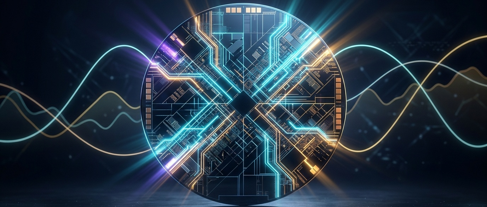
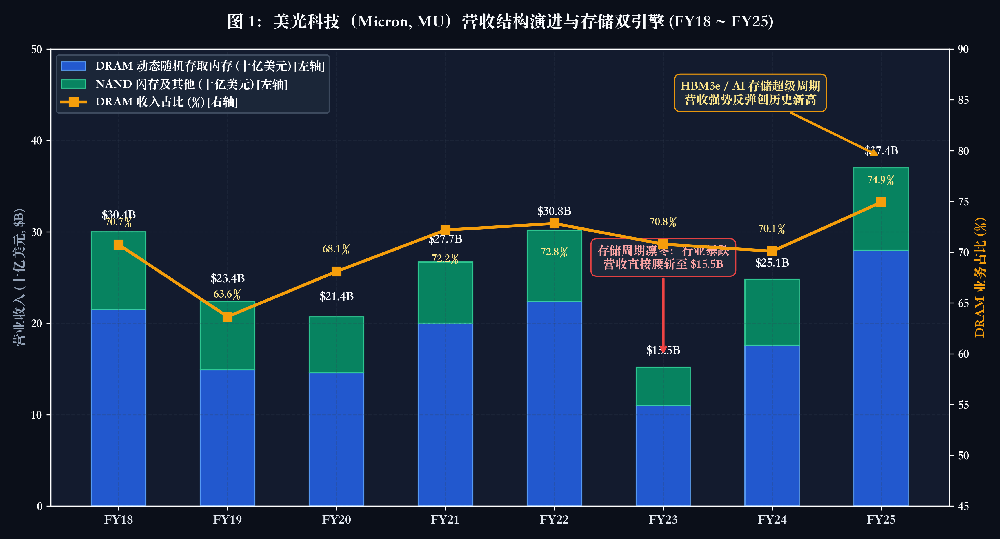
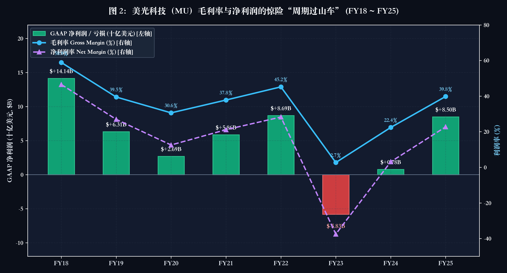
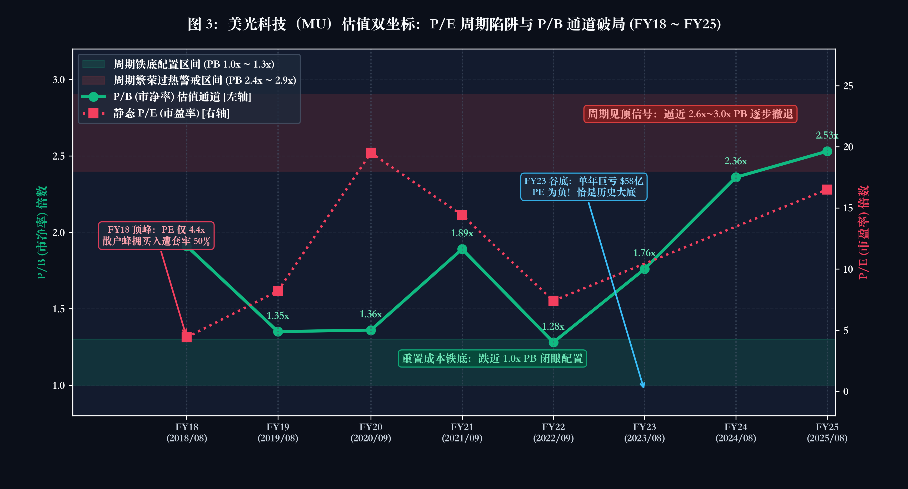
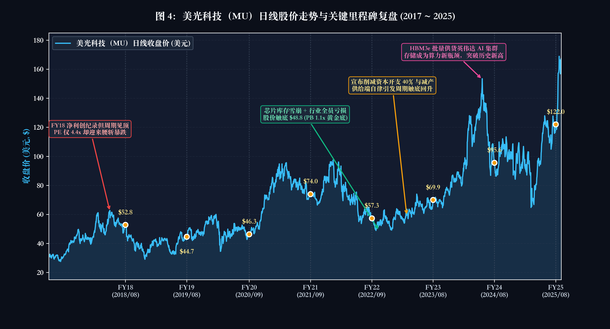

# 买方投研实战与估值体系搭建（十一）：半导体与硬科技估值法——周期、良率、产品 Mix 与中枢正常化估值



> “买在 4 倍 P/E 的景气顶点，随后资产惨遭腰斩；割在单年巨亏 58 亿美元的谷底，却完美错过了三年数倍的超级主升浪。在半导体与硬科技的投资世界里，凡是用软件思维看待硬件制造、用静态报表线性外推未来的人，终将被物理周期的巨轮无情碾碎。”

在二级市场中，没有任何一个板块能像半导体与硬科技这样，将“人性的狂热”与“周期的残酷”演绎得如此淋漓尽致。

许多初入硬科技赛道的投资者，最常犯的致命错误就是**死搬消费品或传统制造业的静态估值逻辑**：
* 看到一家芯片制造厂当年净利润暴增数倍、动态市盈率（P/E）被压缩到“令人垂涎”的 4 到 6 倍，便以为捡到了千载难逢的便宜筹码，结果买入即套在历史最高峰；
* 看到行业下行期公司单年报出数十亿美元的巨额亏损、毛利率近乎归零、动态 PE 变成负数时，吓得惊慌割肉，却恰恰把最带血的筹码抛在了超级周期的黄金铁底。

这种看似荒诞的反直觉现象，正是由硬科技行业底层的**强物理周期性（Silicon Cycle）、重资产高经营杠杆（Operating Leverage）与漫长的产能建设滞后性**所决定的。芯片不是虚拟的代码行，每一颗芯片的诞生，都依赖于重资产晶圆厂的微米级光刻、数以百计的物理工艺良率爬坡，以及瞬息万变的全球供应链供需错配。

在半导体投资中，**静态的财务报表永远是滞后的“后视镜”**。如果不能穿透“物理周期、良率爬坡、产品 Mix（组合）与单颗 ASP（平均售价）”这组核心微观密码，任何简单的财务比率推演都会沦为刻舟求剑。

本讲将从买方投研实战出发，首先梳理看懂硬科技与半导体的 **7 大底层密码**；随后深入剖析硅周期的四阶段演进规律，推导出买方通用的**市净率通道法（PB Band）与全周期中枢正常化估值模型（Normalized Mid-Cycle Valuation）**；最后，我们将以全球存储芯片三大巨头之一、纯粹周期性硬件的教科书级标杆——**美光科技（Micron Technology, NASDAQ: MU）**为实战案例，完整复盘其经历多轮完整周期的向死而生，并立足 2026 年最新出炉突破万亿美元市值的重磅财报，解密顶尖买方如何在“4 倍 PE 逃顶”、在“巨亏 58 亿时捡起带血筹码”，以及面对当下一千美元与万亿市值时的全新审视与中枢重塑。

---

## 一、 语言基石·看懂半导体的 7 大底层密码

在进入复杂的估值模型之前，我们必须先掌握半导体与硬科技产业链通用的“估值语言”。这 7 个微观指标构成了评估一家芯片公司竞争力与周期位置的核心坐标系：

### 1. Fabless / Foundry / IDM / OSAT 产业分工模式
半导体产业链早已告别了早期的单一模式，形成了精细的专业化分工：
* **Fabless（无晶圆厂芯片设计商）**：如英伟达（NVDA）、高通（QCOM）、AMD。轻资产运营，核心资产是顶尖芯片架构师的人才红利与研发专利。毛利率通常高达 60% 至 75%，经营现金流弹性极大，但极度依赖代工厂产能。
* **Foundry（晶圆代工厂）**：如台积电（TSMC）。重资产极值，单座先进制程晶圆厂（Fab）投资高达 150 亿至 200 亿美元。其商业模式的核心是**产能利用率（Capacity Utilization Rate）与设备折旧周期**。一旦利用率跌破 75%，固定折旧费用将迅速吞噬所有净利润。
* **IDM（垂直整合制造商）**：如美光科技（MU）、三星、英特尔。集芯片设计、晶圆制造与封装测试于一身，兼具轻资产的设计弹性与重资产制造的折旧风险。
* **OSAT（外包封测厂）**：如日月光、安靠。处于制造后段，近年来随着先进封装（CoWoS、TSV、Chiplet）成为延续摩尔定律的核心瓶颈，先进封装的技术溢价正在重构产业链利润分配格局。

### 2. 良率（Yield Rate）与 晶圆切割（Die per Wafer）
* **微观定义**：良率是单片晶圆上合格功能裸片（Good Die）占总裸片数的百分比。
* **利润杠杆**：良率是重资产半导体制造的“生命线”。在晶圆厂固定折旧与化学耗材成本恒定的前提下，良率从 50% 爬坡至 85%，单颗芯片的物理净成本将直接腰斩。高良率不仅意味着毛利率暴增，更是先进制程能否实现商业化盈利的分水岭。

### 3. 产品组合（Product Mix）与 均价（ASP）
* **结构性护城河**：即便在行业总出货量平淡的阶段，一家芯片公司若能通过快速迭代，将低毛利的成熟制程产品（如普通 DDR4、低阶逻辑芯片）切换为高毛利的先进制程产品（如 HBM3e/HBM4、高端车规 MCU），其综合平均售价（ASP）与综合毛利率依然能逆周期扩张。
* **买方监控点**：警惕只看“出货颗粒数”而忽视“ASP 与产品 Mix 恶化”的假增长。

### 4. 渠道存货周转天数（DOI, Days of Inventory）
* **半导体周期的“体温计”**：芯片产业链极其冗长（从硅片到最终装入终端设备通常长达 6 到 9 个月）。当终端需求放缓时，渠道和仓库中的芯片并不会立即消失，而是积压形成“堰塞湖”。
* **预警信号**：当一家芯片公司的 DOI 超过其历史正常中枢 30% 以上（例如从正常的 90 天激增至 150 天），即使当期报表营收依然在增长，也意味着“虚假繁荣”，下游客户即将启动剧烈的砍单（De-stocking）。

### 5. Book-to-Bill Ratio（订单出货比，BB 值）
* **领先景气指标**：当期净接单金额（Bookings）与当期实际出货金额（Billings）的比值。
* **拐点判别**：
  * **BB 值 > 1.0**：行业处于扩张期，订单增速快于交付，供不应求，芯片具有提价能力。
  * **BB 值 < 1.0**：行业进入收缩期，订单不及出货，往往预示着 1 至 2 个季度后的收入滑坡与价格战。

### 6. 单机半导体价值量（Silicon Content）
* **穿越周期的结构性 Alpha**：区分“纯周期芯片”与“成长型硬科技”的关键在于单机半导体含量的变化。
* **典型逻辑**：传统燃油车单车芯片价值量仅约 300 到 500 美元，而智能电动汽车（高阶智驾 + 智能座舱 + 碳化硅功率器件）单车芯片价值量飙升至 1500 至 3000 美元以上；传统通用服务器单机芯片价值量约 2000 美元，而现代 AI 算力服务器单机芯片价值量突破 40,000 美元。**总出货台数即便零增长，单机价值量的数倍提升依然能支撑百亿美元的增量市场。**

### 7. 周期中枢正常化每股收益（Normalized Mid-Cycle EPS）
* **买方去噪工具**：半导体公司在景气顶峰（Peak）时往往赚取过高的超额利润（由恐慌性囤货和现货涨价导致），而在景气谷底（Trough）时又承受存货减值和产能闲置损失。
* **计算逻辑**：买方机构在估值时，坚决剔除繁荣顶峰的不可持续暴利，而是根据全周期的平均营业利润率与中枢营收，测算出该公司在一个完整 3 至 4 年硅周期内的“平准化中枢盈利能力”，并结合市净率通道（PB Band）锚定周期安全垫。

---

## 二、 硅周期运作机制：为什么买在“高 PE / 亏损”时反而最安全？

半导体产业自诞生之日起，就如同被安装在一个摆动不息的钟摆上。要理解硬科技估值，首先必须深入其周期运行函数与生产成本结构。

### 1. 经典硅周期的四阶段演进规律

半导体周期的本质，是**下游即时波动的需求**与**上游滞后且刚性的产能建设**之间的时间差：

* **阶段 1：供给短缺与恐慌性囤货（Shortage & Double-Ordering）**  
  终端新需求爆发（如智能手机换代、远程办公潮或 AI 算力军备竞赛），芯片迅速售罄。下游客户因担心断供，开始向多家代工厂与存储原厂“超额下单”（原本需要 10 万颗，向三家供应商各自下单 10 万颗）。芯片现货价格暴涨，原厂毛利率飙升，产能利用率达到 100% 极限。
* **阶段 2：繁荣顶峰与虚假低估值（The Peak Earnings Trap）**  
  芯片公司交出历史最亮眼的财务报表，营收暴增，净利润创下天量。股价处于历史最高点，但由于当期净利润极高，**静态市盈率（P/E）被动压缩到只有 4 到 8 倍**，呈现出极其廉价的诱人假象。各家原厂纷纷宣布百亿美元级别的激进扩产计划，新晶圆厂破土动工。
* **阶段 3：供需逆转与渠道踩踏（Glut & Price Collapse）**  
  下游实际需求见顶，超额预订的虚假订单被大面积取消。渠道库存瞬间变成烫手山芋，芯片现货价格闪崩（甚至跌破现金制造成本）。原厂存货周转天数（DOI）飙升至历史警戒线上方，不得不计提巨额存货跌价准备，开工率暴跌，财报利润断崖式滑坡。
* **阶段 4：产能出清与估值绝佳黄金坑（Trough & Valuation Reset）**  
  资本开支全面冻结，各厂商削减产出，行业供给自然收缩。报表利润降至冰点甚至出现数十亿美元的巨额净亏损。此时由于净利润为负，**市盈率（P/E）变成负数或几十倍上百倍的“极高值”**。但与此同时，下游库存已经去化完毕，PB 触及 1.0x 左右的重资产铁底。**这恰恰是整个周期中最安全、赔率最高的买入时刻。**

> 提示：半导体周期投资的铁律是“买在高 PE / 负 PE（利润周期谷底），卖在低 PE（利润周期繁荣顶峰）”。用静态 PE 去给处于繁荣顶点的半导体公司估值，无异于在火山口上数金币。

### 2. 周期估值双轨制：PB 通道法与全周期中枢正常化法

为了解决“峰值暴利与谷底亏损扭曲估值”的难题，华尔街顶级买方机构普遍采用双轨制估值模型：

#### 轨道一：市净率通道法（P/B Band）—— 丈量周期底部的绝对标尺
对于美光（MU）这类重资产半导体制造企业，其净资产（Book Value）绝大部分由世界顶尖的洁净室厂房、先进制程光刻机及高精密沉积刻蚀设备构成。
* **1.0x 至 1.2x PB（铁底黄金坑）**：如果一家芯片龙头的市值跌到与其净资产等同，意味着市场给其拥有的全部核心制造专利与尖端设备打了零折，甚至认为其厂房只值二手废铁价。只要公司没有破产清算风险，这个区间几乎总是历史级底部。
* **2.5x 至 3.0x PB（估值亢奋逃顶区）**：当市净率突破 2.5 倍以上，意味着市场不仅对现有资产给予充分溢价，更透支了未来数年的暴利预期，周期繁荣往往步入尾声。

#### 轨道二：全周期中枢正常化估值模型（Normalized Mid-Cycle Valuation）
在测算周期股的中期合理内在价值时，买方机构坚决剔除繁荣顶峰的不可持续暴利，采用以下平准化计算框架：

```
全周期正常化营业收入 = 行业周期平均出货量 × 周期平准单机价值量
全周期正常化营业利润率 = 剔除极端景气峰值与亏损深坑后的中枢利润率
周期中枢净利润 = 正常化营业收入 × 正常化净利率
目标公允市值 = 周期中枢净利润 × 周期中枢合理 PE 倍数
```

#### 估值推演对比示例：
假设某周期性存储芯片龙头：
* **在景气峰值（Peak）**：年营收 300 亿美元，净利润 140 亿美元（净利率 46%）。此时股价处于高位，市值 620 亿美元，**表观静态 P/E 仅为 4.4 倍**。
  * 散户视角：“业绩大涨，PE 只有 4 倍多，简直太便宜了，闭眼买入！”
  * 买方机构视角：“46% 的超高净利率来自行业恐慌性囤货带来的不可持续暴利。过去 8 年全周期中枢净利率仅为 20%，正常化年营收仅为 250 亿美元，中枢年净利润实际上只有 50 亿美元。当前 620 亿美元市值对应正常化中枢净利的真实 PE 已经高达 12.4 倍，且 PB 逼近 2.0x 危险区间，应当坚决止盈撤退。”
* **在景气谷底（Trough）**：年营收断崖跌至 155 亿美元，净利润为负 58 亿美元（陷入巨亏）。此时股价大跌，市值缩水至 550 亿美元，**表观 P/E 为负数（无法计算）**。
  * 散户视角：“一年巨亏 58 亿美元，连毛利率都跌平了，行业彻底完蛋，赶紧割肉止损！”
  * 买方机构视角：“下游去库存已达极限，原厂资本开支已削减 40%，供给端见底。按照 250 亿美元中枢营收和 20% 正常化净利率测算，中枢净利润为 50 亿美元。当前市值对应正常化 PE 仅为 11 倍，且 PB 已经回到 1.2x 附近的历史铁底，是极佳的逆向重仓窗口。”

---

## 三、 硬件制造微观经济学：良率、稼动率悬崖与 HBM 架构质变

要精准判断一家硬科技公司的护城河深浅，必须深入其背后的生产函数与成本结构。芯片设计与制造是典型的非线性微观经济学代表。

### 1. 墨菲良率模型与芯片面积惩罚律（Die Size Penalty）

根据半导体制造工程中著名的 **墨菲良率模型（Murphy's Yield Model）**：

```
芯片良率 Y = 1 ÷ (1 + 缺陷密度 D × 裸片面积 A) 的平方
```

这个公式揭示了硬科技领域的两个残酷规律：
1. **芯片面积惩罚律（Die Size Penalty）**：芯片物理面积（A）越大，良率下降的速度呈几何级数放大。普通手机射频芯片面积小，良率易达到 90% 以上；而现代顶级 AI 芯片（如英伟达 Hopper/Blackwell 架构）或大容量 HBM 存储裸片逼近光罩极限（Reticle Limit，约 858 平方毫米），缺陷密度稍微波动，良率就会断崖式暴跌。
2. **重资产成本非线性分摊**：晶圆流片是固定成本开销。良率从 50% 提高到 85%，意味着单颗芯片分摊的固定折旧与光刻掩模费用减少了 41%。谁能率先拉升良率跨过拐点，谁就拥有了摧毁竞品的定价权空间。

### 2. 重资产制造的“稼动率悬崖”（Utilization Cliff）

半导体制造与芯片设计呈现截然相反的成本曲线形态：

* **重资产 IDM / Foundry 的“稼动率悬崖”**：  
  晶圆制造是一门典型的重折旧固定成本生意。一座 150 亿美元的晶圆厂，每年折旧高达 30 亿至 40 亿美元，无论你是否开机生产，这笔折旧每天一睁眼都在发生。  
  当产能利用率维持在 95% 时，巨额折旧被海量晶圆稀释，企业毛利率可达 50% 以上；但当下游砍单导致稼动率降至 70% 以下时，单位芯片分摊的折旧成本瞬间翻倍，毛利率甚至会直接砸穿为负数（如美光 FY23 毛利率降至 2.7%）。这种折旧刚性是周期股在下行期利润毁灭的终极推手。
* **轻资产 Fabless 的“固定研发杠杆”**：  
  芯片设计公司（Fabless）的主要成本是前置工程师薪酬与流片费用（NRE）。芯片设计一旦完成并通过验证，后续每多卖出一颗芯片，仅需向代工厂支付纯边际代工费。因此，只要下游出货量突破盈亏平衡线，后续新增收入的 70% 以上都将直接沉淀为营业利润。

### 3. HBM（高带宽内存）架构质变：从大宗标准品到 AI 定制化算力底座

在过去的数十年里，DRAM 内存一直被华尔街视作纯粹的“大宗同质化商品（Commodity）”，其价格走势完全随全球 PC 和手机周期的现货报价剧烈波动。然而，生成式 AI 的爆发彻底颠覆了这一底层范式：

* **技术维度的革命（3D 堆叠与先进封装）**：  
  HBM（High Bandwidth Memory，高带宽内存）不再是传统的平面贴片内存，而是通过 TSV（硅通孔技术）将 8 层、12 层甚至 16 层 DRAM 裸片进行立体三维堆叠，并与英伟达的 GPU 主芯片一同放置在微米级中介层（Interposer）上合封。
* **产能消耗倍增效应（Wafer Penalty）**：  
  制造 1GB 容量的 HBM 芯片，在先进制程晶圆上所消耗的裸片面积与工艺步骤，相当于生产传统普通 DRAM 的 **3 倍以上**。这意味着供给端每生产 100 颗 HBM，就会挤占并消灭掉原本 300 颗普通 PC/服务器内存的晶圆产能，从而在供给端对全行业内存带来强烈的收缩效应。
* **商业模式的范式跃迁（从现货投机到按年保供锁定）**：  
  传统内存按月按季度甚至按周结算现货价格，而 HBM 深度定制于英伟达、AMD 等算力集群的系统架构中。云巨头与芯片厂商通常提前 1 年以上完成规格验证，并签订具有法律效力的保供锁量长约。美光由此从一家被动的“大宗存储周期股”，蜕变为了分享全球 AI 算力盛宴的不可或缺的基础设施核心供应商。

---

## 四、 深度实战案例复盘：美光科技（Micron, MU）的周期向死而生与万亿跨越

作为全球仅存的三大存储芯片巨头之一（与三星电子、SK海力士三足鼎立），美光科技（Micron Technology, NASDAQ: MU）是全球半导体投资史上最经典、最纯粹的周期硬科技标杆。

美光没有多元化的软件业务作为护垫，其 98% 以上的收入直接来源于两类存储核心硬件：**DRAM（动态随机存取内存）** 与 **NAND Flash（闪存）**。复盘美光历年财报与股价轨迹，就等于读懂了整部全球半导体周期的兴衰史。

### 1. 美光 9 年 SEC 10-K 核心财务数据复盘 (FY18 ~ FY26)

下表数据严格摘录整理自美光科技官方历年提交给美国 SEC 的 10-K 年报及财务对账披露（注：美光财年通常截至每年 8 月底或 9 月初；股价及每股数据均按实际财年末复权收盘价核准）：

| 财年 (FY) | 总营收 (十亿美元) | DRAM 收入 (十亿美元) | NAND 收入 (十亿美元) | DRAM 收入占比 (%) | GAAP 毛利率 (%) | GAAP 净利润 (十亿美元) | 净利润率 (%) | 财年末市盈率 (P/E) | 财年末市净率 (P/B) | 财年末收盘价 (美元) |
| :--- | :---: | :---: | :---: | :---: | :---: | :---: | :---: | :---: | :---: | :---: |
| **FY18** | 30.39 | 21.50 | 8.50 | 70.7% | 58.9% | 14.14 | 46.5% | 4.4x | 1.91x | 52.76 |
| **FY19** | 23.41 | 14.90 | 7.50 | 63.6% | 39.5% | 6.31 | 27.0% | 8.2x | 1.35x | 44.67 |
| **FY20** | 21.44 | 14.60 | 6.10 | 68.1% | 30.6% | 2.69 | 12.5% | 19.5x | 1.36x | 46.33 |
| **FY21** | 27.71 | 20.00 | 6.70 | 72.2% | 37.8% | 5.86 | 21.1% | 14.4x | 1.89x | 73.99 |
| **FY22** | 30.76 | 22.40 | 7.80 | 72.8% | 45.2% | 8.69 | 28.3% | 7.4x | 1.28x | 57.31 |
| **FY23** | 15.54 | 11.00 | 4.20 | 70.8% | 2.7% | -5.83 | -37.5% | 负数 (亏损) | 1.76x | 69.94 |
| **FY24** | 25.11 | 17.60 | 7.20 | 70.1% | 22.4% | 0.78 | 3.1% | 136.5x | 2.36x | 95.57 |
| **FY25** | 37.38 | 28.00 | 9.00 | 74.9% | 39.8% | 8.50 | 22.7% | 16.5x | 2.53x | 122.00 |
| **FY26** | 133.19 | 100.68 | 31.79 | 75.6% | 80.7% | 84.97 | 63.8% | 12.9x | 7.91x | 958.16 |

*数据来源：Micron Technology 官方 SEC 10-K 年报、Investor Relations。注：FY26 财年截至 2026 年 9 月 3 日，财年末收盘价为 958.16 美元；而在 2026 年 9 月 30 日美光正式披露震撼年报后，股价跳涨突破 1,000 美元，截至 2026 年 10 月初股价已达到 1,072 ~ 1,097 美元，总市值突破 1.22 万亿美元，对应市净率 P/B 高达 8.8x ~ 9.0x，年化单季 P/E 压缩至 8.0x。*

---

### 2. 核心图表复盘：周期浪潮下的财务与估值全景

#### 图 1：营收结构演进与“存储双引擎” (FY18 ~ FY25)


从图 1 可以清晰看到存储周期的剧烈呼吸：
* **DRAM 始终是基石主舵**：DRAM 业务在美光总营收中的占比常年稳固在 63% 至 75% 之间。DRAM 价格与出货量的变动，直接主导了美光总营收的生命线。
* **两次深幅过山车**：FY18 营收冲顶至 303.9 亿美元后，受智能手机与云厂商去库存影响，连跌两年至 FY20 的 214.4 亿美元；而在随后的疫情居家红利与缺芯潮刺激下，FY22 营收反弹至 307.6 亿美元的新高；随后迎接美光的，则是 FY23 史诗级的**营收断崖腰斩至 155.4 亿美元**。
* **AI 驱动的超级爆发**：FY25 在高带宽内存 HBM3e 批量供货英伟达 AI 集群的驱动下，美光营收一举跨过 373.8 亿美元，创下公司成立以来的历史最高纪录。

#### 图 2：毛利率与净利润的惊险“周期过山车” (FY18 ~ FY25)


图 2 完美诠释了什么是重资产高经营杠杆的“双刃剑”效应：
* **从暴利 141 亿到巨亏 58 亿**：FY18 在大繁荣顶峰，美光的 GAAP 毛利率逼近 **59%**，净利润高达 **141.4 亿美元**，净利率高达惊人的 46.5%；然而到了 FY23，由于现货价格跌破成本线与巨额存货减值，毛利率近乎归零（仅剩 **2.7%**），单年巨亏 **58.3 亿美元**！
* **经营杠杆的极致释放**：在下行期，固定设备折旧无情碾碎利润；而在上行期（FY24 至 FY25），随着晶圆厂稼动率重新拉满与高毛利 HBM 出货，毛利率从 2.7% 火箭式反弹至近 40%，净利润迅速扭亏暴增至 85 亿美元。

#### 图 3 与 图 4：估值倍数通道与日线股价关键节点（像素级时间轴对齐）





将图 3 的估值倍数变动与图 4 的日线股价走势垂直对照，我们可以清晰地将美光科技的发展划分为三大历史纪元：

---

### 3. 历史复盘：美光科技的四幕历史大戏

#### 第一幕：4.4 倍 PE 的致命诱惑与 50% 腰斩深渊（FY18 ~ FY20）
2018 年初，全球数据中心云化与加密货币挖矿热潮推升存储芯片价格暴涨，美光迎来了前所未有的超级景气顶点。
* **低估值陷阱的完美范本**：FY18 美光年赚 141.4 亿美元，管理层交出了历史最辉煌的报表。此时各路卖方分析师纷纷喊出“这次不一样，存储已摆脱周期”。美光股价在 2018 年年中冲至 64 美元附近，此时其**静态市盈率（P/E）仅为 4.4 倍**（见图 3）。
* **戴维斯双杀降临**：被低 PE 吸引进场的普通投资者未曾料到，4.4 倍 PE 正是全周期的最高危时刻。随着下游智能手机销量放缓和云巨头削减采购，存储芯片现货价格在 2018 下半年崩盘。美光营收逐季滑坡，利润迅速缩水。
* **股价惨烈腰斩**：短短 6 个月内，美光股价从 64 美元一路狂泻至 2018 年末的 28.3 美元，**跌幅超过 55%**！在此期间，由于利润下滑速度远快于股价下跌，其表观 P/E 反而从 4.4 倍被动推升到了 10 倍以上。

#### 第二幕：供应链过山车与单年巨亏 58 亿的 1.1x PB 绝佳黄金坑（FY21 ~ FY23）
2021 年全球疫情催生了远程办公与居家娱乐对 PC、平板和服务器的井喷需求，加之汽车“缺芯荒”蔓延，存储行业再度进入供给紧俏通道。
* **虚假繁荣再现**：客户为了防范供应链断链而展开了历史上最激进的“双倍下单（Double Ordering）”。美光在 FY21 与 FY22 迎来业绩第二波爆发，营收重回 300 亿美元上方，净利润达到 86.9 亿美元。FY22 财年末，其静态 PE 再次被压低到 **7.4 倍**。
* **2022 凛冬降临：通胀高企与下游断崖**：2022 年美联储开启史诗级暴力加息，全球消费电子需求骤降。客户手里堆满了之前超额囤积的芯片，开始长达数个季度的“零采购清库存”行动。
* **FY23 史上最惨财报**：美光营收直接腰斩至 155.4 亿美元，毛利率被压缩到 2.7% 的物理极限，单年净亏损高达 **58.3 亿美元**。各家评级机构纷纷下调评级，悲观情绪笼罩市场。
* **买方眼中的 1.1x PB 黄金坑**：  
  在 2022 年底至 2023 年初，美光股价最低探底至 48.8 美元。此时美光的表观 PE 彻底失真（净利润为负无法计算），但敏锐的买方专业机构却打开了 **P/B 估值通道（图 3）**：  
  此时美光每股净资产约 44 美元，48.8 美元的股价对应 **市净率仅为 1.1x**！这意味着市场认为美光遍布全球的尖端晶圆厂全部报废。与此呼应的是，美光管理层在 2022 年底宣布削减 40% 的资本开支并带头减产。**供给端出清信号确立，1.1x PB 的绝佳黄金坑构筑完成，成为长线买方重仓捡起带血筹码的最核心依据。**

#### 第三幕：HBM3e 批量供货英伟达与 AI 超级周期的暴涨（FY24 ~ FY25）
2023 年下半年，以 ChatGPT 为代表的生成式 AI 引爆了全球数据中心对 GPU 算力的无限渴望，存储行业的运行逻辑发生了不可逆的质变。
* **HBM3e 逆袭破局**：在过去的 HBM 研发中，韩国 SK海力士一度占据先发优势。然而在 24GB/36GB 的 8 层及 12 层 HBM3e 关键代际上，美光凭借其 1-beta（1b）先进工艺制程与卓越的能效控制，实现了技术跨越，并率先顺利通过英伟达严苛的测试验证，正式进入 H200 与 Blackwell（B200）旗舰 AI 芯片的核心供应链。
* **戴维斯超级双击**：  
  1. **业绩爆炸**：由于生产 HBM 消耗了 3 倍的常规晶圆产能，原本供过于求的普通 DDR5 和服务器存储价格也随之全面暴涨。美光 FY24 营收强劲反弹至 251.1 亿美元并顺利扭亏；FY25 营收更是一跃冲上 **373.8 亿美元的历史新顶峰**，毛利率逼近 40%。  
  2. **估值跃迁**：市场彻底抛弃了给普通大宗商品周期股的估值折价，开始将其重塑为“AI 算力基础设施核心玩家”。美光股价从 2023 年初的底部 50 美元起步，在 2024 年夏季突破 150 美元，创下历史新高，经历了两轮向死而生的惊天大逆转！

#### 第四幕：立足当下 2026 年：万亿市值跨越、87% 毛利率神话与周期的终极诘问
站在 2026 年 10 月的当下节点，美光科技刚刚在数天前（2026 年 9 月 30 日收盘后）交出了整个人类半导体制造史上最不可思议的一份财报，将全球资本市场的博弈推向了前所未有的白热化高潮：
* **震撼全球的 FY26 成绩单**：  
  * **体量火箭式跃迁**：FY26 美光总营收冲上惊人的 **1331.9 亿美元**（同比增长超 250%，是 FY25 的 3.5 倍，更是 FY23 谷底的近 9 倍！）。
  * **单一产品破千亿**：DRAM 收入破天荒突破 **1000 亿美元** 大关（达到 1006.8 亿美元）。
  * **印钞机般的净利润**：全年实现 GAAP 净利润 **849.7 亿美元**（净利率高达 63.8%）。而在刚刚过去的第四财季（Q4 FY26），单季营收冲到 542.3 亿美元，Non-GAAP 毛利率达到了骇人听闻的 **87.0%**，单季度 Non-GAAP EPS 就高达 **33.42 美元**！
  * **破千美元与万亿市值俱乐部**：财报发布后，美光股价直接跨过千美元大关，最高冲至 **1097 美元**，总市值正式突破 **1.22 万亿美元**，成为全球市值最昂贵的硬科技巨头之一。
* **卖方狂欢：AI 超级智能时代的“算力税收垄断”**：  
  卖方分析师纷纷喊出 1300 至 1500 美元的目标价，其逻辑看似坚不可摧：“随着英伟达 Vera Rubin 架构量产，HBM4 采用台积电 3nm 逻辑裸片做 Base Die，存储芯片已成为深度定制的算力核心；HBM4 消耗晶圆面积达到普通 DRAM 的 3 到 4 倍，供给端被永久锁死；按 Q4 单季 33.42 美元年化（年化 EPS 超 133 美元），当前 1070 美元股价对应**动态市盈率仅为 8.0 倍**，即便按全年 GAAP EPS 计算也仅 14.4 倍，简直便宜得不可思议！”
* **买方冷眼：熟悉的声音、放大十倍体量的“终极周期拷问”**：  
  然而，坐在买方投研室的成熟分析师们，审视着这份繁花似锦的报表与 8 倍动态 PE，骨髓里却升起一股寒意：
  1. **8.8x PB 彻底粉碎了物理资产锚**：美光每股净资产虽大幅增厚至 121 美元（归母权益 1384 亿美元），但在 1070 美元上方，**其市净率（P/B）高达 8.85x（盘中触及 9.0x）**！半导体工业 40 年来，美光无论在何等疯狂的牛市顶峰，PB 也从未突破过 3.0x。8.8 倍 PB 意味着市场已经完全忘记了它是一家重资产晶圆制造厂，而赋予了它轻资产垄断软件的估值溢价。
  2. **87% 毛利率的不可持续性**：现代工业史中，没有任何重资产制造业能够长期维持 80% 以上毛利率。超额暴利正在诱发全球最狂暴的资本开支竞赛：三星电子与 SK海力士正在全球以数百亿美元量级抢建洁净室。
  3. **资本开支悬顶（CapEx Overhang）**：当前的万亿市值建立在云巨头对 AI CapEx 每年 50%+ 复合增长的乐观预期上。一旦下游算力基建进入阶段性消化期，海量先进制程产能集中释放，87% 的毛利率将迅速遭遇“稼动率悬崖”的无情反噬。

---

### 4. 买方实战测算：美光科技（MU）全周期中枢正常化估值建模

掌握了硅周期的运行机理后，买方投研面临的最核心挑战是：**如何在具体的历史时点，建立不含“后视镜未来函数”的动态估值模型？**

在投资实战中，周期中枢不是一个静态不变的常数，而是一个**动态滚动的全周期滑动窗口（Rolling Mid-Cycle Window）**。因为半导体既受 3 到 4 年物理供需周期的剧烈牵引，又承载着技术演进带来的长期容量增长。买方分析师在每一个具体时点，都必须基于“截至当时可获取的一个完整历史周期（包含完整的波峰与波谷）”，去推导该时点的正常化中枢盈利能力。

下面我们以美光科技历史上最关键的两次极值拐点为例，进行严密的第一手数据回溯与建模测算：

#### 场景一：站在 2018 年景气顶点——如何用“FY14 ~ FY17 滚动中枢”识破 4.4 倍低 PE 陷阱？

**1. 历史底表回溯（基于当时可得的 FY14 ~ FY17 官方 SEC 10-K 数据）**：  
要给 2018 年的美光做中枢平准，必须调取此前经历完整波峰与波谷的一个物理周期（2013 年 7 月美光完成收购日本尔必达，FY14 为整合后的首个完整财年，至 FY17 刚好构成后尔必达时代的第一个完整 4 年周期）：
* **FY14**（景气期）：营收 163.6 亿美元，GAAP 净利润 30.3 亿美元
* **FY15**（降速期）：营收 161.9 亿美元，GAAP 净利润 28.7 亿美元
* **FY16**（周期谷底）：营收 124.0 亿美元，GAAP 净亏损 -2.8 亿美元（行业陷于亏损）
* **FY17**（全面复苏）：营收 203.2 亿美元，GAAP 净利润 50.9 亿美元

**2. 周期中枢指标测算**：
* **4 年累计营收**：`163.6 ＋ 161.9 ＋ 124.0 ＋ 203.2 ＝ 652.7 亿美元`
* **4 年平准化年化中枢营收**：`652.7 ÷ 4 ＝ 163.2 亿美元`
* **4 年累计净利润**：`30.3 ＋ 28.7 − 2.8 ＋ 50.9 ＝ 107.1 亿美元`
* **4 年平准化年化中枢净利**：`107.1 ÷ 4 ＝ 26.8 亿美元`
* **全周期中枢净利率**：`107.1 ÷ 652.7 ＝ 16.4%`  
  *(注：即便算上收购当年的 FY13，5 年平准化年化中枢净利也仅为 23.8 亿美元)*

**3. 买方估值照妖镜（2018 年年中实操）**：
* **报表假象**：当期净利润暴增至 141.4 亿美元，股价 52.8 美元，市值约 580 亿美元（年内峰值 64 美元对应市值约 740 亿美元），**表观静态 PE 仅为 4.4 倍**。卖方研报狂呼“超级低估”。
* **真实正常化 PE**：将 580 亿美元市值除以当时周期中枢净利润（26.8 亿美元），**真实正常化市盈率 ＝ 580 ÷ 26.8 ＝ 21.6 倍**！（若按峰值 740 亿美元计算，正常化 PE 甚至高达 **27.6 倍**！）。
* **决策结论**：对于一家重资产、强周期性的存储原厂，21.6 倍至 27.6 倍的正常化市盈率，已经极度泡沫化并顶到了估值天花板，叠加 PB 逼近 2.0x 危险区，买方坚决判定为“低 PE 诱多陷阱”，果断清仓离场。美光股价随后从 64 美元暴跌至 28 美元。

---

#### 场景二：站在 2022 年底周期谷底——如何用“FY17 ~ FY21 滚动 5 年中枢”捕捉 1.1x PB 绝佳黄金坑？

**1. 历史底表回溯（基于此前完整的 FY17 ~ FY21 官方 SEC 10-K 数据）**：  
站在 2022 年底行业坠入冰点、股价探底时，买方分析师调取的是此前经历完整波峰与波谷的 5 年周期底表：
* **FY17**（全面复苏）：营收 203.2 亿美元，GAAP 净利润 50.9 亿美元
* **FY18**（超级繁荣顶峰）：营收 303.9 亿美元，GAAP 净利润 141.4 亿美元
* **FY19**（渠道去库存）：营收 234.1 亿美元，GAAP 净利润 63.1 亿美元
* **FY20**（周期磨底）：营收 214.4 亿美元，GAAP 净利润 26.9 亿美元
* **FY21**（需求二次回升）：营收 277.1 亿美元，GAAP 净利润 58.6 亿美元

**2. 周期中枢指标测算**：
* **5 年累计营收**：`203.2 ＋ 303.9 ＋ 234.1 ＋ 214.4 ＋ 277.1 ＝ 1232.7 亿美元`
* **5 年平准化年化中枢营收**：`1232.7 ÷ 5 ＝ 246.5 亿美元`（约 247 亿美元）
* **5 年累计净利润**：`50.9 ＋ 141.4 ＋ 63.1 ＋ 26.9 ＋ 58.6 ＝ 340.9 亿美元`
* **5 年平准化年化中枢净利**：`340.9 ÷ 5 ＝ 68.2 亿美元`
* **全周期中枢净利率**：`340.9 ÷ 1232.7 ＝ 27.6%`  
  *(注：即便买方审慎预期随后 2022/2023 下行期将发生剧烈亏损，并进行悲观平滑下修，周期年化中枢净利润底线依然在 50 亿至 53 亿美元区间，对应平准净利率约 20%~21%)*

**3. 买方估值试金石（2022 年底实操）**：
* **报表假象**：2022 年底美光股价崩跌至 48.8 美元，市值缩水至约 530 亿美元。由于随后面临行业大亏，市盈率即将变成负数，散户因恐惧断崖亏损而疯狂踩踏割肉。
* **真实正常化 PE**：将 530 亿美元市值除以 5 年中枢净利（68.2 亿美元），**真实正常化市盈率仅为 ＝ 530 ÷ 68.2 ＝ 7.8 倍**！（即便按悲观平滑后的 50 亿美元底线利润测算，正常化 PE 也仅为 **10.6 倍**）。
* **PB 估值双底确认**：美光每股账面净资产约 44 美元，48.8 美元股价对应 **市净率仅为 1.1x PB**，直接砸到了重资产清算价值的历史铁底。
* **决策结论**：不到 8 到 10 倍的正常化市盈率，加上 1.1 倍 PB 的极厚资产清算级安全垫，构成了赔率极佳的非对称看涨期权。长线买方在此阶段坚决逆向建仓，成为随后的超级赢家。

---

#### 场景三：立足 2026 财报发布当下——万亿市值下的“新中枢重估”与周期终极诘问

站在 2026 年 10 月、美光交出 1332 亿营收与 850 亿净利的当前节点，全市场都在追问同一个终极命题：**美光是否已经彻底摆脱了周期，蜕变成了万亿美元体量的 AI 超级公用事业？买方该如何给当下的美光估值？**

**1. 跨周期 9 年全样本（FY18 ~ FY26）的历史造血基线**：  
从 2018 年顶峰到 2026 年顶峰，美光经历了完整的“波峰（2018）- 谷底（2020）- 繁荣（2022）- 巨亏（2023）- 爆发（2024-2026）”大轮回：
* **9 年累计总营收**：`30.39 ＋ 23.41 ＋ 21.44 ＋ 27.71 ＋ 30.76 ＋ 15.54 ＋ 25.11 ＋ 37.38 ＋ 133.19 ＝ 344.93 亿美元`
* **9 年平准化年化中枢营收**：`344.93 ÷ 9 ＝ 383.3 亿美元`
* **9 年累计净利润**：`14.14 ＋ 6.31 ＋ 2.69 ＋ 5.86 ＋ 8.69 − 5.83 ＋ 0.78 ＋ 8.50 ＋ 84.97 ＝ 126.11 亿美元`
* **9 年平准化年化中枢净利**：`126.11 ÷ 9 ＝ 140.1 亿美元`
* **9 年全周期平准 EPS**：按当前 11.4 亿股折算，**历史平准中枢 EPS 约为 12.3 美元**。

**2. 核心买方分歧：如何科学对待“结构性范式跃迁（Regime Shift）”？**：  
如果机械地套用 9 年平均（140 亿中枢净利润），显然低估了 AI 时代内存地位的物理质变：
* **晶圆消耗惩罚（Wafer Penalty）**：HBM4 消耗 3 到 4 倍的常规晶圆面积，从物理上收缩了全球通用存储的供给弹性；
* **单机含硅量（Silicon Content）剧增**：DRAM 占 AI 算力集群总成本的比重从过去通用服务器的 15% 飙升至 35% 以上；
* **定制化绑定**：与台积电先进封装、英伟达 Vera Rubin 的系统级深度异构整合，使部分收入转变为高壁垒的定制化现金流。

然而，如果盲目把 FY26 年赚 850 亿美元（甚至 Q4 年化赚 1300 亿）视作“永久稳态”，则是重蹈 2018 年 4.4 倍低 PE 诱多陷阱的覆辙。

**3. 买方双轨情景压力测试（立足 1070 美元 / 1.22 万亿美元市值关口）**：

* **基准情景（结构性台阶大幅上移 ＋ 长期供需常态化）**：  
  * **中枢营收预期**：承认 AI 带来的长期永久性增量，将未来一个完整周期的平准年化中枢营收大幅上调至 **650 亿至 750 亿美元**（是 2018-2022 年中枢 250 亿的近 3 倍！）。
  * **中枢净利率预期**：随着未来 2-3 年三星、SK海力士庞大先进制程洁净室产能释放，行业超额暴利逐步回落，但受益于 HBM 高占比，中枢净利率维持在 **25%**（显著高于历史 19.4% 的稳态）。
  * **正常化中枢净利**：`700 亿美元 × 25% ＝ 175 亿美元`（对应中枢 EPS 约 **15.3 美元**）。
  * **真实正常化 PE 测算**：  
    将当前 1.22 万亿美元市值除以中枢净利（175 亿美元），**真实正常化市盈率 ＝ 12200 ÷ 175 ＝ 69.7 倍**！（按股价 1070 美元除以 15.3 美元中枢 EPS，**正常化 PE 约为 70.0 倍**！）。
* **超级狂热乐观情景（AI 基础设施永久超级公用事业化）**：  
  * 即便按照最狂热的买方公用事业化假设：假设美光年营收永远不回落，稳态中枢营收达到 **1000 亿美元**，全周期中枢净利率高达 **35%**（中枢年净利高达 **350 亿美元**，对应中枢 EPS 达 **30.7 美元**）。
  * **真实正常化 PE 测算**：  
    `12200 ÷ 350 ＝ 34.9 倍`！（对应股价 1070 美元 ÷ 30.7 美元 ＝ **34.9 倍**）。

**4. 2026 年买方终极决策结论**：
* **估值照妖镜的无情穿透**：表面上看，美光按当期收益算 PE 只有 14 倍，按 Q4 年化甚至只有 8 倍，看似“唾手可得的低估值”；但只要放入全周期正常化收益模型中审视，其真实估值高达 **35 倍至 70 倍**！
* **PB 物理资产锚的彻底破位**：美光当前每股净资产约 121 美元（归母权益 1384 亿美元），1070 美元股价对应 **市净率高达 8.86 倍（盘中触及 9.0 倍）**！在过去 40 年的历史中，美光的 PB 从未突破过 3.0 倍。8.8 倍的 PB 意味着当前股价中只有大约 11% 是由真实的晶圆厂、尖端光刻机等硬资产构成的清算底线，其余 89% 的市值全部建立在对未来超额暴利“永不降速、永不价格战”的乐观预期上。
* **买方行动指南**：买方的纪律永远不是“猜顶”，而是“算清赔率”。站在 2026 年 10 月 1.22 万亿美元的关口，美光当下的估值已经透支了未来数年的 AI 景气外推。对于专业买方机构而言，这绝非逆向建仓买点，而是需要紧盯各大原厂资本开支释放节奏、分批锁定丰厚利润的“景气兑现防守期”。

---

## 五、 买方避坑工具箱与实战自查清单

在分析半导体与硬科技公司时，买方机构应当常备以下“体检工具箱”，以规避常见的估值地雷。

### 1. 识别三大致命估值地雷

* **地雷 1：“假便宜”的景气顶峰低估值陷阱（Peak Earnings Trap）**  
  * **危险信号**：一家纯周期芯片公司的动态 PE 降至 4 到 6 倍，所有卖方研报一致推荐“估值处于历史最低百分位，强烈买入”。  
  * **穿透核查**：查看其下游终端（PC、智能手机、通用服务器）是否已经连续狂欢了 6 个季度以上？渠道存货周转天数（DOI）是否创出新高？如果是，当期的高盈利极大概率是周期的峰值暴利，迎接投资者的将是“利润暴跌 80% + 估值收缩”的戴维斯双杀。
* **地雷 2：重资产制造厂的“稼动率悬崖”（Capacity Utilization Cliff）**  
  * **危险信号**：二线晶圆代工厂或传统封测厂在景气高点宣布激进资本开支扩产。  
  * **穿透核查**：重资产工厂的折旧费用是不可逆的刚性支出。一旦产能利用率从 95% 滑落至 70%，哪怕产品价格只下跌 10%，公司的营业利润也可能瞬间由正转负。在下行周期中，永远不要用重资产制造厂的 EBITDA 去幻想其安全边际。
* **地雷 3：资本开支膨胀后的“降价踩踏陷阱”（CapEx Overhang）**  
  * **危险信号**：行业主要竞争对手在过去两年内的资本开支（CapEx）总和占其营业收入的比例超过 45% 以上。  
  * **穿透核查**：半导体新建晶圆厂从动工到设备搬入、良率爬坡通常需要 18 到 24 个月。行业集体激进扩产意味着 2 年后将有巨量同质化产能集中涌向市场，极易引发惨烈的价格战踩踏。

### 2. 硬科技公司质地与估值自查清单

在决定重仓一家硬科技公司之前，请逐项核对以下指标：

| 评估维度 | 核心观察指标 | 优秀健康状态（绿色通行） | 警惕预警状态（黄色观察） | 危险淘汰状态（红色否决） |
| :--- | :--- | :--- | :--- | :--- |
| **周期位置** | DOI 存货周转天数 | 处于历史中枢 ±10% 以内，且环比逐季下降 | DOI 超过历史中枢 30%，渠道库存开始堆积 | DOI 创历史新高，客户全面要求延期交货或砍单 |
| **估值锚点** | 市净率通道（P/B Band） | 处于历史底部 1.0x 至 1.3x PB，安全垫极厚 | 处于历史中枢 1.6x 至 2.0x PB，估值合理偏中性 | 超过 2.6x PB 甚至逼近 3.0x PB，周期风险极高 |
| **产品 Mix** | 高附加值新品与单颗 ASP | 高附加值芯片占比持续上升，ASP 逆周期走强 | ASP 走平，出货量增长依靠降价打折推动 | 主力芯片价格崩盘，竞品大打恶性价格战 |
| **资本开支** | CapEx / 营收比例 | 逆周期削减资本开支，维护自由现金流与供需 | 顺周期温和扩产，资本开支与折旧基本匹配 | 在景气顶峰激进加杠杆扩产，资本开支占比超 50% |
| **研发效率** | 关键制程良率与研发转化 | 新制程良率在量产 6 个月内突破 75% 商业线 | 研发费用逐年增加，但新产品量产屡次跳票延期 | 核心架构落后竞品整整一代，且缺乏不可替代专利 |

---

## 六、 本讲小结与买方心法

半导体与硬科技是人类现代工业皇冠上的明珠，也是二级市场上最具魅力的造富竞技场。但驾驭这类资产的根本，在于彻底摆脱对线性外推财务数据的依赖，建立基于物理法则与产业周期的三维认知：

1. **周期是硬科技的宿命，但中枢是锚定价值的罗盘**。平庸的投资者在周期的浪尖被狂热冲昏头脑，在周期的深渊被恐惧击溃割肉；而成熟的买方机构则坚守“全周期正常化收益模型”，在繁荣顶点用正常化利润测算真实泡沫，在行业深渊用重资产市净率（PB）寻找铁底。
2. **读懂微观密码，才能先于报表抢跑**。存货周转天数（DOI）是水库的水位警报，订单出货比（BB 值）是前瞻的景气指南针，良率爬坡曲线是毛利率爆发的引信，而产品 Mix 与单机价值量（Silicon Content）则是抵御周期寒冬的最强铠甲。
3. **美光科技的启示：向死而生处的非对称赔率**。当一家手握全球核心制造主权的技术龙头，在周期底部报出数十亿美元巨亏、静态市盈率变成负数、股价跌回 1.1 倍净资产时，往往不是绝望的终点，而是下一场波澜壮阔超级周期酝酿的起点；而当它在超级 AI 周期顶峰报出 87% 的神话毛利率、8 倍的表观低市盈率、市值冲过万亿美元而市净率飙至近 9 倍时，买方最需要的则是克制狂热、回归常识的定力。

---

### 思考题
如果一家重资产芯片制造巨头正处于周期底部，当年财报巨亏 30 亿美元，当前股价对应市净率为 1.15 倍；此时行业领先指标 BB 值连续两个月回升至 1.05，且公司宣布将新一代 AI 专用内存的资本开支占比提升至 60%。作为买方投资经理，你会如何结合“PB 通道法”与“周期中枢正常化法”评估该标的的潜在风险收益比？欢迎在评论区分享你的深度思考。
