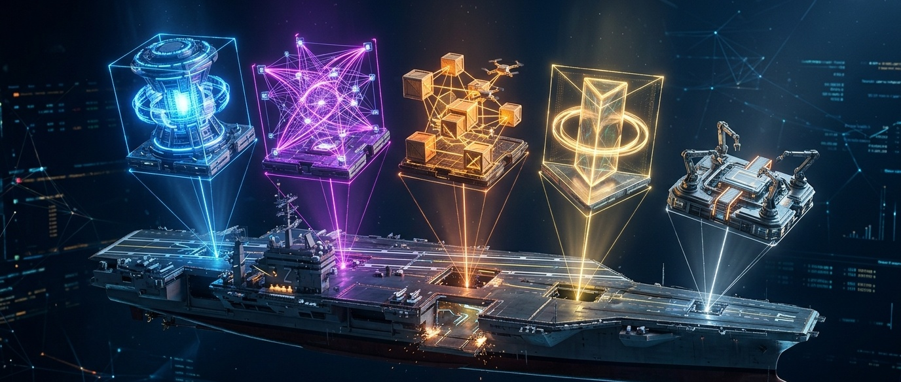
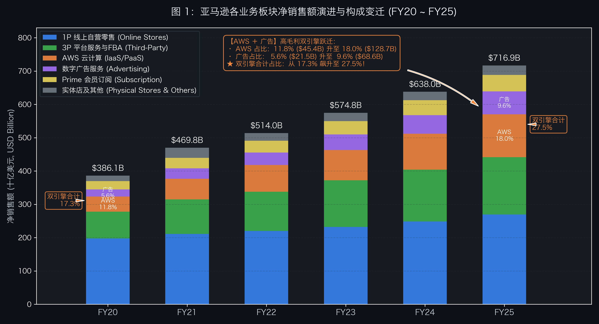
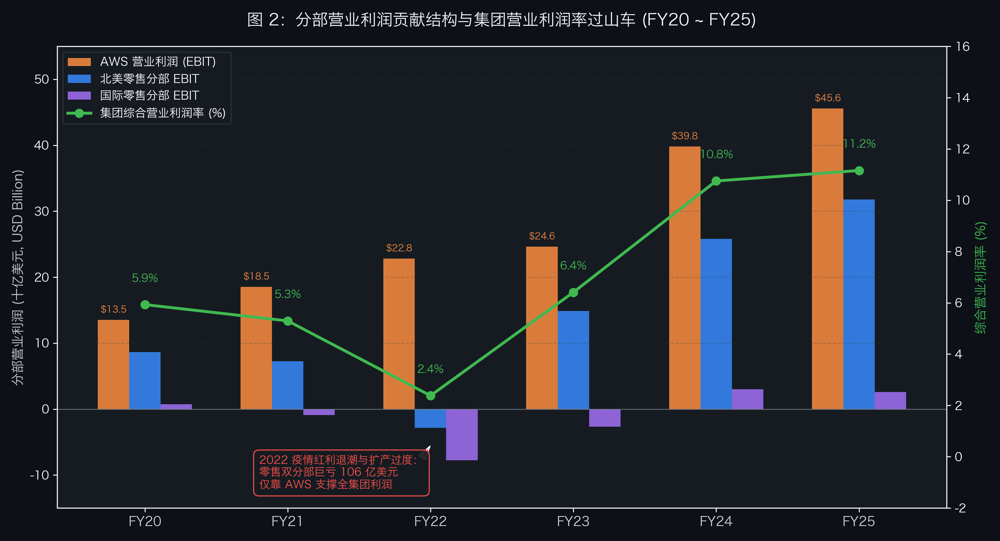
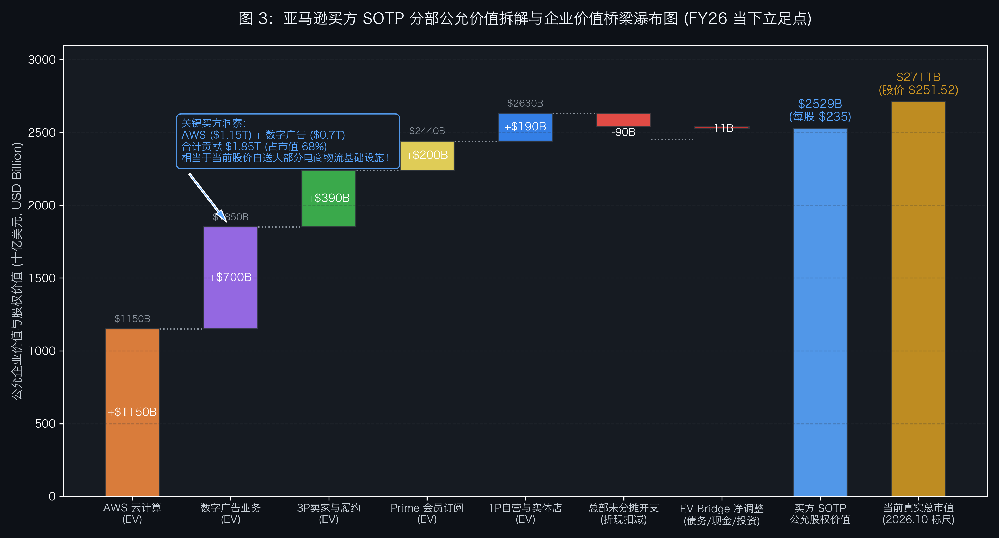
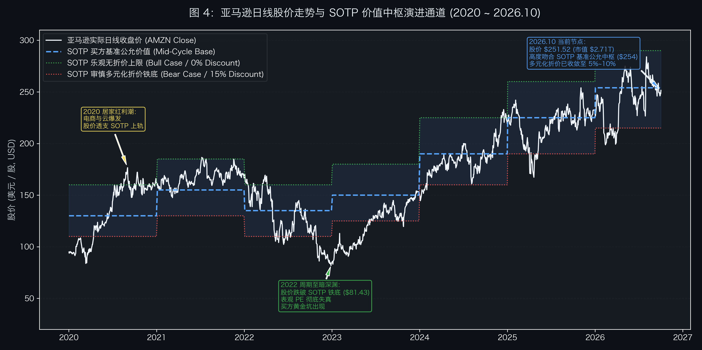

# 第 12 讲｜平台与航母企业解剖——SOTP 分部加总估值如何破解多元化折价？



> “当一家公司成长为横跨零售、云计算、数字广告与物流基建的商业航母时，用单一市盈率对其估值无异于盲人摸象。唯有解构分部，方能穿透多元化折价的迷雾，看清隐形帝国的真实底牌。”

在二级市场的估值坐标系中，最令分析师头疼的物种，莫过于**超级平台与多元化商业航母**。

以全球商业巨擘**亚马逊（Amazon, NASDAQ: AMZN）**为例：
* 如果你用**市盈率（P/E）**去衡量它，你会发现它的历史静态 PE 经常在 40 倍到 100 倍之间剧烈波动。当公司加大物流基建与 AI 算力 CapEx 投入时，净利润骤降，PE 瞬间爆表；当效率优化、经营杠杆释放时，净利润暴增，PE 又迅速被动收缩；
* 如果你用**市销率（P/S）**去衡量它，更是犯了严重的“混为一谈”错误——把 1 美元毛利率仅 15%、净利率仅 2% 的 1P 线上自营日用百货销售额，与 1 美元经营利润率超过 35% 的 AWS 云计算收入、以及经营利润率超过 50% 的高毛利搜索广告收入，按照同一个倍数简单打包打折。

这种“用一把尺子量整艘航母”的粗糙估值方式，直接导致了资本市场最经典的估值异象：**多元化折价（Conglomerate Discount）**。

市场往往因为一家企业业务过于复杂、各个板块处于完全不同的生命周期和资本回报率阶段，而给予整个集团 10% 至 30% 的系统性估值折价。

要破解这一困局，顶尖买方投研机构的核心武器就是：**SOTP（Sum-of-the-Parts，分部加总估值法）**。

SOTP 的本质是**业务解耦与价值重构**：将一艘复杂的航空母舰拆解为独立巡航的驱逐舰、护卫舰与核潜艇，为每一个业务板块寻找全球资本市场中最纯粹的对标资产（Pure-play Peers），匹配其独立的资本成本、成长速度与估值乘数，最后经过严谨的“企业价值桥（EV Bridge）”清洗与未分摊开支扣除，拼装出整艘航母的公允内在价值。

本讲将从买方投研底层逻辑出发，系统阐述看懂平台型巨头的 **5 大底层密码**；推导一套严谨的 **SOTP 估值工程学五步 SOP**；解析平台生态独有的**飞轮效应与交叉补贴微观机制**；并以**亚马逊（AMZN）**为实战案例，依据其历年经审计 SEC Form 10-K 原生数据，在 2026 年的当下时间节点，进行五大商业帝国的颗粒级解构与分部加总估值建模。

---

## 一、 语言基石·看懂航母与平台企业的 5 大底层密码

在进入具体的建模表格前，我们必须掌握买方分析师在评估综合型平台与多元化控股集团时的 5 个核心专业概念。正是这 5 块基石，构成了 SOTP 的方法论底座：

### 1. SOTP（分部加总估值法，Sum-of-the-Parts）
SOTP 是一种将多元化企业的各个独立运营板块视作独立实体分别进行估值，再通过企业价值桥加总得出母公司权益价值的绝对/相对综合估值方法。
* 其核心前提是**业务可分性（Separability）**：不同板块在商业模式、毛利率结构、再投资需求（CapEx）以及所处生命周期上存在本质分化，无法用单一倍数（如全公司统一的 P/E 或 EV/EBITDA）进行准确刻画；
* 其输出结果不仅是一个公允的目标价格区间，更是穿透公司业务结构、识别价值低估与隐形利润池的“透视仪”。

### 2. 多元化折价（Conglomerate Discount）与 生态协同溢价（Synergy Premium）
* **多元化折价（Conglomerate Discount）**：资本市场通常对业务横跨多个异质赛道的企业给予 10% 至 20% 的市值折价。其背后的制度与财务原因包括：
  1. **代理人成本与资本错配**：总部管理层容易将高利润、成熟现金牛业务赚取的现金流，补贴给低回报、缺乏竞争力的边缘扩张板块（帝国建造冲动）；
  2. **信息不对称与分析摩擦**：单一赛道的专精分析师（如纯 SaaS 软件分析师或纯线下零售分析师）难以完全穿透多板块交叉报表，导致机构覆盖意愿降低；
* **生态协同溢价（Synergy Premium）**：与传统的互不相干的工业多元化控股集团（如旧时代的通用电气 GE）不同，现代数字化平台型航母往往具备极强的底层生态协同。例如电商零售为云服务提供了海量的早期内部测试场景，而电商搜索流量又天然滋养了高溢价的数字广告业务。当协同效应产生的增量自由现金流显著超越管理摩擦成本时，买方不仅不应盲目扣除多元化折价，反而应审慎给予协同溢价。

### 3. Pure-play 对标群（纯赛道参照物）与 估值倍数匹配
SOTP 的准确度完全取决于每个分部对标群的“纯度”。
* **什么是 Pure-play？** 指主营业务高度单一、业务边界与被估值板块高度吻合的上市公司。例如估值 AWS 时对标微软 Azure 或谷歌云业务，估值 1P 线上自营零售时对标沃尔玛（WMT）或好市多（COST），估值第三方卖家平台时对标 Shopify（SHOP）或 eBay；
* **估值倍数匹配原则**：重资产、低毛利、周转驱动的零售板块匹配 EV/Sales 或低倍 EV/EBITDA；高毛利、高现金流壁垒的云基础设施板块匹配 EV/Sales（结合 Rule of 40）或 EV/EBIT；现金牛高利润率的广告板块匹配 EV/EBIT 或 P/E。切忌在全集团生搬硬套同一种估值乘数。

### 4. 未分摊总部开支（Unallocated Corporate Overhead）与 跨部门内部抵消
在跨国集团财务报表中，总有一部分研发支出、法务合规、高管薪酬以及总部办公楼租赁等费用，没有细分指派给任何单一运营分部。
* **致命陷阱**：如果在加总各分部价值时，直接将各分部独立估值相加，而忽略了每年数十亿美元的总部开支，公司的整体估值将被严重高估 10% 至 20%；
* **买方准则**：未分摊总部开支必须被视为一项持续消耗公司现金流的“隐形负债”，必须按照集团加权平均资本成本或基准倍数予以资本化，并在总企业价值中作为减项全额扣除。

### 5. 资产分拆与解锁催化剂（Spin-off / Carve-out Catalysts）
SOTP 算出的理论内在价值，往往高于公司当前的二级市场市值。但“纸面便宜”不等于“投资收益”。
* **价值陷阱防范**：如果缺乏明确的催化剂，多元化折价可能维持数年甚至数十年；
* **买方监控的核心催化剂包括**：激进维权投资者（Activist Investor）进驻董事会推动分拆、独立分部进行股权剥离上市（Carve-out / IPO）、管理层宣布停止亏损业务资本开支、启动大规模免税资产分拆（Spin-off）或实施针对被低估核心资产的大规模股份回购。

---

## 二、 SOTP 买方工程学：从业务解耦到价值汇总的 5 步 SOP

建立一个买方级别的 SOTP 模型，绝不是简单找几个 PE 乘一乘。它要求分析师如同外科手术医生一般，遵循严格的五步工程化流程：

```
SOTP 建模标准化五步 SOP：
步骤 1：业务边界解耦与颗粒度划定（Segment Decoupling）
步骤 2：财报数据重构与分部独立损益还原（Carve-out P&L Restructuring）
步骤 3：Pure-play 纯参照对标群确立与估值倍数矩阵构建
步骤 4：企业价值桥（EV Bridge）清洗与跨板块负债分摊
步骤 5：多元化折价/协同溢价的情景加权汇总
```

### 步骤 1：业务边界解耦与颗粒度划定（Segment Decoupling）
第一步是审阅公司披露的 SEC Form 10-K 或年报中的“Segment Reporting”（分部报告附注）。
* 识别公司对外披露的法定分部（Reportable Operating Segments）与管理层讨论与分析（MD&A）中披露的按产品/服务性质划分的收入细分；
* 结合商业模式本质进行二次聚类：将同质性业务归拢，将商业特征迥异的业务坚决剥离。例如在亚马逊的报表中，官方会计分部为北美分部、国际分部与 AWS，但买方在实操中必须按照业务性质重构为：1P 线上自营、3P 第三方卖家服务、AWS 云计算、数字广告、Prime 会员订阅等独立维度。

### 步骤 2：财报数据重构与分部独立损益还原（Carve-out P&L Restructuring）
这是最考验买方基本功的一步。许多分部在母公司报表里只有收入数据，缺乏公开的独立营业利润（Operating Income）与折旧摊销数据。
* 还原独立成本结构：基于行业常识、竞对财报拆解与供应链调研，估算各分部的独立毛利率与归属运营费用；
* 清洗内部关联交易：剔除分部之间的虚增交易（例如 AWS 为自身电商零售系统提供的算力支持、电商平台对自营产品的物流调度）。确保每个分部的收入与成本都是基于真实外部交易或公允内部结算价格；
* 提炼未分摊项目：单独列出母公司层面的未分摊研发费用、股权激励（SBC）与集团行政开支。

### 步骤 3：Pure-play 纯参照对标群确立与估值倍数矩阵构建
为每一个独立分部筛选 3 到 5 家业务最纯粹的公开市场可比公司。
* 严禁“跨物种对标”：不能用通用软件的高估值去给工业硬件套倍数，也不能用高速增长的独立云原生企业倍数去溢价对标处于增长瓶颈期的传统业务；
* 确定基准倍数维度：
  * **高资本开支且具盈利记录的板块（如云计算）**：优先采用 EV/EBIT 或 EV/FCF，辅助采用 EV/Sales（结合营收复合增长率与利润率的 Rule of 40 进行斜率调整）；
  * **高毛利轻资产流量变现板块（如广告平台）**：优先采用 EV/EBITDA 或 EV/Sales；
  * **重周转低利润率板块（如自营零售）**：坚决采用 EV/Sales 或针对固定资产的 EV/EBITDAR。

### 步骤 4：企业价值桥（EV Bridge）清洗与跨板块负债分摊
各分部估值汇总得到的是**全公司的合并企业价值（Consolidated Enterprise Value, Consolidated EV）**，而非股东享有的股权价值。必须通过标准 EV Bridge 进行跨越：

> **股权价值（Equity Value）＝ 集团合并企业价值（Consolidated EV）＋ 现金及有价证券 − 有息总负债 − 经营租赁负债 ＋ 长期股权投资 − 少数股东权益**

* **现金与有价证券（＋）**：纳入非受限的自由现金与流动性投资；
* **有息总负债（−）**：全额扣除短期借款与长期债券；
* **经营租赁负债（−）**：在重资产物流仓储与数据中心行业，新租赁准则（ASC 842）确认的经营租赁负债数额巨大，属于刚性优先偿还义务，必须严格作为债务扣减；
* **长期股权投资与联营企业（＋）**：母公司持有的未并表关联公司股权（如亚马逊早期持有的 Rivian 股权等），按二级市场现值或最新一轮融资估值单列加回。

### 步骤 5：多元化折价/协同溢价的情景加权汇总
根据集团总部的资本分配能力、各业务板块之间的协同强度以及公司治理水平，审慎确定多元化折价系数（通常在 0% 至 20% 区间）。
* **Base Case（基准情景）**：给予 5% 至 10% 的标准折价；
* **Bull Case（牛市情景）**：若生态协同极强、飞轮运转顺畅、公司正通过大规模回购注销股份，折价率设为 0% 甚至给予 5% 的协同溢价；
* **Bear Case（熊市情景）**：若管理层热衷于向无底洞业务盲目输血、面临重大反垄断监管拆分风险，折价率调升至 15% 至 20%。

---

## 三、 平台生态微观经济学：飞轮效应、交叉补贴与隐形利润池

为什么对平台型航母企业的 SOTP 评估，不能机械地等同于对传统多元化工业集团的拼装？

答案藏在现代互联网平台的底层商业机理中：**飞轮效应（Flywheel Effect）、流量漏斗与交叉补贴（Cross-Subsidization）**。

### 1. 流量入口与交叉补贴机制
在成熟的数字化平台中，并非所有业务都承担着“直接赚钱”的使命：
* **引流业务（Loss Leader / Low-Margin Driver）**：以极低甚至零净利率运行，通过高频、刚需的日常履约（如电商 1P 线上日杂、外卖送餐），垄断海量的用户心智与高密度的底层物理基础设施；
* **变现业务（High-Margin Monetizer）**：寄生在庞大的流量与生态之上，以极高的边际毛利率（如零售搜索广告、云原生服务接口）实现惊人的利润转化。

```text
平台企业的跨板块共生飞轮逻辑：
1. 1P 自营零售与低价日用品 ➔ 吸引数亿高频活跃买家与 Prime 付费会员
2. 聚集海量第三方商家 (3P) ➔ 沉淀高转化搜索意图与赞助竞价 ➔ 爆发高毛利数字广告 (Ads)
3. 平台反向采购海量服务器与算力 ➔ 催生并锤炼全球最大云计算平台 ➔ AWS 云服务对外独立变现
4. AWS 与广告的高额经营现金流 ➔ 反哺全球重资产履约物流与下一代生成式 AI 研发
```

如果在进行 SOTP 估值时，孤立地看到 1P 零售的极低利润甚至微幅亏损，就认为这项业务毫无价值，甚至主张立即关停，那么整个平台的流量漏斗将瞬间瓦解，后续的高毛利广告与第三方卖家服务也将失去立足之本。

### 2. 隐形利润池与护城河重估
传统价值投资者常常低估**高周转负营运资本**与**沉淀物流网络**的战略价值：
* **FBA（亚马逊物流配送网络）与重资产仓储**：在会计报表上，它表现为巨额的折旧费用与设备租赁负债，拉低了电商板块的表面会计利润；但在商业竞争中，它构成了全球任何纯软件电商（如新兴独立站）无法在短期内逾越的物理重资产壁垒；
* **Prime 订阅年费的粘性壁垒**：超过 2 亿的高净值付费会员，其年复购频次与单客客单价是普通非会员的数倍。Prime 不仅本身产生数百亿美元的高粘性 ARR（年度经常性收入），更是整个飞轮源源不断的动力来源。

因此，买方分析师在进行 SOTP 建模时，必须建立**“分部独立测算 ＋ 生态全局校准”**的立体视角。

---

## 四、 深度实战案例复盘：亚马逊（Amazon, AMZN）的五大商业帝国拆解与 SOTP 建模

站在 2026 年 10 月的当下节点，亚马逊（Amazon, NASDAQ: AMZN）当前二级市场股价为 **$251.52**，总市值约为 **$2.71 万亿美元（$2,711B）**，完全摊薄总股本约为 **107.8 亿股**。

我们将以其经审计的官方披露报表（Form 10-K）为事实锚点，完整复盘其业务结构的演进，并建立一套严谨的五大商业帝国 SOTP 估值模型。

### 1. 历史基准与财报事实还原（FY20 ~ FY25）

为了透视亚马逊各业务板块的内生增长动力与利润率变迁，我们将 FY20 至 FY25 的关键数据整理如下：

| 指标（单位：亿美元, USD Billion） | FY20 | FY21 | FY22 | FY23 | FY24 | FY25 |
| :--- | :---: | :---: | :---: | :---: | :---: | :---: |
| **净销售额总计 (Total Net Sales)** | **3,860.6** | **4,698.2** | **5,139.8** | **5,747.8** | **6,380.0** | **7,169.0** |
| 1P 线上自营零售 (Online Stores) | 1,973.5 | 2,112.0 | 2,200.0 | 2,318.7 | 2,485.0 | 2,693.0 |
| 3P 第三方卖家服务 (Third-Party Services) | 804.6 | 1,033.7 | 1,177.2 | 1,400.5 | 1,556.0 | 1,722.0 |
| AWS 云计算 (Amazon Web Services) | 453.7 | 622.0 | 801.0 | 907.6 | 1,075.0 | 1,287.0 |
| 数字广告服务 (Advertising Services) | 214.5 | 311.6 | 377.4 | 469.1 | 562.0 | 686.0 |
| Prime 会员订阅服务 (Subscription) | 252.1 | 317.7 | 352.2 | 402.1 | 447.0 | 496.0 |
| 实体店及其他 (Physical Stores & Others) | 162.2 | 101.2 | 232.0 | 249.8 | 255.0 | 285.0 |
| **营业利润总计 (Operating Income, EBIT)** | **229.0** | **248.8** | **122.5** | **368.5** | **615.0** | **800.0** |
| AWS 贡献营业利润 | 135.3 | 185.3 | 228.4 | 246.3 | 360.0 | 456.0 |
| 北美与国际商业零售板块营业利润 | 93.7 | 63.5 | -105.9 | 122.2 | 255.0 | 344.0 |
| **AWS 营业利润率 (EBIT Margin)** | **29.8%** | **29.8%** | **28.5%** | **27.1%** | **33.5%** | **35.4%** |
| **全集团综合营业利润率** | **5.9%** | **5.3%** | **2.4%** | **6.4%** | **9.6%** | **11.2%** |

从上述数据中，我们可以清晰洞察到两张至关重要的图景：



* **高毛利双引擎（AWS ＋ 数字广告）的结构性跃迁**：
  * **AWS 云计算**：营收占比从 FY20 年的 **11.8%**（453.7 亿美元）持续提升至 FY25 年的 **18.0%**（1,287.0 亿美元）；
  * **数字广告服务**：营收占比从 FY20 年的 **5.6%**（214.5 亿美元）激增至 FY25 年的 **9.6%**（686.0 亿美元）；
  * **双引擎合计贡献**：营收占比从 FY20 年的 **17.3%**（668.2 亿美元）一路狂飙至 FY25 年的 **27.5%**（1,973.0 亿美元），构成了全集团最强劲的利润底座；
* 传统的低毛利 1P 自营零售业务，营收占比已从超过 51% 持续稀释至 37.6%。亚马逊已经从一家单纯的“网上书店与自营零售商城”，蜕变成为以技术、数据与广告为底座的综合数字化基础设施航母。



如图 2 所示，在盈利能力方面：
* FY22 年是亚马逊历史上著名的“基建消化阵痛期”——由于疫情期间过度扩张仓库与物流履约中心，导致非云零售业务单年巨额亏损 105.9 亿美元，全集团营业利润率断崖式下滑至 2.4%；
* 随后在安迪·贾西（Andy Jassy）的主导下，亚马逊推行了激进的区域化物流重组（Regionalization）与严控开支，零售业务利润强势反弹，加之高毛利广告的爆发与 AWS AI 算力驱动的利用率提升，FY25 年全集团营业利润达到了创纪录的 **800 亿美元**，营业利润率大幅攀升至 **11.2%**。

---

### 2. 五大商业帝国的独立估值建模

基于重构后的业务板块边界，我们为亚马逊的五大核心业务分别筛选纯对标群体并进行独立估值：

#### 帝国一：AWS 云计算（Cloud Infrastructure & Enterprise AI Platform）
* **财务特征**：FY25 实现净销售额 **$1,287 亿美元**，同比增长约 20%；实现营业利润 **$456 亿美元**，EBIT 利润率高达 **35.4%**。AWS 不仅在传统公有云 IaaS/PaaS 领域稳居全球第一，且在 Bedrock 模型平台、Trainium 自研芯片与企业级生成式 AI 算力服务上构筑了坚固的技术护城河。
* **对标资产（Pure-play Peers）**：微软智能云部门（Azure）、谷歌云（Google Cloud, GCP）。
* **估值方法与乘数匹配**：
  * 对于这种规模超过千亿美元、兼具 20% 增速与 35% 运营利润率（Rule of 40 指标高达 55+）的全球云基础设施王牌，资本市场合理的估值倍数为 **8.5x 至 9.5x EV/Sales**（或 24x 至 27x EV/EBIT）；
  * 取基准估值倍数 **9.0x EV/Sales**；
  * **AWS 独立企业价值（EV）** ＝ $1,287B × 9.0 ＝ **$11,583 亿美元（取整约 $11,500 亿 / $1.15 万亿美元）**。

#### 帝国二：数字广告服务（Retail Media Advertising Services）
* **财务特征**：FY25 实现净销售额 **$686 亿美元**，同比增长超 22%。亚马逊的数字广告绝非传统的展示横幅广告，而是直接嵌入在用户购买决策终点的**闭环搜索广告与算法推荐赞助位**。其转化率极高，边际毛利率接近纯软件水平，行业测算其独立稳态营业利润率在 **50% 至 55%** 之间。
* **对标资产（Pure-play Peers）**：Alphabet（GOOGL 搜索广告部门）、Meta Platforms（META 数字广告业务）。
* **估值方法与乘数匹配**：
  * 搜索广告双寡头当前二级市场估值中枢约为 20x 至 24x 动态 PE，对应 EV/Sales 乘数约为 9.5x 至 11.0x；
  * 鉴于亚马逊广告具备全球最强的“商品购买意图直接变现”属性，给予基准估值倍数 **10.2x EV/Sales**（对应约 20x 潜在独立 EBIT）；
  * **数字广告独立企业价值（EV）** ＝ $686B × 10.2 ＝ **$6,997 亿美元（取整约 $7,000 亿美元）**。

#### 帝国三：3P 第三方卖家服务（Marketplace & FBA Logistics）
* **财务特征**：FY25 实现净销售额 **$1,722 亿美元**。主要构成为第三方商家交易的佣金抽成（Take Rate 约 8%~15%）以及为卖家提供仓储、拣货、包装和配送的 FBA 服务费。目前独立卖家在亚马逊平台上贡献的商品件数（Units）已超过全平台总销量的 60%。
* **对标资产（Pure-play Peers）**：Shopify（SHOP）、MercadoLibre（MELI）、eBay（EBAY）。
* **估值方法与乘数匹配**：
  * 考虑到该板块深度绑定了履约仓储与重资产干线物流，无法享有纯平台软件（如纯电商 SaaS）的极高估值倍数，但其高频壁垒远胜传统电商；
  * 给予其基准估值倍数 **2.25x 至 2.30x EV/Sales**；
  * **3P 卖家服务独立企业价值（EV）** ＝ $1,722B × 2.27 ＝ **$3,908 亿美元（取整约 $3,900 亿美元）**。

#### 帝国四：Prime 会员订阅服务（Subscription Services）
* **财务特征**：FY25 实现净销售额 **$496 亿美元**。包括全球超过 2.2 亿名 Prime 会员的年度/月度订阅费，以及 Audible、Prime Video 数字内容订阅等。年续费率常年维持在 90% 以上，具备极强的“类公用事业”可预测现金流属性。
* **对标资产（Pure-play Peers）**：Netflix（NFLX）、Spotify（SPOT）、Costco 会员费业务。
* **估值方法与乘数匹配**：
  * 纯流媒体与高粘性订阅服务在美股的估值倍数通常在 3.5x 至 4.5x EV/Sales 之间；
  * 考虑到 Prime 会员实质上充当了整个电商与数字内容的流量母舰，给予基准估值倍数 **4.0x EV/Sales**；
  * **Prime 订阅服务独立企业价值（EV）** ＝ $496B × 4.0 ＝ **$1,984 亿美元（取整约 $2,000 亿美元）**。

#### 帝国五：1P 线上自营零售与实体店（Online Stores & Physical Stores）
* **财务特征**：FY25 1P 线上自营零售营收 **$2,693 亿美元**，线下实体店（Whole Foods 等）营收 **$226 亿美元**，合计 **$2,919 亿美元**。模式为典型的买断式重资产零售，毛利率较低，且需承担存货减值与供应链损耗风险，独立净利润率通常在 1.5% 至 3.0% 之间。
* **对标资产（Pure-play Peers）**：沃尔玛（WMT）、好市多（COST）、塔吉特（TGT）。
* **估值方法与乘数匹配**：
  * 成熟传统零售龙头的 EV/Sales 倍数通常在 0.5x 至 0.8x 区间；
  * 给予基准估值倍数 **0.65x EV/Sales**；
  * **1P 自营与线下实体独立企业价值（EV）** ＝ $2,919B × 0.65 ＝ **$1,897 亿美元（取整约 $1,900 亿美元）**。

---

### 3. 未分摊总部开支扣减与企业价值桥（EV Bridge）装配

完成了五大板块的独立拆解后，最关键的一步是**扣除未分摊总部开支并跨越企业价值桥**：

#### 1. 未分摊总部开支资本化扣减（Unallocated Corporate Overhead）
亚马逊每年存在约 80 亿至 100 亿美元的总部行政、全球法务及前瞻性基础研发支出未指派给具体业务分部。
* 我们按照保守原则，将每年未分摊开支常态化中枢设为 **$90 亿美元**；
* 按照 10x 的资本化乘数予以扣减：**未分摊总部开支资本化总价值 ＝ −$900 亿美元（−$90B）**。

#### 2. 毛企业价值加总（Gross Enterprise Value）
```text
毛企业价值（Gross EV）＝ 11,500（AWS）＋ 7,000（Ads）＋ 3,900（3P）＋ 2,000（Prime）＋ 1,900（1P）− 900（总部开支）＝ 25,400 亿美元（约 2.54 万亿美元）
```

#### 3. 企业价值桥（EV Bridge）跨越
依据亚马逊截至 FY25 末的资产负债表与最新披露：
* **（＋）现金与有价证券**：$1,230 亿美元；
* **（−）有息长短期总负债**：$688 亿美元（净现金头寸为 ＋$542 亿美元）；
* **（−）经营租赁负债（Operating Lease Liabilities）**：物流履约中心与数据中心租赁负债净现值约为 **$800 亿美元**；
* **（＋）长期股权投资现值**：包括持有的其他未并表上市公司与创新公司股权约 **$148 亿美元**；
* **EV Bridge 综合调节净额** ＝ ＋1,230 − 688 − 800 ＋ 148 ＝ **−$110 亿美元（−$11B）**。

最终测算出的**基准公允股权价值（Equity Value）** ＝ 25,400 − 110 ＝ **$25,290 亿美元（约 $2.53 万亿美元）**。
折合完全稀释后的每股内在价值约为 **$234.60 美元**（在未扣减多元化折价的纯拆分视角下，各板块价值总和区间为 **$235 至 $275 美元**）。



如图 3 所示的估值瀑布清晰展现了整艘航母的价值拼图：
* **AWS 云计算（$1.15T）** 是全公司价值的基石底座，单一板块贡献了总价值的 **43.7%**；
* **数字广告服务（$700B）** 凭借高毛利率，以不足 10% 的营收贡献了高达 **26.6%** 的企业价值；
* **两项高毛利业务合计估值达 $1.85 万亿美元，占据了公司总价值的 70.3%！**

---

### 4. 股价日K走势与 SOTP 估值通道演变

将 SOTP 的动态测算映射到二级市场的实际交易走势中，我们可以观察到买方估值锚点与市场情绪之间的长期共振：



结合图 4 的日K走势与 SOTP 估值区间演进，买方可以得出以下几点深刻结论：
1. **2020 ~ 2021 年（疫情红利顶部）**：股价在流动性泛滥与电商订单激增的推动下一度冲破 $180，市场给出了极为亢奋的估值倍数，但随后遭遇了严重的过度产能扩张；
2. **2022 年底（周期绝望黄金坑）**：受通胀、电商增速回落以及零售板块百亿巨亏冲击，股价一度暴跌至 **$81.82**（总市值跌破 9,000 亿美元）。当时用 SOTP 测算，仅 AWS 的独立价值（按 10x EV/Sales 测算达 8,000 亿）就已经几乎能够覆盖全公司的总市值！这意味着**市场不仅完全以“零对价”白送了全美最大的零售网络和万亿规模的电商基建，而且计入了极度恐慌的过度折价**。这成为了顶尖买方机构历史上难得一遇的世纪级建仓点；
3. **2023 ~ 2026 年（效率重构与 AI 主升浪）**：随着零售利润率强劲修复、AI 云算力重回 20% 高增轨道，股价持续沿着 SOTP 价值中枢向上重塑，并在 2026 年 10 月稳定运行在 **$251.52** 附近。

---

### 5. 多元化折价敏感性分析与买方核心洞察

为了评估市场对多元化控股风险的定价程度，我们对不同**多元化折价率（Conglomerate Discount Rate）**进行了敏感性分析：

| 折价情景设定 | 折价率假设 | 对应总权益价值 (Equity Value) | 对应每股公允合理价 (Per Share) | 较当前市价 ($251.52) 空间 | 买方定性评价 |
| :--- | :---: | :---: | :---: | :---: | :--- |
| **纯拆分/强协同（0% 折价）** | 0.0% | $25,290 亿美元 | **$234.60** | -6.7% | 极端完全分拆或激进回购催化下的纯粹总和 |
| **轻度协同折价（5% 折价）** | -5.0% | $24,025 亿美元 | **$222.87** | -11.4% | 生态飞轮运转顺畅，管理协同强劲 |
| **标准基准折价（10% 折价）** | -10.0% | $22,761 亿美元 | **$211.14** | -16.1% | 传统多元化大市值科技股的常态定价中枢 |
| **监管/摩擦折价（15% 折价）** | -15.0% | $21,496 亿美元 | **$199.41** | -20.7% | 遭遇严重反垄断审查与跨板块资本错配 |
| **极端惩罚折价（20% 折价）** | -20.0% | $20,232 亿美元 | **$187.68** | -25.4% | 宏观恶性衰退与零售业务重陷深幅亏损 |

### 6. 2026 年 10 月当下买方的核心定价洞察
当前亚马逊二级市场总市值约为 **$2.71 万亿美元（股价 $251.52）**，略高于我们基于 FY25 历史静态报表测算的无折价中枢（$2.53 万亿）。这向买方清晰揭示了当前市场的定价逻辑：
1. **市场正在提前透支 FY26/FY27 年的 AI 利润扩张**：市场认为 AWS 在生成式 AI 浪潮下的年化复合增速将进一步提速，并给予了 AWS 更高的远期乘数（约 10x~11x FY26E EV/Sales）；
2. **核心安全垫依然极度坚实**：AWS（$1.15T）＋ 广告（$7,000B）的清算与对标价值已经达到 **$1.85 万亿美元（占当前市值的 68.3%）**。这意味着在当前股价下，投资者实际上仅仅支付了约 **$8,600 亿美元**，就买下了亚马逊覆盖全球、年营收超 4,700 亿美元的全部电商网络、Prime 2.2 亿会员现金流以及全球最顶级的物流配送基础设施！

---

## 五、 买方避坑工具箱与 SOTP 实战自查清单

SOTP 虽是解剖航母的利刃，但在投研实操中，也是初级分析师最容易“自我陶醉、人为捏造目标价”的重灾区。买方必须警惕以下三大致命陷阱：

### 1. 避坑一：双重计算陷阱（Double Counting）
* **陷阱表象**：分析师在估值电商零售板块时，将广告收入带来的利润计入零售毛利增量；在单独估值广告分部时，又把全额广告收入以 10 倍 PS 再次计算。或者在估值 AWS 时计算了内部电商部门结算的巨额云服务收入，但在电商成本端却未全额扣除这笔支出。
* **买方校准法则**：必须编制**分部对账表（Reconciliation Table）**。各分部收入之和必须精确等于集团审计合并收入，分部间未实现的内部交易利润必须予以 100% 冲销。

### 2. 避坑二：总部幽灵开支悬空（Orphan Overhead）
* **陷阱表象**：在分拆估值时，每个分部看起来都极其轻盈、利润率极高，分析师却将每年几十亿美元的集团总务、合规、全员期权（SBC）与基础研发费用“悬空遗忘”。
* **买方校准法则**：永远不要相信“各个业务分部利润相加大于集团合并营业利润”的鬼话。任何未能明确分摊给业务线的开支，必须按加权平均资本成本全额资本化，并在 EV 汇总时作为刚性负债扣减。

### 3. 避坑三：脱离催化剂的“纸面价值”（Value Trap without Catalysts）
* **陷阱表象**：分析师兴奋地推算出某多元化集团 SOTP 价值比当前股价高出 50%，于是重仓买入，结果持有三年股价纹丝不动，多元化折价甚至从 15% 扩大到 30%。
* **买方校准法则**：**没有催化剂的低估就是价值陷阱**。在撰写 SOTP 投资备忘录时，必须明确回答：
  * 管理层是否有意愿分拆核心优质资产独立上市？
  * 是否有维权基金（Activist）介入推动管理层停止亏损扩张？
  * 核心业务是否已具备完全独立的自由现金流造血能力，可以脱离母公司体系独立运营？

### SOTP 实战投研自查清单（Checklist）

| 审核维度 | 买方核心核查点 | 达标判定标准 | 风险处置动作 |
| :--- | :--- | :--- | :--- |
| **1. 业务纯度** | 对标资产（Pure-play）的主营重合度 | 参照公司主营收入重合度 ＞ 75% | 剔除包含杂质业务的宽基对标公司 |
| **2. 内部结算** | 关联交易与内部抵消清洗 | 各分部收入相加 ＝ 10-K 合并总净销售额 | 编制跨部门交易抵消底表，挤出虚增水分 |
| **3. 总部开支** | 未分摊集团行政与研发开支资本化 | 总部未分摊开支全额按 8x~12x 乘数扣除 | 若被遗忘，强制调低目标价 10%~15% |
| **4. 负债桥梁** | 经营租赁负债、少数股东权益全额清洗 | 完整执行标准 EV Bridge，不遗漏租赁负债 | 核对资产负债表附注中的租赁到期期限表 |
| **5. 催化剂验证** | 资产分拆、独立上市或股票回购催化 | 未来 12~24 个月内存在明确的治理动作 | 若无催化剂，在模型中强制加入 15%~20% 折价 |

---

## 六、 本讲小结与买方心法

### 1. 三大核心结论
1. **单一估值倍数是对航母企业的侮辱**：当一家公司的业务跨越了零售、科技基础设施、数字广告等完全不同的毛利与生命周期赛道时，P/E 与 P/S 都会产生严重的失真与误导。SOTP 不是可选项，而是看清多元化航母的唯一科学路径；
2. **看懂 SOTP 才能抓住“市场恐慌白送核心资产”的世纪机会**：正如 2022 年底亚马逊在 $80 附近时，市场实际上以零对价赠送了全球自营电商帝国一样，掌握 SOTP 的买方能够一眼看穿恐慌中的极端定价失衡；
3. **警惕没有催化剂的多元化折价**：纸面上的分部加总溢价绝不是买入的充分条件。必须穿透总部未分摊开支的侵蚀，并耐心等待资产剥离、股票回购或资本分配转向的催化剂降临。

### 2. 投研思考题
审视中国资本市场中的平台型航母（如**美团**或**阿里巴巴**）：
* 如果将美团拆解为“核心本地商业（外卖＋到店酒旅）”与“新业务（美团优选、小象超市、快驴等）”，你应该分别为其匹配怎样的估值方法与对标群？
* 为什么在过去几年中，市场曾长期对美团的新业务亏损给予严重的负估值（即不仅不算价值，反而在核心利润中扣减亏损现金流）？当前随着新业务减亏，其 SOTP 的价值通道正在发生怎样的质变？

欢迎在评论区分享你的拆解框架与测算逻辑。

---

*（下讲预告：第 13 讲｜实战推演：从 10-K 原生数据到三情景财务预测的买方建模演示）*
