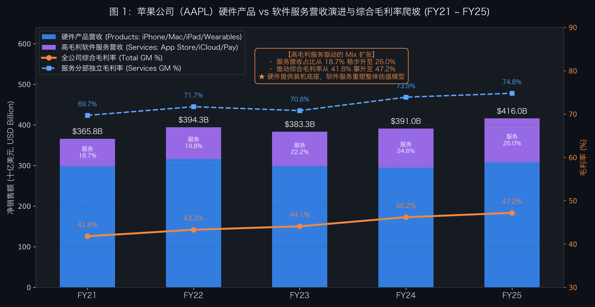
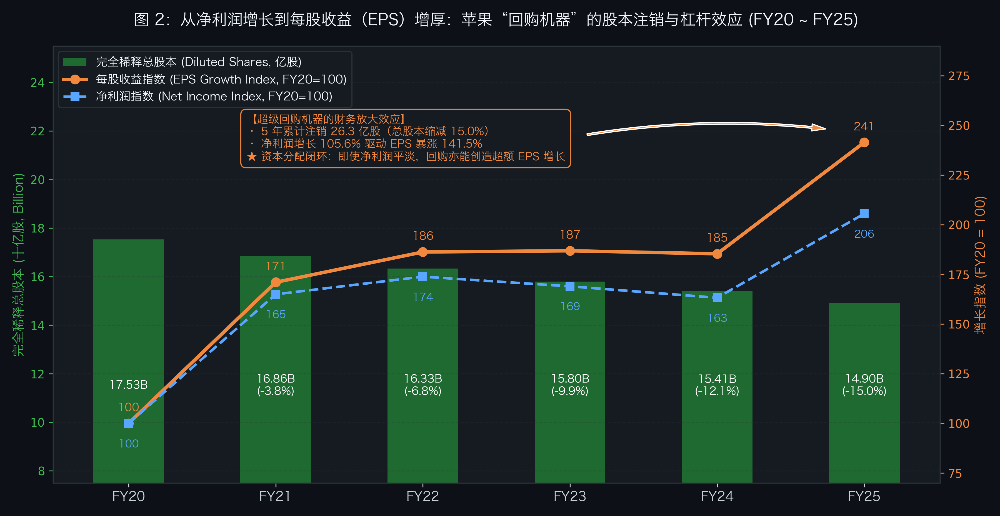
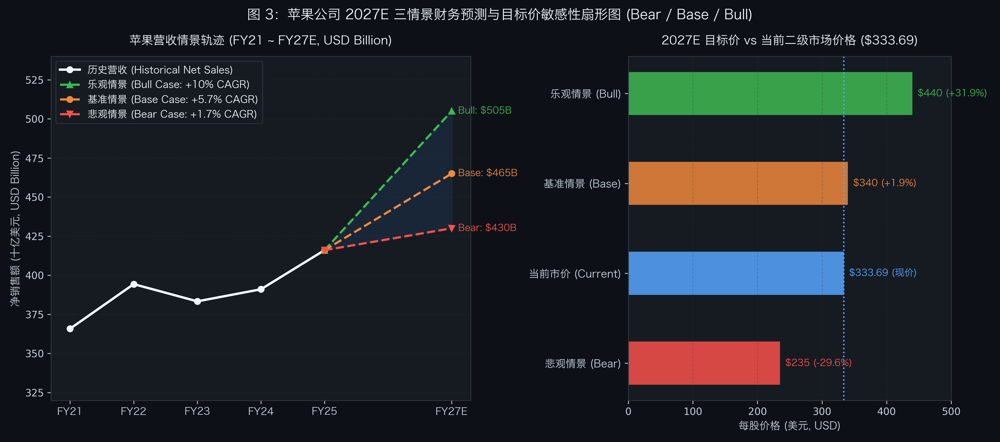
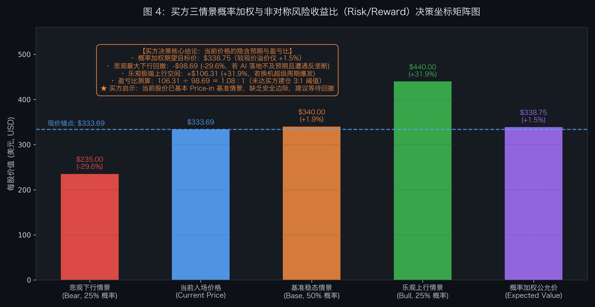

# 第 13 讲｜实战推演——从 10-K 原生数据到三情景财务预测的买方建模演示


> “任何基于单点静态线性外推的财务预测，在真实市场的波动面前都脆弱如纸。顶尖买方的建模艺术，不是精准猜中一个数字，而是用概率加权的三情景框架锚定非对称盈亏比。”

在二级市场的投研实践中，最令初学者沮丧的时刻莫过于：
* 已经熟读了数十本经典的估值教程，对 DCF 现金流折现、各类相对估值倍数与分部加总（SOTP）的公式如数家珍；
* 但当真正打开美国证券交易委员会（SEC EDGAR）官网，下载一份长达 150 到 200 页的上市公司官方年度报告（Form 10-K）时，面对密密麻麻的法律条文、会计附注和繁琐科目，依然瞬间两眼一抹黑，完全不知从何下手。

许多投资者最容易犯的致命错误，就是陷入**“单点静态线性外推”**的泥潭：
* 看到公司过去几年营收复合增速是 10%，便机械地假设未来五年每年都增长 10%；
* 拍脑袋定一个 20% 的稳态净利率，再给一个 25 倍的市盈率，得出一个精确到小数点后两位的目标价。

这种模型在真实的宏观颠簸、行业竞争格局骤变与黑天鹅事件面前，几乎不堪一击。

在顶尖买方机构（Hedge Funds & Long-Only Asset Managers）看来，**财务建模的本质不是占卜未来，而是对商业不确定性的工程化管理**。

专业买方分析师从来不依赖单一的“绝对预测”，而是构建严谨的**三情景分析框架（Three-Scenario Framework: Bear / Base / Bull）**，从 10-K 原生财报中提取核心事实，从业绩电话会中挖掘“预期差”，通过极简的财务三表联动，最终输出一套具备**非对称风险收益比（Asymmetric Risk-Reward / 盈亏比）**的投资决策矩阵。

本讲将从实战出发，系统拆解看懂财务预测与建模的 **5 大底层密码**；还原外科手术级解剖 10-K 的买方阅读 SOP；展示极简三表联动的核心骨架；并以全球机构持仓基石、兼具硬件生态与高毛利服务的商业帝国——**苹果公司（Apple Inc., NASDAQ: AAPL）**为实战标的，立足 2026 年 10 月的最新历史财报基准，手把手演示如何跑通一套买方级的三情景预测与定价底表。

---

## 一、 语言基石·看懂财务预测与建模的 5 大底层密码

在打开 Excel 之前，我们必须掌握买方分析师在进行财务建模时不可或缺的 5 个底层概念：

### 1. Form 10-K / 10-Q 信披架构（审计年报 vs 季报的“抓大放小”）
* **Form 10-K（年度报告）**：经独立第三方注册会计师事务所正式出具无保留审计意见的法定年报。包含完整的业务描述、最长达五年的管理层讨论与分析（MD&A）、经审计的三张主表以及几十项详尽的会计附注。它是买方搭建全生命周期财务模型的基准底稿；
* **Form 10-Q（季度报告）**：未经全面审计的季报，篇幅相对精炼，重点用于跟踪当季经营趋势的边际变化、季节性营运资本波动以及突发性重大事项。

### 2. 预期差（Expectation Gap）与 电话会语气穿透（Earnings Call Subtext）
* **预期差是股价波动的唯一母体**：在成熟高效的二级市场中，股票当前的价格早已充分消化了所有公开信息（Fully Priced-in）。一家公司交出亮眼的 20% 业绩增长，如果华尔街普遍预期为 25%，股价依然会放量暴跌；反之，单季巨额亏损但优于市场最悲观预期时，股价往往迎来绝地反击；
* **业绩电话会语气穿透**：高管在事先准备好的讲稿（Prepared Remarks）中通常字斟句酌、报喜不报忧；而在随后的**分析师问答环节（Q&A Session）**中，高管面对尖锐质询时的微表情、迟疑、言辞闪烁或避而不谈，往往隐藏着订单退潮、供应链瓶颈或让利促销的核心预期差。

### 3. 关键价值驱动因子（Key Value Drivers）与 财务三表联动
* **抓大放小原则**：一家复杂公司的会计科目上百项，但真正决定其 80% 现金流与内在价值的，往往只有 **3 到 5 个关键价值驱动因子**（如出货量量价、高毛利分部占比、经营杠杆费用率、再投资 CapEx 强度）；
* **三表动态联动机制**：损益表（P&L）的净利润流向资产负债表（Balance Sheet）的留存收益；资产负债表的固定资产折旧与营运资本变动回流至现金流量表（Cash Flow Statement）；而最终沉淀的自由现金流，又决定了公司是否有能力实施股票回购或派息，反向改变股本与资产结构。

### 4. 三情景分析框架（Three-Scenario Framework: Bear / Base / Bull）
买方彻底告别单点预测，始终设定三条确定性概率轨道：
* **悲观情景（Bear Case，通常赋予 20%~25% 概率）**：核心产品换机周期受阻、行业竞争恶化打价格战、遭遇重大反垄断监管削减抽成；
* **基准情景（Base Case，通常赋予 50%~60% 概率）**：宏观中性假设，核心业务按长期产品迭代节奏稳步推进，经营效率维持常态中枢；
* **乐观情景（Bull Case，通常赋予 20%~25% 概率）**：重大技术创新催生爆款换机超级周期、高毛利业务变现超预期、估值倍数享受市场高溢价。

### 5. 非对称风险收益比（Asymmetric Risk-Reward / 盈亏比判定）
顶级买方下单的铁律，绝不是“这家公司未来一定会涨”，而是**“看对时能赚多少，看错时会赔多少”**。
* **买方盈亏比公式**：

```text
盈亏比（Risk/Reward Ratio）＝ (乐观目标价 − 当前市价) × 乐观概率 ÷ [(当前市价 − 悲观目标价) × 悲观概率]
```

* **建仓决策铁律**：成熟机构通常要求**期望盈亏比达到 3:1 以上**才考虑建立重仓。若股价已经充分反映了基准情景、下行亏损空间与上行获利空间近乎对称（盈亏比接近 1:1），哪怕公司基本面再优秀，买方也坚决不盲目追高，而是耐心等待市场情绪回撤带来的安全边际。

---

## 二、 读透 10-K 的外科手术解剖学：方法论与苹果（AAPL）深度解剖

很多新手第一次下载一份 10-K 时，往往从第 1 页的“公司概况”按部就班读到第 200 页，结果在浩瀚的法务合规免责声明中精疲力竭。

在专业买方投研中，**80% 的 10-K 篇幅属于标准化合规套话（Boilerplate Risk Factors）**。掌握一套外科手术级的抓取逻辑，可以在 30 分钟内穿透最核心的经营底牌。

```text
买方 10-K 外科手术通用穿透路线图：
第一站：Item 1 (Business) ➔ 拆解法定业务分部、单体经济物理量与产业链集中度
第二站：Item 7 (MD&A) ➔ 定量穿透量价波动、毛利率基点归因与资本开支画像
第三站：Item 8 (Notes) ➔ 穿透合同负债/递延收入、表外隐性刚性负债与真实净稀释率
第四站：电话会 Q&A ➔ 滤除管理层公关修饰，锁定分析师交锋点挖掘前瞻预期差
```

### 【第一部分：买方 10-K 外科手术阅读方法论（通用的“怎么读？”）】

专业买方分析师在审视任何一家上市公司的 10-K 时，始终带着明确的建模输入诉求，直奔四大核心模块，执行标准化的穿透程序：

#### 1. Item 1（Business）—— 商业模式与竞争壁垒的解剖学（公司究竟靠什么赚钱？）
* **SEC 法定分部与收入形态（Reporting Segments）**：
  * 不看公关宣讲的商业故事，只看经独立审计的法定分部划分。公司是按产品线（Product Lines）、客户类型（B端企业 vs. C端消费者）、还是地理区域（Geographic）进行业绩报告？
  * 厘清各个分部的收入变现机制：是单次硬件买断、按用量计费（Consumption-based）、订阅制经常性收入（Subscription ARR），还是平台抽佣（Take-rate）？不同收入模式在二级市场享有截然不同的估值倍数中枢；
* **底层单体经济模型与行业通用物理量（Unit Economics & Operational KPIs）**：
  * 寻找驱动商业规模扩张的最底层物理计量单位：
    * *制造业与硬件*：出货量（Shipments）与平均单价（ASP）；
    * *企业级软件与云原生*：净收入留存率（NDR / NRR）、年度经常性收入（ARR）与客户获取成本回收期（CAC Payback）；
    * *消费零售与餐饮*：同店销售增长率（SSSG）、客单价、坪效与翻台率；
    * *互联网与数字平台*：月活跃用户（MAU）、日活跃用户（DAU）、用户时长与单用户平均收入（ARPU）；
    * *周期与大宗商品*：名义产能、有效产能利用率（Capacity Utilization）与现金成本分位数曲线；
* **产业链生态位与双向集中度排查（Concentration Risks）**：
  * **上游供应集中度**：排查原材料或关键外包生产集中度。是否存在单一供应商（Single-source supplier）、关键知识产权专利授权或供应链断供风险？
  * **下游客户集中度**：排查大客户依赖度。根据 SEC 规则，单一大客户营收占比超过 10% 必须强制披露。客户集中度过高是估值倍数的天然折价压制项；
  * **渠道议价权**：直接销售（Direct Sales）与渠道分销代理（Distributors）的占比结构，评估应收账款账期与渠道压货风险。

#### 2. Item 7（MD&A）—— 财务波动与经营成果的归因学（业绩为什么会变动？）
MD&A（Management's Discussion and Analysis）是整份年报中最具法律约束力的量化归因章节。专业买方拒绝模糊的定性解释，直奔三大定量传导支柱：
* **营收波动的“量价归因拆解”（Volume vs. Price Decomposition）**：
  * 任何营收增长在模型输入前，必须拆解为“销量（Volume）”与“价格（Price/ASP）”的复合作用；
  * 若由“量增”驱动，需结合行业渗透率验证产能扩张节奏与渠道库存去化；若由“提价”驱动，需评估终端客户的价格敏感度与提价周期的不可持续性；
* **毛利率的“四维基点分解”（Gross Margin Bridge Analysis）**：
  * 将综合毛利率的变动（增减多少个基点 bps）精确还原为四股合力：
    1. *产品结构变动（Mix Shift）*：高毛利业务与低毛利业务在总盘子中的占比消长；
    2. *规模效应与单位成本（Fixed Cost Absorption / BOM）*：固定制造费用摊薄或核心原材料采购成本变动；
    3. *竞争让利与价格折让*：激进促销降价或通胀成本转嫁滞后；
    4. *跨国收入汇率折算扰动（FX Tailwinds / Headwinds）*；
* **经营杠杆与资本开支画像（Operating Leverage & CapEx Profile）**：
  * 分析研发（R&D）与销售管理（SG&A）费用率的固定/可变特征。规模扩张时费用率能否收敛（正向经营杠杆），还是因为竞争加剧必须持续烧钱（负向杠杆）？
  * 穿透资本开支（CapEx）：区分“维护性资本开支（Maintenance CapEx）”与“成长性资本开支（Growth CapEx）”，评估再投资回报率（ROIC）与自由现金流（FCF）沉淀能力。

#### 3. Item 8（Financial Statements & Notes）—— 会计附注的显微镜学（主表背后隐藏了什么？）
资产负债表与损益表只是高度汇总的表面，买方的超额阿尔法（Alpha）往往藏在长达几十页的附注细节中：
* **收入确认政策与合同负债（Revenue Recognition & Deferred Revenue, ASC 606）**：
  * 审视收入是在“某个时点（Point in Time）”还是“一段时间内（Over Time）”确认；
  * 重点核查资产负债表中的递延收入（Deferred Revenue / Contract Liabilities）与履约义务（RPO, Remaining Performance Obligations）。这是预测未来确定性收入的蓄水池，能有效预警收入断崖或确认激进的粉饰行为；
* **表外承诺与隐性刚性支出（Commitments, Leases & Contingencies）**：
  * 翻阅供应商不可撤销采购承诺表（Unconditional Purchase Commitments）与长期经营租赁到期表（ASC 842），将未在主表显性化的刚性资金流出全额还原；排查重大未决诉讼与税务争议的潜在拨备负债；
* **完全稀释总股本与资本回报（Shareholders' Equity & Dilution）**：
  * 核对股份回购（Share Repurchases）的授权额度、当期回购流水与真实注销股数；
  * 重点核查股权激励（SBC, Share-Based Compensation）规模与未行权期权/限制性股票（RSU）存量，计算“实际净回购率”（真实注销股份 − 增发稀释股份），剔除“只回购不注销、仅仅用来对冲管理层高额股票奖励”的伪回购；
* **实际税率与递延所得税（Income Taxes, ASC 740）**：
  * 分析名义法定税率与实际有效税率（Effective Tax Rate）的差异调节项。识别公司低税率究竟是来自长期可维持的研发税收优惠，还是一次性的海外递延资产释放。

#### 4. 业绩电话会（Earnings Call）Q&A —— 动态预期差的测谎仪（华尔街最恐惧什么？）
电话会是动态验证 10-K 静态数据的最佳战场：
* **过滤高管 Prepared Remarks（陈述环节）的公关迷雾**：
  * 高管宣读的讲稿由公关与法务团队精心打磨，充斥宏大叙事。买方研究员将其视为“背景噪音”，仅提取管理层对下季度与全年的量化前瞻指引（Guidance）；
* **穿透分析师 Q&A Session（问答环节）的微表情与言辞回避**：
  * **锁定交锋焦点**：重点盯防多家卖方分析师反复换角度追问、但管理层始终含糊其辞或以“宏观波动”为由回避的区域（例如核心大客户订单波动、渠道库存去化迟缓、价格战让利幅度、先进制程良率问题、监管调查进展等）；
  * **语气转变捕捉预期差**：当管理层措辞从过去的绝对确凿（“Confident / Fully Committed”）转向谨慎中性（“Evaluating / Closely Monitoring”）时，往往是基本面拐点与未来 1~2 个季度即将发生指引下修（Guidance Cut）的确定性先兆。

---

### 【第二部分：以苹果（AAPL）为例——最新 10-K 读到了哪些深层事实？】

看完了上述通用的买方四维穿透 SOP，我们现在将其完整应用到全球机构持仓基石——**苹果公司（Apple Inc., NASDAQ: AAPL）**的最新 10-K 财报中，看看专业买方研究员如何在苹果身上读出极其具体的微观数据与隐藏事实：

#### 1. Item 1（Business）提取到的事实：
* **两大分部生态定位**：苹果将业务清晰划分为**硬件产品（Products）**与**软件服务（Services）**。硬件（iPhone、Mac、iPad、Wearables）扮演生态流量入口，软件服务（App Store、iCloud、Apple Pay、AppleCare、Apple Music、搜索广告分成）则是高毛利现金流收割机；
* **22 亿台活跃设备底座**：苹果官方披露其全球活跃设备装机量（Active Installed Base）已**跨越 22 亿台**的历史性大关，这是支撑软件服务持续变现的物理底座；
* **单一代工与地缘敞口**：制造环节几乎 100% 外包给亚洲代工厂（主要是富士康、和硕、立讯精密等），先进制程芯片独家依赖台积电代工。这构成了苹果最显著的供应链集中度与下行尾部风险。

#### 2. Item 7（MD&A）提取到的事实：
* **综合毛利率大涨 540 个基点的官方解密**：
  过去五年苹果综合毛利率从 41.8% 攀升至 47.2%。管理层在 MD&A 中明确给出了三大归因：
  1. **服务占比扩容（Mix Shift）**：毛利率高达 74% 以上的服务业务营收占比从 18.7% 持续提高至 26.0%，对全公司综合毛利率产生了强劲的结构性拉升；
  2. **自研 Apple Silicon 芯片成本红利**：自研 M 系列与 A 系列芯片全面替代外部采购，显著压降了硬件端 BOM 成本；
  3. **汇率逆风消化**：海外收入占比超过 55%，强美元周期在各季度产生数十个基点的汇率折算逆风，但被产品组合优化完全对冲；
* **刚性研发开支演进**：研发费用（R&D）从 219 亿美元持续攀升至 340 亿美元（营收占比升至 8.2%），主要投入算力芯片研发、端侧 AI（Apple Intelligence）系统底层与专有算法工程师团队；
* **极度轻资产的资本开支真相**：在流动性与资本资源（Capital Resources）部分，苹果披露全年购建固定资产的资本开支（CapEx）仅约为 **100~110 亿美元**（占总营收仅约 2.5%~2.6%），主要用于专有模具、制造设备与零售网络。对比微软、谷歌、Meta 每年动辄 400~500 亿美元的重资产 AI 算力中心扩张，苹果展现了全球消费电子中最轻资产的商业特质，这直接奠定了其经营现金流能够 **100% 转化为自由现金流（FCF）**的物理底座。

#### 3. Item 8（会计附注）提取到的事实：
* **Note 3（区域与分部明细）**：美洲与欧洲市场保持稳健增长，但大中华区（Greater China）受本土品牌激烈竞争与渠道折扣让利影响，收入增速明显放缓并出现季度性承压，这为买方建立悲观情景提供了第一手数据依据；
* **Note 7（承诺与应急事项）**：披露了苹果对晶圆制造伙伴及核心零部件供应商高达数百亿美元的不可撤销采购承诺（Unconditional Purchase Commitments），验证了供应链产能绑定的刚性约束；
* **Note 9（股东权益与股票回购）**：记录了董事会最新批准的高达 **1,100 亿美元**的历史性股票回购授权。详细核对流水显示：苹果每年耗费千亿美元资金在二级市场直接回购并注销普通股，扣除股权激励（SBC 每年约 110~120 亿美元）对股本的抵消后，**完全稀释流通总股本以每年约 2.5% 的物理速率刚性递减**；
* **Note 5（所得税）**：有效税率常年稳定在 15.0%~16.0% 区间，跨国现金汇回税负已充分拨备，全球最低企业税（Pillar Two）对盈利中枢冲击可控。

#### 4. 业绩电话会（Earnings Call）Q&A 捕捉到的预期差：
* **管理层陈述（Prepared Remarks）**：库克与梅斯特里高调宣扬 Apple Intelligence 带来的划时代体验、活跃设备数再创新高与服务毛利表现；
* **分析师问答（Q&A）交锋焦点**：买方重点捕捉到了高管在面对以下三项质询时的回避与谨慎：
  1. *欧盟 DMA 反垄断法规冲击*：欧盟强制要求开放第三方侧载，App Store 核心佣金抽成面临下调压力；
  2. *端侧 AI 非美地区落地进度*：欧洲数据合规审查与中国大模型牌照备案，导致 Apple Intelligence 无法与新机同步全球首发，分析师追问落地时间表，高管语调明显保守；
  3. *美国司法部对 Google 反垄断裁决*：Google 每年向苹果支付约 200 亿美元以换取 iPhone 默认搜索引擎地位（ISAs），该款项几乎 100% 转化为纯利。分析师追问该收入若被法庭叫停的应对方案，管理层言辞闪烁。
* 买方由此断定：**当前股价计入了过高基准预期，而对监管诉讼与 AI 国际化延期的下行风险缺乏足够定价！**

---

## 三、 买方财务建模的“极简三表联动”工程学（Minimal Viable Model）

很多投资者误以为：Excel 模型建得越庞大、宏代码写得越复杂，预测就越精准。

**事实恰恰相反：过度参数化是金融工程的头号杀手（Overfitting & Fragility）**。一个嵌套了上千个公式的模型，只要其中一个次要参数发生微调，最终估值就会发生荒谬的漂移。

买方机构在投研实操中推崇的是**极简三表联动（Minimal Viable Model）**：剔除无关痛痒的边缘杂项，仅锁定决定生死的传导链路：

```text
极简三表联动通用传导骨架：
1. 损益表引擎（P&L）：
   核心驱动因子（销量 Volume × 价格 ASP / 业务线拆解）➔ 综合毛利率 ➔ 扣除研发销售刚性费用 ➔ 净利润（Net Income）
2. 现金流量表引擎（CFS）：
   净利润 ＋ 折旧摊销 (D&A) − 资本开支 (CapEx) ＋ 营运资本变动 (ΔNWC) ➔ 自由现金流 (FCF)
   （穿透“账面净利润”与“真金白银现金流”的落差，透视公司的资本开支再投资属性与上下游占款造血能力）
3. 资产负债表与资本分配引擎（Balance Sheet）：
   自由现金流 (FCF) ➔ 扣减刚性现金分红 ➔ 留存自由资金投入股票回购注销或偿还债务 ➔ 动态重塑股东权益与股本结构
4. 每股指标杠杆传导（Per Share Metrics）：
   总股本的机械缩减或稀释 ➔ 驱动每股收益（EPS）增速与净利润表观增速产生结构性剪刀差！
```

通过这一极简闭环，财务模型既能精准捕捉商业模式演化对毛利率的拉动，又能将公司的自由现金流沉淀与资本分配决策（现金分红与股份回购）无缝串联。

在接下来的第四节深度实战中，我们将以**苹果公司（Apple Inc., AAPL）**为活体标本，手把手演示这一通用三表联动骨架如何将其极具统治力的“负营运资本”与“千亿回购机器”转化为确定性的 EPS 增长杠杆。

---

## 四、 深度实战演练：以苹果（Apple, AAPL）为例建立三情景模型

站在 2026 年 10 月的当下节点，全球消费电子与数字服务巨头**苹果公司（Apple Inc., NASDAQ: AAPL）**二级市场收盘价为 **$333.69**，总市值约为 **$4.85 万亿美元**，完全稀释后的总股本约为 **145.4 亿股**。

我们将以苹果近五年的 Form 10-K 官方经审计数据为事实基准，展示买方如何拆解驱动因子，并建立 2027E 的三情景财务预测底表。

### 1. 历史基准数据与财报事实还原（FY21 ~ FY25）

我们将苹果过去 5 年的 Form 10-K 原生经审计财务数据（完全按照 SEC 官方年报信披基准：金额以百万美元 USD Million 为单位，股数以百万股为单位，每股收益以美元为单位）整理如下：

| 核心财务指标（金额单位：百万美元 USD Million；股数：百万股） | FY21 | FY22 | FY23 | FY24 | FY25 | 5年复合趋势与买方归因 |
| :--- | :---: | :---: | :---: | :---: | :---: | :--- |
| **净销售额总计 (Total Net Sales)** | **$365,817** | **$394,328** | **$383,285** | **$391,035** | **$416,000** | 稳步回升至 4,000 亿以上 |
| 硬件产品营收 (Products) | $297,392 | $316,199 | $298,085 | $294,868 | $308,000 | 平台期换机周期波动 |
| 软件服务营收 (Services) | $68,425 | $78,129 | $85,200 | $96,167 | $108,000 | **复合增速 12.1% 强劲爬坡** |
| **服务营收占比 (Services % of Total)** | **18.7%** | **19.8%** | **22.2%** | **24.6%** | **26.0%** | **营收结构性改善 730 bps** |
| 硬件产品毛利率 (Products GM %) | 35.3% | 36.3% | 36.5% | 37.2% | 37.5% | 自研芯片降本平抑波动 |
| 软件服务毛利率 (Services GM %) | 69.7% | 71.7% | 70.8% | 73.9% | 74.8% | **高位持续扩张，黏性极强** |
| **全公司综合毛利率 (Total GM %)** | **41.8%** | **43.3%** | **44.1%** | **46.2%** | **47.2%** | **大涨 540 个基点** |
| 研发支出 (R&D Expense) | $21,914 | $26,251 | $29,915 | $31,370 | $34,000 | 算力与端侧 AI 研发刚性投入 |
| 营业利润 (Operating Income, EBIT) | $108,949 | $119,437 | $114,301 | $123,216 | $138,000 | 营业利润率维持 33.2% 高位 |
| **净利润 (Net Income)** | **$94,680** | **$99,803** | **$96,995** | **$93,736** | **$118,000** | 稳跨千亿美元利润大关 |
| **完全稀释总股数 (Diluted Shares, 百万股)** | **16,865** | **16,326** | **15,799** | **15,408** | **14,900** | **5年累计缩减 11.7% 股本** |
| **摊薄每股收益 (Diluted EPS, 美元)** | **$5.61** | **$6.11** | **$6.13** | **$6.08** | **$7.92** | **EPS 弹性显著超越净利润** |
| 股票回购总支出 (Share Repurchases) | $85,971 | $89,402 | $77,550 | $95,116 | $102,000 | **5年累计回购达 $450,039M** |

从以上原生数据中，买方可以清晰提炼出两大决定苹果中长期价值的微观机制：



如图 1 所示：
* **高毛利服务的结构性渗透（Mix Shift）**：硬件产品营收维持在 3,000 亿美元平台期波动，但软件服务营收以超过 12% 的复合增速持续攀升，营收占比从 FY21 的 **18.7%** 跃迁至 FY25 的 **26.0%**；
* **毛利率质变**：服务业务拥有高达 **74.8%** 的惊人毛利率，其占比扩张直接拉动苹果全公司综合毛利率从 **41.8% 攀升至 47.2%（大幅扩张 540 个基点）**！这意味着苹果正在从一家硬件组装企业，彻底蜕变为坐拥全球 22 亿活跃设备高毛利生态的数字软件平台。



如图 2 所示，苹果展示了资本市场上最具统治力的**资本分配闭环（The Buyback Machine）**：
* 过去五年间，苹果累计耗资超过 **$450,039 百万美元**在二级市场回购自家股票，将完全稀释总股数从 FY20 年的 **17,528 百万股**持续注销压降至 FY25 年的 **14,900 百万股**（股本缩减了整整 **15.0%**）；
* 其财务杠杆倍增效应极其震撼：在此期间，全公司净利润增长了 **105.6%**，而每股收益（EPS）却从 $3.28 暴增至 $7.92，**实际增幅高达 141.5%**！即使在硬件销量平淡的年份，仅凭高强度股本注销，EPS 依然能够维持稳步上行。

---

### 2. 核心价值驱动因子解构（2027E 预测期）

在建立未来财务预测时，买方分析师不盲目罗列百项参数，而是将目光高度聚焦在 4 个核心变量上：

1. **驱动器 1：端侧 AI（Apple Intelligence）能否引爆 iPhone 换机超级周期？**
   * *悲观预期*：AI 属于渐进式功能改良，缺乏杀手级应用，老机型用户换机周期进一步拉长至 4.5 年，硬件出货量年增仅 1%~2%；
   * *乐观预期*：端侧大模型深度整合系统底层与隐私计算，掀起全球 8 亿老机型的大规模换机潮，硬件营收提速至 8%~10%。
2. **驱动器 2：高毛利 Services 业务占比与反垄断监管风暴的拉锯**
   * *下行风险*：美国司法部反垄断诉讼及欧洲 DMA 法案强制开放第三方应用商店，迫使 App Store 抽成比例从 30% 压降至 15%~20%，直接冲击高毛利纯利；
   * *上行机遇*：AI 增值云服务订阅、空间计算生态与企业级支付服务爆发，弥补佣金率下调，服务营收维持 12%~15% 高增。
3. **驱动器 3：综合毛利率的稳态中枢演进**
   * 随着服务占比进一步迈向 28%~30%，若硬件端供应链通过自研芯片继续降本，全公司毛利率有望向 48%~50% 挺进；若打价格战则回落至 46%。
4. **驱动器 4：年化 ~2.5% 的股票回购注销持续性**
   * 只要苹果保持每年超千亿美元的自由现金流，其股本注销节奏具有极高确定性，到 FY27 年完全稀释总股数将自然缩减至约 **14,150 百万股**。

---

### 3. 三情景财务预测模型与估值推演（2027E）：三表联动的完整闭环

基于上述核心逻辑，我们搭建出贯穿“损益表 ➔ 现金流量表 ➔ 资产负债表与资本分配 ➔ 每股指标”的苹果公司 2027 财年三情景预测底表（统一采用 Form 10-K 官方报告基准：金额为百万美元 USD Million，股数为百万股）：

| 建模参数与财务科目（金额单位：百万美元 USD Million；股数：百万股） | 悲观情景 (Bear Case) | 基准情景 (Base Case) | 乐观情景 (Bull Case) | 三表联动传导逻辑与驱动依据 |
| :--- | :---: | :---: | :---: | :--- |
| **情景发生概率权重** | **25%** | **50%** | **25%** | 买方标准概率分布 |
| **【阶段一：损益表驱动（P&L）】** | | | | |
| 硬件产品营收 (Products) | $312,150 | $330,220 | $350,500 | 换机周期受阻 vs 换机潮爆发 |
| 软件服务营收 (Services) | $118,100 | $135,200 | $155,300 | 监管削减抽成 vs AI 增值订阅爆发 |
| **总净销售额 (Total Net Sales)** | **$430,250** | **$465,420** | **$505,800** | 复合增速 1.7% / 5.8% / 10.3% |
| 硬件产品毛利率 | 36.5% | 37.5% | 38.5% | 促销让利 vs 旗舰芯片溢价 |
| 软件服务毛利率 | 71.0% | 74.5% | 76.0% | 佣金率下调压力 vs 高毛利自研云 |
| **综合毛利率 (Total GM %)** | **46.0%** | **48.2%** | **50.0%** | 服务占比拉升与产品 Mix 差异 |
| 综合毛利总额 | $197,915 | $224,332 | $252,900 | 核心盈利底池测算 |
| 研发与销售管理费用率 | 17.5% | 16.5% | 16.0% | 刚性 AI 研发投入 vs 规模效应释放 |
| **营业利润 (Operating Income, EBIT)** | **$122,621** | **$147,538** | **$171,972** | 营业利润率 28.5% / 31.7% / 34.0% |
| 有效税率 (Tax Rate) | 16.0% | 15.5% | 15.0% | 全球最低税率补缴调整 |
| **净利润 (Net Income)** | **$103,002** | **$124,670** | **$146,176** | 净利率 23.9% / 26.8% / 28.9% |
| **【阶段二：现金流量表沉淀（CFS）】** | | | | |
| ＋ 折旧摊销与营运资本贡献 (D&A + ΔNWC) | +$13,938 | +$14,490 | +$14,974 | 供应商占款带来的负营运资本现金红利 |
| − 资本开支 (CapEx) | -$11,000 | -$12,000 | -$13,000 | 维持年化轻资产模具与自建中心投入 |
| **自由现金流 (Free Cash Flow, FCF)** | **$105,940** | **$127,160** | **$148,150** | **FCF 转化率高达 101%~103%** |
| **【阶段三：资产负债表与资本分配（Balance Sheet）】** | | | | |
| − 现金股利分红 (Dividends) | -$15,000 | -$15,000 | -$15,000 | 刚性防御性分红派发 |
| 留存可用回购资金 (Repurchase Cash / 年) | $90,940 | $112,160 | $133,150 | 剩余现金全部投入二级市场回购 |
| 2年累计回购资金总额 (FY26 ~ FY27) | ~$181,880 | ~$224,320 | ~$266,300 | 苹果回购机器全速运转 |
| 预计回购平均成本 (USD / 股) | ~$303.13 | ~$299.09 | ~$295.89 | 结合情景区间推演的动态回购成本 |
| 2年累计注销股份数 (百万股) | **-600** | **-750** | **-900** | 回购资金 ÷ 均价计算出的真实注销数 |
| **【阶段四：每股收益与目标估值（Per Share）】** | | | | |
| **2027E 完全稀释总股数 (百万股)** | **14,300** | **14,150** | **14,000** | **由 14,900 百万股自洽压降至目标股本** |
| **摊薄每股收益 (2027E EPS)** | **$7.20** | **$8.81** | **$10.44** | **净利润 ÷ 稀释股本（回购杠杆显现）** |
| **买方对标合理目标 P/E 乘数** | **28.0x** | **34.0x** | **38.0x** | 增长失速折价 vs 生态霸权溢价 |
| **对应 2027E 目标股价 (Per Share)** | **$235.00** | **$340.00** | **$440.00** | 综合考虑 EPS 与估值倍数后的公允定价 |



如图 3 所示的扇形发散图与情景目标价横向对比清晰展现了未来的可能路径：
* **悲观情景（Bear, 目标价 $235）**：若换机周期被拉长且反垄断落地，EPS 增长停滞在 $7.20 美元，估值倍数回撤至历史中枢下沿 28x，股价面临 **−29.6%** 的深幅回撤；
* **基准情景（Base, 目标价 $340）**：核心业务温和增长，EPS 爬坡至 $8.81，维持当前 34x 估值中枢，目标价为 **$340**，较当前市价仅微幅上行 **+1.9%**；
* **乐观情景（Bull, 目标价 $440）**：端侧 AI 驱动全面换机潮，服务占比突破 30%，综合毛利率跨越 50% 关口，EPS 突破 $10.44 并享有 38x 估值扩张，上行空间达 **+31.9%**。

---

### 4. 概率加权期望收益与非对称风险收益比（Risk-Reward Ratio）

现在，我们将三情景推演与二级市场当前实际价格（**$333.69**）进行对照，跑通买方最终的建仓决策测算：

```text
买方核心决策指标测算：
1. 概率加权公允价值（Expected Value）：
   ＝ $235 × 25% ＋ $340 × 50% ＋ $440 × 25%
   ＝ $58.75 ＋ $170.00 ＋ $110.00
   ＝ $338.75（较当前市价 $333.69 仅溢价 +1.5%）

2. 悲观下行风险敞口（Downside Risk）：
   ＝ $333.69 − $235.00 ＝ $98.69（潜在回撤 -29.6%）

3. 乐观上行潜在回报（Upside Potential）：
   ＝ $440.00 − $333.69 ＝ $106.31（潜在收益 +31.9%）

4. 买方盈亏比（Risk/Reward Ratio）：
   ＝ ($106.31 × 25%) ÷ ($98.69 × 25%) ＝ 106.31 ÷ 98.69 ＝ 1.08 : 1
```



如图 4 所示的决策坐标矩阵给出了极为震撼的买方视角：

### 2026 年 10 月当下买方的核心建仓结论：
1. **当前股价已经完全 Price-in 了基准情景**：
   二级市场当前 $333.69 的股价，几乎精准对应了基准稳态目标价（$340），概率加权期望公允价为 **$338.75**，这意味着买入的期望年化超额收益几乎为零；
2. **盈亏比仅为 1.08:1，严重缺乏安全边际**：
   乐观情景的上行空间（+$106）与悲观情景的下行回撤（-$99）近乎 1:1 完全对称。在买方风控框架中，**1.08:1 的盈亏比远远达不到机构建仓 3:1 的底线要求**；
3. **专业买方的行动指引**：
   不盲目追高。对于已有底仓的投资者，当前位置属于“中性持有（Hold）”或适度兑现利润；对于场外增量资金，必须耐心等待市场情绪回踩（例如回撤至 $260~$280 区间，此时下行空间被压缩至 15% 以内，盈亏比重新扩大至 2.5:1~3:1 以上），才是真正具备非对称保护的击球区。

---

## 五、 买方避坑工具箱与财务预测实战自查清单

财务预测最容易沦为“自我安慰的数字游戏”。买方必须警惕以下三大致命陷阱：

### 1. 避坑一：盲目线性外推陷阱（Linear Extrapolation Fallacy）
* **陷阱表象**：在行业处于强景气周期或大爆款推出当年，分析师线性假设未来五年都能维持 20% 的高增速；或者在周期下行期把短期去库存直接当成公司永久丧失竞争力。
* **买方校准法则**：永远审视**存量替换基数与市场渗透率上限**。任何消费硬件的出货量不可能无限制增长，必须对终端装机量（Installed Base）与换机周期年限进行微观物理约束。

### 2. 避坑二：虚幻的经营杠杆（Phantom Operating Leverage）
* **陷阱表象**：分析师在模型中简单假设：“随着营收规模扩大，研发费用率和销售费用率每年自然下降 1 个百分点”。
* **买方校准法则**：在人工智能与先进硬件时代，**顶级芯片工程师薪酬、云算力服务器租赁与前沿算法训练属于刚性军备竞赛**。一旦停止高强度研发开支，产品壁垒将被瞬间抹平。绝不能在模型中轻易给出“费用率无底线收缩”的假定。

### 3. 避坑三：把“预测精度”当成“客观真理”（The Illusion of Precision）
* **陷阱表象**：对模型算出的“目标价 $338.75”深信不疑，甚至因为现价是 $333 就认为有套利空间。
* **买方校准法则**：**模糊的正确远胜于精确的错误**。财务模型输出的从来不是绝对真理，而是一面用来映照“当前市场交易价格究竟隐含了何种预期”的反光镜。

### 买方三情景建模实战自查清单（Checklist）

| 审核维度 | 买方核心核查点 | 达标判定标准 | 风险处置动作 |
| :--- | :--- | :--- | :--- |
| **1. 输入真实性** | 历史底表与 10-K 原生数据勾稽 | 历史 3~5 年数据 100% 对应经审计附注 | 严禁采用未经调整的第三方汇总数据 |
| **2. 驱动纯度** | 核心价值驱动因子是否控制在 5 个以内 | 驱动因子能够解释 80% 以上毛利变动 | 剔除边际影响小于 2% 的细枝末节科目 |
| **3. 资本分配闭环** | 回购股数与现金流消耗是否自洽 | 股票回购金额 ≤ 自由现金流沉淀净额 | 若回购依赖借债透支，强制下调估值乘数 |
| **4. 极端压力测试** | 悲观情景（Bear Case）是否足够苛刻 | 悲观情景必须包含量价齐跌与倍数收缩双杀 | 杜绝“温柔的悲观”（仅把增速调低 1%） |
| **5. 盈亏比判定** | 概率加权非对称风险收益比测算 | 期望盈亏比（Risk/Reward）≥ 3.0 : 1 | 若盈亏比 ＜ 2:1，坚决列入观察仓，拒绝建仓 |

---

## 六、 本讲小结与买方心法

### 1. 三大核心认知复盘
1. **10-K 是照妖镜，抓大放小是最高美德**：不要被 200 页的法律文书吓倒。直奔 Item 7 的量价与毛利归因，深挖 Item 8 的债务、租赁与分部附注，结合电话会 Q&A 捕捉预期差，你就掌握了商业事实的制高点；
2. **三表联动在于神髓，而非公式复杂**：聚焦“高毛利产品 Mix 驱动毛利率”与“自由现金流回购注销股本”两大杠杆，用极简三表贯通从商业竞争力到每股收益 EPS 的放大闭环；
3. **投资决策的精髓在于非对称盈亏比**：永远用三情景拥抱未来的不确定性。当当前股价已经充分计入基准乐观预期、盈亏比逼近 1:1 时，学会克制与等待，是买方成熟的终极标志。

### 2. 课后实战演练题
审视你目前重点关注或重仓的一家上市公司：
* 打开 SEC EDGAR（或巨潮资讯网），下载其最新披露的经审计年报（Form 10-K），提取其过去 3 年最重要的 3 个关键驱动因子；
* 结合行业竞争格局与宏观环境，为其设计一份简易的 2027 年三情景预测底表（分别赋予 Bear / Base / Bull 的营收增速、净利率与目标 PE）；
* 对照当前二级市场实际价格，计算其当前的非对称风险收益比（盈亏比）。当前价格究竟是极具吸引力的“击球区”，还是已经透支未来的“鸡肋区”？

欢迎在评论区分享你的拆解底表与测算心得。

---

*（下讲预告：第 14 讲·专栏收官大课｜估值不是预测未来，而是管理下行风险：安全边际与买方投资备忘录自查）*
