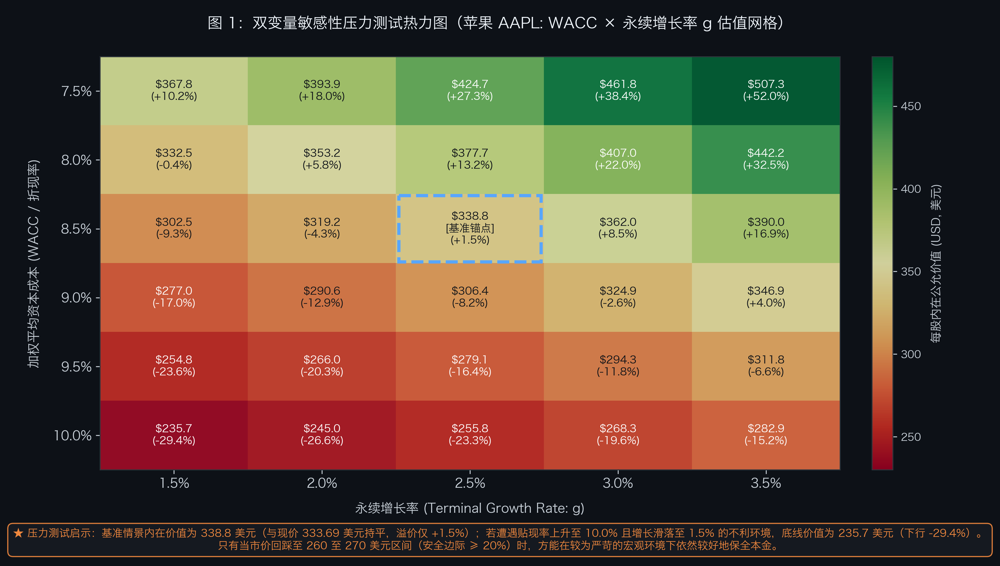
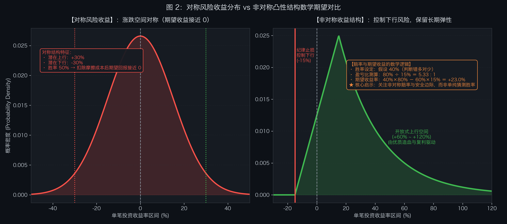
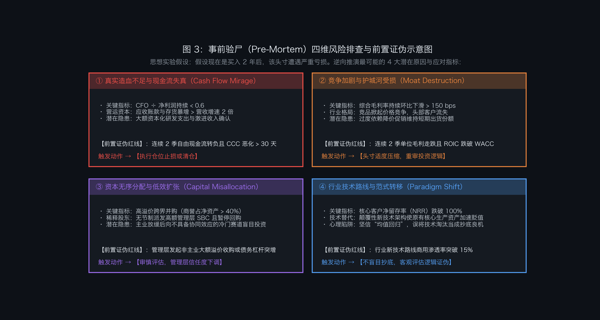
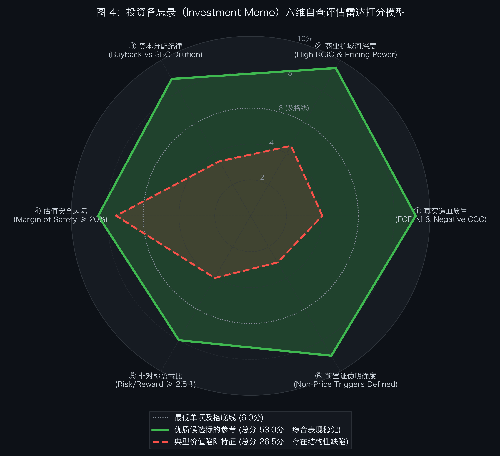
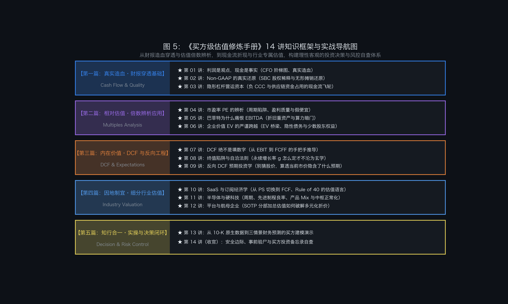

# 第 14 讲｜安全边际与投资备忘录自查：将估值分析转化为投资决策（收官篇）


> “估值模型无法消除未来的不确定性；安全边际的真正妙处，在于坦然承认自己的算力局限，并给现实世界的意外预留足够厚的肉垫。”

不知你是否有过这样的经历：

花了一整个周末，在 Excel 里把 DCF 模型的嵌套公式拉得整整齐齐，甚至算出了一个精确到小数点后两位的目标价（比如 338.82 美元）。周一开盘满怀信心地建仓，结果美联储官员随便讲了句话，或者行业龙头突然宣布降价促销，股价应声下挫——原本自以为无懈可击的模型，瞬间被现实打得有点发懵。

如果上面的场景听起来有些耳熟，请完全不必沮丧。正如本杰明·格雷厄姆与沃伦·巴菲特两位投资长者一再强调的大实话：
**“宁要模糊的正确，不要精确的错误。”**

在资本市场里，财务模型从来不是占卜未来的水晶球，它更像是一辆在迷雾里开车的车灯：能帮你大致看清前方的路况和沟坎。但如果你开的车没有坚固的防撞梁（安全边际），刹车踏板没有设定反应机制（前置止损），开得再快也难免心惊肉跳。

在前面 13 讲中，我们拆解了现金流、还原了 Non-GAAP、辨析了各种倍数，还推演了 DCF 与细分行业估值。在专栏的收官篇中，我们要把这些工具从“案头推演”，真正变成一套能防守、能纠错、能踏实执行的决策防线：

1. **双变量敏感性压力测试**：别只看晴天能赚多少，先测测暴风雨来时底线在哪里；
2. **非对称风险收益比**：不跟市场玩“抛硬币赌大小”，把重点放在“截断亏损、让利润奔跑”的赔率设计上；
3. **事前验尸（Pre-Mortem）**：在掏出真金白银前，先设想自己亏了 50%，反向推演潜在死因并设好证伪红线；
4. **《投资备忘录》七步框架**：一份写给未来自己的“防冲动合同”与六维雷达自查体系；
5. **投资风控的 3 个常识**：聊聊低估值陷阱、被套后的叙事美化以及刻舟求剑的均值回归；
6. **实操自查清单**：把全专栏 14 讲提炼成 10 个直击灵魂的自问，建仓前快速过一遍。

---

## 一、 核心概念：安全边际与投资决策框架

在聊怎么实战落地之前，我们先把 5 个最基础、但也最容易被误解的概念彻底聊透：

### 1. 安全边际（Margin of Safety）：给自己的“算不准”买份意外险
很多人误以为安全边际就是“买便宜的破净股或者低 PE 股票”，其实完全不是一回事。
就像桥梁工程师设计一座通行限重 10 吨的桥，往往会按照能扛住 30 吨卡车的标准去施工。安全边际的真正含义，不是证明你算得有多准，而是坦白承认：**未来充满意外，我们大概率算不准**。
在基准内在价值的基础上留出 **20% 到 30%** 的折扣空间，就是为了防备未来宏观加息、同行打价格战、或者管理层偶尔脑子发热。有了这层肉垫，哪怕公司未来只跑出了最平庸的业绩，你的投资本金依然能得到相对稳妥的保全。

### 2. 非对称风险收益比（Asymmetric Risk/Reward）：聪明的赔率游戏
在日常交易中，很多人容易陷入“对称赌博”：看着潜在可能涨 30%，但跌下去也可能亏 30%。这种 1:1 的买卖玩多了，扣掉摩擦成本和时间成本，最后往往是“一顿操作猛如虎，一看账户原地杵”。
理性的投资更像是一种“非对称的优势”：通过安全边际和前置纪律，把单笔最大的下行风险牢牢封死在小区间（比如 -15% 止损）；同时依托公司的现金流复利，把向上的弹性放开到 +60%、+80% 甚至翻倍。
这样哪怕你的判断胜率只有 40%（也就是说十次里有六次看走眼），靠着优秀的盈亏比，长期算下来依然能稳稳地拿到正期望回报。

### 3. 事前验尸（Pre-Mortem）：买入前先给自己泼盆冷水
大多数人在买股票前，脑子里想的都是“翻倍后怎么犒劳自己”，等真正亏惨了才在深夜复盘会上痛心疾首（这是事后尸检）。
而“事前验尸”是个很有趣的反向思想实验：**在掏出真金白银建仓之前，先假定这笔投资在两年后亏了整整 50%，然后请所有人坐下来认真推导：它是怎么死掉的？**
把隐藏在乐观情绪背后的暗礁提前扒出来，人的大脑才能从盲目的多巴胺亢奋中清醒过来。

### 4. 前置证伪红线（Pre-Committed Triggers）：别被每天的 K 线牵着鼻子走
看股票最忌讳的一件事，就是让股价每天的红红绿绿牵动情绪：今天涨了 2% 觉得“逻辑全对”，明天跌了 3% 怀疑“是不是要完蛋”。
真正的防线必须是**非价格的经营与基本面指标**。比如：“如果连续两个季度自由现金流转负且账期拉长”、“核心毛利率连续下滑超 150 个基点”。关键是要在头脑冷静、还没掏钱的时候就把规则白纸黑字定下来。一旦触发，按预案执行减仓或离场，绝不在深套之后找借口自我安慰。

### 5. 投资备忘录（Investment Memo）：写给未来自己的一份防剁手合同
很多成熟机构在建仓前必须写一份 Investment Memo，这真不是为了应付领导的形式主义，而是一面“照妖镜”。
当你把商业模式、真实造血、估值底线、证伪指标一笔一画写成文稿时，很多原本脑子里模模糊糊、靠拍脑袋脑补的环节，就会立刻现出原形。

---

## 二、 核心机理：敏感性压力测试与非对称风险收益比

### 1. 双变量敏感性压力测试：测算不利环境下的底线价值

在第 07、08 讲中，我们推导了绝对现金流折现（DCF）模型与永续增长率（g）的逻辑。

很多时候，我们在表格里给公司填一个 WACC = 8.5%、g = 2.5%，算出来公允价值 338.8 美元。一看现价 333.69 美元，好像便宜了 1.5%，立马想冲？
先等等！这 1.5% 的差距，连美股盘前打个喷嚏的波动都覆盖不了。如果你在这个位置追高，相当于在毫无护垫的情况下迎风走钢丝。

机构风控的一个常用方法，就是通过**双变量敏感性压力测试（Two-Variable Sensitivity Stress Testing）**，绘制出内在价值在不同宏观与经营组合下的分布网格。



如上图 1 所示（立足 2026 年 10 月苹果 AAPL 真实收盘价 333.69 美元）：
* **基准情境（Base Case）**：在 WACC = 8.5%、g = 2.5% 的中性假设下，模型测算的内在公允价值约为 **338.8 美元**，与当前市价 333.69 美元 几乎持平（溢价仅 +1.5%）。这说明当前股价已经充分反映了基准预期，追高买入缺乏足够的安全边际；
* **压力情境（Stress Test）**：当同时遭遇贴现率上升至 10.0%、永续增速滑落至 1.5% 的不利环境时，企业公允价值将收敛至 **235.7 美元**（与第 13 讲测算的悲观底线 235.0 美元高度一致），较当前市价有约 **-29.4%** 的潜在折让；
* **安全边际启示**：若市价在市场回调中回踩至 **260 至 270 美元区间**（提供约 20%~25% 的安全边际），即使遭遇上述压力情境，下行风险也将被大幅收窄在 10% 左右。

成熟的估值分析，不只看晴天下的预期收益，更会提前测算暴风雨来临时的防御底线。

---

### 2. 非对称收益结构的数学期望：盈亏比与胜率的平衡

在二级市场中，决定长期投资表现的不仅是判断涨跌的胜率，还包括赔率（盈亏比）的结构设计。

我们可以通过简单的数学期望公式来观察两种典型的收益分布：

```text
投资期望收益率 E(R) ＝ [胜率 P × 盈利幅度 Gain] － [(1 － P) × 亏损幅度 Loss]
```



如上图 2 所示，两种模式在收益结构上存在明显差异：

#### （1）对称分布结构（Symmetrical Risk/Reward）
* 潜在上涨空间与潜在下跌空间基本对称（例如涨幅 +30%，跌幅 -30%）；
* 即使拥有 50% 的判断胜率，其数学期望为：
  `E(R) = (50% × +30%) + (50% × -30%) = 0.0%`
* 叠加双向交易费用、摩擦成本及情绪干扰，长期收益很容易被逐步侵蚀。

#### （2）非对称收益结构（Asymmetric Convexity）
通过严格的安全边际要求与前置止损红线，可以主动优化收益分布：
* **控制左侧下行**：设定风控红线，将单笔头寸的最大亏损控制在 **-15%** 以内；
* **保留右侧弹性**：依靠优质公司的现金流增长与复利效应，长期潜在收益空间达到 **+60% 到 +120%**（假设中枢为 +80%）；
* **盈亏比计算**：
  `盈亏比 ＝ 80% ÷ 15% ＝ 5.33 : 1`
* **在 40% 的相对保守胜率下**，期望收益率为：
  `E(R) = (40% × 80%) － (60% × 15%) = 32.0% － 9.0% = +23.0%`

这个推演说明了一个朴素常识：**投资不需要每一次都当预言家，关键是在判断失误时控制损失，在判断正确时享有充分的收益空间。**

---

### 3. 事前验尸（Pre-Mortem）：逆向推演潜在风险与前置证伪

在做出买入决策前，人们往往更容易被当下积极的催化剂吸引，产生确认偏误。

心理学家加里·克莱因（Gary Klein）提出的**事前验尸（Pre-Mortem）**方法，在专业投资机构中被广泛采用：在正式建仓前，假设该笔投资在未来遭遇了严重亏损，逆向推演最可能导致失败的潜在原因，从而提前识别盲区并设立应对规则。



结合前几讲的分析框架，上图 3 梳理了四个最常见的潜在“死因”维度：

#### 风险 ①：账面繁荣，口袋空空（现金流幻觉 Cash Flow Mirage）
* **表象特征**：损益表账面净利润维持增长；
* **潜在风险**：经营现金流（CFO）走弱，CFO ÷ 净利润持续低于 0.6；应收账款或存货增速远超营收增速，研发支出存在激进资本化倾向；
* **前置证伪红线**：连续 2 个季度自由现金流（FCF）转负，且净营业周期（CCC）拉长超过 30 天；
* **应对规则**：触发即执行减仓或止损。

#### 风险 ②：杀敌一千，自损八百（价格战毁掉护城河 Moat Destruction）
* **表象特征**：营收规模维持高位，但伴随较大幅度的折价促销；
* **潜在风险**：行业壁垒下降导致恶性竞争，综合毛利率逐季持续下滑，高获客成本侵蚀利润；
* **前置证伪红线**：连续 2 个季度单位毛利持续走低，且投资资本回报率（ROIC）跌破 WACC；
* **应对规则**：持仓头寸适度压缩，重新评估核心投资逻辑。

#### 风险 ③：主业放缓，开始瞎折腾（资本乱分配 Capital Misallocation）
* **表象特征**：管理层宣布进入当前市场热门但与主业协同较弱的全新领域；
* **潜在风险**：主业成长放缓后，通过高溢价并购维持账面扩张，商誉占比大幅抬升，或高管股权激励（SBC）过度摊薄股东权益；
* **前置证伪红线**：发起缺乏产业协同的大额非主业收购，或有息负债率异常攀升；
* **应对规则**：列入重点警示，审慎评估管理层诚信与治理风险。

#### 风险 ④：世界变了，你还在等均值回归（范式转移 Paradigm Shift）
* **表象特征**：估值处于历史偏低分位，财务指标看似稳定；
* **潜在风险**：行业底层技术或商业形态发生代际更替，原有核心资产面临加速减值风险；
* **前置证伪红线**：替代性新技术渗透率突破关键节点（如 15%），且核心客户净留存率（NRR）跌破 100%；
* **应对规则**：不盲目押注均值回归，及时认错并评估退出。

---

## 三、 实战模版：投资备忘录（Investment Memo）七步结构

为了将财务分析、估值模型与风控原则落实为可执行的决策，专业投资机构通常会编写标准化的《投资备忘录（Investment Memo）》。

下面以我们在第 13 讲剖析过的苹果公司（Apple Inc., NASDAQ: AAPL）为参考标的，立足 2026 年 10 月的最新数据，演示一份涵盖七个核心步骤的备忘录实录：

```text
================================================================================
                    【内部参考·投资备忘录样例】
标的名称：苹果公司（Apple Inc.）
股票代码：NASDAQ: AAPL
研究覆盖：消费电子与软件服务生态
基准日期：2026 年 10 月 04 日
当前市价：333.69 美元 | 决策结论：【列入核心观察池 / 等待安全边际击球区】
================================================================================
```

### 第一步：核心投资论文与执行摘要（Executive Summary）
* **投资核心逻辑**：
  依托全球超过 22 亿台高黏性活跃设备生态，公司正逐步从硬件单次销售驱动，转向“高毛利端侧智能与服务订阅”的长期商业模式。其负营运资本飞轮与审慎的资本分配纪律，构筑了较深的竞争壁垒。但由于当前二级市场股价已较充分地计入了基准预期，短期建议保持耐心，等待更具性价比的安全边际区间。
* **预期差识别（Variant Perception）**：
  * **市场偏谨慎观点**：担忧消费电子硬件换机周期拉长，倾向于给予成熟硬件制造环节的保守估值；
  * **基本面研究视角**：关注高毛利服务业务（Services）占比提升对整体利润中枢的结构性拉动，以及健康的自由现金流支持下股票回购对 EPS 的稳定增厚效应。

### 第二步：商业模式穿透与真实造血飞轮（Cash Flow Quality & Working Capital）
* **现金造血检验（复用第 01 讲）**：
  近五年平均 CFO ÷ 净利润维持在 **1.05 到 1.15 之间**，应收账款周转保持健康，净利润转化为真实经营现金流的比例较高。
* **营运资本运转（复用第 03 讲）**：
  存货周转天数（DSI）约为 10 天，应付账款周转天数（DPO）超过 110 天，净营业周期（CCC）常年处于 **-50 天至 -60 天** 的负区间。这表明公司在供应链中具有极强的话语权，相当于全产业链的上下游在无息提供经营周转资金，日常运营对外部权益资本的占用极小。

### 第三步：商业护城河深度与单位经济学（Moat & Unit Economics）
* **转换壁垒**：
  iOS 闭环系统与软硬件协同带来了较高的用户忠诚度，活跃用户留存率长期保持在 90% 以上；
* **资本回报率（ROIC vs WACC）**：
  剔除庞大的账面多余现金资产后，核心经营资产的真实 ROIC 稳定在 **40% 以上**，显著高于其约 8.5% 的加权平均资本成本（WACC），体现出较强的经济增加值创造能力。

### 第四步：资本分配纪律与股东回报（Capital Discipline & Share Repurchase）
* **股权激励与股份稀释分析（复用第 02 讲）**：
  公司年均股权激励支出（SBC）约为 110 亿美元，但其每年的股票回购注销规模达到 900 亿至 1,000 亿美元，回购规模显著覆盖稀释影响，总股本年均净减少约 **2.5%~3.0%**；
* **内生增长放大**：
  在总净利润温和增长的背景下，持续的股份注销相当于管理层在不声不响给股东手里的每股收益（EPS）加杠杆，展现出良好的资本回报纪律。

### 第五步：综合估值模型、预期反推与安全边际打折（Valuation & Margin of Safety）
* **三情景绝对估值底表（与第 13 讲测算保持闭环）**：
  * **悲观情境（Bear, 25% 概率）**：公允价值 **235.00 美元**（较现价 -29.6%）；
  * **基准情境（Base, 50% 概率）**：公允价值 **340.00 美元**（较现价 +1.9%）；
  * **乐观情境（Bull, 25% 概率）**：公允价值 **440.00 美元**（较现价 +31.9%）；
  * **加权期望公允价值**：`235×25% + 340×50% + 440×25% ＝ 338.75 美元`（较现价仅溢价 +1.5%）；
  * **期望盈亏比（Risk/Reward）**：`1.08 : 1`，暂未达到通常建仓偏好的舒适区间；
* **反向 DCF 预期检验（复用第 09 讲）**：
  在当前 333.69 美元市价下，反推隐含未来 10 年自由现金流复合增速需达到 10.2% 左右。与历史增速中枢及未来硬件增速预期对照，当前估值基本平价，缺乏明显的低估保护；
* **建仓安全边际策略**：
  这就好比去超市买东西，标价 340 的商品现在卖 333.69，几乎没打折，何必急着把购物车堆满？**建议设定以 270.00 美元（安全边际约 20%，盈亏比提升至 2.5:1）作为观察介入位，以 240.00 美元（安全边际约 30%，接近悲观底线）作为重点防守配置位**。

### 第六步：事前验尸与前置证伪清单（Pre-Mortem Invalidation Triggers）
丑话先说在前面，投研团队需记录以下 **4 项非价格前置红线**，触发即执行仓位调整：
1. **服务毛利率红线**：若外部监管环境导致应用商店抽成政策大幅调整，使服务分部毛利率连续 2 季跌破 65%；
2. **营运资本恶化红线**：净营业周期（CCC）出现持续恶化，连续 2 季转正至 +15 天以上，且存货周转天数大幅拉长至 25 天以上；
3. **资本分配偏离红线**：大幅压缩常规股票回购，转而发起缺乏商业协同的大额跨界高溢价收购；
4. **用户黏性下滑红线**：活跃设备基数出现净流失，或主力产品通过大幅降价促销导致单机均价（ASP）同比下滑超过 8%。

### 第七步：仓位规划、节奏管理与退出机制（Position Sizing & Execution）
* **目标配置权重**：基准仓位上限设定为组合总资产的 **6.0%**；
* **分批建仓节奏**：
  * **跟踪观察仓（2.0%）**：可在现价 333.69 美元 附近维持小幅基础跟踪仓位；
  * **核心加仓（2.0%）**：若市场系统性调整至 270.00 美元 附近（提供约 20% 安全边际），开展第二阶段加仓；
  * **防守配置（2.0%）**：若遭遇非理性恐慌回踩至 240.00 美元 附近（提供约 30% 深入安全边际），配置至组合目标上限；
* **止盈退出准则**：
  若股价上涨触及或突破乐观公允价值 440.00 美元、且反向 DCF 隐含的未来增速要求突破 15% 时，按既定比例分批减持以锁定回报。

---

### 投资备忘录六维雷达打分评估模型

为了避免定性讨论陷入“我觉得挺好”的主观臆断，专业投资团队通常采用**六维雷达打分模型（Radar Matrix）**，对候选标的进行多维度客观体检。



#### 六维雷达评分评估对照表：

| 评估维度 | 核心考察指标 | 优质标的参考评分（满分10分） | 典型价值陷阱标的评分（满分10分） | 建议及格线 |
| :--- | :--- | :---: | :---: | :---: |
| **① 真实造血质量** | CFO ÷ 净利润中枢、FCF 转化率、负 CCC 营运资本天数 | **9.2 分** | 4.0 分 | **≥ 6.0 分** |
| **② 商业护城河深度** | ROIC vs WACC 溢价、定价权、毛利稳定性、用户转换成本 | **9.5 分** | 4.5 分 | **≥ 6.0 分** |
| **③ 资本分配纪律** | 回购注销净额 vs 股权稀释比例、再投资 CapEx 审慎性 | **8.8 分** | 3.5 分 | **≥ 6.0 分** |
| **④ 估值安全边际** | 市价相较于中性内在价值的折让空间（Margin of Safety） | **8.5 分** | 7.5 分（账面倍数偏低） | **≥ 6.0 分** |
| **⑤ 非对称盈亏比** | 悲观下行底线与乐观上行空间的比例关系（Risk/Reward） | **8.0 分** | 4.0 分 | **≥ 6.0 分** |
| **⑥ 前置证伪明确度** | 是否明确定义了非价格层面的止损与逻辑证伪指标 | **9.0 分** | 3.0 分 | **≥ 6.0 分** |
| **综合评分** | **六维累计总分（满分 60 分）** | **53.0 分（综合表现稳健）** | **26.5 分（存在结构性缺陷）** | **总分建议 ≥ 45.0 分** |

如上图 4 与上表所示：
* **综合优质标的（绿线）**：虽然在单点估值上并非极端低廉，但凭借稳健的造血质量、宽广的护城河与明确的证伪机制，综合评估处于健康水平；
* **典型价值陷阱标的（红虚线）**：市盈率或市净率看似极低（估值打分显得很便宜），但其实造血能力偏弱、资本分配混乱、竞争壁垒脆弱，就像一套看着单价便宜但到处漏水的老破小，综合评分偏低，需要保持清醒。

---

## 四、 投资风控的 3 个常识与常见深坑

在二级市场里摸爬滚打，有 3 个经典的心理误区与认知深坑，几乎每个人都踩过：

### 陷阱一：贪便宜的“低估值陷阱”（The Low PE / Value Trap）
* **常见误区**：
  有些朋友买股票只看 PE：看到 5 倍、6 倍市盈率，或者股价跌破净资产（PB < 1.0），就觉得捡到了大便宜，认为跌了这么多肯定有安全边际；
* **现实真相**：
  市场上的钱并不傻。显而易见的超低倍数，往往反映了市场对其**商业模式长期承压的清醒定价**：
  * **纸面富贵**：账面利润虽然看着是正的，但现金流全压在卖不出去的库存或收不回来的烂账里；
  * **碎钞机属性**：为了维持现有的微薄收入，公司每年不得不掏出巨额 CapEx 买设备搞更新；
  * **行业进入黄昏期**：技术路线变了，过去的生产线正在迅速沦为废铁。
* **避坑口诀**：便宜不等于安全。如果一辆报废拖拉机的价格打了一折，它也变不成保时捷。以合理价格买入好公司，远比在下坠的飞刀里博反弹要安全得多。

### 陷阱二：被套后的“叙事美化”（Narrative Rationalization）
* **常见误区**：
  原本只是想做个短线，博个季度业绩或者订单催化剂；结果买入后预期落空，股价跌了 20%。这时候不少人因不愿止损认错，突然开始连夜通读年报，从里面找出了“星辰大海般的长期愿景”，开始向身边所有人布道：**“其实我是这家公司的坚定长期价值投资者！”**
* **现实真相**：
  市场并不关心你的持仓成本。频繁给被套寻找宏大叙事，往往会把一次小的战术失误，拖成伤筋动骨的战略溃败；
* **避坑口诀**：**买入的最初逻辑被打破了，就老老实实按规则认错**。千万别把“交易被套后的自我安慰”，包装成崇高的“价值投资”。

### 陷阱三：刻舟求剑的“均值回归”（Blind Mean Reversion）
* **常见误区**：
  很多人把统计学上的“均值回归”奉为圭臬：觉得某只股票跌到了历史估值分位数的 1%，就必然能涨回历史中枢；
* **现实真相**：
  均值回归只适用于**行业格局稳固、需求具备周期弹性、且底层壁垒没被摧毁的公司**（比如半导体存储芯片在去库存之后的周期重启）；
  如果面临的是**颠覆性的代际变革**：
  * 传统胶卷面对数码影像、功能机面对触屏智能机、传统大卖场面对线上电商，这些往往是不可逆的单向替代；
* **避坑口诀**：在指望均值回归前，先看一眼核心护城河还在不在。要是时代已经翻篇了，历史估值中枢只是一张失效的旧地图。

---

## 五、 专栏复盘与决策自查清单

至此，《买方级估值修炼手册》全专栏 14 讲的知识框架已完整呈现。

### 投资决策 10 项核心自查清单（Checklist）

在做出重大投资决策、准备掏出真金白银前，建议花五分钟对照以下 10 个问题快速过一遍：

1. **真实造血检验**：公司的经营现金流（CFO）能否稳定覆盖净利润？还是说赚的都是账面白条？（回看第 01 讲）
2. **利润质量还原**：如果把管理层的高额股权激励（SBC）与激进的研发资本化扣除，真实利润还剩下多少？（回看第 02 讲）
3. **营运资本质量**：现金周转周期（CCC）是占用上下游资金的飞轮型，还是自己天天被动垫资？（回看第 03 讲）
4. **倍数工具辨析**：当前使用的 PE、EV/EBITDA 或 PS 倍数，有没有被周期顶点的虚高利润或巨大的重资产折旧蒙蔽？（回看第 04、05、06 讲）
5. **折现参数自洽**：DCF 模型里的永续增长率（g）有没有头脑发热填得比 GDP 还高？WACC 有没有合理反映风险？（回看第 07、08 讲）
6. **反向工程检验**：反推当前股价到底隐含了多高的增长预期？这个预期在产业现实中真的能实现吗？（回看第 09 讲）
7. **商业物种适配**：针对 SaaS 订阅、半导体周期或平台生态公司，有没有用对各自专属的估值模型与分部加总工具？（回看第 10、11、12 讲）
8. **三情景盈亏比**：在悲观、基准与乐观的三情景下，潜在下行底线与潜在上行空间的赔率合不合适？（回看第 13 讲）
9. **事前验尸推演**：如果未来这笔投资真的亏了 50%，最可能的死因是什么？我设好非价格的前置证伪红线了吗？（本讲）
10. **安全边际纪律**：当前买入价格相较于中性公允价值，有没有留出能让自己在意外面前睡得着觉的安全垫？（本讲）

---

### 全专栏 14 讲知识框架脉络图

从最底层的财报现金流穿透，到相对估值倍数辨析、绝对 DCF 与反向工程，再到具体细分物种的估值实战与决策风控落地，全专栏形成了一条清晰的递进逻辑：



```text
================================================================================
            《买方级估值修炼手册》14 讲知识框架全貌
================================================================================

【第一篇：真实造血·财报穿透基础】
  +- 第 01 讲：利润是观点，现金是事实（CFO 阶梯图、真实造血）
  +- 第 02 讲：Non-GAAP 的真实还原（SBC 股权稀释与无形摊销还原）
  +- 第 03 讲：隐形杠杆营运资本（负 CCC 与供应链资金占用的现金流飞轮）

【第二篇：相对估值·倍数辨析应用】
  +- 第 04 讲：市盈率 PE 的辨析（周期陷阱、盈利质量与假便宜）
  +- 第 05 讲：巴菲特为什么痛恨 EBITDA（折旧重资产与算力暗门）
  +- 第 06 讲：企业价值 EV 的严谨跨越（EV 桥梁、隐性债务与少数股东权益）

【第三篇：内在价值·DCF 与反向工程】
  +- 第 07 讲：DCF 绝不是填数字（从 EBIT 到 FCFF 的手把手推导）
  +- 第 08 讲：终值陷阱与自洽法则（永续增长率 g 怎么定才不沦为玄学）
  +- 第 09 讲：反向 DCF 预期投资学（别猜股价，算透当前市价隐含了什么预期）

【第四篇：因地制宜·细分行业估值】
  +- 第 10 讲：SaaS 与订阅经济学（从 PS 切换到 FCF、Rule of 40 的估值语言）
  +- 第 11 讲：半导体与硬科技（周期、先进制程良率、产品 Mix 与中枢正常化）
  +- 第 12 讲：平台与航母企业（SOTP 分部加总估值如何破解多元化折价）

【第五篇：知行合一·实操与决策闭环】
  +- 第 13 讲：从 10-K 原生数据到三情景财务预测的买方建模演示
  +- 第 14 讲（收官）：安全边际、事前验尸与买方投资备忘录自查
================================================================================
```

---

## 结语：在不确定的市场中坚守纪律

写到这里，《买方级估值修炼手册》全套 14 篇连载正文就正式完结了。

投资这门手艺，最迷人也最折磨人的地方，就在于我们必须依靠过去和现在已经发生的有限数据，去对充满未知与变数的未来做出真金白银的配置决定。

财务分析与估值模型不是灵丹妙药，但它能像罗盘一样，帮我们在狂热与恐慌的市场迷雾中守住常识：
* **穿透表象**：不被花哨的财报修饰迷惑，看清企业兜里真正的真金白银；
* **理解预期**：搞清楚当前股价到底是在捧杀一家公司，还是在错杀一家公司；
* **坚守纪律**：给自己留足安全边际和逃生通道，不盲目乐观，也不被动挨打。

市场永远充满波动与意外，没有任何人能保证每一次出手都百发百中。但只要我们保持对市场的敬畏，多算胜少算，把每一笔交易的下行风险管好、赔率算清，时间与概率的天平终究会慢慢偏向理性这一边。

感谢你一路以来的阅读与同行。希望这套手册能成为你投资书架上一份随时翻阅的实用工具书。在商业世界与资本市场的潮起潮落中，祝你始终保持独立、清醒与耐心！
