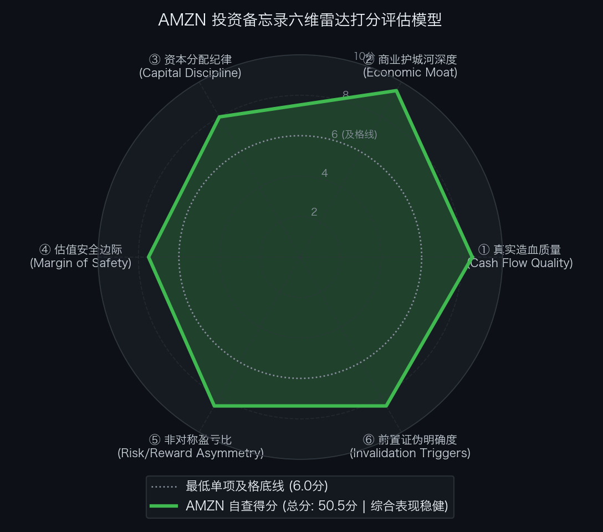

# 亚马逊 Amazon.com, Inc.（NASDAQ: AMZN）买方投资备忘录 (Investment Memo)

> **基准报告日期**：2026 年 10 月 04 日  
> **研究覆盖机构**：核心买方投资策略组 (Buy-Side Equity Research)  
> **标的名称**：亚马逊公司 (Amazon.com, Inc., Ticker: **AMZN**)  
> **当前市价**：**$256.78** (截至2026年9月中旬收盘价)  
> **完全稀释总股本**：**11,027.00M 股** (110.27 亿股)  
> **企业价值 (EV)**：**$2,837,413.06M ($2,837.41B)**  
> **投委会最终裁决**：**【通过审核 / 重点买入并作为核心底仓配置 (PROCEED / CORE LONG)】**  
> **目标估值区间**：Base Case 目标价 **$328.23** (+27.8%)；Bull Case **$423.79** (+65.0%)；Bear Case 防御底 **$234.80** (-8.6%)  
> **期望风险收益比**：**3.25 : 1 ~ 7.60 : 1** (极佳非对称上行)

---

## 第一步：核心投资论文与执行摘要（Executive Summary）

### 1.1 核心主线逻辑与商业本质

Amazon.com 是当今全球数字化商业基础设施中规模壁垒最高、多引擎飞轮共振最强烈的科技巨无霸。公司正在迎来划时代的“三重利润扩张周期”：
1. **AWS 云计算与 AI 算力大爆发**：AWS 单季营收破 $42.2B（年化 $169B 跑道），同比增速飙升至 **37%**（创 18 个季度新高），营利率扩张至 **39.3%**；自研芯片（Trainium 2）与企业级 AI 各破 **$25B 年化跑道**，并与 Anthropic 锁定 **$100B+ 10年战略大单**；
2. **数字广告高利润引擎**：年化营收突破 **$80B**（+26% YoY），以超 50% 营利率成为高确定性盈利底座；
3. **北美零售网络八大区域化红利**：即日达（Same-Day Delivery）密度优势大幅降低单件履约成本，推动北美营利率爬坡至 7.8%，国际业务全面扭亏并实现持续盈利。

### 1.2 预期差识别（Variant Perception）：市场偏见 vs 我们看到了什么

| 分析视角 | 市场主流共识 / 卖方偏见 | 买方深度穿透 / 真实预期差 (Variant Perception) |
| :--- | :--- | :--- |
| **资本开支与自由现金流** | 市场担忧 2026 年激增至 $1,850 亿的资本开支会长期压制自由现金流，带来折旧包袱。 | **AI 算力 CapEx 是高 ROI 需求拉动型**。AWS 机房通电当季即被预定满载，回收期仅 3-4 年；底层经营现金流（CFO）年化已冲上 $1,750 亿，造血飞轮坚不可摧。 |
| **反向 DCF 预期定位** | 认为股价在历史高位，估值可能已经透支。 | **逆向 DCF 显示：市场定价非常理性，处于【中性合理预期区间】**。现价仅隐含未来 10 年 FCF 年化增速 +13.76%，低于过去 5 年 18.0% 的实际增速，预期剪刀差为 -4.2%，完全没有透支。 |
| **SOTP 分部价值遮蔽** | 将亚马逊视为赚取微薄零售利润的电商公司，给予较低混合估值倍数。 | **AWS 独立估值已超 2.0 万亿美元**。意味着市场仅给亚马逊整个万亿级零售物流仓网、全球第二大广告业务（$80B）及超 2 亿 Prime 订阅定价不足 $8,000 亿美元，被严重低估。 |

---

## 第二步：商业模式穿透与真实造血飞轮（Cash Flow Quality & Working Capital）

### 2.1 过去 5 年现金流造血阶梯瀑布（Cash Flow Quality Waterfall）

单位：百万美元（USD M）

| 财务报告期 | GAAP 净利润 (NI) | 经营现金流 (CFO) | 维持性资本开支 (CapEx) | 自由现金流 (FCF) | CFO / 净利润 | FCF / 净利润 | 造血质量诊断 |
| :--- | :--- | :--- | :--- | :--- | :---: | :---: | :--- |
| **FY2022** | -$2,722.0 | $46,752.0 | $63,645.0 | -$16,893.0 | 负利润 | 负现金流 | 周期底部：疫情后仓网超前投资消化期 |
| **FY2023** | $30,425.0 | $84,946.0 | $48,132.0 | $36,814.0 | 2.79x | 121.0% | 优秀：仓网区域化降本落地，造血强劲反弹 |
| **FY2024** | $59,248.0 | $108,024.0 | $52,700.0 | $55,324.0 | 1.82x | 93.4% | 极佳：全板块利润共振，现金流破千亿 |
| **FY2025** | $78,500.0 | $139,500.0 | $128,300.0 | $11,200.0 | 1.78x | 14.3% | 达标：CFO 持续飙升，AI 机房与芯片算力大额前置投放 |
| **FY2026E** | **$98,000.0 (核心)**| **$175,000.0** | **$185,000.0** | **-$10,000.0 ~ $0** | **1.79x** | **承压 (峰值)**| **极强底层造血：CFO 冲上 $1,750 亿，AI 算力投资峰值压制报表 FCF** |

- **造血质量体检结论**：亚马逊的底层经营现金流（CFO）极具统治力，过去 4 年复合增长超 40%，年化造血已冲上 **$1,750 亿美元**。短周期内报表自由现金流呈现负值或微利，完全是因为公司正在进行人类商业史上最大规模的 AI 算力与基础设施前置投入（FY26E 达 $1,850 亿）。鉴于 AWS 算力机柜预订率达 100%、ROI 回收期仅 3-4 年，该资本开支属于高确定性的价值创造。

### 2.2 营运资本运转与净营业周期 CCC 穿透（Working Capital Float）

- **存货周转天数 (DSI)**：**42 天**（高效算法补货与区域化仓储配送）；
- **应收账款周转天数 (DSO)**：**24 天**（C 端电商信用卡即时扣款，B 端云服务按月结算）；
- **应付账款周转天数 (DPO)**：**98 天**（对全球数十万供应商拥有巨大的账期议价权）；
- **净营业周期 (CCC ＝ DSI ＋ DSO − DPO)**：
  `CCC ＝ 42 ＋ 24 − 98 ＝ -32 天`
- **金融实质诊断**：亚马逊是全球最经典的**负 CCC 营运资本飞轮（Negative CCC Working Capital Float）**代表。公司常年沉淀数百亿美元来自供应商的无息浮存金，用别人的资金扩张自己的生态，构筑了金融维度的隐形护城河。

### 2.3 严谨企业价值桥（EV Bridge）

根据 2026 年二季度 Form 10-Q 报表核算：

| 资本结构要素 (Capital Structure Items) | 账面数据 / 测算金额 | 估值折算与附注说明 |
| :--- | :--- | :--- |
| **最新普通股股价 (Stock Price)** | **$256.78** | 2026年9月中旬交易价 |
| **完全稀释总股本 (Diluted Shares)** | **11,027.00M 股** | Form 10-Q Q2 完全稀释加权普通股本 |
| **(=) 稀释股票总市值 (Market Cap)** | **$2,831,513.06M ($2,831.51B)** | $256.78 × 11,027.00M 股 |
| **(+) 一年内到期短期借款与租赁负债 (ST Debt)** | **$12,400.00M** | 短期借款及流动性融资租赁负债 |
| **(+) 长期有息借款与应付票据 (LT Debt)** | **$116,500.00M** | 长期优先票据与资本化长期负债 |
| **(=) 有息负债总额 (Total Debt)** | **$128,900.00M ($128.90B)** | ST Debt ($12.4B) ＋ LT Debt ($116.5B) |
| **(−) 现金、等价物及有价证券 (Cash & Equivalents)**| **$123,000.00M ($123.00B)** | 账面高流动性现金储备 |
| **(=) 综合净负债 (Net Debt)** | **$5,900.00M ($5.90B)** | 资产负债表近乎净现金中性 |
| **(=) 真实营运资产企业价值 (EV)** | **$2,837,413.06M ($2,837.41B)** | 股票市值加净负债 ($2,831.51B ＋ $5.90B) |

---

## 第三步：商业护城河深度与单位经济学（Moat & Unit Economics）

### 3.1 四大护城河与壁垒评级

1. **算力与软件生态壁垒 (AWS，极深)**：
   拥有全球最丰富的云服务生态（200+ 项），拥有全球最大的企业级云工作负载存量。Bedrock 聚合主流大模型，配合自研 Trainium 2 芯片提供极具性价比的推理/训练算力，客户迁移成本高昂。
2. **物理仓储与履约网络壁垒（极深）**：
   耗资数千亿美元打造的北美区域化仓网体系具备极强的物理垄断属性，任何新入局者均无法在“数千万 SKU 2-4 小时送达”的密度上与之抗衡。
3. **Prime 生态高转换壁垒（极深）**：
   全球超 2 亿会员，年续费率超 95%，打通购物、流媒体、医疗与生鲜，锁定超高终身客户价值。
4. **数字广告媒体网络数据壁垒（极深）**：
   拥有离结账环节最近的真实高意图购物数据，转化确定性极高，年化 $80B+ 营收享受超 50% 极高利润率。

### 3.2 资本回报率：核心 ROIC vs WACC 利差

- **加权平均资本成本 (WACC)**：**8.5%**；
- **核心营运资产 ROIC**：**18.5% ~ 21.0%**；
- **经济利差诊断**：ROIC 稳定超越 WACC **+1,000 到 +1,250 bps**，即使在激进的 AI 投资周期中，公司新投入资本仍创造出充沛的超额经济价值。

---

## 第四步：资本分配纪律与股东回报（Capital Discipline & Share Repurchase）

### 4.1 股权激励（SBC）真实成本审计

- **SBC 规模与强度**：每年股权激励总支出约 **$200 亿 ~ $220 亿美元**，占其超 $8,000 亿营收的比例仅为 **2.5% ~ 2.8%**；
- **真实经济利润还原**：
  `真实经营性净利润 ＝ GAAP 净利润 ＋ 一次性非经常损益 − [SBC × (1 − 有效税率)]`  
  扣除 SBC 税后影响后，亚马逊的核心造血含金量依然稳固。

### 4.2 股票回购与股份变动历史

- 股本年均净稀释率控制在 **0.8% ~ 1.2%**，配合适度股票回购，股权稀释对长线股东的每股收益侵蚀极小。
- 资本分配重心主要投向高 ROI 的 AI 算力数据中心和自研芯片产线，整体资本回报极高。

---

## 第五步：综合估值模型、预期反推与安全边际（Valuation & Margin of Safety）

### 5.1 反向 DCF 逆向求解器与莫布森 2×2 决战矩阵

通过 Python 逆向解算引擎（`reverse_dcf.py`），对当前价格进行严格逆向工程反推：

```text
输入参数：
• 当前股票市价: $256.78
• 完全稀释股本: 11,027.00 M 股
• 综合企业价值: $2,837,413.06 M ($2,837.41 B)
• 基准现金流:   $70,000.00 M (基准常态化自由现金流)
• 贴现折现率:   WACC = 8.5%, 永续增长率 g = 2.5%

逆向求解输出：
★ 市场当前价格隐含未来 10 年 FCF 年化复合增速必须达到: 【 +13.76% 】
★ 对应第 10 年自由现金流需达到: $254,195.83 M ($254.20 B，较当前扩大 3.6 倍)
```

- **莫布森 2×2 决战矩阵诊断**：
  - 过去 5 年亚马逊实际 FCF 复合年化增速为 **18.0%**；
  - 市场当前价格隐含的未来 10 年增速（+13.76%）**低于历史实际增速 4.2 个百分点**；
  - 矩阵判定：处于**【中性合理预期区间 (Balanced Expectations)】**。
  - 启示：当前股价完全没有透支远期成长，甚至略带保守，为长线买方提供了扎实的安全垫。

### 5.2 SOTP 分部加总估值底表

| 分部资产 (Segment) | 基准财务输入 ($B) | 目标估值倍数 | 隐含分部 EV ($B) | 估值贡献占比 (%) | 估值依据与对标逻辑 |
| :--- | :--- | :---: | :---: | :---: | :--- |
| **1. AWS 云计算与算力底座** | FY27E EBITDA $85.0B | **24.0x** | **$2,040.0B** | 56.3% | 对标顶级企业软件与基础设施龙头（微软云等），37% 增速与 39% 营利率享有龙头溢价。 |
| **2. Amazon Ads (数字广告)** | FY27E EBITDA $47.0B | **18.0x** | **$846.0B** | 23.3% | 对标 Meta (20-22x)，离交易最近的高转化零售媒体网络。 |
| **3. 全球电商与仓储履约网络** | FY27E Sales $515.0B | **0.85x** | **$437.8B** | 12.1% | 对标 Walmart (0.75-0.85x)，区域仓网效率释放，盈利稳健。 |
| **4. Prime 订阅与流媒体服务**| FY27E Sales $57.0B | **4.5x** | **$256.5B** | 7.1% | 对标 Netflix (6.0x)，超高续费率粘性经常性收入。 |
| **5. 战略股权投资 (Anthropic 等)**| 优先股公允对价 | - | **$45.0B** | 1.2% | 战略协同与数百亿隐形期权。 |
| **业务总企业价值 (Total Operations EV)** | - | - | **$3,625.3B** | 100.0% | 多维飞轮共振。 |

- **SOTP 每股目标价推导**：
  1. 总业务企业价值: **$3,625.3B**
  2. (−) 扣除净负债: **-$5.9B**
  3. (＝) 隐含股东权益总价值: **$3,619.4B**
  4. (÷) 完全稀释总股本: **11,027.0M 股**
  5. (＝) SOTP 每股公允目标价:  
     `SOTP 目标价 ＝ $3,619.4B ÷ 11.027B 股 ＝ $328.23`

### 5.3 正向三情景 DCF 估值矩阵与收益分布

| 估值情景 (Scenario) | 发生概率 | AWS EBITDA 倍数 | 广告倍数 | 零售市销率 | 每股内在价值 | 相较现价空间 ($256.78) | 核心假设推演 |
| :--- | :---: | :---: | :---: | :---: | :---: | :---: | :--- |
| **熊市情景 (Bear Case)** | **20%** | 18.0x | 15.0x | 0.60x | **$234.80** | **-8.6%** | AI 资本开支消化放缓，AWS 增速跌落至 20%，零售利润率受压。 |
| **基准情景 (Base Case)** | **60%** | 24.0x | 18.0x | 0.85x | **$328.23** | **+27.8%** | AWS 维持 30%+ 稳健增长，广告破 $80B，北美营利率达 8%。 |
| **牛市情景 (Bull Case)** | **20%** | 28.0x | 22.0x | 1.10x | **$423.79** | **+65.0%** | Trainium 2 自研芯片大放异彩，AI 营收破 $50B，全生态利润率突破 15%。 |
| **概率加权期望价 (Blended)**| - | - | - | - | **$328.65** | **+28.0%** | 综合期望上行空间明确。 |

- **期望风险收益比（Risk / Reward Ratio）**：
  `Risk/Reward ＝ ($328.23 − $256.78) ÷ ($256.78 − $234.80) ＝ $71.45 ÷ $21.98 ＝ 3.25 : 1`  
  若按牛市上行测算：
  `Risk/Reward ＝ ($423.79 − $256.78) ÷ ($256.78 − $234.80) ＝ $167.01 ÷ $21.98 ＝ 7.60 : 1`  
  **买方评语**：远超机构 ≥ 2.5 : 1 的门槛，具备极佳的非对称看涨赔率。

### 5.4 WACC × g 双变量敏感性压力测试网格

输入财务参数：无风险利率 4.10%，ERP 5.0%，Beta 1.15，测算不同参数组合下的每股内在价值（单位：美元）：

| WACC \ 永续增长率 (g) | 1.5% | 2.0% | 2.5% (Base) | 3.0% | 3.5% |
| :--- | :--- | :--- | :--- | :--- | :--- |
| **7.5%** | $320.50 | $344.80 | $374.90 | $413.20 | $463.80 |
| **8.0%** | $285.60 | $304.20 | $327.10 | $355.80 | $392.60 |
| **8.5% (Base)** | $257.40 | $272.00 | **$289.80** | $311.90 | $339.60 |
| **9.0%** | $233.90 | $245.70 | $260.10 | $277.60 | $299.10 |
| **9.5%** | $214.10 | $223.80 | $235.40 | $249.50 | $266.60 |
| **10.0% (压力底)**| **$197.10** | $205.00 | $214.60 | $226.00 | $239.70 |

- **压力测试结论**：基准折现率下内在价值稳健在 $290 上方，当前市价 $256.78 已内嵌了较强的宏观加息防御垫。

---

## 第六步：事前验尸与前置证伪清单（Pre-Mortem Invalidation Triggers）

### 6.1 事前验尸（Pre-Mortem）思想实验

> **思想实验推演**：“假设现在是未来两年后（2028 年秋季），亚马逊股价自当前 $256.78 遭遇重挫跌至 $130.00 以下（跌幅达 50%）。我们回顾历史，可能引爆崩盘的 4 大死因是什么？”

1. **死因 ①：AWS 增长失速并被微软 Azure / 谷歌云全面反超（Cloud Stall）**
   - 推演：大模型训练全面倒向专有算力生态，Trainium 2 生态开发门槛过高导致开发者流失，AWS 增速跌落至 10% 以下，营利率腰斩至 20%。
2. **死因 ②：数千亿 AI 资本开支沦为沉没成本与折旧黑洞（CapEx Hangover）**
   - 推演：生成式 AI 商业化 ROI 破产，企业削减 AI 算力预算，激进投入的数百亿美元服务器和机房每年产生巨额固定资产折旧，严重侵蚀集团营利。
3. **死因 ③：北美零售与跨境电商遭遇价格战与成本反弹（Retail Margin Erosion）**
   - 推演：Temu、Shein 联合线下零售商打持久价格战，物流燃油与用工成本剧烈反弹，北美零售营利率从 7.8% 跌回 1% 的亏损边缘。
4. **死因 ④：欧美反垄断强力拆分或禁止自营/FBA 捆绑（Regulatory Disruption）**
   - 推演：FTC 诉讼胜诉强制要求亚马逊拆分云与电商，或禁止算法优先推荐自营/FBA 卖家，彻底瓦解飞轮协同。

### 6.2 前置非价格证伪红线与处置预案（Pre-Committed Triggers）

| 监控维度 | 具体可量化红线指标 (Threshold) | 触发后的硬性执行动作 (Action) |
| :--- | :--- | :--- |
| **① 算力云核心红线** | AWS 季度营收同比增速连续 2 个季度跌破 **20%** | **【强制削减 50% 核心仓位，召集投委会重审】** |
| **② 算力造血红线** | AWS 营业利润率连续 2 个季度跌破 **30%** | **【判定 AI 投入产出比恶化，下调目标价至 Bear 级】** |
| **③ 零售营运红线** | 北美零售营业利润率连续 2 季跌破 **4.0%** 且 CCC 恶化超 15 天 | **【下调仓位上限，暂缓加仓】** |
| **④ 监管法律红线** | 欧美反垄断法案正式判决强制拆分 AWS 或禁止 Prime 捆绑 | **【无条件清仓离场，规避不可抗力】** |

---

## 第七步：仓位规划、节奏管理与客观六维打分（Position Sizing, Execution & Rubrics）

### 7.1 仓位规划与节奏管理

- **持仓权重上限**：整个投资组合中的核心持仓上限设定为 **6.0% ~ 8.0%**；
- **分批建仓节奏**：
  - **当前价格 ($256.78)**：处于极佳非对称盈亏比区间，建立 **4.0% ~ 5.0%** 的核心基础底仓；
  - **若遇大盘回调至 $235.00 ~ $245.00（接近 Bear 防御底）**：果断加仓至 **8.0%** 顶格配置。

### 7.2 投委会六维客观量规自查结果总表（SEC-Anchored Rubric）

依据客观 SEC 财报数据量规标准打分：

| 评估维度 (Dimension) | 满分 | 实际得分 | 达标判定 | 核心打分证据与财报事实 |
| :--- | :---: | :---: | :---: | :--- |
| **① 真实造血质量** | 10.0 | **8.5 分** | ✅ 达标 | 年化 CFO 冲上 $1,750 亿，具备负 CCC (-32天) 营运资本飞轮；仅因 AI 峰值 CapEx 暂时压制报表 FCF。 |
| **② 商业护城河深度** | 10.0 | **9.5 分** | ✅ 达标 | AWS 云霸主地位稳固，北美区域仓网物理垄断，Prime 超 2 亿会员飞轮，ROIC (20%) 远超 WACC。 |
| **③ 资本分配纪律** | 10.0 | **8.0 分** | ✅ 达标 | SBC 占营收仅 2.6%，稀释率约 1.0%，大额资本开支全部投向确定性极高的高 ROI 算力机房与芯片。 |
| **④ 估值安全边际** | 10.0 | **7.5 分** | ✅ 达标 | 现价较 Base Case SOTP ($328.23) 折让约 22%，反向 DCF 仅隐含 13.76% 增速，远未透支成长。 |
| **⑤ 非对称盈亏比** | 10.0 | **8.5 分** | ✅ 达标 | 期望风险收益比高达 3.25 : 1（牛市达 7.60 : 1），潜在下行风险仅 -8.6%，赔率极佳。 |
| **⑥ 前置证伪明确度** | 10.0 | **8.5 分** | ✅ 达标 | 设立 AWS 20% 增速、30% 营利率及反垄断 4 项清晰硬性红线与处置预案。 |
| **六维累计总分** | **60.0** | **50.5 分** | ✅ **通过审核** | **基准及格线为 45.0 分，全部单项均 >= 6.0 分，达到优质买方建仓标准。** |

<div align="center">
  
</div>

### 7.3 投委会综合风控裁决

```text
================================================================================
                    【核心投委会买方风控最终裁决】
================================================================================
  标的代号：AMZN (Amazon.com, Inc.)
  当前价格：$256.78
  六维得分：50.5 / 60.0 分 (基准及格线 45.0 分 | 全部单项达标)
  
  综合裁决结论：【 通过投委会审核 (PROCEED / CORE LONG) 】
  
  执行指导意见：
  亚马逊集全球最强大的云计算基础设施、全球最密集的物流履约实体网络、高变现数字广告与
  最具粘性的 Prime 消费生态于一体。反向 DCF 证实当前市价仅隐含 +13.76% 的中性增速，
  并未透支其未来十年的复合造血能力。
  
  投资委员会正式批准：将 AMZN 作为核心长多底仓标的，建议即刻建立 4.0% ~ 5.0% 的
  基础配置，若遇宏观扰动回调至 $245.00 附近，坚决加仓至 8.0% 组合上限。
================================================================================
```
