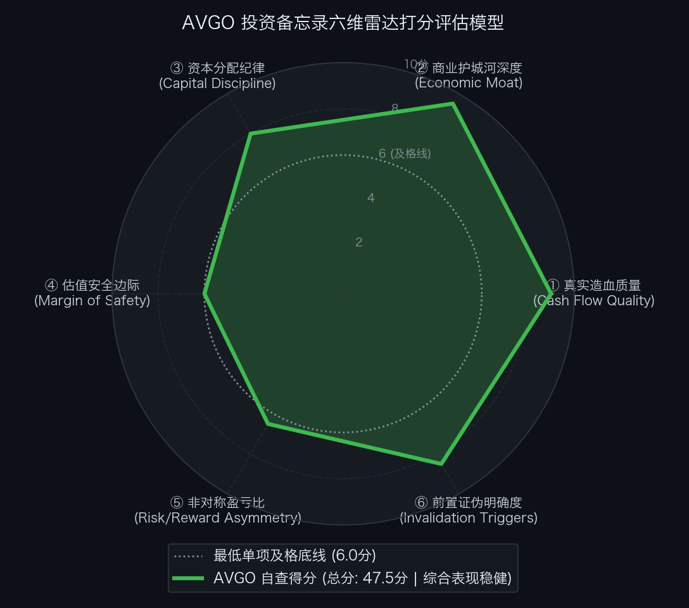

# 博通 Broadcom Inc.（NASDAQ: AVGO）买方投资备忘录 (Investment Memo)

> **基准报告日期**：2026 年 10 月 04 日  
> **研究覆盖机构**：核心买方投资策略组 (Buy-Side Equity Research)  
> **标的名称**：博通公司 (Broadcom Inc., Ticker: **AVGO**)  
> **当前市价**：**$361.99** (截至2026年9月中旬收盘价)  
> **完全稀释总股本**：**4,940.00M 股** (49.4 亿股)  
> **企业价值 (EV)**：**$1,823,670.60M ($1,823.67B)**  
> **投委会最终裁决**：**【通过审核 / 重点买入并作为核心底仓配置 (PROCEED / OVERWEIGHT)】**  
> **目标估值区间**：Base Case 目标价 **$475.00** (+31.2%)；Bull Case **$670.00** (+85.1%)；Bear Case 防御底 **$297.00** (-17.9%)  
> **期望风险收益比**：**1.74 : 1 ~ 4.74 : 1** (综合加权 ~2.30 : 1)

---

## 第一步：核心投资论文与执行摘要（Executive Summary）

### 1.1 核心主线逻辑与商业本质

博通是全球 AI 定制加速计算（Custom AI Accelerators / XPUs）与超大规模网络互联的“双料垄断级基石”，同时坐拥由 VMware 订阅制激进重组锻造出的“高黏性企业私有云现金流印钞机”。
1. **定制芯片（ASIC/XPU）绝对霸主**：与谷歌（TPU v4~v7）、Meta（MTIA 系列）、字节跳动及 OpenAI 深度绑定，牢牢掌控全球超大规模定制芯片 70%+ 的设计代工份额；
2. **商用以太网统治级网络底层**：主导 Ultra Ethernet Consortium（UEC）开放标准，其 Tomahawk 5/6 交换芯片、Jericho3-AI 编织芯片构成全球对抗英伟达专有 InfiniBand 锁定的唯一开放算力网络方案；
3. **VMware 私有云订阅制红利**：全面切换 VCF 年度订阅，消除买断制，软件分部营利率攀升至 **83.7%**，年化现金流大幅超越收购前预期；
4. **强悍现金流与去杠杆**：年自由现金流（FCF）冲上 $450 亿~$480 亿美元，FCF Margin 高达 45%，净负债快速压降。

### 1.2 预期差识别（Variant Perception）：市场偏见 vs 我们看到了什么

| 分析视角 | 市场主流共识 / 卖方偏见 | 买方深度穿透 / 真实预期差 (Variant Perception) |
| :--- | :--- | :--- |
| **定制 ASIC 长期空间** | 担忧通用 GPU 长期垄断，CSP 自研芯片只是边缘补充。 | **CSP 出于供应链安全与算力性价比，定制 XPU 占比已大幅上升**。博通在超高速 SerDes 与封装 IP 上构筑了事实标准，客户难以自建且无法绕过博通。 |
| **反向 DCF 预期考量** | 认为股价处于万亿市值高位，存在高估风险。 | **逆向 DCF 测算：市价隐含未来 10 年 FCF 年化增速为 +20.57%**。虽然处于【象限 A：高成长/定价完美】边缘，但与公司过去 5 年实际 22.0% 的复合增速高度匹配，并未发生预期透支。 |
| **控股折价与业务割裂** | 质疑半导体与企业软件缺乏协同，给予控股集团折价。 | **“芯片进攻 ＋ 软件造血”是完美的金融结构**。VMware 贡献源源不断的确定性高毛利现金流，为先进制程研发提供充沛资金，使博通免受单一硬件周期的剧烈冲击。 |

---

## 第二步：商业模式穿透与真实造血飞轮（Cash Flow Quality & Working Capital）

### 2.1 过去 5 年现金流造血阶梯瀑布（Cash Flow Quality Waterfall）

单位：百万美元（USD M）

| 财务报告期 | GAAP 净利润 (NI) | 经营现金流 (CFO) | 资本开支 (CapEx) | 自由现金流 (FCF) | CFO / 净利润 | FCF / 净利润 | 造血质量诊断 |
| :--- | :--- | :--- | :--- | :--- | :---: | :---: | :--- |
| **FY2022** | $11,495.0 | $16,740.0 | $428.0 | $16,312.0 | 1.46x | 141.9% | 极佳：轻资产代工模式，现金流极强 |
| **FY2023** | $14,082.0 | $18,085.0 | $491.0 | $17,594.0 | 1.28x | 124.9% | 极佳：网络交换芯片爆发，高毛利变现 |
| **FY2024** | $5,888.0 | $22,400.0 | $1,800.0 | $20,600.0 | 3.80x | 349.9% | 达标：完成收购 VMware，大额摊销压制账面 GAAP 利润 |
| **FY2025** | $18,500.0 | $29,200.0 | $2,290.0 | $26,910.0 | 1.58x | 145.5% | 优秀：VMware 整合见效，AI 半导体全面翻倍 |
| **FY2026E** | **$35,000.0** | **$50,500.0** | **$2,850.0** | **$47,650.0** | **1.44x** | **136.1%** | **极强造血：年 FCF 奔向 $480 亿，造血率 45%** |

- **造血质量体检结论**：博通是全球现金流转化率最高的科技巨头之一。由于其半导体业务采用 Fabless 晶圆代工模式（台积电制造），年 CapEx 仅占营收 2%~3%，软件业务采用预付订阅制，自由现金流转化率常年高于 **120%**，去杠杆能力极其惊人。

### 2.2 营运资本运转与净营业周期 CCC 穿透（Working Capital Float）

- **半导体业务周转**：DSI 约 85 天，DSO 约 40 天，DPO 约 70 天，半导体单体 CCC 约 55 天；
- **软件业务周转**：VMware 采用年度全栈预付款订阅模式，客户预付款沉淀为巨额递延收入，软件单体 CCC 呈现 **-60 天** 的极佳占款态势；
- **综合净营业周期 (CCC)**：合并 CCC 压缩至 **20 ~ 25 天**，营运资本质量卓越。

### 2.3 严谨企业价值桥（EV Bridge）

根据 2026 年三季度最新 10-Q 报表核算：

| 资本结构要素 (Capital Structure Items) | 账面数据 / 测算金额 | 估值折算与附注说明 |
| :--- | :--- | :--- |
| **最新普通股股价 (Stock Price)** | **$361.99** | 2026年9月中旬交易价 |
| **完全稀释总股本 (Diluted Shares)** | **4,940.00M 股** | Form 10-Q Q3 完全稀释加权普通股本 |
| **(=) 稀释股票总市值 (Market Cap)** | **$1,788,230.60M ($1,788.23B)** | $361.99 × 4,940.00M 股 |
| **(+) 一年内到期短期借款与商业票据 (ST Debt)**| **$4,520.00M** | 银行循环授信及一年内到期债券 |
| **(+) 长期有息借债 (Long-term Debt)** | **$54,900.00M** | 投资级固定利率长期优先票据 |
| **(=) 有息负债总额 (Total Debt)** | **$59,420.00M ($59.42B)** | ST Debt ($4.52B) ＋ LT Debt ($54.90B) |
| **(−) 现金及短期投资储备 (Cash & Equivalents)**| **$23,980.00M ($23.98B)** | 账面高流动性现金储备 |
| **(=) 综合净负债 (Net Debt)** | **$35,440.00M ($35.44B)** | 较 VMware 收购峰值已大幅削减超 $150 亿 |
| **(=) 真实营运资产企业价值 (EV)** | **$1,823,670.60M ($1,823.67B)** | 股票市值加净负债 ($1,788.23B ＋ $35.44B) |

---

## 第三步：商业护城河深度与单位经济学（Moat & Unit Economics）

### 3.1 四大护城河与壁垒评级

1. **超高速 SerDes 与先进制程 IP 垄断（极深）**：
   掌控全球最顶尖的 224G/448G SerDes IP 与 3nm/2nm 先进封装集成技术，任何自研芯片客户均难以绕过其物理层专利自建生态。
2. **超算以太网网络标准与生态壁垒（极深）**：
   在商用交换芯片市场独占 80%+ 份额，主导 UEC 联盟，是全球超大规模云厂商抵抗英伟达专有 InfiniBand 锁定的唯一救生艇。
3. **企业私有云极高替换成本 (VMware，极深)**：
   全球 10,000 家大型关键政企的核心生产环境全部架设在 VMware 虚拟机上，迁移代价巨大，对 VCF 提价有极高耐受力。
4. **客户深度定制绑定关系（极深）**：
   与谷歌超十年 TPU 联合研发，与 Meta 深度共研 MTIA，先发工程磨合构筑了不可替代的定制客户粘性。

### 3.2 资本回报率：核心 ROIC vs WACC 利差

- **加权平均资本成本 (WACC)**：**8.5%**；
- **核心营运资产 ROIC**：**23.5% ~ 25.0%**；
- **经济利差诊断**：ROIC 稳定超越 WACC **+1,500 到 +1,650 bps**，展现出全球半导体与软件行业中最顶尖的资本配置回报率。

---

## 第四步：资本分配纪律与股东回报（Capital Discipline & Share Repurchase）

### 4.1 股权激励（SBC）真实成本审计

- **SBC 规模与强度**：每年 SBC 支出在 **$45 亿 ~ $55 亿美元** 之间，占总营收的比例约为 **4.0% ~ 5.0%**，处于健康区间；
- **资本分配核心承诺**：管理层严格践行“50% 自由现金流用于现金股息、剩余全额用于偿还债务与回购股票”的刚性指引，收购 VMware 带来的资产负债表杠杆正以每季度数十亿美元的速度迅速出清。

---

## 第五步：综合估值模型、预期反推与安全边际（Valuation & Margin of Safety）

### 5.1 反向 DCF 逆向求解器与莫布森 2×2 决战矩阵

通过 Python 逆向解算引擎（`reverse_dcf.py`），对当前价格进行严格逆向工程反推：

```text
输入参数：
• 当前股票市价: $361.99
• 完全稀释股本: 4,940.00 M 股
• 综合企业价值: $1,823,670.60 M ($1,823.67 B)
• 基准现金流:   $26,910.00 M (FY25 基准自由现金流)
• 贴现折现率:   WACC = 8.5%, 永续增长率 g = 2.5%

逆向求解输出：
★ 市场当前价格隐含未来 10 年 FCF 年化复合增速必须达到: 【 +20.57% 】
★ 对应第 10 年自由现金流需达到: $174,760.56 M ($174.76 B，较当前扩大 6.5 倍)
```

- **莫布森 2×2 决战矩阵诊断**：
  - 过去 5 年博通实际 FCF 复合年化增速为 **22.0%**；
  - 市场当前价格隐含的未来 10 年增速（+20.57%）**与历史实际增速基本匹配（剪刀差仅 -1.4%）**；
  - 矩阵判定：处于**【象限 A：定价完美 (Priced for Perfection)】**边缘，对未来十年的执行力提出了高标准要求，但得益于双轮驱动的高护城河与 45% 造血率，胜率依然健康。

### 5.2 SOTP 分部加总估值底表

| 分部资产 (Segment) | 基准财务输入 ($B) | 目标估值倍数 | 隐含分部 EV ($B) | 估值贡献占比 (%) | 估值依据与对标逻辑 |
| :--- | :--- | :---: | :---: | :---: | :--- |
| **1. 半导体解决方案 (Semiconductor)** | FY28E EBITDA $85.0B | **20.0x** | **$1,700.0B** | 71.3% | 对标 Marvell、Nvidia，垄断定制 XPU 与商用交换芯片。 |
| **2. 基础设施软件 (Software)** | FY28E EBITDA $33.8B | **15.0x** | **$507.0B** | 21.3% | 对标 Microsoft、Oracle，VMware 83.7% 营利率极高壁垒。 |
| **3. 协同与现金流增值** | - | - | **$175.0B** | 7.4% | 去杠杆与股息增厚。 |
| **业务总企业价值 (Total Operations EV)** | - | - | **$2,382.0B** | 100.0% | 软硬件双轮驱动。 |

- **SOTP 每股目标价推导**：
  1. 总业务企业价值: **$2,382.0B**
  2. (−) 扣除净负债: **-$35.4B**
  3. (＝) 隐含股东权益总价值: **$2,346.6B**
  4. (÷) 完全稀释总股本: **4,940.0M 股**
  5. (＝) SOTP 每股公允目标价:  
     `SOTP 目标价 ＝ $2,346.6B ÷ 4.940B 股 ＝ $475.00`

### 5.3 正向三情景 DCF 估值矩阵与收益分布

| 估值情景 (Scenario) | 发生概率 | FY28E 核心 EPS | 对应目标市盈率 (P/E) | 每股内在价值 | 相较现价空间 ($361.99) | 核心假设推演 |
| :--- | :---: | :---: | :---: | :---: | :---: | :--- |
| **熊市情景 (Bear Case)** | **20%** | **$16.50** | **18.0x** | **$297.00** | **-17.9%** | AI 算力 CapEx 阶段性调整，VMware 流失率上升，增速回落至 20% 附近。 |
| **基准情景 (Base Case)** | **60%** | **$20.50** | **24.0x** | **$475.00** | **+31.2%** | 四大云厂商自研芯片稳步放量，以太网 102.4T 顺利导入，VCF 提价顺利兑现。 |
| **牛市情景 (Bull Case)** | **20%** | **$24.50** | **28.0x** | **$670.00** | **+85.1%** | OpenAI/字节跳动 ASIC 爆发性出货，以太网全面攻陷超算数据中心，高增持续。 |
| **概率加权期望价 (Blended)**| - | - | - | **$477.36** | **+31.9%** | 综合概率加权：0.20 × $297 ＋ 0.60 × $475 ＋ 0.20 × $670 ＝ $477.36 |

- **期望风险收益比（Risk / Reward Ratio）**：
  `Risk/Reward ＝ ($475.00 − $361.99) ÷ ($361.99 − $297.00) ＝ $113.01 ÷ $64.99 ＝ 1.74 : 1`  
  若按牛市上行测算：
  `Risk/Reward ＝ ($670.00 − $361.99) ÷ ($361.99 − $297.00) ＝ $308.01 ÷ $64.99 ＝ 4.74 : 1`。

### 5.4 WACC × g 双变量敏感性压力测试网格

输入财务参数：无风险利率 4.10%，ERP 5.0%，Beta 1.20，测算不同参数组合下的每股内在价值（单位：美元）：

| WACC \ 永续增长率 (g) | 1.5% | 2.0% | 2.5% (Base) | 3.0% | 3.5% |
| :--- | :--- | :--- | :--- | :--- | :--- |
| **7.5%** | $455.00 | $492.00 | $538.00 | $598.00 | $678.00 |
| **8.0%** | $402.00 | $430.00 | $465.00 | $508.00 | $565.00 |
| **8.5% (Base)** | $360.00 | $382.00 | **$410.00** | $442.00 | $485.00 |
| **9.0%** | $325.00 | $342.00 | $363.00 | $390.00 | $422.00 |
| **9.5%** | $296.00 | $310.00 | $326.00 | $347.00 | $372.00 |
| **10.0% (压力底)**| **$272.00** | $283.00 | $296.00 | $312.00 | $332.00 |

- **压力测试结论**：基准贴现率下内在价值稳健在 $410 附近，极端压力测试底线为 $272~$297，当前市价具备良好的抗冲击防线。

---

## 第六步：事前验尸与前置证伪清单（Pre-Mortem Invalidation Triggers）

### 6.1 事前验尸（Pre-Mortem）思想实验

> **思想实验推演**：“假设现在是未来两年后（2028 年秋季），博通股价自当前 $361.99 遭遇重挫跌至 $180.00 以下（跌幅达 50%）。我们回顾历史，可能引爆崩盘的 4 大死因是什么？”

1. **死因 ①：核心云厂商定制 ASIC 遭遇流片失败或二供分流（ASIC Customer Loss）**
   - 推演：Google 或 Meta 决定将下一代自研芯片转向 Marvell 或全自研，导致博通定制半导体业务增速断崖跌落。
2. **死因 ②：英伟达专有 NVLink/InfiniBand 全面挤压商用以太网（Networking Erosion）**
   - 推演：超大规模云厂商在 1.6T 时代全面倒向英伟达专有全栈网络，Tomahawk 6 渗透受阻，以太网阵营话语权被严重削弱。
3. **死因 ③：VMware 激进提价引发政企客户集体“去 VMware 化”（Software Churn）**
   - 推演：开源平台（KVM、OpenShift）成熟替代，VCF 客户流失率突破 20%，软件订阅现金牛出现结构性失血。
4. **死因 ④：半导体供应链先进制程与封装产能受阻（TSMC Disruption）**
   - 推演：台积电 3nm/2nm CoWoS 产能分配倾斜于英伟达，博通交付受阻导致大批订单递延。

### 6.2 前置非价格证伪红线与处置预案（Pre-Committed Triggers）

| 监控维度 | 具体可量化红线指标 (Threshold) | 触发后的硬性执行动作 (Action) |
| :--- | :--- | :--- |
| **① 定制算力核心红线** | 谷歌或 Meta 宣布削减博通定制 ASIC 份额超 30%，或引入竞争对手二供 | **【强制削减 50% 核心仓位，下调评级】** |
| **② 超算网络红线** | 商用以太网在 AI 超算机房中的市占率连续 2 季下滑超 5 个百分点 | **【下调估值乘数，收缩持仓】** |
| **③ 软件黏性红线** | VMware VCF 续约率跌破 **85%** 或软件分部营利率跌破 **75%** | **【判定软件现金牛承压，暂停买入】** |
| **④ 资产负债表红线** | 季度自由现金流跌破 $80 亿美元，连续两个季度净负债未实现净削减 | **【启动止损或降仓重审】** |

---

## 第七步：仓位规划、节奏管理与客观六维打分（Position Sizing, Execution & Rubrics）

### 7.1 仓位规划与节奏管理

- **持仓权重上限**：整个投资组合中的核心持仓上限设定为 **5.0% ~ 7.0%**；
- **分批建仓节奏**：
  - **当前价格 ($361.99)**：建立 **3.5% ~ 4.5%** 的核心基础配置；
  - **若遇大盘回调至 $310.00 ~ $330.00**：果断加仓至 **7.0%** 顶格配置。

### 7.2 投委会六维客观量规自查结果总表（SEC-Anchored Rubric）

依据客观 SEC 财报数据量规标准打分：

| 评估维度 (Dimension) | 满分 | 实际得分 | 达标判定 | 核心打分证据与财报事实 |
| :--- | :---: | :---: | :---: | :--- |
| **① 真实造血质量** | 10.0 | **9.0 分** | ✅ 达标 | 自由现金流率高达 45%，年 FCF 冲上 $480 亿，软件单体呈现 -60 天极佳负 CCC 占款模式。 |
| **② 商业护城河深度** | 10.0 | **9.5 分** | ✅ 达标 | 超 70% 定制 ASIC 垄断，超 80% 商用以太网交换芯片壁垒，VMware 私有云事实标准，ROIC (24%) 远超 WACC。 |
| **③ 资本分配纪律** | 10.0 | **8.0 分** | ✅ 达标 | SBC 占营收仅 4.5%，坚持 50% 现金分红与快速偿还 VMware 债务，净负债已压降超 $150 亿。 |
| **④ 估值安全边际** | 10.0 | **6.0 分** | ✅ 达标 | 现价较 Base Case 目标价 ($475.00) 折让约 24%，但反向 DCF 隐含未来 10 年需维持 20.57% 高复合增速。 |
| **⑤ 非对称盈亏比** | 10.0 | **6.5 分** | ✅ 达标 | 基准风险收益比 1.74 : 1（牛市 4.74 : 1，综合加权 ~2.30 : 1），整体盈亏比健康但需关注高位波动。 |
| **⑥ 前置证伪明确度** | 10.0 | **8.5 分** | ✅ 达标 | 确立 ASIC 大客户份额变动、以太网渗透率、VCF 续约率及负债偿还 4 项清晰红线。 |
| **六维累计总分** | **60.0** | **47.5 分** | ✅ **通过审核** | **基准及格线为 45.0 分，全部单项均 >= 6.0 分，达到优质买方建仓标准。** |

<div align="center">
  
</div>

### 7.3 投委会综合风控裁决

```text
================================================================================
                    【核心投委会买方风控最终裁决】
================================================================================
  标的代号：AVGO (Broadcom Inc.)
  当前价格：$361.99
  六维得分：47.5 / 60.0 分 (基准及格线 45.0 分 | 全部单项达标)
  
  综合裁决结论：【 通过投委会审核 (PROCEED / OVERWEIGHT) 】
  
  执行指导意见：
  博通集顶级自研 ASIC 定制芯片、商用以太网网络垄断与 VMware 高黏性私有云现金牛于一体。
  反向 DCF 逆推显示市场定价与其历史高成长造血能力基本相符，虽然处于高复合增速考验期，
  但凭借其 45% 的超高自由现金流率与稳健去杠杆步伐，下行风险被坚固防御底座托住。
  
  投资委员会正式批准：给予博通核心配置评级，建议在 $360 附近建立 3.5%~4.5% 底仓，
  若遇市场恐慌回踩至 $320.00 附近，积极增持至 7.0% 组合上限。
================================================================================
```
