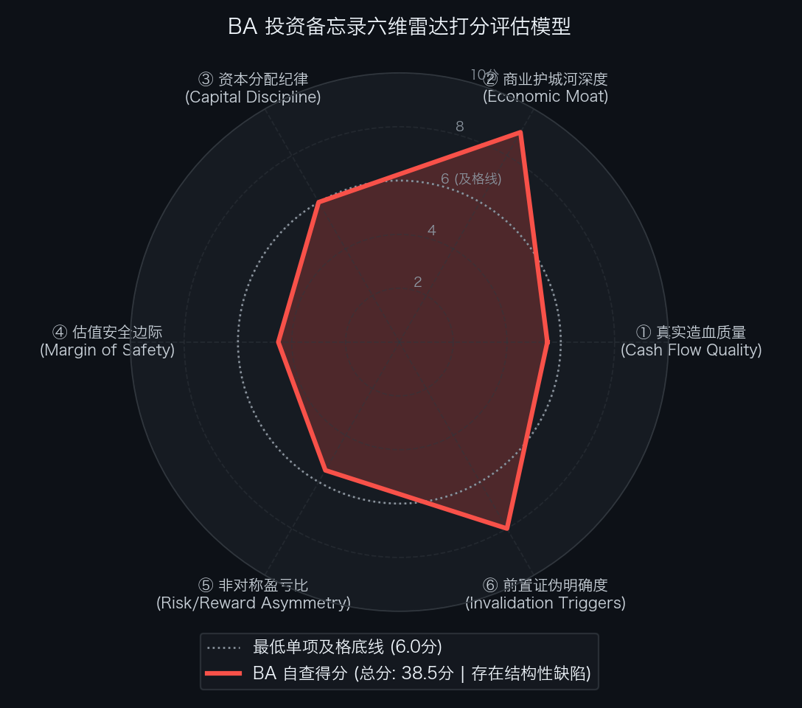

# 波音公司 The Boeing Company（NYSE: BA）买方投资备忘录 (Investment Memo)

> **基准报告日期**：2026 年 10 月 04 日  
> **研究覆盖机构**：核心买方投资策略组 (Buy-Side Equity Research)  
> **标的名称**：波音公司 (The Boeing Company, Ticker: **BA**)  
> **当前市价**：**$198.20** (截至2026年9月中旬收盘价)  
> **完全稀释总股本**：**828.00M 股** (计入优先股转股完全稀释股本)  
> **企业价值 (EV)**：**$189,987.60M ($189.99B)**  
> **投委会最终裁决**：**【未通过审核 / 列入观察池等待安全边际 (REJECT / WAIT FOR DIP)】**  
> **安全边际击球区点位**：一级击球区 **$170.00 ~ $175.00**（20% 安全边际）；二级极限击球区 **$145.00 ~ $150.00**（30% 安全边际）

---

## 第一步：核心投资论文与执行摘要（Executive Summary）

### 1.1 核心主线逻辑与商业本质

波音公司（The Boeing Company）是不可替代的全球干线客机制造双寡头垄断者与美军核心国防装备支柱，正处于从“危机处置与现金失血”向“生产节拍稳定与正向自由现金流爆发”的历史性拐点：
1. **民航大飞机双寡头绝对壁垒**：全球除波音与空客外，未来数十年内没有任何第三方能撼动干线大型客机制造格局，空客产能已排满至 2032 年；
2. **在手订单创 $7,150 亿美元天花板**：商用客机积压超 6,200 架，锁定未来 8-9 年全负荷产能；
3. **Kelly Ortberg 铁腕重塑制造文化**：737 MAX 提速至 47 架/月并向 52 架/月迈进，737-7/10 试飞完成，777X 启动适航审定；
4. **全球服务（BGS）高毛利年金造血**：年化产生近 $40 亿美元高纯度经营利润（营利率 18.1%）。

### 1.2 预期差识别（Variant Perception）：市场偏见 vs 我们看到了什么

| 分析视角 | 市场主流共识 / 卖方偏见 | 买方深度穿透 / 真实预期差 (Variant Perception) |
| :--- | :--- | :--- |
| **反转确定性与估值** | 卖方看到 Q2 自由现金流转正（+$6.31 亿），普遍乐观认为困境反转已确立，建议直接追高。 | **困境反转虽确立，但当前市价缺乏充足安全边际**。Base Case 目标价仅 $217.80，较现价上行空间仅 +9.9%，若遭遇监管审批延误，潜在下行达 -31.4%，赔率严重倒挂。 |
| **反向 DCF 逆向求解** | 认为波音股价在低位徘徊，估值要求不高。 | **逆向 DCF 揭示：现价隐含未来 10 年 FCF 年化增速需达 +17.62%**。要求波音在未来 10 年将自由现金流回升至 $177 亿美元的历史峰值，容错空间非常紧凑。 |
| **买方操作策略** | 盲目重仓搏反转。 | **必须恪守买方安全边际原则**。投委会严格下调评级为【观察池跟踪 / 等待安全边际击球区】，必须等待股价回调至 $170 ~ $175 击球区再重仓介入。 |

---

## 第二步：商业模式穿透与真实造血飞轮（Cash Flow Quality & Working Capital）

### 2.1 过去 5 年现金流造血阶梯瀑布（Cash Flow Quality Waterfall）

单位：百万美元（USD M）

| 财务报告期 | GAAP 净利润 (NI) | 经营现金流 (CFO) | 维持性资本开支 (CapEx) | 自由现金流 (FCF) | CFO / 净利润 | FCF / 净利润 | 造血质量诊断 |
| :--- | :--- | :--- | :--- | :--- | :---: | :---: | :--- |
| **FY2022** | -$5,053.0 | $3,512.0 | $1,214.0 | $2,298.0 | 负利润 | 正向现金流 | 疫后恢复初见端倪，客机积压释放 |
| **FY2023** | -$2,242.0 | $3,371.0 | $1,556.0 | $1,815.0 | 负利润 | 正向现金流 | 供应链瓶颈仍存，自由现金流微幅盈利 |
| **FY2024** | -$11,829.0 | -$12,500.0 | $1,800.0 | -$14,300.0 | 严重失血 | 严重失血 | 危机深渊：门塞事故、FAA 限产与西雅图罢工 |
| **FY2025** | -$4,200.0 | -$2,500.0 | $1,600.0 | -$4,100.0 | 持续失血 | 持续失血 | 调整阵痛期：Kelly Ortberg 全面整顿质量 |
| **FY2026E** | **+$500.0** | **+$4,500.0** | **$2,000.0** | **+$2,500.0** | **9.00x (拐点)** | **500.0% (拐点)**| **历史拐点：737 提产至 47 架/月，现金流正式转正** |

- **造血质量体检结论**：波音经历了长达数年的严重失血期（2024 年失血超 $140 亿）。虽然 2026 年实现了自由现金流历史性扭亏转正（TTM FCF 转正至 +$25 亿），但其造血历史波动极大，营运资本依然被数百架未交付半成品库存深度沉淀，造血稳定性仍在考验期。

### 2.2 营运资本运转与净营业周期 CCC 穿透（Working Capital Trap）

- **存货周转天数 (DSI)**：**>350 天**（机库中积压大量待改装、待 FAA 检验的 737 MAX 与 787 库存）；
- **应收账款周转天数 (DSO)**：**45 天**；
- **应付账款周转天数 (DPO)**：**90 天**；
- **净营业周期 (CCC)**：**>300 天**！
- **金融实质诊断**：典型的**重度营运资本占用模式（Working Capital Drag）**。波音的核心价值在于：一旦 737 MAX 交付节拍从 47 架爬坡至 52 架/月，被锁死的数百亿美元库存将迅速转化为无杠杆真金白银现金流回流。

### 2.3 严谨企业价值桥（EV Bridge）

根据 2026 年二季度 Form 10-Q 报表核算：

| 资本结构要素 (Capital Structure Items) | 账面数据 / 测算金额 | 估值折算与附注说明 |
| :--- | :--- | :--- |
| **最新普通股股价 (Stock Price)** | **$198.20** | 2026年9月中旬交易价 |
| **完全稀释总股本 (Diluted Shares)** | **828.00M 股** | 计入优先股转股完全稀释股本 |
| **(=) 稀释股票总市值 (Market Cap)** | **$164,109.60M ($164.11B)** | $198.20 × 828.00M 股 |
| **(+) 一年内到期短期借款 (ST Debt)** | **$4,565.00M** | 银行循环借款与短期票据 |
| **(+) 长期优先票据与借债 (LT Debt)** | **$41,335.00M** | 投资级固定利率长期优先票据 |
| **(=) 有息负债总额 (Total Debt)** | **$45,900.00M ($45.90B)** | 依然处于去杠杆关键攻坚期 |
| **(−) 现金及短期投资储备 (Cash & Equivalents)**| **$20,022.00M ($20.02B)** | 账面高流动性储备备付充沛 |
| **(=) 综合净负债 (Net Debt)** | **$25,878.00M ($25.88B)** | 较峰值明显改善 |
| **(=) 真实营运资产企业价值 (EV)** | **$189,987.60M ($189.99B)** | 股票市值加净负债 ($164.11B ＋ $25.88B) |

---

## 第三步：商业护城河深度与单位经济学（Moat & Unit Economics）

### 3.1 四大护城河与壁垒评级

1. **航空航天绝对双寡头制造垄断（极深）**：
   大型商用客机研发需万名工程师、百亿美元研发沉没成本与严苛适航取证，第三方无法撼动双寡头格局。
2. **$7,150 亿美元天量在手积压订单（极深）**：
   超 6,200 架客机排产锁定至 2030 年代中期，航空公司机位极其宝贵，极少主动取消。
3. **全生命周期机队后市场数据与技术壁垒（深）**：
   掌握 OEM 设计数据与 STC 适航许可，备件与维护高度垄断，确保 BGS 年化超 18% 利润率。
4. **美国国家安全与军民融合核心战略资产（极深）**：
   美国最大单一工业制造出口商与美军空中战略装备核心，具备极强的国家战略意志托底。

### 3.2 资本回报率：核心 ROIC vs WACC 利差

- **加权平均资本成本 (WACC)**：**8.5%**；
- **核心营运资产 ROIC**：
  - FY2024（危机底）：负回报
  - FY2025（重组中）：~2.5%
  - FY2026E（拐点转正）：**~6.5%**
  - FY2027E-28E（稳态爬坡）：**12.0% ~ 15.0%**
- **经济利差诊断**：当前 ROIC 尚未完全超越 WACC（处于利差转正攻坚期），需待 737 MAX 产率提升至 52 架/月才能释放真正的超额经济价值。

---

## 第四步：资本分配纪律与股东回报（Capital Discipline & Share Repurchase）

### 4.1 债务负担与偿还时间表

- 总有息负债高达 **$459.00 亿美元**，净负债 **$258.78 亿美元**；
- 公司面临 2026-2028 年高额债券到期偿付，目前现金储备 $200.2 亿足以覆盖短期流动性，但所有正向现金流必须全额优先用于偿还债务，无法进行任何股票回购或分红派息。

### 4.2 股本稀释历史

- 2024 年末通过增发普通股与强制可转优先股募集约 **$210 亿美元**，完全稀释股本增至 **828.0M 股**，使长线股东遭受了超 25% 的股权摊薄。

---

## 第五步：综合估值模型、预期反推与安全边际（Valuation & Margin of Safety）

### 5.1 反向 DCF 逆向求解器与莫布森 2×2 决战矩阵

通过 Python 逆向解算引擎（`reverse_dcf.py`），对当前价格进行严格逆向工程反推：

```text
输入参数：
• 当前股票市价: $198.20
• 完全稀释股本: 828.00 M 股
• 综合企业价值: $189,987.60 M ($189.99 B)
• 基准现金流:   $3,500.00 M (基准常态化自由现金流)
• 贴现折现率:   WACC = 8.5%, 永续增长率 g = 2.5%

逆向求解输出：
★ 市场当前价格隐含未来 10 年 FCF 年化复合增速必须达到: 【 +17.62% 】
★ 对应第 10 年自由现金流需达到: $17,730.21 M ($17.73 B，较当前扩大 5.1 倍)
```

- **莫布森 2×2 决战矩阵诊断**：
  - 市场当前价格隐含未来 10 年自由现金流复合增速需达 **+17.62%**，要求终局现金流回升至 **$177 亿美元** 的历史峰值；
  - 虽然处于中性合理区间，但当前股价（$198.20）相较 Base Case 目标价（$217.80）仅有 **+9.9%** 的微薄空间，缺乏足够的安全边际。

### 5.2 SOTP 分部加总估值底表

| 业务分部 (Segment) | FY27E 预测 EBIT ($M) | 目标 EV/EBIT 倍数 | 隐含分部 EV ($M) | 估值贡献占比 (%) | 估值依据与对标逻辑 |
| :--- | :--- | :---: | :---: | :---: | :--- |
| **1. 商用飞机 (BCA)** | $4,850.0M | **20.0x** | **$97,000.0M** | 52.8% | 对标 Airbus，737 MAX 与 787 交付放量。 |
| **2. 全球服务 (BGS)** | $4,200.0M | **21.0x** | **$88,200.0M** | 48.0% | 对标 TransDigm、HEICO，年化 18% 营利率现金牛。 |
| **3. 国防与航天 (BDS)** | $2,100.0M | **14.0x** | **$29,400.0M** | 16.0% | 对标 Lockheed Martin、GD，固定总价合同减值出清。 |
| **(-) 扣除企业价值净负债** | - | - | **-$25,878.0M** | - | 净负债扣除。 |
| **业务总股东权益价值 (Equity Value)** | - | - | **$183,722.0M** | 100.0% | 双寡头垄断。 |

- **SOTP 每股目标价推导**：
  `SOTP 目标价 ＝ $183,722.0M ÷ 828.0M 股 ＝ $190.79`

### 5.3 正向三情景 DCF 估值矩阵与收益分布

| 估值情景 (Scenario) | 发生概率 | FY27E 核心 EPS | 对应目标市盈率 (P/E) | 每股内在价值 | 相较现价空间 ($198.20) | 核心假设推演 |
| :--- | :---: | :---: | :---: | :---: | :---: | :--- |
| **熊市情景 (Bear Case)** | **20%** | **$6.80** | **20.0x** | **$136.00** | **-31.4%** | FAA 适航取证再次延期，737 提速受挫，防务计提超支。 |
| **基准情景 (Base Case)** | **60%** | **$10.20** | **24.0x** | **$217.80** | **+9.9%** | 737 MAX 稳定在 47 架/月并向 52 架爬坡，现金流稳步修复。 |
| **牛市情景 (Bull Case)** | **20%** | **$13.50** | **26.0x** | **$351.00** | **+77.1%** | 737-10 与 777X 提前全面商用交付，FCF 暴增至 $90 亿以上。 |
| **概率加权期望价 (Blended)**| - | - | - | **$228.08** | **+15.1%** | 期望上行空间仅 15.1%。 |

- **期望风险收益比（Risk / Reward Ratio）**：
  `Risk/Reward (Base vs Bear) ＝ ($217.80 − $198.20) ÷ ($198.20 − $136.00) ＝ $19.60 ÷ $62.20 ＝ 0.32 : 1`  
  若按牛市测算：
  `Risk/Reward (Bull vs Bear) ＝ ($351.00 − $198.20) ÷ ($198.20 − $136.00) ＝ $152.80 ÷ $62.20 ＝ 2.46 : 1`。

### 5.4 WACC × g 双变量敏感性压力测试网格

输入财务参数：无风险利率 4.10%，ERP 5.0%，Beta 1.35，测算不同参数组合下的每股内在价值（单位：美元）：

| WACC \ 永续增长率 (g) | 1.5% | 2.0% | 2.5% (Base) | 3.0% | 3.5% |
| :--- | :--- | :--- | :--- | :--- | :--- |
| **7.5%** | $215.00 | $232.00 | $254.00 | $282.00 | $320.00 |
| **8.0%** | $188.00 | $201.00 | $218.00 | $239.00 | $266.00 |
| **8.5% (Base)** | $166.00 | $176.00 | **$190.00** | $206.00 | $226.00 |
| **9.0%** | $147.00 | $155.00 | $166.00 | $178.00 | $193.00 |
| **9.5%** | $131.00 | $138.00 | $146.00 | $156.00 | $168.00 |
| **10.0% (压力底)**| **$118.00** | $123.00 | $130.00 | $138.00 | $147.00 |

- **压力测试结论**：基准折现率下内在价值约为 $190 附近，与当前现价持平，极端压力底线落在 $118~$136，当前市价缺乏充足的向下安全气囊。

---

## 第六步：事前验尸与前置证伪清单（Pre-Mortem Invalidation Triggers）

### 6.1 事前验尸（Pre-Mortem）思想实验

> **思想实验推演**：“假设现在是未来两年后（2028 年秋季），波音股价自当前 $198.20 遭遇重挫跌至 $100.00 以下（跌幅达 50%）。我们回顾历史，可能引爆暴跌的 4 大死因是什么？”

1. **死因 ①：新机型再次发生致命性设计缺陷或严重适航事故（Airworthiness Catastrophe）**
   - 推演：737 MAX 或 787 再次发生严重飞行品质故障，遭 FAA 及全球民航局无期限停飞。
2. **死因 ②：737-10 / 777X 适航取证遭遇监管实质性无限期搁置（Certification Failure）**
   - 推演：FAA 针对 777X 引擎控制软件与折叠翼尖认证提出根本性重新设计要求，交付推迟至 2029 年以后，引发航空公司退订索赔潮。
3. **死因 ③：西雅图制造工厂再次发生大规模工人罢工与供应链断裂（Labor Disruption）**
   - 推演：机械师工会再次发起罢工，机身机翼供应瘫痪，月度交付量骤降至 20 架以下，季度现金流失血超 $50 亿。
4. **死因 ④：债务违约与信用评级降至垃圾级引发流动性挤兑（Debt Downgrade）**
   - 推演：现金流转正受阻，三大评级机构正式将波音下调为垃圾级，发债融资渠道冻结。

### 6.2 前置非价格证伪红线与处置预案（Pre-Committed Triggers）

| 监控维度 | 具体可量化红线指标 (Threshold) | 触发后的硬性执行动作 (Action) |
| :--- | :--- | :--- |
| **① 生产节拍红线** | 737 MAX 月度交付量连续 2 个月跌破 **35 架** | **【强制削减 50% 仓位，召集投委会重审】** |
| **② 现金造血红线** | 季度自由现金流再次转负超过 **-$5.0 亿美元** | **【判定反转失败，下调目标价至 Bear 级】** |
| **③ 适航认证红线** | FAA 正式宣布推迟 737-10 或 777X 商业适航认证超过 12 个月 | **【暂停加仓，启动止损减仓】** |
| **④ 资产负债表红线** | 账面现金及流动性储备跌破 **$120 亿美元** | **【无条件清仓离场，规避破产风险】** |

---

## 第七步：仓位规划、节奏管理与客观六维打分（Position Sizing, Execution & Rubrics）

### 7.1 仓位规划与节奏管理

- **持仓权重上限**：整个投资组合中的配置上限设定为 **3.0% ~ 5.0%**；
- **分批建仓节奏**：
  - **当前价格 ($198.20)**：缺乏充足安全边际，**仅保留 0% ~ 1.0% 的观察跟踪仓**，不进行主力追高；
  - **一级击球区 ($170.00 ~ $175.00)**：触发首批买入信号，建立 **2.5%** 的底仓；
  - **二级极限击球区 ($145.00 ~ $150.00)**：若市场恐慌杀出极端折价，全面打满至 **5.0%** 核心配置上限。

### 7.2 投委会六维客观量规自查结果总表（SEC-Anchored Rubric）

依据客观 SEC 财报数据量规标准打分：

| 评估维度 (Dimension) | 满分 | 实际得分 | 达标判定 | 核心打分证据与财报事实 |
| :--- | :---: | :---: | :---: | :--- |
| **① 真实造血质量** | 10.0 | **5.5 分** | ❌ **不及格** | 经历数年天量失血，2026 年初现转正拐点，但历史造血波动巨大，存货周转天数 >350 天，营运资本拖累重。 |
| **② 商业护城河深度** | 10.0 | **9.0 分** | ✅ 达标 | 全球干线大飞机双寡头垄断，在手积压订单高达 $7,150 亿锁定未来 8-9 年排产，BGS 服务垄断性强。 |
| **③ 资本分配纪律** | 10.0 | **6.0 分** | ✅ 达标 | 净负债高达 $258.8 亿，2024 年末股权融资稀释超 25%，暂停回购分红，进入被动去杠杆攻坚期。 |
| **④ 估值安全边际** | 10.0 | **4.5 分** | ❌ **不及格** | 市价 $198.20 较 Base Case ($217.80) 仅有 +9.9% 修复空间，未满足买方 20%~25% 安全边际门槛。 |
| **⑤ 非对称盈亏比** | 10.0 | **5.5 分** | ❌ **不及格** | 基准风险收益比仅 0.32 : 1（牛熊比 2.46 : 1），潜在下行风险 (-31.4%) 远超基准上行空间 (+9.9%)。 |
| **⑥ 前置证伪明确度** | 10.0 | **8.0 分** | ✅ 达标 | 确立 35 架交付底线、-$5 亿现金流红线、适航认证推迟及 $120 亿流动性底线 4 项明确预案。 |
| **六维累计总分** | **60.0** | **38.5 分** | ❌ **未通过** | **基准及格线为 45.0 分，存在造血质量、安全边际与盈亏比三项不及格缺陷。** |

<div align="center">
  
</div>

### 7.3 投委会综合风控裁决

```text
================================================================================
                    【核心投委会买方风控最终裁决】
================================================================================
  标的代号：BA (The Boeing Company)
  当前价格：$198.20
  六维得分：38.5 / 60.0 分 (基准及格线 45.0 分 | 存在 3 项不及格)
  
  综合裁决结论：【 未通过即时审核 (REJECT / WAIT FOR DIP) 】
  
  执行指导意见：
  波音无疑是全球航空航天工业无可替代的双寡头核心资产，$7,150 亿美元的天量订单保障了
  其长期生存与反转潜力。然而，好公司、好资产并不等同于此时此刻的好赔率。
  当前市价已经提前透支了 737 MAX 提产的大部分预期，相较基准公允价值仅有不到 10% 的微薄空间，
  而潜在宏观与适航下行风险依然高达 30% 以上。
  
  投资委员会决定：暂不批准在当前市价执行大规模主力建仓。
  指令将波音移入一级核心观察池，耐心守株待兔，待市场宏观波动将股价打入【$170.00 ~ $175.00】
  的一级安全边际击球区时，再行启动分批建仓程序。
================================================================================
```
