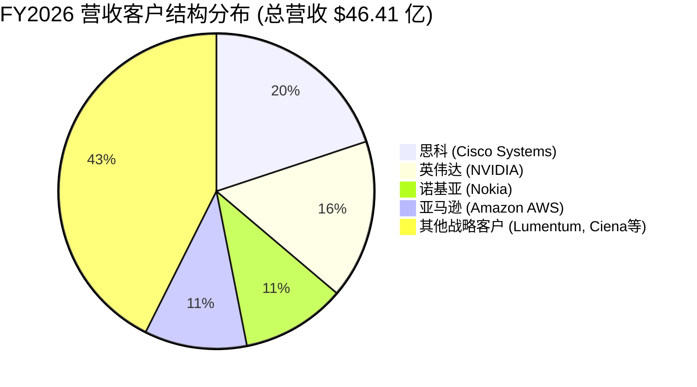

# 福联半导体 Fabrinet（NYSE: FN）投研主档案

> **最后更新**：2026-09-16  
> **覆盖状态**：重点跟踪 / 深度覆盖  
> **当前判断**：**强烈看多（Strong Buy）**  
> **目标区间**：Base Case 目标价 **$442.08**（当前价格 **$374.91**，对应上涨空间 **+17.9%**；Bull Case **$588.59**，对应空间 **+57.0%**）  
> **核心标签**：全球精密光学与 AI 光互连制造隐形冠军 / 英伟达思科核心光学独家代工 / 800G向1.6T跨越与CPO先进封装关键底座 / 泰国Building 10两百万平方英尺新厂即将投产（3楼定于2026年10月交付） / 零负债净现金资产负债表（净现金 $8.75 亿）

---

## 1. 一句话判断（Executive Summary）

> **Fabrinet 是当今全球 AI 算力集群物理层“光进铜退”与高密度光互连网络最核心的独家先进封装工厂（Factory-within-a-Factory）**。
> 公司不是普通的低端电子组装厂（EMS），而是**全球唯一具备亚微米级微光学对准、硅光芯片微组装、高可靠气密封装及共封装光学（CPO）工程化量产能力的超级精密光学制造龙头**。随着英伟达（NVIDIA）Blackwell 架构带动 800G 向 1.6T 光模块爆发式切换，以及思科（Cisco）、诺基亚（Nokia）和亚马逊（AWS）自研 AI 芯片光互连的大规模起量，公司四大核心客户形成共振合力。公司拥有极度健康的**零有息负债、净现金 $8.75 亿美元**资产负债表，伴随泰国春武里 **200 万平方英尺的 Building 10** 超级工厂 3 楼即将于 2026 年 10 月（下月）正式交付投产，正迎来新一轮戴维斯双击成长周期。

---

## 2. 核心投资亮点（Why Watch / Investment Highlights）

- **亮点 1：AI 算力光互连不可逾越的制造壁垒，独占高端数通光模块代工核心生态位**  
  AI 训练与推理集群（如 GB200 NVL72 机架）的 GPU 间通信带宽急剧膨胀，单集群需要数以万计的 800G 及 1.6T 光收发模块与有源光缆（AOC）。Fabrinet 凭借其长达二十余年的微光学封装积累，成为**英伟达高端光通信组件（尤其是 Mellanox 传承的光收发器与线缆）的主要独家代工生产基地**。FY2026 数通光通信（Data Center）单季营收同比暴增 **68%**，全年规模达 **$22.25 亿美元（占总营收 47.9%）**。
- **亮点 2：四大全球科技巨头订单共振，客户集中度由“单极依赖”走向“多核爆发”**  
  据 SEC Form 10-K Note 19 法定披露，FY2026 贡献超 10% 营收的四大客户格局已确立：
  1. **思科 Cisco**：占比 **19.9%**（$9.24 亿，企业网与 AI 交换机光模块需求强劲）；
  2. **英伟达 NVIDIA**：占比 **16.3%**（$7.56 亿，Blackwell 1.6T 前期准备及 800G 满产）；
  3. **诺基亚 Nokia**：占比 **10.7%**（$4.97 亿，收购 Infinera 协同效应及数据中心互联 DCI 订单）；
  4. **亚马逊 AWS**：占比 **10.5%**（$4.87 亿，自研芯片 Trainium 2 及全球云数据中心专属光互连定制）。
  四大巨头合计占比 **57.4%**，打破了过往市场对单一客户砍单的风险担忧。
- **亮点 3：泰国 Building 10 两百万平方英尺新工厂即将投产，打开数十亿美元增量天花板**  
  为应对 AI 爆发式扩张，Fabrinet 在泰国春武里园区投资建设了面积高达 **200 万平方英尺的 Building 10** 超级工厂。根据 8 月财报电话会披露，该厂 3 楼**预计将于 2026 年 10 月（下月）正式交付客户入驻并投产**，专门用于满足 1.6T 光模块、硅光集成以及 CPO 模块的客户专线扩产，将为未来 2-3 年提供翻倍级别的产能储备。
- **亮点 4：“厂中厂（Factory-within-a-Factory）”构筑独一无二的客户黏性与 IP 防火墙**  
  Fabrinet 独创的运营模式为不同客户（如英伟达与思科、亚马逊）提供完全物理隔离的独立厂区、专属工程团队与独立供料通道。这一机制彻底消除了科技巨头对知识产权泄露的戒心，使客户愿意将其最新、最核心的未公开设计交给 Fabrinet 首发试产与量产。
- **亮点 5：零有息负债 + 净现金 $8.75 亿美元，轻装上阵现金造血能力极强**  
  截至 2026 年 6 月 26 日，公司账面拥有 **$8.75 亿美元** 现金及短期投资，**长期借款为 $0.00**。在同类高端精密制造企业中，极少有企业能做到完全无负债运营。公司不仅无偿债压力，每年更产生数千万美元的纯利息净收益。

---

## 3. 商业模式与收入结构（Business Model & Revenue Streams）

### 3.1 公司是怎么赚钱的（Value Proposition & Monetization）

```text
┌────────────────────────────────────────────────────────────────────────┐
│                   FABRINET 全球先进精密光学制造飞轮                   │
└────────────────────────────────────────────────────────────────────────┘
                                    │
       ┌────────────────────────────┴────────────────────────────┐
       ▼                                                         ▼
┌──────────────────────────────┐        ┌──────────────────────────────┐
│ 1. 高阶光通信封装制造 (81.3%) │        │ 2. 非光通信先进制造 (18.8%)  │
│ • Data Center: 800G/1.6T 光模块│        │ • 汽车激光雷达 (LiDAR) / 传感器│
│ • Telecom: 相干光传输 / DCI  │        │ • 工业超快激光器 (Coherent等) │
│ • 硅光子 (Silicon Photonics) │        │ • 医疗精密光学检测仪器       │
└──────────────────────────────┘        └──────────────────────────────┘
                                    │
                                    ▼
┌────────────────────────────────────────────────────────────────────────┐
│ 独特护城河：高复杂度、低容错、多品种小批量（High-Mix / Any-Volume）  │
│ 制造毛利率常年维持在 11.5%~12.5%，净利率超 10%，远超传统 EMS (3%-5%)   │
└────────────────────────────────────────────────────────────────────────┘
```

1. **核心价值主张**：不同于电子元件表面贴装（SMT），光纤与激光通信需要将光纤对准到纳米至亚微米精度的激光发光二极管（VCSEL / DFB / EML）或硅光波导。这一过程涉及复杂的温度补偿、气密封装与微光学透镜加工，良率极难把控。Fabrinet 在泰国建立了低成本、高技术熟练度的工程师红利体系，使客户能免去自建产线的巨额资本开支与试错成本。
2. **收费模式**：交钥匙（Turnkey）模式与来料加工（Consignment）组合，收取包含高精光学封装工艺费、物料管理与良率增益的代工收益。

---

### 3.2 终端市场收入拆解（End-Market Breakdown，SEC 10-K FY2026 真实核验数据）

| 终端市场 / 产品线 (End Market) | FY2026 营收 ($M) | FY2025 营收 ($M) | 同比增速 (YoY) | 收入占比 (%) | 核心商业驱动因素 |
|---|---:|---:|---:|---:|---|
| **数据中心光互连 (Data Center)** | **$2,225.1** | $1,579.9 | **+40.8%** | **47.9%** | **最强主引擎**：AI 算力机架 800G/1.6T 光模块放量，NVIDIA / AWS 采购拉动 |
| **通信基础设施 (Telecom / Metro)** | **$1,546.4** | $1,049.4 | **+47.4%** | **33.3%** | 思科与诺基亚相干光模块（400ZR/800ZR）、DCI 数据中心互联升级 |
| **光通信业务总计 (Total Optical)** | **$3,771.5** | **$2,629.3** | **+43.4%** | **81.3%** | 确立光通信制造赛道绝对领导地位 |
| **汽车、激光与传感器 (Auto & Industrial)**| **$869.6** | $790.0 | **+10.1%** | **18.8%** | 汽车智驾激光雷达（LiDAR）、工业精密加工激光器、医疗光学探测 |
| **集团合并净营收 (Net Revenues)** | **$4,641.1** | **$3,419.3** | **+35.7%** | **100.0%** | **Non-GAAP 净利润 $510.9M（净利率 11.0%）** |

---

### 3.3 四大客户集中度画像（SEC 10-K Note 19 真实核实）



- **从“依附型代工”到“平台型枢纽”**：过往英伟达占比较高时市场担忧“单点依赖”。FY2026 随着思科（19.9%）、诺基亚（10.7%）和亚马逊（10.5%）的全面爆发，Fabrinet 已成为横跨 AI 芯片厂、网络设备龙头与头部云厂商的**全球光学底层基础设施平台**。

---

## 4. 竞争格局与护城河（Moat & Competitive Dynamics）

### 4.1 核心护城河评估

| 护城河维度 | 强/中/弱 | 评估逻辑与买方证据 |
|---|:---:|---|
| **精密光学工艺与自研设备积累** | **极强** | 拥有 25 年积累的光学微对准、自动调芯、主动对准（Active Alignment）工艺专利库。传统电子代工厂（如富士康、立讯精密）无法跨越光学气密封装的高废品率门槛。 |
| **厂中厂（IP 隔离与合规信任）** | **极强** | 芯片客户最忌讳代工厂逆向工程或图纸泄露给竞争对手。Fabrinet 坚持纯代工、绝不碰自有品牌产品（Pure Play EMS），赢得了英伟达、思科的终身信赖。 |
| **泰国本土化制造与地缘避险优势** | **强** | 主力制造产能布局于泰国曼谷及春武里园区（面积超 400 万平方英尺），有效规避了中美科技战对先进光学出口的直接制裁关税风险，是欧美客户最青睐的“中国+1”首选基地。 |
| **零债务强健资产底色** | **强** | 净现金超 8.7 亿美元，使公司在行业高波动周期中能够逆势大手笔扩建超级工厂（如 Building 10），抢占未来代工先机。 |

---

### 4.2 核心竞争对手横向对比

| 厂商名称 | 定位与核心业务 | 相对 Fabrinet 的劣势 | Fabrinet 竞争态势 |
|---|---|---|---|
| **天弘科技 (Celestica / CLS)** | 北美 EMS 龙头，AI 交换机与服务器机柜硬件整机代工 | Celestica 擅长板级与整机硬件（White-box Switch），但在模块内部激光发光芯片的亚微米级微光学对准能力上弱于 FN | 双方在 AI 供应链互补合作多于直接竞争；CLS 做交换机整机，FN 做内部光互连 |
| **捷普科技 (Jabil / JBL)** | 全球综合 EMS 巨头，涉足消费电子、医疗、云计算 | Jabil 规模庞大但业务过于分散，光通信在其营收占比不足 10%，难以提供专属深度定制 | FN 在高精密光收发器上享有更高客户信任与研发介入深度 |
| **中际旭创 (300308.SZ)** | 全球 800G/1.6T 光模块品牌龙头 | 拥有自有品牌与自研设计，但与北美部分客户存在地缘顾虑与知识产权竞争 | 旭创是光模块品牌厂商，而 FN 是为英伟达、思科做专属定制封装的“幕后推手” |
| **新美亚 (Sanmina / SANM)** | 传统电信与光网络 EMS 厂商 | 研发投入较慢，错失 AI 早期 800G 布局，泰国产能布局弱于 FN | FN 在数通 AI 光模块份额遥遥领先 |

---

## 5. 财务画像与资本分配（Financial Profile & Capital Allocation）

### 5.1 关键财务指标趋势（SEC 10-K 真实核实）

| 核心财务指标 | FY2024 (基期) | FY2025 (去年) | FY2026 (最新完整财年) | 趋势与健康度评估 |
|---|---:|---:|---:|---|
| **营业收入 ($M)** | $2,883.0 | $3,419.3 | **$4,641.1** | 连续两年加速成长（+18.6% -> **+35.7%**） |
| **GAAP 毛利率 (%)** | 12.4% | 12.1% | **12.0%** | 精密制造行业极高稳定性（维持在 12% 稳态） |
| **Non-GAAP 毛利率 (%)** | 12.6% | 12.4% | **12.2%** | 扣除股权激励后毛利率保持健康 |
| **GAAP 营业利润 ($M)** | $277.6 | $324.4 | **$462.9** | 同比增长 **+42.7%**，规模杠杆释放 |
| **Non-GAAP 净利润 ($M)** | $332.5 | $368.8 | **$510.9** | 同比增长 **+38.5%**，创历史新高 |
| **Non-GAAP 稀释 EPS ($)**| $9.17 | $10.17 | **$14.09** | **三年复合增速超 25%** |
| **全面稀释股本 (M 股)** | 36.3 | 36.3 | **36.4** | 股本几乎零稀释，股权激励控制极好 |
| **经营活动现金流 ($M)** | $298.5 | $328.4 | **$256.7** | 营运资金因备货与扩张小幅上升 |
| **资本开支 CapEx ($M)** | $105.0 | $121.1 | **$252.5** | Building 10 厂房基建步入尾声 |
| **资产负债表净现金 ($M)** | +$580.0 | +$628.0 | **+$875.1** | **零有息借款，净现金充沛** |

---

### 5.2 资本分配战略

- **逆周期重资产前瞻扩张**：FY2026 资本开支达到创纪录的 **$2.53 亿美元**，主要用于 Building 10 土地厂房基建与高洁净度无尘室（Cleanroom）建设；
- **回购护盘与抗稀释**：截至 2026 年 6 月，公司仍保有 **$1.69 亿美元** 的公开股票回购授权，持续抵消管理层 SBC 稀释。

---

## 6. 核心追踪变量与先导指标（Key Leading Indicators）

1. **先导指标 1：英伟达 Blackwell 架构 1.6T 光模块订单起量斜率**  
   随着 B200 / GB200 规模交付，1.6T 光模块单机价值量显著高于 800G，密切跟踪 Q1-Q2 FY2027 数通营收能否单季突破 $8 亿美元。
2. **先导指标 2：Building 10 新工厂设备进驻与产能爬坡效率**  
   紧盯 2026 年 10 月（下月）Floor 3 正式投产后的客户设备进驻与产能爬坡效率，以及后续楼层的客户预定签约进度。
3. **先导指标 3：共封装光学（CPO）与线性直驱（LPO）代工导入节奏**  
   追踪思科、亚马逊与英伟达在下一代交换机和加速卡中引入 CPO 的定点代工公告。

---

## 7. 估值核心结论与仓位配置建议（Valuation Summary）

- **当前真实股价**：**$374.91**（总市值 $136.3 亿美元，净现金 $8.75 亿美元，EV $127.6 亿美元）
- **估值模型交叉检验**：
  - **SOTP 分部加总基准公允价**：**$434.16**（数通 Datacom 给 26.0x EBIT，通信基建给 18.0x，汽车/工业给 16.0x，加回净现金）；
  - **NTM 目标市盈率（25.0x FY27E EPS $18.00）**：**$450.00**；
  - **合成基准目标价（Base Case）**：**$442.08（+17.9% 上行空间）**；
  - **悲观防守底价（Bear Case）**：**$270.56（-27.8%）**；
  - **乐观爆发目标价（Bull Case）**：**$588.59（+57.0%）**；
  - **概率加权期望目标价（20/60/20）**：**$437.08（+16.6%）**。
- **投资建议**：**强烈看多（Strong Buy）**。
  - 当前股价对应 FY2027E 预期市盈率仅为 **20.8x**，远低于其数通业务 40%+ 的爆发增速与零负债的高质量资产底色；
  - 市场过度担忧了“从 800G 到 1.6T 切换期的短期空窗”，却低估了 Building 10 投产后四大科技巨头（英伟达、思科、诺基亚、亚马逊）订单叠加的爆发力，建议在当前位置积极重仓配置。

---

## 8. 相关专题研究与财报复盘索引

- 📄 [Fabrinet FY2026-Q4 财报深度穿透复盘与电话会实录](earnings/FY2026-Q4.md)
- 📊 [Fabrinet SOTP 分部加总与多维度估值模型](research/valuation-sotp.md)
