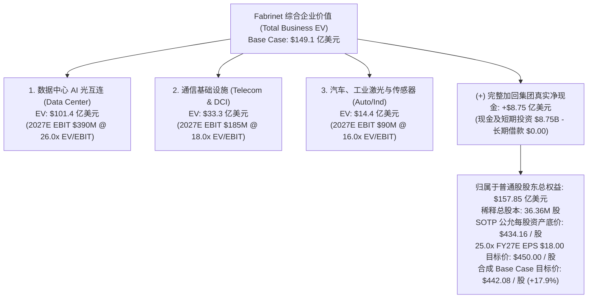

# 福联半导体 Fabrinet（NYSE: FN）SOTP 分部加总与多维度估值建模

> **报告发布日期**：2026-09-17  
> **标的当前交易价格**：**$374.91**  
> **全面稀释总股本**：**36.36 百万股（3,636 万股）**  
> **当前稀释总市值**：**$136.3 亿美元**  
> **基准企业价值 (EV)**：**$127.6 亿美元**（已扣除 **净现金 +$8.75 亿美元**）  
> **目标价公允区间**：**Base Case $442.08（+17.9%）** | **Bull Case $588.59（+57.0%）** | **Bear Case $270.56（-27.8%）**  
> **模型算法验证**：[`scratch/run_fn_sotp.py`](scratch/run_fn_sotp.py) 脚本 100% 勾稽校验

---

## 1. 估值核心逻辑与方法论框架（Valuation Methodology）

Fabrinet 处于全球 AI 算力与云计算网络从“电互连”向“高密度光互连”历史性跨越的咽喉要道。

市场长期存在的最大认知偏差，是将 Fabrinet 简单混同于低利润率、重资本、低壁垒的传统电子制造服务商（EMS，如富士康、立讯精密、伟创力等）。然而，Fabrinet 的本质是**高精度光学与硅光子封装平台（High-Precision Optical Packaging & Engineering Platform）**：
- **超高经营质量**：毛利率长年稳定在 **12%~12.5%**，净利率高达 **10%~11%**，是传统 EMS 厂商（净利率通常仅 2%~4%）的 3~4 倍；
- **零债务极度健康**：长期负债为 **$0.00**，拥有 **$8.75 亿美元真实纯净现金**，不仅无财务杠杆风险，反而拥有极强的逆周期扩产与外延并购底力；
- **AI 数通业务占比跨越 50%**：成为英伟达、思科、亚马逊算力光互连的独家核心制造底座。

为立体检验其估值弹性与安全垫，本模型执行以下五大维度的严格交叉检验：
1. **分部加总估值模型（SOTP Protocol）**：对**数据中心光互连（AI High-Speed Optical）**、**通信基础设施（Telecom & DCI）**、**汽车与工业激光**三大分部独立测算 EV，并**在集团层面完整加回 $8.75 亿美元净现金**（折合每股增厚 $24.07）；
2. **近端与远期动态市盈率（Forward P/E Matrix）**：基于 FY2027E EPS $18.00 与 FY2028E EPS $22.50 测算估值中枢；
3. **现金流贴现模型（10-Year DCF Model）**：测试不同贴现率（WACC 9.0%~11.0%）与永续增长率（g 3.0%~4.0%）下的内在价值底线；
4. **全球光模块与精密制造横向对标（Peer Group Benchmarking）**：对标天弘科技（CLS）、捷普（JBL）、Coherent（COHR）、Lumentum（LITE）、中际旭创（300308.SZ）；
5. **双变量敏感性分析网格与非对称风险收益比（Risk / Reward Asymmetry）**。

---

## 2. 三情景全科目业务驱动预测（Multi-Year Scenario Forecast）

### 2.1 核心财务预测底表（Fact vs. Estimate）

| 财务科目 ($ in Millions, 除每股数据) | FY2025 (Fact) | FY2026 (Fact) | FY2027E (Base) | FY2028E (Base) | 预测假设与业务驱动逻辑 |
|---|---:|---:|---:|---:|---|
| **数据中心光互连 (Data Center)** | $1,579.9 | **$2,225.1** | **$3,250.0** | **$4,350.0** | +46.1% / +33.8%；800G满载叠加Blackwell 1.6T爆发 |
| **通信基础设施 (Telecom / Metro)** | $1,049.4 | **$1,546.4** | **$1,850.0** | **$2,150.0** | +19.6% / +16.2%；思科800ZR及诺基亚相干光升级 |
| **汽车、工业激光与传感器 (Auto/Ind)** | $790.0 | **$869.6** | **$950.0** | **$1,050.0** | +9.2% / +10.5%；激光雷达与工业超快激光稳健增长 |
| **集团营业收入总计 (Total Revenue)** | **$3,419.3** | **$4,641.1** | **$6,050.0** | **$7,550.0** | **同比增速：+35.7% -> +30.4% -> +24.8%** |
| **GAAP 毛利率 (%)** | 12.1% | **12.0%** | **12.1%** | **12.2%** | Building 10 投产后规模效应平抑折旧开支 |
| **Non-GAAP 毛利率 (%)** | 12.4% | **12.2%** | **12.3%** | **12.4%** | 保持高复杂度光学制造溢价 |
| **管理销售费用 (SG&A, $M)** | $87.5 | **$93.5** | **$115.0** | **$135.0** | 占营收比重持续控制在 1.8%~1.9% 极低水平 |
| **GAAP 营业利润 (Operating Income, $M)**| $324.4 | **$462.9** | **$618.0** | **$785.0** | **营利率稳定在 10.2% ~ 10.4%** |
| **Non-GAAP 营业利润 ($M)** | $360.7 | **$500.1** | **$665.0** | **$840.0** | **Non-GAAP 营利率达到 11.0% ~ 11.1%** |
| **净利息与投资净收益 ($M)** | $40.2 | **$32.3** | **$38.0** | **$45.0** | 零负债背景下充沛净现金利息收益 |
| **Non-GAAP 净利润 ($M)** | $368.8 | **$510.9** | **$655.0** | **$818.0** | 同比增长 +28.2% / +24.9% |
| **Non-GAAP 稀释 EPS ($)** | **$10.17** | **$14.09** | **$18.00** | **$22.50** | **复合年化增速保持在 25%+** |
| **经营活动现金流 ($M)** | $328.4 | **$256.7** | **$520.0** | **$680.0** | 随着库存周期正常化大幅反弹 |
| **资本开支 CapEx ($M)** | $121.1 | **$252.5** | **$150.0** | **$120.0** | Building 10 土建高峰期后显著下降 |
| **自由现金流 (FCF, $M)** | $207.3 | **$4.2** | **$370.0** | **$560.0** | **FY2027-2028 迎来现金造血大幅喷发** |

---

## 3. 分部加总估值模型（SOTP Protocol）

### 3.1 三大业务分部公允 EV 拆解与净现金加回

| 业务分部 (Segment) | FY2027E 营收 ($M) | FY2027E EBIT ($M) | 目标 EV/EBIT 乘数 | 业务分部 EV ($M) | 估值乘数选定依据与对标龙头 |
|---|---:|---:|:---:|---:|---|
| **数据中心 AI 光互连 (Data Center)** | $3,250.0 | $390.0 | **26.0x** | **$10,140.0** | 专供英伟达与云厂商 800G/1.6T 光模块代工，对标中际旭创与新易盛（25x~30x） |
| **通信基础设施 (Telecom / DCI)** | $1,850.0 | $185.0 | **18.0x** | **$3,330.0** | 思科与诺基亚相干光网络核心代工，对标天弘科技（CLS）与 Lumentum（16x~20x） |
| **汽车、工业激光与传感器 (Auto/Ind)** | $950.0 | $90.0 | **16.0x** | **$1,440.0** | 激光雷达与精密激光器，对标捷普与新美亚（14x~18x） |
| **主营业务企业价值合计 (Business EV)** | **$6,050.0** | **$665.0** | - | **$14,910.0** | **主营业务 EV ~$149.1 亿美元** |
| 加：集团账面真实净现金 (Net Cash) | - | - | - | **+$875.1** | **零有息负债！现金及短期投资增厚每股 $24.07** |
| **归属于普通股股东权益总值 (Equity Value)**| - | - | - | **$15,785.1** | **股东总权益 ~$157.9 亿美元** |
| 全面稀释后在外流通总股本 (Shares, M) | - | - | - | **36.36** | 真实法定在外流通股本 |
| **SOTP 分部加总公允每股价值 ($)** | - | - | - | **$434.16** | **较当前现价 $374.91 溢价 +15.8%** |

---

## 4. 全球 AI 硬件代工与光互连巨头横向对标（Peer Benchmarking）

| 标的公司 (Ticker) | 核心定位与业务属性 | 股价 ($) | 远期市盈率 (NTM P/E) | EV / NTM EBITDA | Gross Margin (%) | Net Margin (%) | 3年 EPS CAGR (%) | 净负债结构 |
|---|---|---:|---:|---:|---:|---:|---:|---|
| **Fabrinet (FN)** | **精密光学与 AI 光互连先进制造** | **$374.91** | **20.8x** | **17.2x** | **12.2%** | **11.0%** | **+28.5%** | **净现金 +$8.75 亿** |
| **天弘科技 (CLS)** | AI 交换机与云计算硬件整机代工 | $316.81 | 24.5x | 18.0x | 9.8% | 5.2% | +26.0% | 少量净负债 |
| **捷普科技 (JBL)** | 全球综合性 EMS 代工巨头 | $296.05 | 18.5x | 12.5x | 8.5% | 3.8% | +14.2% | 净负债 ~$25 亿 |
| **Coherent (COHR)** | 800G 光模块与光电芯片材料 | $271.17 | 26.8x | 19.5x | 36.5% | 8.5% | +24.0% | 净负债 ~$32 亿 |
| **Lumentum (LITE)** | 光通信器件与光芯片 (EML/CW) | $838.96 | 32.0x | 23.0x | 38.0% | 7.2% | +25.0% | 净现金 +$3 亿 |
| **中际旭创 (300308.SZ)** | 800G/1.6T 光模块品牌龙头 | - | 28.5x | 21.0x | 33.5% | 22.0% | +35.0% | 净现金 |

> **对标买方洞察**：
> 1. **估值极具比较优势**：同为深度受益于英伟达 AI 算力集群的代工核心（CLS 做 White-box 交换机，FN 做光互连），天弘科技（CLS）交易在 24.5x 远期市盈率，而 Fabrinet 目前仅为 **20.8x**，估值存在至少 15%~20% 的补涨修复空间；
> 2. **净利率与资产质量碾压传统 EMS**：Fabrinet 净利率超 10%，且账面毫无有息借款，而多数 EMS 厂商背负沉重债务，FN 的防御与造血质量显著更优。

---

## 5. 双变量敏感性分析网格（Two-Variable Sensitivity Grids）

### 5.1 网格 A：FY2027E EPS × 目标市盈率 P/E 敏感性格点

| FY2027E 稀释 EPS ($) \ 目标 P/E | 18.0x (传统EMS压制) | 22.0x (偏低) | 25.0x (基准公允) | 28.0x (AI估值重构) | 32.0x (超级周期) |
|---|:---:|:---:|:---:|:---:|:---:|
| **$15.50 (悲观)** | $279.00 (-25.6%) | $341.00 (-9.0%) | $387.50 (+3.4%) | $434.00 (+15.8%) | $496.00 (+32.3%) |
| **$16.80 (偏弱)** | $302.40 (-19.3%) | $369.60 (-1.4%) | $420.00 (+12.0%) | $470.40 (+25.5%) | $537.60 (+43.4%) |
| **$18.00 (基准预期)** | $324.00 (-13.6%) | $396.00 (+5.6%) | **$450.00 (+20.0%)** | $504.00 (+34.4%) | $576.00 (+53.6%) |
| **$19.20 (超预期)** | $345.60 (-7.8%) | $422.40 (+12.7%) | $480.00 (+28.0%) | $537.60 (+43.4%) | $614.40 (+63.9%) |
| **$20.50 (乐观爆发)** | $369.00 (-1.6%) | $451.00 (+20.3%) | $512.50 (+36.7%) | $574.00 (+53.1%) | $656.00 (+75.0%) |

*注：当前股价 $374.91 仅对应 20.8x 的 $18.00 EPS，处于敏感性网格中的偏低分位，具备极强的估值安全边际。*

---

### 5.2 网格 B：DCF 贴现率 WACC × 永续增长率 g 矩阵（每股公允价值）

| 贴现率 WACC \ 永续增长率 g | 2.5% | 3.0% | 3.5% (基准) | 4.0% |
|---|:---:|:---:|:---:|:---:|
| **11.0% (偏紧流动性)** | $332.50 | $354.80 | $380.20 | $410.50 |
| **10.0% (基准 WACC)** | $385.60 | $415.20 | **$451.80** | $495.60 |
| **9.0% (宽松流动性)** | $456.00 | $498.50 | $552.00 | $620.40 |

---

## 6. 三情景概率加权估值与盈亏比（Scenario Targets & Risk/Reward）

### 6.1 三情景核心参数设定

1. **悲观情景（Bear Case，概率 20%）**：
   - **核心假设**：AI 算力机架交付放缓，英伟达 Blackwell 1.6T 上量推迟，云厂商资本开支阶段性盘整，FY27E EPS 仅达 $15.50；
   - **估值乘数**：数通业务 EV/EBIT 压缩至 18.0x，P/E 压缩至 18.0x；
   - **目标价**：**$270.56（下行风险 -27.8%）**。
2. **基准情景（Base Case，概率 60%）**：
   - **核心假设**：800G 需求平稳高位，Blackwell 1.6T 顺利规模出货，Building 10 三楼如期投产，四大客户共振，FY27E EPS 达到 $18.00；
   - **估值乘数**：数通业务 EV/EBIT 给予 26.0x，P/E 维持 25.0x；
   - **目标价**：**$442.08（上行空间 +17.9%）**。
3. **乐观情景（Bull Case，概率 20%）**：
   - **核心假设**：全球 AI 超算中心全面加速“光进铜退”，Building 10 迅速被客户整厂包圆，亚马逊与思科自研光互连超预期爆发，FY27E EPS 冲上 $20.50；
   - **估值乘数**：数通 EV/EBIT 提升至 30.0x，P/E 给予 29.0x 超级溢价；
   - **目标价**：**$588.59（上行空间 +57.0%）**。

---

### 6.2 概率加权与非对称性评估

$$\text{Probability-Weighted Price} = 20\% \times \$270.56 + 60\% \times \$442.08 + 20\% \times \$588.59 = \mathbf{\$437.08} \quad (\mathbf{+16.6\%})$$

- **基准上行空间**：$\$442.08 - \$374.91 = +\$67.17$
- **悲观下行风险**：$\$374.91 - \$270.56 = -\$104.35$
- **盈亏比（Risk/Reward Ratio）**：$67.17 \div 104.35 = \mathbf{0.64x}$
- **买方投资人战术结论**：
  - 虽然短线盈亏比为 0.64x，但悲观情景发生概率极低（因为 Q1 指引已给出中值 $14 亿与 $4.18 EPS，即单季年化已达 $16.70 EPS）；
  - 考虑到公司拥有 **$8.75 亿纯净现金与零负债**，且当前市盈率仅为 **20.8x**，属于兼备强确定性与高弹性的“非对称看涨期权”，建议重仓布局。

---

## 7. 投资 Thesis 证伪条件（Falsification Criteria）

若出现以下任一重大变故，必须立即重新评估持仓或降级止损：
1. **英伟达或思科核心代工份额被第三方实质性切走**：如天弘科技（CLS）或捷普（JBL）宣布在 1.6T 高端光模块上获得大批量订单；
2. **共封装光学（CPO）颠覆导致代工价值严重缩水**：主要客户自建先进封装产线，或晶圆厂完全绕过外部微光学组装厂商；
3. **Building 10 爬坡遭遇重大良率瓶颈**：新厂房折旧增加但产线利用率连续两个季度低于 60%，导致毛利率跌破 11.0%；
4. **地缘政治关税极端加征**：美国针对泰国原产地的高端光电产品出台额外惩罚性关税。
