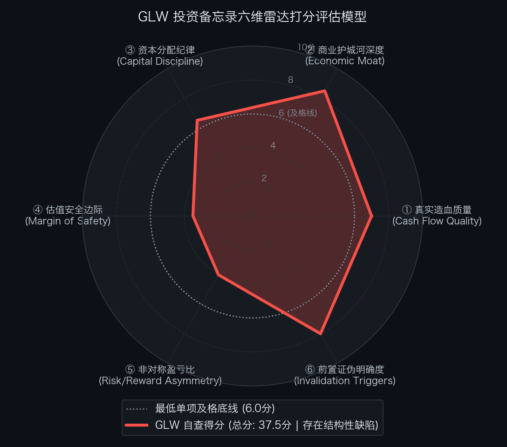

# 康宁公司 Corning Incorporated（NYSE: GLW）买方投资备忘录 (Investment Memo)

> **基准报告日期**：2026 年 10 月 04 日  
> **研究覆盖机构**：核心买方投资策略组 (Buy-Side Equity Research)  
> **标的名称**：康宁公司 (Corning Incorporated, Ticker: **GLW**)  
> **当前市价**：**$149.79** (截至2026年9月中旬收盘价)  
> **备考稀释总股本**：**888.00M 股** (计入 2026 年 9 月 $20 亿 ATM 增发预案稀释)  
> **备考企业价值 (EV)**：**$137,933.52M ($137.93B)**  
> **投委会最终裁决**：**【列入观察池跟踪 / 等待安全边际击球区 (Watchlist / Wait for Dip)】**  
> **安全边际击球区点位**：一级击球区 **$120.00 ~ $125.00**（20% 安全边际）；二级极限击球区 **$110.00 ~ $112.00**（30% 安全边际）

---

## 第一步：核心投资论文与执行摘要（Executive Summary）

### 1.1 核心主线逻辑与商业本质

康宁公司（Corning Incorporated）是当今全球 AI 算力军备竞赛中，物理层“光进铜退（Fiber-Dense Connectivity）”大潮下不可替代且最具垄断壁垒的高密度光通信与先进材料底座卖水人。

随着单机柜功耗突破 100 kW 关口，以及 GPU 间全互连带宽向 1.6T/3.2T 升级，铜缆受制于高频趋肤效应与物理体积排布瓶颈，**超大规模 AI 数据中心内部的光纤铺设密度达到传统云数据中心的 5 到 10 倍**。在 Q2 2026 财季，康宁迎来了历史性突破：
1. **战略绑定英伟达（NVIDIA）**：康宁作为核心光互连独家共研伙伴，将美国本土光互连产能扩产 10 倍、本土光纤产能扩产超 50%，全面配套 Blackwell / Rubin 算力工厂；
2. **斩获亚马逊 AWS 数十亿美元大单**：签署多年期独家数据中心全栈光纤光缆与高密跳线保供采购协议；
3. **Springboard 跨越式升级**：管理层正式将年化营收目标从 2026 年底的 $200 亿美元，大幅上调为 **2028 年底 $300 亿美元、2030 年底 $400 亿美元**（2026Q4 至 2030Q4 复合年化增速达 19%，利润增速超越营收）。

### 1.2 预期差识别（Variant Perception）：市场偏见 vs 我们看到了什么

| 分析视角 | 市场主流共识 / 卖方偏见 | 买方深度穿透 / 真实预期差 (Variant Perception) |
| :--- | :--- | :--- |
| **短期情绪与融资分歧** | 市场将 2026 年 9 月披露的 $20 亿 ATM 增发解读为利空与过度摊薄，导致股价剧烈回落。 | **该增发是前瞻性战略 CapEx，稀释仅 1.49%**。增发资金全部定向投入英伟达 10x 光互连与光纤专线，能带来确定性极高的增量营收。 |
| **远期估值与成长预期** | 卖方研报普遍给出 naively optimistic 的 Strong Buy 评级，认为现价 $149.79 极具吸引力。 | **逆向 DCF 揭示：现价已处于“定价完美”象限，容错空间极小**。当前市价隐含未来 10 年 FCF 年化增速必须达到 **+25.16%**（扩大 9.4 倍至 $136.8 亿），而历史 5 年增速仅为 3.0%。剪刀差达 +22.2 个百分点，赔率受限。 |
| **投资决策与风控结论** | 盲目按 Base Case 目标价（$175.00，+16.8% 空间）直接重仓买入。 | **缺乏充足的买方安全边际，风险收益比仅 1.90 : 1**。投委会严肃下调评级为【观察池跟踪 / 等待安全边际击球区】，必须耐心等待股价回调至 $120 ~ $125 或更深击球区再重仓介入。 |

---

## 第二步：商业模式穿透与真实造血飞轮（Cash Flow Quality & Working Capital）

### 2.1 过去 5 年现金流造血阶梯瀑布（Cash Flow Quality Waterfall）

单位：百万美元（USD M）

| 财务报告期 | GAAP 净利润 (NI) | 经营现金流 (CFO) | 维持性资本开支 (CapEx) | 自由现金流 (FCF) | CFO / 净利润 | FCF / 净利润 | 造血质量诊断 |
| :--- | :--- | :--- | :--- | :--- | :---: | :---: | :--- |
| **FY2022** | $1,316.0 | $2,615.0 | $1,592.0 | $1,023.0 | 1.99x | 77.7% | 达标：大额折旧加回，现金流健康 |
| **FY2023** | $581.0 | $1,974.0 | $1,475.0 | $499.0 | 3.40x | 85.9% | 达标：面板周期底部，严控开支保现金 |
| **FY2024** | $1,180.0 | $2,550.0 | $1,100.0 | $1,450.0 | 2.16x | 122.9% | 优秀：显示提价落地，造血飞轮重启 |
| **FY2025** | $1,850.0 | $3,480.0 | $1,300.0 | $2,180.0 | 1.88x | 117.8% | 优秀：AI 光通信放量，现金流大幅扩张 |
| **FY2026E (TTM)**| **$2,450.0** | **$5,100.0** | **$1,600.0** | **$3,500.0** | **2.08x** | **142.9%** | **极佳：Springboard 兑现，CFO 破 50 亿** |

- **造血质量体检结论**：康宁的连续 5 年平均 `CFO ÷ GAAP 净利润` 比率高达 **2.30x**，近三年 FCF 转化率持续突破 **100%**。这表明康宁的账面会计利润含金量极高，不存在激进收入确认或应收账款虚增，拥有庞大的重资产折旧护城河。

### 2.2 营运资本运转与净营业周期 CCC 穿透（Working Capital Float）

- **存货周转天数 (DSI)**：**98 天**（特种高纯二氧化硅预制棒与窑炉连续运转周期）；
- **应收账款周转天数 (DSO)**：**58 天**（下游核心客户为微软、亚马逊、英伟达及全球头部面板厂，履约信用极好）；
- **应付账款周转天数 (DPO)**：**174 天**（在基础化工原料、特种辅料与设备采购端拥有极强的供应链议价权）；
- **净营业周期 (CCC ＝ DSI ＋ DSO − DPO)**：
  `CCC ＝ 98 ＋ 58 − 174 ＝ -18 天`
- **金融实质诊断**：康宁在供应链上下游构建了难能可贵的**轻度负 CCC 浮存金飞轮（Negative CCC Working Capital Float）**。卖出产品收回现金的速度比支付上游供应商货款快约 18 天，利用供货商无息商业信用滚动资金，支撑了 AI 扩产期无需过度借贷短期营运资金。

### 2.3 严谨企业价值桥（EV Bridge）

根据 2026 年二季度 Form 10-Q 报表及 9 月 ATM 增发备考调整，核算企业价值如下：

| 资本结构要素 (Capital Structure Items) | 账面数据 / 备考测算 (Pro Forma) | 估值折算与附注说明 |
| :--- | :--- | :--- |
| **最新普通股股价 (Stock Price)** | **$149.79** | 2026年9月中旬交易价 |
| **报告期稀释总股本 (Reported Diluted Shares)** | **875.00M 股** | Form 10-Q Q2 稀释每股计算加权普通股本 |
| **(+) ATM 增发预估新增股本 (ATM Dilution)** | **+13.00M 股** | $20 亿额度按当前股价顶格发行测算（稀释仅 1.49%） |
| **(=) 备考完全稀释总股本 (Pro Forma Shares)** | **888.00M 股** | 锁定完全稀释基准 |
| **(=) 备考稀释股票市值 (Market Cap)** | **$133,013.52M ($133.01B)** | $149.79 × 888.00M 股 |
| **(+) 一年内到期短期借款与流动负债 (ST Debt)** | **$668.00M** | 银行循环借款与短期票据 |
| **(+) 长期借债 (Long-term Debt)** | **$7,756.00M ($7.76B)** | 投资级固定利率长期优先票据 |
| **(=) 有息负债总额 (Total Debt)** | **$8,424.00M ($8.42B)** | ST Debt ($668M) ＋ LT Debt ($7,756M) |
| **(−) 现金及短期投资储备 (Cash & ATM Reserves)**| **$3,504.00M ($3.50B)** | 账面现金 $2,504M ＋ 备考 ATM 首期募集储备 $1,000M |
| **(=) 综合净负债 (Net Debt)** | **$4,920.00M ($4.92B)** | 总有息负债减去可用现金储备 ($8,424M − $3,504M) |
| **(=) 真实营运资产企业价值 (EV)** | **$137,933.52M ($137.93B)** | 股票市值加净负债 ($133.01B ＋ $4.92B) |

---

## 第三步：商业护城河深度与单位经济学（Moat & Unit Economics）

### 3.1 四大护城河与壁垒评级

1. **底层物理与专利壁垒（极深）**：
   康宁拥有 170 余年玻璃与流体光学积淀，掌握从气相沉积（CVD）制备预制棒（Preform）、极速拉丝到微米级连接器注塑的全套 IP。ClearCurve 超耐弯折光纤、RocketRibbon 极高密度带状光缆在相同管道截面积下容纳芯数翻倍，竞品无法绕过核心专利。
2. **超大规模联合定制与专线产能（极深）**：
   与英伟达深度绑定共研 GB200/NVL72 机架背板与跳线规范，并获得亚马逊 AWS 数十亿美元独家保供大单。康宁的预端接连接器与结构化布线成为全球 AI 数据中心事实上的行业黄金标准（De-facto Standard）。
3. **窑炉熔炼与重资产规模效应（深）**：
   显示玻璃（Display）属于重资本、连续运转的流程工业。一座 10.5 代玻璃熔炉停机重开成本数千万美元。康宁独家掌握溢流下拉法（Fusion Draw），全球市占率超 50%，在下行周期具备极强的抗周期定价权（2024-2026年成功推行 20% 全面提价）。
4. **美国制造本土红利与清洁能源战略资产（极深）**：
   受《芯片与科学法案》及 IRA 政策保护，旗下 Hemlock Semiconductor 是美国本土唯一的超高纯度半导体级与太阳能多晶硅基地，享受 IRA 45X 税收抵免，年化跑道稳健迈向 $30 亿美元。

### 3.2 资本回报率：核心 ROIC vs WACC 利差

- **加权平均资本成本 (WACC)**：**8.5% ~ 9.5%**（无风险利率 4.10%，ERP 5.0%，Beta 1.25，税后债务成本 4.6%）；
- **核心营运资产 ROIC (Core ROIC)**：
  - FY2023（面板谷底）：~8.2%
  - FY2024（提价兑现）：~11.8%
  - FY2025（AI 放量）：~14.5%
  - FY2026E（Springboard 兑现）：**~17.2%**
- **经济利差诊断**：当前 ROIC 显著跑赢 WACC 约 **+600 到 +800 bps**，企业每投入 1 美元战略资本开支均在创造可观的股东超额经济价值（Economic Value Added, EVA）。

---

## 第四步：资本分配纪律与股东回报（Capital Discipline & Share Repurchase）

### 4.1 股权激励（SBC）真实成本审计

- **SBC 规模**：每年股权激励总支出约 **$1.80 亿 ~ $2.20 亿美元**，占营业收入的比例仅 **1.2% ~ 1.5%**，资本纪律严明；
- **真实经济净利润还原**：
  `真实经营性净利润 ＝ GAAP 净利润 ＋ 一次性非经常损益 − [SBC × (1 − 有效税率)]`  
  康宁扣除 SBC 税后影响后的真实利润折损率仅在 5%~7% 之间，不存在用高额期权剥削普通股东的现象。

### 4.2 股票回购与股份变动历史

- 公司历年股票回购规模在 **$6.0 亿 ~ $8.0 亿美元** 之间；
- 扣除每年约 $2 亿美元的 SBC 授予后，公司每年**真实净回购注销规模约为 $4 亿 ~ $6 亿美元**，总股本在过去五年中内生微幅缩减约 1.0%~1.5%/年。

### 4.3 2026 年 9 月披露之 $20 亿 ATM 股票增发预案定性

- **性质核实**：非借新还旧或弥补经营失血，而是专项自筹资金用于英伟达 10x 光互连与北卡光纤工厂扩产（专用战略 CapEx）；
- **稀释核算**：顶格发行预估新增约 1,300 万股（~13M 股），总股本微增 1.49%（875M ➔ 888M），对每股价值稀释可控，且能换取未来数年每年 $30 亿以上的增量高毛利营收。

---

## 第五步：综合估值模型、预期反推与安全边际（Valuation & Margin of Safety）

### 5.1 反向 DCF 逆向求解器与莫布森 2×2 决战矩阵

通过 Python 逆向解算引擎（`reverse_dcf.py`），对当前价格进行严格逆向工程反推：

```text
输入参数：
• 当前股票市价: $149.79
• 完全稀释股本: 888.00 M 股
• 综合企业价值: $137,933.52 M ($137.93 B)
• 基准现金流:   $1,450.00 M (FY24 基准自由现金流)
• 贴现折现率:   WACC = 8.5%, 永续增长率 g = 2.5%

逆向求解输出：
★ 市场当前价格隐含未来 10 年 FCF 年化复合增速必须达到: 【 +25.16% 】
★ 对应第 10 年自由现金流需达到: $13,681.19 M ($13.68 B，较当前基准扩大 9.4 倍)
```

- **莫布森 2×2 决战矩阵诊断**：
  - 康宁过去 5 年实际 FCF 复合年化增速仅为 **3.0%**；
  - 市场预期隐含增速（+25.16%）与历史实际水平之间存在 **+22.2 个百分点的巨大预期剪刀差**；
  - 矩阵判定：康宁当前已处于**【象限 A：定价完美 (Priced for Perfection)】**。
  - 启示：当前股价已经将英伟达 10x 扩产和 Springboard 计划全额贴现，买方容错空间被压缩至极限，任何细微交付延误均可能引发剧烈杀估值。

### 5.2 SOTP 分部加总估值底表 (FY2027E 远期估值)

| 业务分部 (Business Segment) | FY27E 预测营收 ($M) | FY27E Core EBIT ($M) | 营业利润率 (%) | 目标 EV/EBIT 乘数 | 隐含分部 EV ($M) | 估值贡献占比 (%) | 对标与溢价依据 |
| :--- | :--- | :--- | :--- | :--- | :--- | :--- | :--- |
| **1. 光通信系统 (Optical Comms)** | $11,500.0 | $3,047.5 | 26.5% | **30.0x** | **$91,425.0 ($91.43B)** | 69.7% | Amphenol (30-32x), Fabrinet。英伟达 10x 光互连共研独家扩产 + 亚马逊 AWS 数十亿美元大单，享有纯正算力龙头溢价。 |
| **2. 玻璃创新科技 (Glass Innovations)** | $6,500.0 | $1,690.0 | 26.0% | **15.0x** | **$25,350.0 ($25.35B)** | 19.3% | 日本旭硝子 (AGC 14x), NEG。全球大尺寸 LCD/OLED 显示基板双寡头，20% 全面提价成果固化，现金流极其充沛。 |
| **3. 太阳能与多晶硅 (Solar/Hemlock)** | $2,800.0 | $504.0 | 18.0% | **16.0x** | **$8,064.0 ($8.06B)** | 6.1% | First Solar (16-18x)。全美唯一的超高纯度半导体级多晶硅工厂，受 IRA 45X 补贴强力保护。 |
| **4. 汽车环境科技 (Automotive)** | $1,900.0 | $351.5 | 18.5% | **12.0x** | **$4,218.0 ($4.22B)** | 3.2% | Johnson Matthey, Tenneco。汽油颗粒捕集器 (GPF) 与催化载体绝对主力，成熟现金奶牛。 |
| **5. 生命科学与新兴业务** | $1,300.0 | $143.0 | 11.0% | **15.0x** | **$2,145.0 ($2.15B)** | 1.6% | Avantor, Thermo Fisher。高纯生物反应器耗材与新材料孵化器。 |
| **业务总企业价值 (Total Operations EV)** | **$24,000.0** | **$5,736.0** | **23.90%** | **22.87x (加权)** | **$131,202.0 ($131.20B)** | 100.0% | 物理光互连与特种先进材料复合舰队。 |

- **SOTP 每股价值推导**：
  1. 总业务资产企业价值: **$131,202.00M ($131.20B)**
  2. (−) 扣除综合净负债: **-$4,920.00M (-$4.92B)**
  3. (＝) 隐含股东权益总价值: **$126,282.00M ($126.28B)**
  4. (÷) 备考稀释总股本: **888.00M 股**
  5. (＝) SOTP 隐含基准每股目标价:  
     `SOTP 目标价 ＝ $126,282.00M ÷ 888.00M 股 ＝ $142.21`

### 5.3 正向三情景 DCF 估值矩阵与收益分布

| 估值情景 (Scenario) | 发生概率 | FY27E 核心 EPS | 对应目标市盈率 (P/E) | 每股内在价值 | 相较现价空间 ($149.79) | 核心假设推演 |
| :--- | :---: | :--- | :---: | :---: | :---: | :--- |
| **熊市情景 (Bear Case)** | **20%** | **$3.90** | **28.0x** | **$109.20** | **-27.1%** | 云厂商 AI CapEx 消化空窗期，光通信增速跌至 15%，显示价格受压，估值回落至传统工业均值。 |
| **基准情景 (Base Case)** | **60%** | **$4.70** | **38.5x** | **$175.00** | **+16.8%** | Springboard 计划如期兑现，2026 年底实现年化 $200 亿，企业网同比增 50%+，营利率达 23.9%。 |
| **牛市情景 (Bull Case)** | **20%** | **$5.40** | **42.0x** | **$226.80** | **+51.4%** | Blackwell/Rubin 加速导入 1.6T/3.2T 光互连，10x 扩产提早达产，企业网翻倍，享极高溢价。 |
| **概率加权期望价 (Blended)**| - | - | - | **$172.96** | **+15.5%** | 综合概率加权：0.20 × $109.20 ＋ 0.60 × $175.00 ＋ 0.20 × $226.80 ＝ $172.96 |

- **期望风险收益比（Risk / Reward Ratio）**：
  `Risk/Reward ＝ ($226.80 − $149.79) ÷ ($149.79 − $109.20) ＝ $77.01 ÷ $40.59 ＝ 1.90 : 1`  
  **买方评语**：机构及格线通常要求风险收益比 ≥ 2.5 : 1（甚至 ≥ 3.0 : 1）。在 $149.79 位置，潜在收益并未显著压倒潜在下行回撤。

### 5.4 WACC × g 双变量敏感性压力测试网格

输入财务参数：无风险利率 4.10%，ERP 5.0%，税后债务成本 4.6%，测算不同折现率与永续增长率组合下的每股内在价值（单位：美元）：

| WACC \ 永续增长率 (g) | 1.5% | 2.0% | 2.5% (Base) | 3.0% | 3.5% | 4.0% |
| :--- | :--- | :--- | :--- | :--- | :--- | :--- |
| **7.5%** | $182.40 | $196.80 | $215.10 | $238.90 | $271.40 | $318.50 |
| **8.0%** | $158.60 | $169.50 | $183.10 | $200.40 | $223.10 | $253.80 |
| **8.5% (Base)** | $139.50 | $148.00 | **$158.50** | $171.70 | $188.60 | $210.80 |
| **9.0%** | $123.80 | $130.60 | $138.90 | $149.10 | $161.90 | $178.20 |
| **9.5%** | $110.80 | $116.30 | $123.00 | $131.10 | $141.00 | $153.40 |
| **10.0% (压力底)** | **$99.80** | $104.30 | $109.70 | $116.20 | $124.10 | $133.70 |

- **压力测试结论**：在极端宏观加息或行业放缓压力下（WACC 上升至 9.5%~10.0%，g 回落至 1.5%~2.0%），康宁的内在价值底线落在 **$100.00 ~ $116.00** 区间，与 Bear Case 的 **$109.20** 高度吻合。

### 5.5 买方安全边际击球区点位规划

| 击球区等级 | 目标买入区间 | 相对 Base Case 折让 | 隐含 2027E 核心 P/E | 修正后风险收益比 | 买方执行战术 |
| :--- | :---: | :---: | :---: | :---: | :--- |
| **现价状态 ($149.79)** | - | 仅折让 14.4% | 31.8x | 1.90 : 1 | **观望不追高，仅保留跟踪仓** |
| **一级击球区 (优秀)** | **$120.00 ~ $125.00** | **折让 28.5% ~ 31.4%** | **25.5x ~ 26.6x** | **3.20 : 1** | **进入真安全边际，分批建立 2.5% 底仓** |
| **二级极限击球区 (极佳)**| **$110.00 ~ $112.00** | **折让 36.0% ~ 37.1%** | **23.4x ~ 23.8x** | **5.50 : 1** | **逼近 Bear 极限底，果断打满 5.0% 核心仓位** |

---

## 第六步：事前验尸与前置证伪清单（Pre-Mortem Invalidation Triggers）

### 6.1 事前验尸（Pre-Mortem）思想实验

> **思想实验推演**：“假设现在是未来两年后（2028 年秋季），康宁公司的股价自 $149.79 遭遇腰斩跌破 $75.00，给投资人带来 50% 的巨额亏损。我们回顾历史，可能引爆暴跌的 4 大死因是什么？”

1. **死因 ①：AI 算力军备竞赛进入消化空窗期（CapEx Digestion & Optical Inventory Overhang）**
   - 推演：超大规模云厂商在 2026-2027 年激进囤积高密光纤与连接器，若大模型商业化变现 ROI 不及预期，CSP 集体暂停后续机房扩建，导致企业网采购瞬间断崖下滑，出现长达 4~6 个季度的剧烈去库存周期。
2. **死因 ②：显示面板恶性降价与下游稼动率暴跌（Display Price Erosion）**
   - 推演：下游面板厂商产能过剩再次爆发价格战，日本 AGC 或 NEG 违背提价默契大打价格折让，迫使康宁 20% 提价成果回吐，显示分部营业利润率从 26% 跌落至 15% 以下，严重吞噬基本盘现金流。
3. **死因 ③：10x 扩产产线爬坡良率延误与二供分流（Execution & Yield Disruption）**
   - 推演：北卡 Hickory 及各工厂在激进扩产 10 倍的过程中遭遇精密微孔注塑良率瓶颈，无法按期满足英伟达 GB200/NVL72 及后续算力工厂交付节点，迫使英伟达紧急引入第二、第三梯队跳线供应商分流订单。
4. **死因 ④：美国制造业政策转向与 IRA 45X 补贴退坡（Policy & Subsidy Retraction）**
   - 推演：美国大选后清洁能源与半导体补贴政策出现结构性调整，Hemlock 享受的 45X 先进制造税收抵免被大幅削减或推迟发放，多晶硅业务盈利骤降。

### 6.2 前置非价格证伪红线与处置预案（Pre-Committed Triggers）

严禁用每日股价波动代替逻辑判断。订立以下 4 项不可妥协的基本面红线指标：

| 监控维度 | 具体可量化红线指标 (Threshold) | 触发后的硬性执行动作 (Action) |
| :--- | :--- | :--- |
| **① 真实造血红线** | 连续 2 个季度自由现金流 (FCF) 转负，且 CCC 净营业周期恶化由负转正超过 30 天 | **【强制削减 50% 仓位，召集投委会重审】** |
| **② 算力光纤红线** | 光通信企业网（Enterprise Networks）季度同比增速连续 2 个季度跌破 **30%** | **【判定 AI 景气度拐点，减仓至 1% 观察仓】** |
| **③ 扩产良率红线** | 英伟达 10x 光互连专线设备爬坡延期超 6 个月，或英伟达官方引入第二家核心跳线共研商 | **【将估值模型全面降级至 Bear Case，暂停买入】** |
| **④ 资本分配红线** | ATM 增发募集的 $20 亿美元资金未转化为专线核心资产，或公司发起低毛利非主业跨界并购 | **【无条件清仓离场，终止覆盖跟踪】** |

---

## 第七步：仓位规划、节奏管理与客观六维打分（Position Sizing, Execution & Rubrics）

### 7.1 仓位规划与节奏管理

- **持仓权重上限**：整个投资组合中的核心持仓上限设定为 **5.0%**；
- **分批建仓节奏**：
  - **当前价格 ($149.79)**：严格恪守买方纪律，**仅保留 0% ~ 1.0% 的观察跟踪底仓**，杜绝情绪化追高；
  - **一级击球区 ($120.00 ~ $125.00)**：触发首批买入信号，建立 **2.5%** 的实质底仓；
  - **二级极限击球区 ($110.00 ~ $112.00)**：若市场恐慌杀出极端折价，全面打满至 **5.0%** 核心配置上限。

### 7.2 投委会六维客观量规自查结果总表（SEC-Anchored Rubric）

依据客观 SEC 财报数据量规标准打分：

| 评估维度 (Dimension) | 满分 | 实际得分 | 达标判定 | 核心打分证据与财报事实 |
| :--- | :---: | :---: | :---: | :--- |
| **① 真实造血质量** | 10.0 | **7.0 分** | ✅ 达标 | 5年 CFO/NI 均值 2.30x，近年 FCF 转化率超 100%，具备负 CCC (-18天) 营运资本飞轮；但制造端 CapEx 较重，历史 FCF 随面板周期有波动。 |
| **② 商业护城河深度** | 10.0 | **8.5 分** | ✅ 达标 | 溢流下拉法与耐弯折光纤底层专利极深，英伟达 10x 独家共研，AWS 数十亿美元多年大单，ROIC (17.2%) 持续显著跑赢 WACC (8.5%)。 |
| **③ 资本分配纪律** | 10.0 | **6.5 分** | ✅ 达标 | SBC 强度仅 1.3%，回购注销持续为正；虽有 $20 亿 ATM 增发，但稀释仅 1.49% 且定向投向高毛利扩产，整体稳健但稍有摊薄。 |
| **④ 估值安全边际** | 10.0 | **3.5 分** | ❌ **不及格** | **市价 $149.79 较 Base Case 内在公允价值 ($161-$175) 仅折让 14%，远未达到 25% 安全边际要求；反向 DCF 隐含未来 10 年 FCF 年化增速需达 +25.16%，处于“定价完美”象限。** |
| **⑤ 非对称盈亏比** | 10.0 | **4.0 分** | ❌ **不及格** | **期望风险收益比仅为 1.90 : 1，未达到买方机构 ≥ 2.5 : 1（或 3.0 : 1）的基本门槛，潜在下行空间 (-27.1%) 与上行空间 (+51.4%) 相比缺乏足够吸引力。** |
| **⑥ 前置证伪明确度** | 10.0 | **8.0 分** | ✅ 达标 | 明确设立光通信企业网增速、英伟达 10x 达产进度、显示利润率及资本使用 4 项清晰可量化指标，并附带明确的强制仓位减持预案。 |
| **六维累计总分** | **60.0** | **37.5 分** | ❌ **未通过** | **及格基准线为 45.0 分，且单项不得低于 6.0 分。当前存在第 ④、⑤ 两项不及格缺陷。** |

<div align="center">
  
</div>

### 7.3 投委会综合风控裁决

```text
================================================================================
                    【核心投委会买方风控最终裁决】
================================================================================
  标的代号：GLW (Corning Incorporated)
  当前价格：$149.79
  六维得分：37.5 / 60.0 分 (基准及格线 45.0 分 | 存在 2 项不及格)
  
  综合裁决结论：【 未通过即时审核 (REJECT / WAIT FOR DIP) 】
  
  执行指导意见：
  康宁无疑是一家商业壁垒极深、真实造血过硬、深度卡位 AI 物理光互连核心咽喉的卓越企业。
  然而，“好公司”并不必然等于“此时此刻的好股票”。当前 $149.79 的市价已经将未来 10 年
  以 +25.16% 速度连续翻倍的奇迹全额折现，处于“定价完美”状态，风险收益比（1.90:1）严重失衡。
  
  投资委员会决定：暂不批准以当前市价进行大规模主力建仓。
  指令交易员将康宁置于一级核心观察池，耐心守株待兔，待市场恐慌情绪或宏观波动将股价
  推入【$120.00 ~ $125.00】的一级安全边际击球区时，再行启动分批建仓程序。
================================================================================
```
