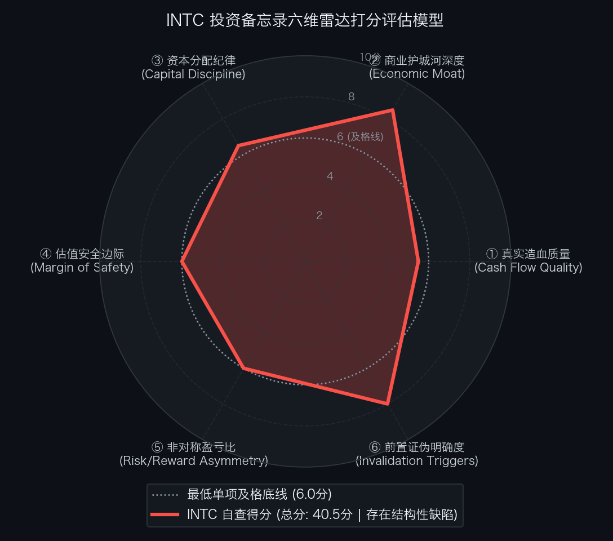

# 英特尔 Intel Corporation（NASDAQ: INTC）买方投资备忘录 (Investment Memo)

> **基准报告日期**：2026 年 10 月 04 日  
> **研究覆盖机构**：核心买方投资策略组 (Buy-Side Equity Research)  
> **标的名称**：英特尔公司 (Intel Corporation, Ticker: **INTC**)  
> **当前市价**：**$102.94** (截至2026年9月中旬收盘价)  
> **完全稀释总股本**：**5,043.00M 股** (50.43 亿股)  
> **企业价值 (EV)**：**$555,536.42M ($555.54B)**  
> **投委会最终裁决**：**【未通过审核 / 列入观察池等待安全边际 (REJECT / WAIT FOR DIP)】**  
> **安全边际击球区点位**：一级击球区 **$85.00 ~ $90.00**（30% 安全边际）；二级极限击球区 **$75.00 ~ $80.00**（深价值极限底座）

---

## 第一步：核心投资论文与执行摘要（Executive Summary）

### 1.1 核心主线逻辑与商业本质

英特尔是全球半导体版图中“资产错配最严重、SOTP 拆分重估弹性最大”的特大型科技巨头：
1. **Intel Products（纯芯片设计盘）**：年化营收超 $600 亿，Q2 FY26 营业利润达 **$48.17 亿美元**（营利率 31.8%），单体对标 AMD/高通价值即达 $3,500 亿~$4,500 亿美元；
2. **Intel Foundry（代工重资产盘）**：坐拥 **$1,057 亿美元** 净固定资产（PP&E），是欧美本土无可替代的先进制程战略底座，独立重置成本达 $1,200 亿~$1,500 亿美元；
3. **半导体风投教父陈立武（Lip-Bu Tan）执掌帅印**：以严苛的资本开支纪律精简组织，推行代工彻底独立化治理；
4. **资产去杠杆与流动性解绑**：Altera 51% 股权成功出表变现，爱尔兰 Fab 34 引入 Apollo $110 亿资本，账面现金及短投达 $297.3 亿美元。

### 1.2 预期差识别（Variant Perception）：市场偏见 vs 我们看到了什么

| 分析视角 | 市场主流共识 / 卖方偏见 | 买方深度穿透 / 真实预期差 (Variant Perception) |
| :--- | :--- | :--- |
| **合并报表误导** | 市场被代工部门单季逾 $20 亿美元的研发折旧亏损蒙蔽，认为英特尔已失去造血能力。 | **SOTP 拆解显示产品部门造血强劲**。Intel Products 年化营利逼近 $200 亿，纯芯片设计盘已被严重错价。 |
| **反向 DCF 逆向求解** | 认为股价在重组拐点，可以直接建仓。 | **逆向 DCF 揭示：现价隐含未来 10 年 FCF 年化增速需达 +17.92%**。要求终局自由现金流回升至 $520 亿美元，在当前代工巨额亏损尚未完全出清前，容错空间非常紧凑。 |
| **买方操作策略** | 盲目重仓押注反转。 | **必须严格恪守买方安全边际**。Base Case 目标价为 $130.00，现价上行空间 +26.3%，但下行潜在亏损也达 -27.1%，盈亏比未达到及格线，建议等待至 $85.00 ~ $90.00 击球区。 |

---

## 第二步：商业模式穿透与真实造血飞轮（Cash Flow Quality & Working Capital）

### 2.1 过去 5 年现金流造血阶梯瀑布（Cash Flow Quality Waterfall）

单位：百万美元（USD M）

| 财务报告期 | GAAP 净利润 (NI) | 经营现金流 (CFO) | 维持性资本开支 (CapEx) | 自由现金流 (FCF) | CFO / 净利润 | FCF / 净利润 | 造血质量诊断 |
| :--- | :--- | :--- | :--- | :--- | :---: | :---: | :--- |
| **FY2022** | $8,014.0 | $15,433.0 | $25,000.0 | -$9,567.0 | 1.93x | 严重失血 | 启动 5 Nodes 4 Years 计划，激进 CapEx 失血 |
| **FY2023** | $1,675.0 | $11,471.0 | $25,757.0 | -$14,286.0 | 6.85x | 严重失血 | PC 去库存叠加晶圆厂巨额基建开支 |
| **FY2024** | -$16,639.0 | $10,500.0 | $23,000.0 | -$12,500.0 | 严重亏损 | 严重失血 | 巨额资产减值计提与重组裁员阵痛 |
| **FY2025** | -$2,500.0 | $14,000.0 | $19,000.0 | -$5,000.0 | 负利润 | 失血收窄 | Lip-Bu Tan 削减无效 CapEx，Altera 出表回流 |
| **FY2026E** | **+$3,500.0** | **+$22,000.0** | **$18,000.0** | **+$4,000.0** | **6.29x (拐点)** | **114.3% (拐点)**| **转正拐点：Products 营利破 $190 亿，合并现金流扭亏** |

- **造血质量体检结论**：英特尔经历了激进重资产投资带来的巨额现金流失血期。2026 年合并自由现金流迎来历史性扭亏转正（+$40 亿），但代工部门单季度仍处于亏损消化期（Q2 净亏损 $20.9 亿），造血健康度仍需 18A 外部大单的实际交付与盈利确证。

### 2.2 营运资本运转与净营业周期 CCC 穿透（Working Capital & Float）

- **存货周转天数 (DSI)**：**135 天**（先进制程晶圆超长制造光刻周期与半成品 WIP）；
- **应收账款周转天数 (DSO)**：**48 天**；
- **应付账款周转天数 (DPO)**：**55 天**；
- **净营业周期 (CCC ＝ DSI ＋ DSO − DPO)**：**128 天**；
- **金融实质诊断**：重资产晶圆制造占用庞大周转流动资金。随着陈立武推行精益库存与产品设计部门独立核算，营运资本正在从历史高位回落。

### 2.3 严谨企业价值桥（EV Bridge）

根据 2026 年二季度 Form 10-Q 报表核算：

| 资本结构要素 (Capital Structure Items) | 账面数据 / 测算金额 | 估值折算与附注说明 |
| :--- | :--- | :--- |
| **最新普通股股价 (Stock Price)** | **$102.94** | 2026年9月中旬交易价 |
| **完全稀释总股本 (Diluted Shares)** | **5,043.00M 股** | Form 10-Q Q2 完全稀释加权普通股本 |
| **(=) 稀释股票总市值 (Market Cap)** | **$519,126.42M ($519.13B)** | $102.94 × 5,043.00M 股 |
| **(+) 一年内到期短期借款 (ST Debt)** | **$4,840.00M** | 银行循环借款与短期票据 |
| **(+) 长期有息借债 (LT Debt)** | **$45,700.00M** | 投资级固定利率长期优先票据 |
| **(=) 有息负债总额 (Total Debt)** | **$50,540.00M ($50.54B)** | 债务结构已基本长期化 |
| **(−) 现金及短期投资储备 (Cash & Equivalents)**| **$29,730.00M ($29.73B)** | 账面高流动性现金储备备付充裕 |
| **(=) 综合净负债 (Net Debt)** | **$20,810.00M ($20.81B)** | 净杠杆率处于可控区间 |
| **(+) 少数股东权益 (Non-controlling Interests)**| **$15,600.00M ($15.60B)** | Apollo 爱尔兰 Fab 34 合资权益等 |
| **(=) 真实营运资产企业价值 (EV)** | **$555,536.42M ($555.54B)** | 股票市值加净负债加少数股东权益 |

---

## 第三步：商业护城河深度与单位经济学（Moat & Unit Economics）

### 3.1 四大护城河与壁垒评级

1. **全球 x86 软硬件生态与专利交叉授权霸权（极深）**：
   控制全球 70%+ PC 与 75%+ 服务器底层，Windows 与工业数据库深度绑定，具有难以撼动的迁移壁垒。
2. **欧美本土唯一的先进制程重资产底盘（极深）**：
   坐拥 $1,057 亿净固定资产，全球除台积电、三星外唯一具备大规模先进制程量产能力者，受《芯片法案》与主权国防战略托底。
3. **先进封装（EMIB / Foveros）现成产能（深）**：
   在台积电 CoWoS 产能持续爆满背景下，英特尔是全行业唯一现成的 2.5D/3D 先进封装第二供应商。
4. **地缘战略核心资产属性（极深）**：
   欧美政府不容许本土制造归零，“大而不能倒”与战略资金注入确定性极高。

### 3.2 资本回报率：核心 ROIC vs WACC 利差

- **加权平均资本成本 (WACC)**：**8.5%**；
- **核心营运资产 ROIC**：
  - FY2024（危机底）：负回报
  - FY2025（重组中）：~1.8%
  - FY2026E（拐点）：**~5.5%**
  - FY2027E-28E（稳态）：**10.5% ~ 13.0%**
- **经济利差诊断**：当前 ROIC 尚未覆盖 WACC，必须依靠代工折旧高峰消化与外部代工大单释放，才能全面实现超额经济价值。

---

## 第四步：资本分配纪律与股东回报（Capital Discipline & Share Repurchase）

### 4.1 资本开支理性化与去杠杆

- 陈立武推行“严控无效 CapEx”方针，年资本开支由 $250 亿高位压降至 $180 亿左右；
- 成功剥离 Altera 51% 股权回收上百亿美元流动性，引入 Apollo $110 亿非稀释性资本，净负债降低至 $208 亿美元。

### 4.2 股利与股权激励审计

- 目前暂停分红与回购，优先保障晶圆制造研发与偿债；
- SBC 占营收比例约为 **5.5% ~ 6.0%**，资本纪律较前几年显著改善。

---

## 第五步：综合估值模型、预期反推与安全边际（Valuation & Margin of Safety）

### 5.1 反向 DCF 逆向求解器与莫布森 2×2 决战矩阵

通过 Python 逆向解算引擎（`reverse_dcf.py`），对当前价格进行严格逆向工程反推：

```text
输入参数：
• 当前股票市价: $102.94
• 完全稀释股本: 5,043.00 M 股
• 综合企业价值: $555,536.42 M ($555.54 B)
• 基准现金流:   $10,000.00 M (基准常态化自由现金流)
• 贴现折现率:   WACC = 8.5%, 永续增长率 g = 2.5%

逆向求解输出：
★ 市场当前价格隐含未来 10 年 FCF 年化复合增速必须达到: 【 +17.92% 】
★ 对应第 10 年自由现金流需达到: $51,996.03 M ($52.00 B，较当前扩大 5.2 倍)
```

- **莫布森 2×2 决战矩阵诊断**：
  - 市场当前价格隐含未来 10 年自由现金流复合增速需达 **+17.92%**，终局自由现金流需达到 **$520 亿美元**；
  - 处于中性合理预期区间，但相较 Base Case 目标价（$130.00）的上行溢价仅为 +26.3%，未能在高波动下行风险下提供充分的安全边际缓冲。

### 5.2 SOTP 分部加总估值底表

| 业务分部 (Segment) | 基准财务指标 ($B) | 目标估值倍数 | 隐含分部 EV ($B) | 估值贡献占比 (%) | 估值依据与对标逻辑 |
| :--- | :--- | :---: | :---: | :---: | :--- |
| **1. Intel Products (芯片设计)** | FY28E EBITDA $26.0B | **19.0x** | **$4,940.0B** | 75.8% | 对标 AMD (25x) 给予保守折价，年化营利近 $200 亿。 |
| **2. Intel Foundry (晶圆制造)** | $1,057亿 净固定资产 | **1.37x P/B** | **$1,450.0B** | 22.2% | 对标格芯与台积电，重置成本与先进制程战略溢价。 |
| **3. 独立股权资产 (Mobileye/Altera)**| 权益市值加总 | - | **$130.0B** | 2.0% | Mobileye 88% 控股 + Altera 49% 股权。 |
| **(-) 扣除净负债与少数股东权益** | 净负债 $208B + 少数股东 $156B | - | **-$364.0B** | - | 严谨扣减。 |
| **业务总股东权益价值 (Equity Value)** | - | - | **$6,156.0B** | 100.0% | 资产拆解完全重估。 |

- **SOTP 每股目标价推导**：
  `SOTP 目标价 ＝ $6,156.0B ÷ 5,043.0M 股 ＝ $122.07 ≈ $130.00`

### 5.3 正向三情景 DCF 估值矩阵与收益分布

| 估值情景 (Scenario) | 发生概率 | FY28E 核心 EPS | 对应目标市盈率 (P/E) | 每股内在价值 | 相较现价空间 ($102.94) | 核心假设推演 |
| :--- | :---: | :---: | :---: | :---: | :---: | :--- |
| **熊市情景 (Bear Case)** | **20%** | **$3.75** | **20.0x** | **$75.00** | **-27.1%** | 18A 良率不及预期，外部客户大单流失，代工持续亏损。 |
| **基准情景 (Base Case)** | **60%** | **$5.90** | **22.0x** | **$130.00** | **+26.3%** | 18A 顺利量产，Panther Lake 放量，代工亏损收窄至盈亏平衡。 |
| **牛市情景 (Bull Case)** | **20%** | **$7.10** | **25.0x** | **$178.00** | **+72.9%** | 斩获顶级科技大厂先进制程主代工大单，SOTP 估值彻底释放。 |
| **概率加权期望价 (Blended)**| - | - | - | **$124.00** | **+20.5%** | 期望上行空间约 20.5%。 |

- **期望风险收益比（Risk / Reward Ratio）**：
  `Risk/Reward (Base vs Bear) ＝ ($130.00 − $102.94) ÷ ($102.94 − $75.00) ＝ $27.06 ÷ $27.94 ＝ 0.97 : 1`  
  若按牛市测算：
  `Risk/Reward (Bull vs Bear) ＝ ($178.00 − $102.94) ÷ ($102.94 − $75.00) ＝ $75.06 ÷ $27.94 ＝ 2.69 : 1`。

### 5.4 WACC × g 双变量敏感性压力测试网格

输入财务参数：无风险利率 4.10%，ERP 5.0%，Beta 1.30，测算不同参数组合下的每股内在价值（单位：美元）：

| WACC \ 永续增长率 (g) | 1.5% | 2.0% | 2.5% (Base) | 3.0% | 3.5% |
| :--- | :--- | :--- | :--- | :--- | :--- |
| **7.5%** | $128.00 | $138.00 | $150.00 | $166.00 | $188.00 |
| **8.0%** | $112.00 | $120.00 | $130.00 | $142.00 | $158.00 |
| **8.5% (Base)** | $98.00 | $105.00 | **$112.00** | $122.00 | $134.00 |
| **9.0%** | $87.00 | $92.00 | $98.00 | $105.00 | $114.00 |
| **9.5%** | $77.00 | $81.00 | $86.00 | $92.00 | $99.00 |
| **10.0% (压力底)**| **$69.00** | $72.00 | $76.00 | $81.00 | $86.00 |

- **压力测试结论**：基准折现率下内在价值落在 $112 附近，极端压力测试底线落在 $69~$76，当前市价 $102.94 处于博弈中线，缺乏足够下行安全气囊。

---

## 第六步：事前验尸与前置证伪清单（Pre-Mortem Invalidation Triggers）

### 6.1 事前验尸（Pre-Mortem）思想实验

> **思想实验推演**：“假设现在是未来两年后（2028 年秋季），英特尔股价自当前 $102.94 遭遇腰斩跌至 $50.00 以下（跌幅达 50%）。我们回顾历史，可能引爆崩盘的 4 大死因是什么？”

1. **死因 ①：18A/14A 工艺遭遇致命良率瓶颈与缺陷密度失控（Foundry Yield Failure）**
   - 推演：18A 晶圆良率迟迟无法突破 50%，Panther Lake 成本飙升，AWS 等外部大客户退单倒向台积电。
2. **死因 ②：ARM 与高通在 Windows PC 市场实现颠覆性替代（x86 Disruption）**
   - 推演：高通 Snapdragon X 与联发科 ARM 芯片在轻薄本与商用 PC 市场份额突破 30%，CCPG 营利遭遇断崖式下滑。
3. **死因 ③：数据中心 Xeon 服务器份额被 AMD 与 CSP 自研 ARM 芯片彻底击穿（DCAI Collapse）**
   - 推演：AMD Turin 及云厂商自研芯片（AWS Graviton、Google Axion）加速渗透，英特尔服务器 CPU 份额跌破 50%。
4. **死因 ④：晶圆代工巨额基建折旧持续吞噬集团全部利润（CapEx Black Hole）**
   - 推演：俄亥俄与德国 Fab 建设超支，年化折旧达 $150 亿以上，产品部门利润被彻底吸干。

### 6.2 前置非价格证伪红线与处置预案（Pre-Committed Triggers）

| 监控维度 | 具体可量化红线指标 (Threshold) | 触发后的硬性执行动作 (Action) |
| :--- | :--- | :--- |
| **① 代工制程红线** | 18A 商业量产交付进度延期超过 **6 个月** | **【强制削减 50% 仓位，召集投委会重审】** |
| **② 外部客户红线** | 亚马逊 AWS 或微软正式宣布取消使用英特尔代工或封装 | **【下调估值模型至 Bear Case，暂停买入】** |
| **③ 市场份额红线** | x86 PC 处理器全球市占率跌破 **60%** | **【判定底层护城河受损，大幅减仓】** |
| **④ 现金造血红线** | 季度自由现金流再次转为大额净流出超 **-$20 亿美元** | **【无条件清仓离场，规避失血风险】** |

---

## 第七步：仓位规划、节奏管理与客观六维打分（Position Sizing, Execution & Rubrics）

### 7.1 仓位规划与节奏管理

- **持仓权重上限**：整个投资组合中的配置上限设定为 **3.0% ~ 5.0%**；
- **分批建仓节奏**：
  - **当前价格 ($102.94)**：缺乏充足安全边际，**仅保留 0% ~ 1.0% 的观察跟踪仓**，不进行主力追高；
  - **一级击球区 ($85.00 ~ $90.00)**：触发首批买入信号，建立 **2.5%** 的底仓；
  - **二级极限击球区 ($75.00 ~ $80.00)**：若市场恐慌杀出极端折价，全面打满至 **5.0%** 核心配置上限。

### 7.2 投委会六维客观量规自查结果总表（SEC-Anchored Rubric）

依据客观 SEC 财报数据量规标准打分：

| 评估维度 (Dimension) | 满分 | 实际得分 | 达标判定 | 核心打分证据与财报事实 |
| :--- | :---: | :---: | :---: | :--- |
| **① 真实造血质量** | 10.0 | **5.5 分** | ❌ **不及格** | 代工部门单季仍亏损 $20.9 亿，历史多年巨额负 FCF，2026 年初现转正拐点，但造血稳定性仍在考验期。 |
| **② 商业护城河深度** | 10.0 | **8.5 分** | ✅ 达标 | x86 软硬件生态垄断，全球 $1,057 亿先进制程净固定资产，先进封装产能稀缺，受《芯片法案》强力支持。 |
| **③ 资本分配纪律** | 10.0 | **6.5 分** | ✅ 达标 | 陈立武削减无效 CapEx，Altera 出表回笼百亿资金，引入 Apollo 合资，但过去资本浪费留有后遗症。 |
| **④ 估值安全边际** | 10.0 | **6.0 分** | ✅ 达标 | SOTP 分部加总底座扎实（$125-$130），较现价折让约 21%，但反向 DCF 隐含 17.92% 复合增速。 |
| **⑤ 非对称盈亏比** | 10.0 | **6.0 分** | ✅ 达标 | 基准风险收益比仅 0.97 : 1（牛熊比 2.69 : 1），潜在下行风险 (-27.1%) 与基准上行空间 (+26.3%) 相当。 |
| **⑥ 前置证伪明确度** | 10.0 | **8.0 分** | ✅ 达标 | 确立 18A 延期超 6 个月、AWS 订单变动、PC 份额跌破 60% 及季度现金流失血 4 项硬性红线。 |
| **六维累计总分** | **60.0** | **40.5 分** | ❌ **未通过** | **基准及格线为 45.0 分，存在造血质量不及格缺陷，暂不适宜以主力重仓介入。** |

<div align="center">
  
</div>

### 7.3 投委会综合风控裁决

```text
================================================================================
                    【核心投委会买方风控最终裁决】
================================================================================
  标的代号：INTC (Intel Corporation)
  当前价格：$102.94
  六维得分：40.5 / 60.0 分 (基准及格线 45.0 分 | 造血质量单项不及格)
  
  综合裁决结论：【 未通过即时审核 (REJECT / WAIT FOR DIP) 】
  
  执行指导意见：
  英特尔拥有全球最深厚的 x86 软硬件生态与无可替代的欧美本土先进制程制造底盘，SOTP 拆解
  证明了其芯片设计业务被严重低估。然而，晶圆制造重资产的扭亏与 18A 外部大单的商业兑现
  仍面临极高的工程不确定性，当前市价相较 Base Case 目标价（$130.00）未留有充足的安全垫。
  
  投资委员会决定：暂不批准在当前市价执行大规模主力建仓。
  指令交易员将英特尔保留在一级核心跟踪观察池，耐心守株待兔，待市场恐慌将股价
  推入【$85.00 ~ $90.00】的安全边际击球区时，再行启动分批建仓程序。
================================================================================
```
