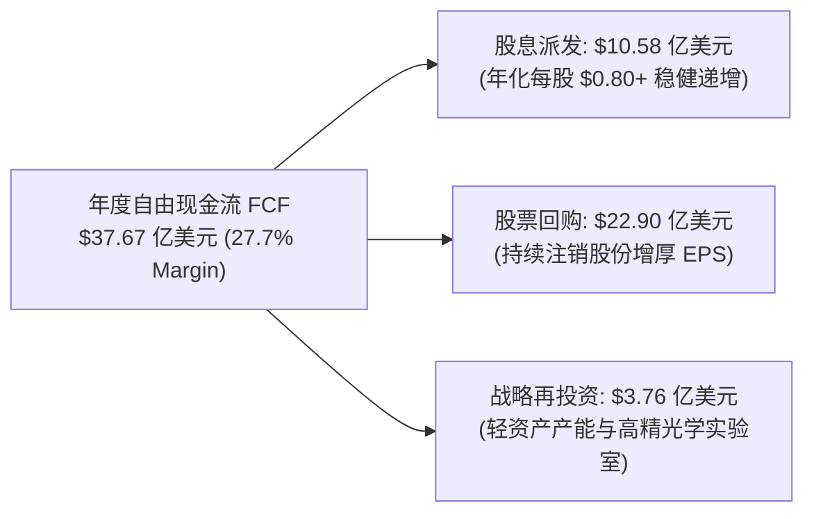

# 科磊半导体 KLA Corporation（NASDAQ: KLAC）投研主档案

> **最后更新**：2026-09-16  
> **覆盖状态**：重点跟踪 / 深度覆盖  
> **当前判断**：**审慎看多（Overweight / Buy）**  
> **目标区间**：Base Case 目标价 **$180.67**（当前价格 **$168.02**，对应上涨空间 **+7.5%**；Bull Case **$239.70**，对应空间 **+42.7%**）  
> **核心标签**：全球半导体良率控制绝对垄断霸主 / 晶圆检测市占率超 50% 且规模为次席对手 6 倍 / 10 换 1 拆股流动性释放 / 先进封装过程控制年化 $11 亿（+70% YoY）/ 2nm GAA 与 High-NA EUV 量测强度超级周期 / 89% FCF 股东回报飞轮

---

## 1. 一句话判断（Executive Summary）

> **KLA Corporation 是全球半导体制造“物理良率极限”与“先进制程登顶”不可逾越的独家守门人**。在全球半导体设备（WFE）版图中，光刻（Lithography）有 ASML，而**良率与过程控制（Process Control & Metrology/Inspection）则被 KLA 绝对垄断（全球市占率 >50%，规模超第二名 6 倍）**。
> 伴随 2026 年 6 月正式完成 **10 换 1 股票拆细（10-for-1 Stock Split）**，公司股票流动性大幅提升。台积电与三星 2nm 全环绕栅极（GAA/Nanosheet）量产、英特尔 18A/14A、High-NA EUV 亚纳米套刻及 AI 芯片先进封装（CoWoS / HBM4）正带来量测强度（Process Control Intensity）的历史性跃升。公司毛利率常年维持在 **61%~63%**，营业利润率超 **42%**，近 90% 的自由现金流直接通过分红与回购回馈股东，是半导体设备赛道兼具极深护城河与澎湃造血能力的超级蓝筹。

---

## 2. 核心投资亮点（Why Watch / Investment Highlights）

- **亮点 1：半导体良率控制全球市占率超 50%，构筑 6 倍于次席对手的压倒性技术护城河**  
  半导体制造每一代微缩均带来缺陷检测难度指数级上升。KLA 在无图形/有图形晶圆光学检测（BBP 宽波段等离子体检测，市占率超 80%）、光刻套刻量测（Archer 系列 Overlay，市占率超 70%）与掩膜版检测（Reticle Inspection）构筑了极深软硬件协同壁垒。正如 CEO Rick Wallace 在 2026 电话会所强调：“KLA 的业务体量是紧随其后的竞争对手（应用材料、日立高新、中微等）总和的数倍，且领先优势持续拉大”。
- **亮点 2：AI 算力爆发驱动“先进封装过程控制”单列爆发，CY2026 规模突破 $11 亿美元（+70% YoY）**  
  GPU、TPU 与 ASIC 算力芯片全面转向 2.5D/3D Chiplet 堆叠（TSMC CoWoS、Intel Foveros、三星 I-Cube）与 HBM4 内存立柱。微凸块（Micro-bump）、硅通孔（TSV）与混合键合（Hybrid Bonding）的任何微小缺陷都将导致价值数千美元的整颗裸晶报废。KLA 凭借独家高精度光学检测算法与封装量测设备，2026 年先进封装相关收入跨越 **11 亿美元大关（同比飙升超 70%）**，成为增长第二曲线。
- **亮点 3：2nm GAA 与 High-NA EUV 推动“过程控制强度（Process Control Intensity）”非线性跃升**  
  从 FinFET 转向 GAA（Gate-All-Around 纳米片晶体管），垂直纳米片结构的内应力、薄膜厚度、三维沟槽悬空刻蚀以及背部供电网络（BSPDN）无法再依赖传统抽检，必须实施高频度原位量测与电子束复查。同时，High-NA EUV 带来的景深变浅（DoF 减小）倒逼光刻对准误差必须控制在 0.5nm 以内，推动每百亿美元 WFE 投资中分配给 KLA 的比例持续攀升。
- **亮点 4：资本分配典范：89% 自由现金流回馈股东，10:1 拆股彻底激活流动性**  
  KLA 是标普 500 中股东回报最慷慨的科技巨头之一。FY2026 全年产生 **$37.67 亿美元自由现金流**（FCF 转化率达 92.4%），其中 **$33.48 亿美元直接用于分红（$10.58 亿）与回购（$22.90 亿）**。2026 年 6 月实施 10 换 1 拆股后，最新真实交易股价为 **$168.02**，为个人投资者与期权交易提供了更佳流动性。
- **亮点 5：资产负债表坚韧如磐，近乎净现金中性**  
  截至 2026 年 6 月 30 日，公司账面拥有 **$49.0 亿美元现金及有价证券**，长期债务仅 $58.9 亿美元，综合净负债不足 **$9.85 亿美元**（仅占其年化 EBITDA 的 0.16x），具备极强的抗周期穿越能力。

---

## 3. 商业模式与收入结构（Business Model & Revenue Streams）

### 3.1 公司是怎么赚钱的（Value Proposition & Monetization）

```text
┌────────────────────────────────────────────────────────────────────────┐
│                   KLA CORPORATION 全球半导体良率控制生态飞轮           │
└────────────────────────────────────────────────────────────────────────┘
                                    │
       ┌────────────────────────────┴────────────────────────────┐
       ▼                                                         ▼
┌──────────────────────────────┐        ┌──────────────────────────────┐
│ 1. 高价值量测与检测设备硬件  │        │ 2. 存量装机高黏性服务合同    │
│ • 单机价值 $10M - $40M       │        │ • 年收入突破 $31.2 亿美元    │
│ • 极高毛利 (60% - 65%)       │        │ • 高复购率服务保障合约 (SLA) │
│ • 深度嵌入客户研发与量产爬坡 │        │ • 随全球 5 万+ 运行机台滚雪球│
└──────────────────────────────┘        └──────────────────────────────┘
                                    │
                                    ▼
┌────────────────────────────────────────────────────────────────────────┐
│   全球客户不可或缺性：没有 KLA 的良率监控，晶圆厂开线良率无法逾越 50%   │
│   (台积电 TSMC、三星 Samsung、英特尔 Intel、美光 Micron、海力士 SK Hynix)│
└────────────────────────────────────────────────────────────────────────┘
```

1. **核心价值主张**：半导体制造是人类精密制造之最，一条先进制程晶圆厂（Fab）单厂投资超 200 亿美元。如果良率只有 40%，晶圆厂将承受巨额亏损；而若通过 KLA 设备将良率从 40% 快速拉升至 85%，每月可为客户挽回数亿美元的废品损失。因此，客户对 KLA 设备的采购是**硬性刚需且价格极度不敏感**。
2. **变现模式（剃刀与刀片）**：
   - **硬件销售（77%）**：以 BBP（宽波段等离子体检测）、Surfscan、Archer 光刻量测为代表的旗舰设备，单台售价可达千万甚至数千万美元；
   - **服务维护（23%）**：随全球数万台 KLA 设备日夜不停运转，耗材更换、原厂驻场工程师校准、算法软件升级带来年化超 **31 亿美元的高利润经常性服务收入**，在下行周期提供极强韧性。

---

### 3.2 业务分部拆解（Segment Breakdown，SEC 10-K FY2026 真实核验数据）

| 业务部门 (Segment) | FY2026 营收 ($M) | FY2025 营收 ($M) | 同比增速 (YoY) | 收入占比 (%) | 核心产品线与商业驱动因素 |
|---|---:|---:|---:|---:|---|
| **半导体过程控制 (Process Control)** | **$12,244.7** | $10,947.4 | **+11.8%** | **90.2%** | **绝对核心支柱**：晶圆缺陷检测（BBP/e-beam）、光刻套刻量测（Archer）、掩膜版检测（Teron）；GAA 2nm 与 HBM 堆叠拉动 |
| **特种半导体工艺 (Specialty Semi)** | **$584.1** | $587.1 | -0.5% | **4.3%** | SPTS 业务线：SiC/GaN 宽禁带功率半导体、MEMS 与汽车射频芯片刻蚀与物理气相沉积（PVD） |
| **PCB 与元器件检测 (PCB & Components)**| **$750.4** | $621.7 | **+20.7%** | **5.5%** | Orbotech 业务线：AI 算力服务器高多层板、ABF 载板与直接成像（LDI），从周期底部强劲复苏 |
| **集团合并净营收 (Net Revenues)** | **$13,579.5** | **$12,156.2** | **+11.7%** | **100.0%** | **毛利率 61.3% / GAAP 营业利润 $5,660.8M（营利率 41.7%）** |

---

### 3.3 细分收入性质（Product vs. Service）

| 收入类别 | FY2026 营收 ($M) | YoY 增速 | Q4 FY2026 ($M) | Q4 YoY 增速 | 商业属性 |
|---|---:|---:|---:|---:|---|
| **产品硬件收入 (Product)** | **$10,453.5** | +10.4% | **$2,837.2** | +14.8% | 晶圆厂资本开支驱动，随 WFE 扩张周期波动 |
| **服务与维保收入 (Service)** | **$3,125.9** | **+16.5%** | **$820.4** | **+16.8%** | 极其稳健的高毛利经常性现金牛，抗周期属性突出 |

---

## 4. 竞争格局与护城河（Moat & Competitive Dynamics）

### 4.1 核心护城河评估

| 护城河维度 | 强/中/弱 | 评估逻辑与买方证据 |
|---|:---:|---|
| **光学与算法双重壁垒** | **极强** | 宽波段等离子体光源（BBP）结合深紫外光学系统是物理工程巅峰，可识别比病毒还小得多的亚纳米缺陷；配合积累数十年的缺陷分类算法库（ADC），误报率极低，竞争对手根本无法绕过其专利丛林。 |
| **晶圆厂产线深度嵌入与高切换成本** | **极强** | 台积电、三星、英特尔的所有量产良率控制配方（Yield Recipe）完全构建在 KLA 的软件与机台之上。更换测试机台意味着需要推倒重来耗费数个季度的工程调校，产线停滞风险不可承受。 |
| **规模效应与研发飞轮** | **极强** | KLA 每年研发开支超 **15 亿美元**，这几乎是中小型量测对手的全部年收入。规模优势使其能够提前 5 年与台积电、IMEC 联合研发下一代节点（如 A16 / 14A）。 |
| **服务装机量网络** | **强** | 全球运行机台规模庞大，庞大的 Field Service 工程师团队与备件网络使第三方或新进入者根本无法提供同等 SLA 响应速度。 |

---

### 4.2 核心竞争对手横向对比

| 厂商名称 | 业务侧重与核心产品 | 相对 KLA 的劣势 | KLA 竞争态势 |
|---|---|---|---|
| **应用材料 (Applied Materials / AMAT)** | 薄膜沉积与刻蚀龙头，兼营电子束检测与冷场发射（PDC 分部） | AMAT 核心在工艺制造而非检测；光学检测技术落后 KLA 至少两代，市场份额不足 KLA 的 1/5 | KLA 在光学检测与量测上保持绝对统治，AMAT 主要在特定电子束缺陷复查展开局部竞争 |
| **日立高新 (Hitachi High-Tech)** | CD-SEM 关键尺寸扫描电镜、缺陷复查 | 产品线较窄，缺乏全流程套刻量测与掩膜版一体化解决方案 | KLA 在先进逻辑厂已在大量节点取代日立，实现 CD-SEM 与光学联合扫描 |
| **Nova Ltd. (NASDAQ: NVMI)** | 集成式量测（Integrated Metrology）、材料薄膜量测 | 专注于特定薄膜与集成量测缝隙，体量仅 KLA 的 1/20 | Nova 在部分集成量测上有创新，但在主线大型独立晶圆检测上不构成实质威胁 |
| **Onto Innovation (NYSE: ONTO)** | 宏观缺陷检测、先进封装量测与软件 | 主要立足先进封装与功率半导体中低端检测 | 在前道先进制程无法切入，先进封装高端市场受到 KLA 强力挤压 |
| **Camtek (NASDAQ: CAMT)** | 专注于先进封装晶圆外观与凸块检测 | 专注于 2D/3D 表面检测，研发体量有限 | 在 AI 封装浪潮中表现敏捷，但 KLA 推出高通量封装系统后直击其核心腹地 |

---

## 5. 财务画像与资本分配（Financial Profile & Capital Allocation）

### 5.1 关键财务指标趋势（SEC 10-K 真实核实）

| 核心指标 | FY2024 | FY2025 | FY2026 (最新完整财年) | 趋势与健康度定性 |
|---|---:|---:|---:|---|
| **营业收入 ($M)** | $9,791.0 | $12,156.2 | **$13,579.5** | 创历史新高，连续跨越百亿美元大关 |
| **YoY 增速 (%)** | -7.8% (行业去库存) | +24.2% (周期复苏) | **+11.7%** | 迈入 AI 先进制程驱动的高质量扩张期 |
| **GAAP 毛利率 (%)** | 59.8% | 60.9% | **61.3%** | 极其稳健，Non-GAAP 毛利率高达 62.4% |
| **GAAP 营利率 (%)** | 37.1% | 38.2% | **41.7%** | 规模效应持续释放，研发与管理费率压缩 |
| **GAAP 净利润 ($M)** | $2,757.0 | $4,061.6 | **$4,830.8** | 同比增长 **+18.9%** |
| **稀释 EPS ($, 拆股调整后)**| $2.04 | $3.04 | **$3.66** | 拆股后口径，复合增速超 20% |
| **经营现金流 ($M)** | $3,322.0 | $4,081.9 | **$4,143.1** | 极具含金量，现金流与净利润高度匹配 |
| **资本开支 CapEx ($M)** | $310.0 | $335.3 | **$375.9** | **轻资产属性极强**（CapEx 仅占营收 2.8%） |
| **自由现金流 FCF ($M)** | $3,012.0 | $3,746.6 | **$3,767.1** | FCF 利润率高达 **27.7%** |
| **股东回报现金流 ($M)** | $2,735.0 | $3,054.5 | **$3,347.6** | **分红 $10.58 亿 + 回购 $22.90 亿（占 FCF 89%）** |
| **净负债 ($M)** | $1,850.0 | $1,389.6 | **$985.0** | 持续降低，负债结构极度健康 |

---

### 5.2 资本分配与股东回报飞轮



- **资本开支高度克制**：KLA 核心在光学设计、精密加工与软件算法，厂房固定资产依赖度低，每年 CapEx 仅 3~4 亿美元；
- **回购注销坚定不移**：通过常态化大额回购，稀释股本每年稳步下降约 1.0%~1.5%，持续增厚每股收益。

---

## 6. 核心追踪变量与先导指标（Key Leading Indicators）

1. **先导变量 1：全球晶圆制造设备（WFE）市场规模预测**  
   管理层已将 CY2026 WFE 预期上调至 **低 $1,500 亿区间（$150B Low）**，同比增速超 20%。WFE 每一轮向上周期，KLA 凭借量测强度的增加均能实现跑赢行业的超额增长（Alpha 溢价）。
2. **先导变量 2：先进封装过程控制设备单季订单与交付**  
   追踪 2.5D/3D Chiplet、CoWoS 产能扩张进度。KLA CY2026 先进封装营收指引为 **$11 亿美元（+70%）**，若超预期达 $12B+ 将直接上修盈利预测。
3. **先导变量 3：2nm GAA 研发线向商业量产线（HVM）切换节奏**  
   台积电 N2 计划于 2025 年底至 2026 年量产，英特尔 18A 与三星 SF2 紧随其后。量产阶段机台配置密度将成倍于研发线。
4. **先导变量 4：中国区成熟制程与本土客户采购合规度**  
   中国区客户对光刻套刻与无图形晶圆检测需求旺盛，密切追踪出口管制边界变动对 KLA 交付的影响。

---

## 7. 估值核心结论与仓位配置建议（Valuation Summary）

- **当前真实股价**：**$168.02**（对应拆股后总股本 13.15 亿股，总市值 $2,209 亿美元）
- **估值模型交叉验证**：
  - **SOTP 分部加总基准公允价**：**$172.34**（半导体过程控制 EV 给 30x 2027E EBIT，特种工艺与 PCB 给 18x）；
  - **NTM 目标市盈率（36.0x FY27E EPS $5.25）**：**$189.00**；
  - **合成基准目标价（Base Case）**：**$180.67（+7.5% 修复空间）**；
  - **悲观防守底价（Bear Case）**：**$118.25（-29.6%）**；
  - **乐观爆发目标价（Bull Case）**：**$239.70（+42.7%）**；
  - **概率加权期望目标价（20/60/20）**：**$179.99（+7.1%）**。
- **投资建议**：**审慎看多（Overweight / Buy）**。
  - 当前估值（~32x FY27E EPS）已部分反映了 AI 先进制程初期的景气度，但其**不可替代的垄断地位、极高毛利与近 90% FCF 回报**为长期资本提供了稀缺的确定性；
  - 建议买方投资人采取“底仓配置 + 回调至 $150~$160 区间强力增配”策略，充分享受 2nm GAA 与 AI 封装超级周期的戴维斯双击。

---

## 8. 相关专题研究与财报复盘索引

- 📄 [KLA FY2026-Q4 财报深度穿透复盘与电话会实录](earnings/FY2026-Q4.md)
- 📊 [KLA SOTP 分部加总与多情景估值模型](research/valuation-sotp.md)
