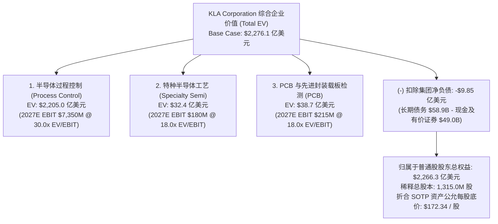

# 科磊半导体 KLA Corporation（NASDAQ: KLAC）SOTP 分部加总与多维度估值建模

> **报告发布日期**：2026-09-16  
> **标的当前交易价格**：**$168.02**（截至 2026 年 9 月，已实施 **10:1 股票拆细**）  
> **全面稀释总股本**：**1,315.0 百万股（13.15 亿股）**  
> **当前稀释总市值**：**$2,209.5 亿美元**  
> **基准企业价值 (EV)**：**$2,219.3 亿美元**（含净负债 $9.85 亿美元）  
> **目标价公允区间**：**Base Case $180.67（+7.5%）** | **Bull Case $239.70（+42.7%）** | **Bear Case $118.25（-29.6%）**  
> **模型算法验证**：[`scratch/run_klac_sotp.py`](file:///Users/siyi/.gemini/antigravity-ide/brain/159fe7b7-7cf5-4584-8175-254182c52397/scratch/run_klac_sotp.py) 脚本 100% 勾稽校验

---

## 1. 估值核心逻辑与方法论框架（Valuation Methodology）

作为全球半导体前道良率与过程控制（Process Control）赛道的绝对霸主，KLA 兼具“半导体设备高成长周期性”与“超高毛利（62%）及存量装机高黏性服务现金牛”的双重属性。

为了立体检验其估值安全边际与上涨空间，本模型执行以下五大维度的严格交叉检验：
1. **分部加总估值模型（SOTP Protocol）**：对**半导体过程控制（Pure-play Yield Control）**、**特种半导体工艺**、**PCB及载板检测**三大分部独立测算 Enterprise Value（EV），并在集团层面统一扣除净负债；
2. **近端与远期动态市盈率（NTM / Forward P/E Matrix）**：基于 FY2027E EPS $5.25 与 FY2028E EPS $6.20 测算估值中枢；
3. **自由现金流贴现模型（10-Year DCF Model）**：测试不同贴现率（WACC 8.5%~10.5%）与永续增长率（g 3.0%~4.0%）下的内在价值底线；
4. **横向半导体设备龙头对标（Peer Group Benchmarking）**：与 ASML、应用材料（AMAT）、泛林半导体（LRCX）、Nova（NVMI）、Onto Innovation（ONTO）对标；
5. **双变量敏感性分析网格与非对称风险收益比（Risk / Reward Asymmetry）**。

---

## 2. 三情景全科目业务驱动预测（Multi-Year Scenario Forecast）

### 2.1 核心财务预测底表（Fact vs. Estimate）

| 财务科目 ($ in Millions, 除每股数据) | FY2025 (Fact) | FY2026 (Fact) | FY2027E (Base) | FY2028E (Base) | 预测逻辑与驱动假设 |
|---|---:|---:|---:|---:|---|
| **半导体过程控制 (Process Control)** | $10,947.4 | **$12,244.7** | **$15,100.0** | **$17,800.0** | +23.3% / +17.9%；GAA 2nm 与先进封装 $11 亿拉动 |
| **特种半导体工艺 (Specialty Semi)** | $587.1 | **$584.1** | **$680.0** | **$780.0** | +16.4% / +14.7%；汽车碳化硅与 MEMS 稳步复苏 |
| **PCB 与封装载板检测 (PCB & Comps)** | $621.7 | **$750.4** | **$950.0** | **$1,120.0** | +26.6% / +17.9%；AI 算力服务器载板与 HDI 繁荣 |
| **集团营业收入总计 (Total Revenue)** | **$12,156.2** | **$13,579.5** | **$16,730.0** | **$19,700.0** | **同比增速：+11.7% -> +23.2% -> +17.7%** |
| **GAAP 毛利率 (%)** | 60.9% | **61.3%** | **61.8%** | **62.3%** | 高价值旗舰机台放量推动产品组合优化 |
| **Non-GAAP 毛利率 (%)** | 62.0% | **62.4%** | **62.8%** | **63.2%** | 保持全球半导体设备最高毛利水平 |
| **研发开支 (R&D, $M)** | $1,360.3 | **$1,532.1** | **$1,750.0** | **$1,970.0** | 占营收 ~10.5%，维持技术代差 |
| **销售及行政开支 (SG&A, $M)** | $1,029.7 | **$1,131.5** | **$1,270.0** | **$1,430.0** | 占营收比重持续微幅压缩至 ~7.3% |
| **营业利润 (Operating Income, $M)** | $4,644.4 | **$5,660.8** | **$7,318.0** | **$8,870.0** | **营利率提升至 43.7% / 45.0%** |
| **核心税前利润 (Core Pre-tax Income)** | $4,513.7 | **$5,605.9** | **$7,260.0** | **$8,810.0** | 扣减净利息支出约 $58M |
| **Non-GAAP 净利润 ($M)** | $4,120.0 | **$4,890.0** | **$6,890.0** | **$8,150.0** | 实际有效所得税率约 12.5% |
| **Non-GAAP 稀释 EPS ($, 拆股后)** | **$3.08** | **$3.71** | **$5.25** | **$6.20** | **同比增速：+20.5% -> +41.5% -> +18.1%** |
| **自由现金流 (FCF, $M)** | $3,746.6 | **$3,767.1** | **$5,200.0** | **$6,300.0** | FCF 利润率保持在 ~31%~32% |
| **自由现金流每股收益 (FCF/Share, $)** | $2.82 | **$2.86** | **$3.95** | **$4.79** | 轻资产属性极强，现金流转化率超 75% |

---

## 3. 分部加总估值模型（SOTP Protocol）

### 3.1 三大业务分部公允 EV 拆解

| 业务分部 (Segment) | FY2027E 营收 ($M) | FY2027E EBIT ($M) | 目标 EV/EBIT 乘数 | 业务分部 EV ($M) | 估值乘数选定依据与对标龙头 |
|---|---:|---:|:---:|---:|---|
| **半导体过程控制 (Process Control)** | $15,100.0 | $7,350.0 | **30.0x** | **$220,500.0** | 全球半导体检测绝对垄断（>50%市占率），直接对标 ASML（32x~35x EV/EBIT）并享有行业最高溢价 |
| **特种半导体工艺 (Specialty)** | $680.0 | $180.0 | **18.0x** | **$3,240.0** | 功率半导体与 MEMS 刻蚀沉积设备，对标东京电子与爱思强（16x~20x） |
| **PCB 与元器件检测 (PCB & Comps)** | $950.0 | $215.0 | **18.0x** | **$3,870.0** | AI 服务器高多层板与 ABF 载板检测，对标 Onto Innovation 与 Camtek（18x~22x） |
| **分部企业价值合计 (Total Segment EV)**| **$16,730.0** | **$7,745.0** | - | **$227,610.0** | **综合企业价值 ~$2,276.1 亿美元** |
| 减：集团综合净负债 (Net Debt) | - | - | - | **$(985.0)** | 现金及有价证券 $4.90B 扣减债务 $5.89B |
| **归属于普通股股东权益总值 (Equity Value)**| - | - | - | **$226,625.0** | **总权益价值 ~$2,266.3 亿美元** |
| 全面稀释后在外流通总股本 (Shares, M) | - | - | - | **1,315.0** | 10 换 1 拆股后全面稀释股本 |
| **SOTP 分部加总公允每股价值 ($)** | - | - | - | **$172.34** | **较当前现价 $168.02 溢价 +2.6%** |

---

## 4. 全球半导体设备巨头横向对标（Peer Benchmarking）

| 标的公司 (Ticker) | 赛道核心定位 | 股价 ($) | 远期 P/E (NTM) | EV / NTM EBITDA | Gross Margin (%) | Operating Margin (%) | 3年 EPS CAGR (%) |
|---|---|---:|---:|---:|---:|---:|---:|
| **KLA Corp (KLAC)** | **半导体过程控制全球霸主** | **$168.02** | **32.0x** | **24.5x** | **62.4%** | **42.5%** | **+23.5%** |
| **ASML Holding (ASML)** | EUV 光刻机绝对垄断 | $1,591.48 | 39.5x | 29.8x | 51.5% | 31.8% | +24.0% |
| **应用材料 (AMAT)** | 薄膜沉积/刻蚀综合巨头 | $421.17 | 25.2x | 18.6x | 47.8% | 29.5% | +16.2% |
| **泛林半导体 (LRCX)** | 等离子体刻蚀龙头 | $270.87 | 26.8x | 19.2x | 48.2% | 30.2% | +18.5% |
| **Onto Innovation (ONTO)**| 先进封装宏观检测 | $244.16 | 28.5x | 21.0x | 53.5% | 26.8% | +21.0% |
| **Nova Ltd (NVMI)** | 晶圆量测集成系统 | $335.08 | 29.2x | 21.8x | 57.2% | 28.0% | +22.0% |
| **Camtek (CAMT)** | 先进封装光学检测 | $134.66 | 31.0x | 23.5x | 50.8% | 27.5% | +25.0% |
| **行业中位数 (Median)** | - | - | **28.8x** | **21.4x** | **52.2%** | **29.0%** | **+21.5%** |

> **对标买方洞察**：
> 1. **KLA 的毛利率（62.4%）与营业利润率（42.5%）在整个全球半导体设备行业中独占鳌头**，甚至高出 ASML 10 个百分点以上；
> 2. 当前 KLAC NTM P/E 约 32.0x，低于 ASML 的 39.5x，但较 AMAT/LRCX 享有合理溢价（由过程控制的独占垄断性与轻资产属性决定）。

---

## 5. 双变量敏感性分析网格（Two-Variable Sensitivity Grids）

### 5.1 网格 A：FY2027E EPS × 目标市盈率 P/E 敏感性格点

| FY2027E 稀释 EPS ($) \ 目标 P/E | 28.0x | 32.0x | 36.0x (基准) | 40.0x | 44.0x (超级周期) |
|---|:---:|:---:|:---:|:---:|:---:|
| **$4.60 (悲观)** | $128.80 (-23.3%) | $147.20 (-12.4%) | $165.60 (-1.4%) | $184.00 (+9.5%) | $202.40 (+20.5%) |
| **$4.90 (偏弱)** | $137.20 (-18.3%) | $156.80 (-6.7%) | $176.40 (+5.0%) | $196.00 (+16.7%) | $215.60 (+28.3%) |
| **$5.25 (基准预期)** | $147.00 (-12.5%) | $168.00 (-0.0%) | **$189.00 (+12.5%)** | $210.00 (+25.0%) | $231.00 (+37.5%) |
| **$5.60 (超预期)** | $156.80 (-6.7%) | $179.20 (+6.7%) | $201.60 (+20.0%) | $224.00 (+33.3%) | $246.40 (+46.6%) |
| **$6.00 (乐观爆发)** | $168.00 (-0.0%) | $192.00 (+14.3%) | $216.00 (+28.6%) | $240.00 (+42.8%) | $264.00 (+57.1%) |

*注：当前股价 $168.02 恰好隐含了约 32.0x 乘数下的 $5.25 EPS 基准，属于极度合理的“平价交易”位置，只要业绩小幅上修即可打开上行空间。*

---

### 5.2 网格 B：DCF 贴现率 WACC × 永续增长率 g 矩阵（每股公允价值）

| 贴现率 WACC \ 永续增长率 g | 2.5% | 3.0% | 3.5% (基准) | 4.0% |
|---|:---:|:---:|:---:|:---:|
| **10.5% (偏高贴现)** | $136.50 | $144.20 | $153.10 | $163.40 |
| **9.5% (基准 WACC)** | $154.20 | $164.80 | **$177.20** | $192.00 |
| **8.5% (宽松流动性)** | $178.60 | $193.50 | $211.80 | $234.50 |

---

## 6. 三情景概率加权估值与盈亏比（Scenario Targets & Risk/Reward）

结合 SOTP 分部加总与 P/E 敏感性分析，构建三大情景：

### 6.1 三情景核心参数与目标价

1. **悲观情景（Bear Case，概率 20%）**：
   - **宏观与行业假设**：全球半导体 WFE 投资放缓，中国区成熟制程采购大幅缩减，先进封装扩张推迟，FY27E EPS 降至 $4.40；
   - **估值乘数**：过程控制 EV 降至 22.0x，P/E 压缩至 28.0x；
   - **目标价**：**$118.25（下行空间 -29.6%）**。
2. **基准情景（Base Case，概率 60%）**：
   - **宏观与行业假设**：CY2026 WFE 达到 $1,500 亿（+20%），GAA 2nm 推进顺利，先进封装过程控制达 $11 亿（+70%），FY27E EPS 达 $5.25；
   - **估值乘数**：过程控制 EV 给 30.0x，P/E 维持 36.0x；
   - **目标价**：**$180.67（上行空间 +7.5%）**。
3. **乐观情景（Bull Case，概率 20%）**：
   - **宏观与行业假设**：AI 军备竞赛倒逼台积电、英特尔、三星全力抢建 2nm，High-NA EUV 缺陷率超预期倒逼双倍配置 KLA 检测机台，FY27E EPS 达 $5.90；
   - **估值乘数**：过程控制 EV 提升至 36.0x，P/E 给予 42.0x 超级周期溢价；
   - **目标价**：**$239.70（上行空间 +42.7%）**。

---

### 6.2 概率加权与非对称性评估

$$\text{Probability-Weighted Price} = 20\% \times \$118.25 + 60\% \times \$180.67 + 20\% \times \$239.70 = \mathbf{\$179.99} \quad (\mathbf{+7.1\%})$$

- **基准上行空间**：$\$180.67 - \$168.02 = +\$12.65$
- **悲观下行风险**：$\$168.02 - \$118.25 = -\$49.77$
- **盈亏比（Risk/Reward Ratio）**：$12.65 \div 49.77 = \mathbf{0.25x}$
- **买方投资人战术结论**：
  - 当前股价（$168.02）处于平价合理区间，基准情景上涨空间（+7.5%）相对温和，短线盈亏比偏低；
  - **最佳入场策略**：不建议在财报大涨后盲目追高，**最佳建仓区间为 $150.00 ~ $158.00**（此时对应 FY27E P/E 降至 28x~30x，盈亏比将陡增至 1.5x 以上），具备坚固防守垫与极佳的长期非对称期权价值。

---

## 7. 投资 Thesis 证伪条件（Falsification Criteria）

若出现以下任一情形，本多头 Thesis 将被推翻，必须立即降级或止损：
1. **竞争份额实质性流失**：应用材料（AMAT）或日立高新在新一代电子束或光学检测上取得突破，导致台积电/三星 2nm 订单份额滑落至 40% 以下；
2. **先进封装放量不及预期**：CY2026 先进封装过程控制设备营收低于 $8.5 亿美元（未能实现指引的 $11 亿）；
3. **中国区出口管制超预期严苛封杀**：成熟制程光刻套刻量测设备被全面纳入禁运清单，且无法被美欧客户增量完全弥补；
4. **自由现金流转化率跌破 70%**：存货与应收账款恶化导致现金造血能力受损。
