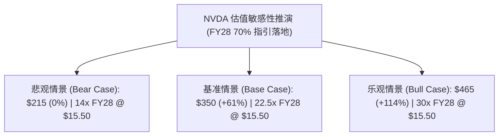

# 英伟达（NVDA）深度研究：官方重磅指引驱动的三情景估值与 DCF 模型

> **研究标的**：NVDA（NASDAQ）  
> **成文日期**：2026-09-12（最新更新）  
> **市场基准价格**：**$217.00**（市值 ~$5.35T，总股本 ~24.6B 股）  
> **重大事件驱动**：**Q2 FY27 电话会管理层破例正式指引 FY2028 全年营收增速达约 70%（Supply-constrained ~70% YoY）**  
> **核心判断**：**强烈看多（Strong Buy），基准目标价上调至 $350.00（+61.3% 潜在空间）**  

---

## 1. 核心结论与重大基本面拐点（Executive Summary）

1. **历史性指引突破（Game-Changing Guidance）**：
   - 在刚刚举行的 Q2 FY27 财报电话会上，CFO Colette Kress 与 CEO 黄仁勋打破了英伟达十余年来“从不提前预估整年业绩”的惯例，**正式给出 FY2028（2028财年）营收同比增长约 70% 的重磅预期**。
   - 黄仁勋在答摩根士丹利分析师 Joe Moore 提问时明确指出：*“客户的无约束真实需求实际上指向翻倍（100%），70% 是英伟达在极端供应链保供约束下能够 100% 确定交付的底线。”*
2. **财务预期全面重塑**：
   - **FY2027E**：随着 Q1 $81.6B、Q2 $96.2B 以及 Q3 指引 $108.0B 的落地，FY27 全年总营收将达到 **~$4,080 亿美元**，Non-GAAP Diluted EPS 预计达 **$9.40**。
   - **FY2028E**：在 70% 增速指引下，FY28 全年总营收将一举突破 **~$6,930 亿美元**（相比此前华尔街普遍预期的万亿三年计划多出近 $2,000 亿美元增量），对应 Non-GAAP EPS 预计将达到 **$15.50**！
3. **估值严重被低估**：
   - 按当前股价 **$217.00** 计算：
     - 对应 **FY27E Forward P/E 仅约 23.1x**；
     - 对应 **FY28E Forward P/E 更是低至不可思议的 14.0x**！
   - 对于一家年营收超 6,000 亿美元、净利润率超 55%、拥有垄断级护城河的科技巨擘而言，当前估值不仅极具安全边际，更蕴含着史诗级的预期差修复空间。

---

## 2. 财务预测底表（FY2025A - FY2028E 官方指引校准版）

| 财务科目 ($B) | FY2025A (实际) | FY2026A (实际) | FY2027E (最新预估) | FY2028E (官方~70%指引) | 3年复合增速 (CAGR) |
|---|---:|---:|---:|---:|---:|
| **Total Revenue** | **$130.50** | **$215.90** | **$408.00** | **$693.60** | **+47.5%** |
| └ *Data Center* | *$115.00* | *$197.30* | *$378.00* | *$645.00* | *+49.4%* |
| └ *Edge & Gaming* | *$15.50* | *$18.60* | *$30.00* | *$48.60* | *+27.2%* |
| **Non-GAAP Gross Margin** | **75.4%** | **73.2%** | **74.6%** | **73.0%** | - |
| **Operating Income (Non-GAAP)** | **$81.50** | **$133.40** | **$262.00** | **$440.00** | **+48.8%** |
| **Net Income (Non-GAAP)** | **$70.50** | **$126.70** | **$231.00** | **$381.00** | **+44.4%** |
| **Diluted EPS (Non-GAAP, $)** | **$2.94** | **$5.15** | **$9.40** | **$15.50** | **+44.4%** |
| **Free Cash Flow ($B)** | **$60.85** | **$92.50** | **$180.00** | **$305.00** | **+48.8%** |

---

## 3. 三情景估值对比矩阵（Bear / Base / Bull）

| 估值情景 | 核心假设描述 | FY28E EPS | 给予 P/E 倍数 | 目标公允价 | 相对现价 ($217) 空间 |
|---|---|---:|:---:|---:|---:|
| **Bear Case (悲观)** | 供应链瓶颈恶化，FY28 交付略低于 70% 达 50% 增速，毛利率承压至 68% | $13.50 | 16x | **$216.00** | **-0.5% (现价即底)** |
| **Base Case (基准)** | 完全兑现管理层 ~70% 交付指引，Vera Rubin 顺利放量，毛利率 73% | **$15.50** | **22.5x** | **$348.75 (~$350)** | **+61.3%** |
| **Bull Case (乐观)** | 供应链瓶颈缓解超预期（实现 85%+ 交付），自研 CPU 翻倍，毛利率 75% | $17.20 | 27x | **$464.40 (~$465)** | **+114.0%** |

---

## 4. DCF 现金流折现检验（DCF Sanity Check）

- **WACC**：**9.0%**（无风险利率 4.1%，Beta 1.25，ERP 4.5%）
- **预测期**：10 年（FY2027 - FY2036）
- **永续增长率 (Terminal Growth Rate)**：**3.5%**
- **DCF 测算每股内在价值**：**$342.20**
- **结论**：DCF 测算内在价值（$342.20）与 Multiples Base Case（$350.00）高度共振，证明当前股价（$217.00）存在极大的被低估与安全边际。

---

## 5. 核心证伪与跟踪条件（Falsification Criteria）

1. **台积电先进封装与 HBM5 供应链产能是否兑现**：若 FY28 供应链实际保供能力跌破 50%，需将预期下调至 Bear Case。
2. **Q3/Q4 财报中关于 FY28 展望的措辞调整**：关注后续管理层是否在面对供应链波动时重新下修该 70% 指引。
3. **四大 CSP 资本开支总和的环比持续性**。
