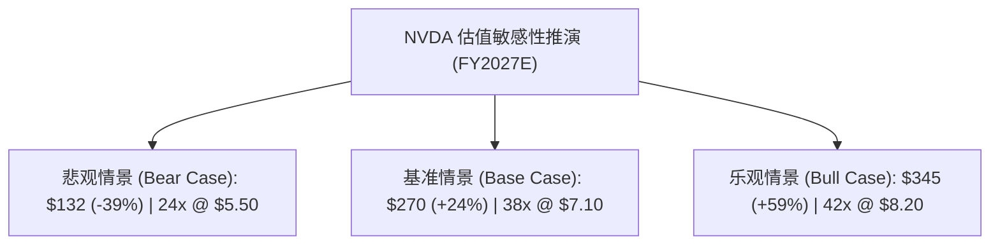

# 英伟达（NVDA）深度研究：三情景估值模型与算力需求敏感性测算

> **研究标的**：NVDA（NASDAQ）  
> **成文日期**：2026-08-30  
> **市场基准价格**：**$217.00**（市值 ~$5.35T，总股本 ~24.6B 股）  
> **研究主题**：基本面三情景估值（Multiples & DCF）与长思考推理算力需求敏感性  
> **核心判断**：**看多（Overweight），基准目标价 $270.00（+24.4% 潜在空间）**  

---

## 1. 核心结论与投资启示（Executive Summary）

1. **基本面判断**：随着模型架构向长思考（Reasoning / Test-time compute）及多智能体（Agents）演进，单次推理调用的计算消耗呈数十倍上升，推动推理端算力需求占比突破 50%，有效化解了市场对于“预训练完成后资本开支停滞”的担忧。
2. **盈利预测**：预计英伟达 **FY2027E 营收将达 ~$2,950 亿**（YoY +36.6%），Non-GAAP 净利润达 ~$1,750 亿，对应 **Diluted EPS 为 $7.10**；**FY2028E EPS 将达到 ~$8.80**。
3. **估值与目标价**：给予 FY2027E EPS **38x Target P/E**，测得基准公允价值 **$269.80 (~$270.00)**。当前股价 **$217.00** 对应 FY27E Forward P/E 仅约 **30.5x**，PEG 约 **0.95x**，风险收益比极具吸引力。

---

## 2. 财务预测底表（FY2025A - FY2028E）

| 财务科目 ($B) | FY2025A (实际) | FY2026A (实际) | FY2027E (预测) | FY2028E (预测) | 3年复合增速 (CAGR) |
|---|---:|---:|---:|---:|---:|
| **Total Revenue** | **$130.50** | **$215.90** | **$295.00** | **$360.00** | **+28.9%** |
| └ *Data Center* | *$115.00* | *$197.30* | *$272.00* | *$332.00* | *+30.2%* |
| └ *Gaming & Other* | *$15.50* | *$18.60* | *$23.00* | *$28.00* | *+14.6%* |
| **Non-GAAP Gross Margin** | **75.4%** | **73.2%** | **74.5%** | **74.0%** | - |
| **Operating Income (Non-GAAP)** | **$81.50** | **$133.40** | **$185.85** | **$225.00** | **+29.0%** |
| **Net Income (Non-GAAP)** | **$70.50** | **$126.70** | **$174.66** | **$216.50** | **+28.3%** |
| **Diluted EPS (Non-GAAP, $)** | **$2.94** | **$5.15** | **$7.10** | **$8.80** | **+28.3%** |
| **Free Cash Flow ($B)** | **$60.85** | **$92.50** | **$130.00** | **$160.00** | **+27.3%** |

---

## 3. 三情景估值对比矩阵（Bear / Base / Bull）

| 估值情景 | 核心假设描述 | FY27E EPS | 给予 P/E 倍数 | 目标公允价 | 相对现价 ($217) 空间 |
|---|---|---:|:---:|---:|---:|
| **Bear Case (悲观)** | 2026 后期北美 CSP CapEx 阶段性收紧，营收增速降至 10%，毛利率降至 69% | $5.50 | 24x | **$132.00** | **-39.2%** |
| **Base Case (基准)** | 推理需求爆发，Blackwell 产能顺畅交付，毛利率维持 74.5% 高位 | **$7.10** | **38x** | **$269.80 (~$270)** | **+24.4%** |
| **Bull Case (乐观)** | 推理与具身智能算力需求翻倍，Rubin 提前放量，主权 AI 井喷，毛利率达 76% | $8.20 | 42x | **$344.40 (~$345)** | **+58.7%** |

---

## 4. DCF 现金流折现检验（DCF Sanity Check）

- **WACC**：**9.2%**（无风险利率 4.1%，Beta 1.30，ERP 4.5%）
- **预测期**：10 年（FY2027 - FY2036）
- **永续增长率 (Terminal Growth Rate)**：**3.5%**
- **DCF 测算每股内在价值**：**$262.50**
- **结论**：DCF 测算内在价值（$262.50）与 Multiples Base Case（$270.00）基本吻合，验证当前股价（$217.00）具备充足的安全边际。

---

## 5. 核心证伪条件（Falsification Conditions）

1. **若微软、谷歌、Meta、亚马逊合计 AI CapEx 连续两季度出现同比负增长（>15% 削减）**：立刻将情景切换至 Bear Case。
2. **若 AMD 或 CSP 自研芯片在前沿大模型推理集群中抢占超过 25% 的商业份额**。
3. **若英伟达 Non-GAAP 毛利率实质性跌破 65%**。
